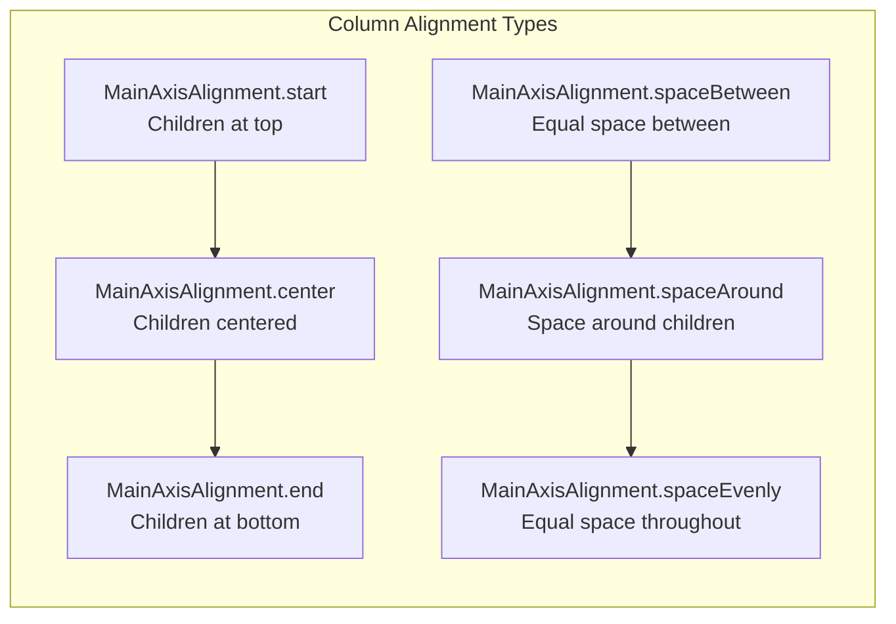
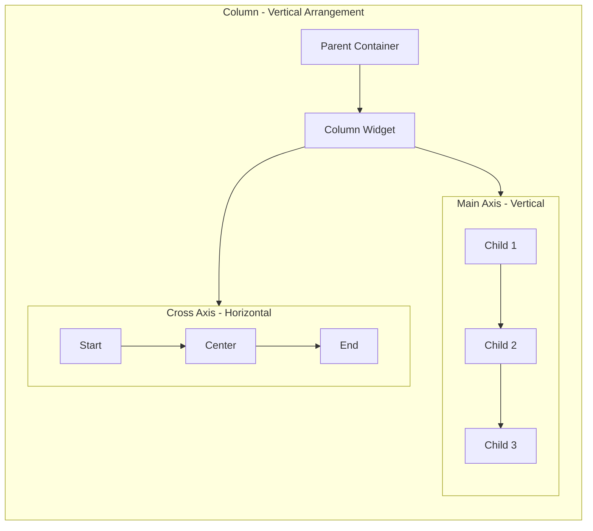
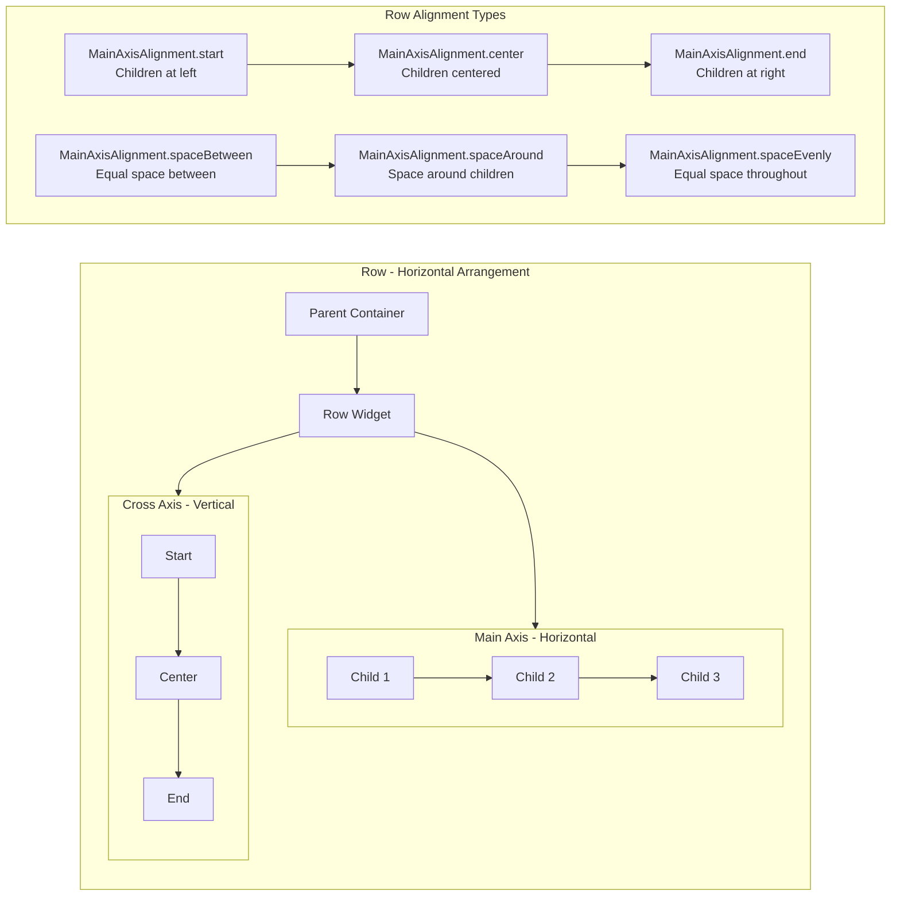
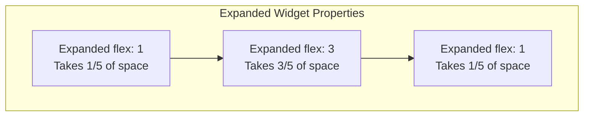
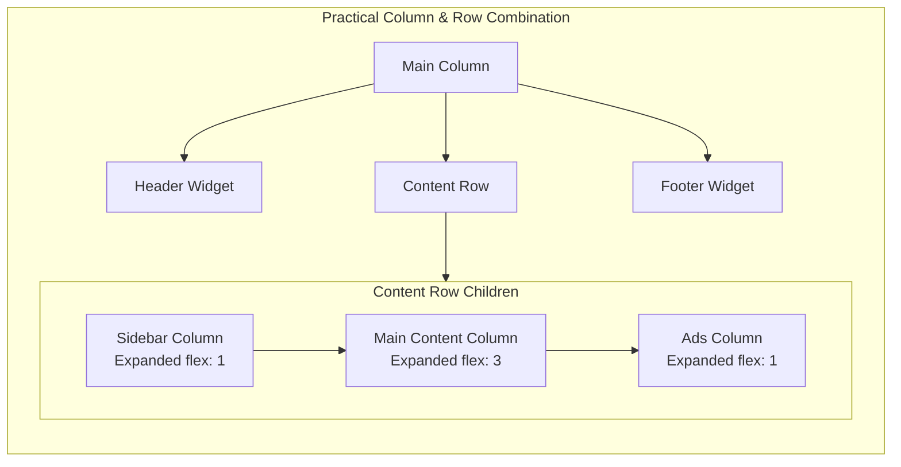

These **layout widgets** are fundamental to **Flutter UI development** and understanding their properties is crucial for creating responsive and well-structured interfaces.

## Column


A `Column` is a widget that displays its children in a **vertical array**. It's one of the most fundamental layout widgets in Flutter.

### Most Used Attributes and Values

| Attribute            | Description                                                     | Common Values                                                                            |
| -------------------- | --------------------------------------------------------------- | ---------------------------------------------------------------------------------------- |
| `children`           | The widgets to display vertically                               | `[Widget1, Widget2, ...]`                                                                |
| `mainAxisAlignment`  | How children should be placed along the main axis (vertical)    | `MainAxisAlignment.start`, `center`, `end`, `spaceBetween`, `spaceAround`, `spaceEvenly` |
| `crossAxisAlignment` | How children should be placed along the cross axis (horizontal) | `CrossAxisAlignment.start`, `center`, `end`, `stretch`                                   |
| `mainAxisSize`       | How much space should be occupied in the main axis              | `MainAxisSize.max`, `min`                                                                |
| `verticalDirection`  | The order to lay children out vertically                        | `VerticalDirection.down`, `up`                                                           |
| `textDirection`      | The order to lay children out horizontally                      | `TextDirection.ltr`, `rtl`                                                               |

### Example Usage

```dart
Column(
  mainAxisAlignment: MainAxisAlignment.spaceBetween,
  crossAxisAlignment: CrossAxisAlignment.center,
  children: [
    Container(width: 50, height: 50, color: Colors.red),
    Container(width: 50, height: 50, color: Colors.green),
    Container(width: 50, height: 50, color: Colors.blue),
  ],
)
```

## Visual Representation with Diagrams

### Column Layout Visualization





## Row

A `Row` is a widget that displays its children in a horizontal array. It works similarly to Column but along the horizontal axis.

### Most Used Attributes and Values

| Attribute            | Description                                                    | Common Values                                                                            |
| -------------------- | -------------------------------------------------------------- | ---------------------------------------------------------------------------------------- |
| `children`           | The widgets to display horizontally                            | `[Widget1, Widget2, ...]`                                                                |
| `mainAxisAlignment`  | How children should be placed along the main axis (horizontal) | `MainAxisAlignment.start`, `center`, `end`, `spaceBetween`, `spaceAround`, `spaceEvenly` |
| `crossAxisAlignment` | How children should be placed along the cross axis (vertical)  | `CrossAxisAlignment.start`, `center`, `end`, `stretch`, `baseline`                       |
| `mainAxisSize`       | How much space should be occupied in the main axis             | `MainAxisSize.max`, `min`                                                                |
| `verticalDirection`  | The order to lay children out vertically                       | `VerticalDirection.down`, `up`                                                           |
| `textDirection`      | The order to lay children out horizontally                     | `TextDirection.ltr`, `rtl`                                                               |
| `textBaseline`       | The baseline to use for aligning text                          | `TextBaseline.alphabetic`, `ideographic`                                                 |

### Example Usage

```dart
Row(
  mainAxisAlignment: MainAxisAlignment.spaceEvenly,
  crossAxisAlignment: CrossAxisAlignment.center,
  children: [
    Container(width: 50, height: 50, color: Colors.red),
    Container(width: 50, height: 50, color: Colors.green),
    Container(width: 50, height: 50, color: Colors.blue),
  ],
)
```

### Row Layout Visualization



### Practical Example Visualization





## Key Differences and When to Use

| Aspect              | Column                                        | Row                                   |
| ------------------- | --------------------------------------------- | ------------------------------------- |
| **Primary Axis**    | Vertical (top to bottom)                      | Horizontal (left to right)            |
| **Use Case**        | Vertical lists, forms, stacked content        | Horizontal lists, toolbars, tab bars  |
| **Scrolling**       | Use `ListView` instead for scrollable content | Use `ListView` with horizontal scroll |
| **Common Children** | `Text`, `TextField`, `Button`, `Container`    | `Icon`, `Text`, `Button`, `Spacer`    |

## Advanced Usage with Expanded and Flexible

Both Column and Row work well with `Expanded` and `Flexible` widgets to create flexible layouts:

```dart
Column(
  children: [
    Expanded(
      flex: 2, // Takes 2/5 of available space
      child: Container(color: Colors.red),
    ),
    Expanded(
      flex: 3, // Takes 3/5 of available space
      child: Row(
        children: [
          Flexible(child: Container(color: Colors.green)),
          Flexible(child: Container(color: Colors.blue)),
        ],
      ),
    ),
  ],
)
```

## Common Pitfalls and Solutions

1. **Overflow Errors**: Use `Expanded`, `Flexible`, or `SingleChildScrollView` to handle content that might exceed available space
2. **Alignment Issues**: Remember that `crossAxisAlignment` works perpendicular to the main axis
3. **Size Constraints**: Columns and Rows respect their parent's constraints, so ensure proper constraint propagation
