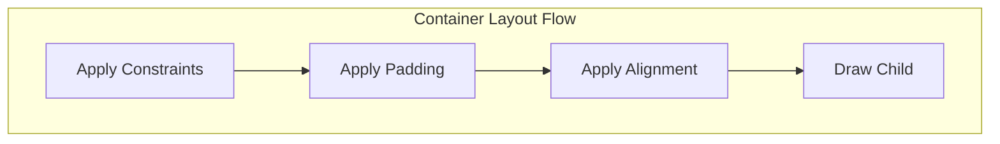
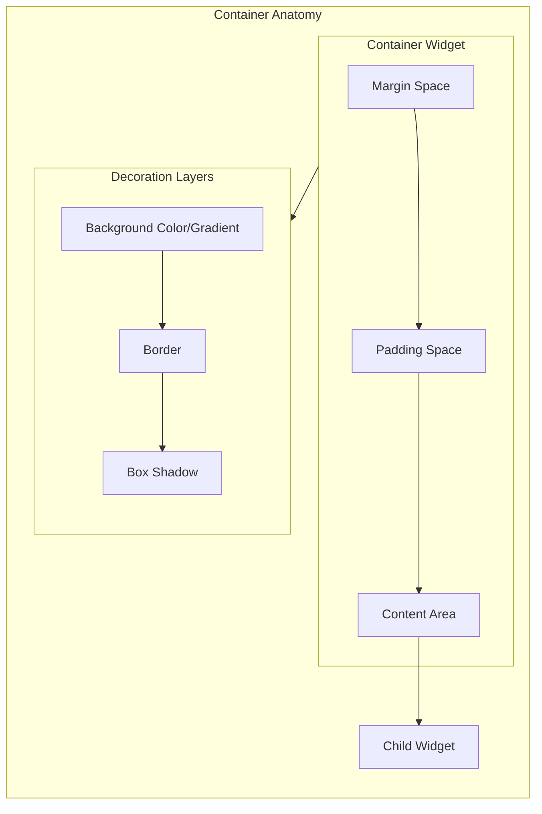
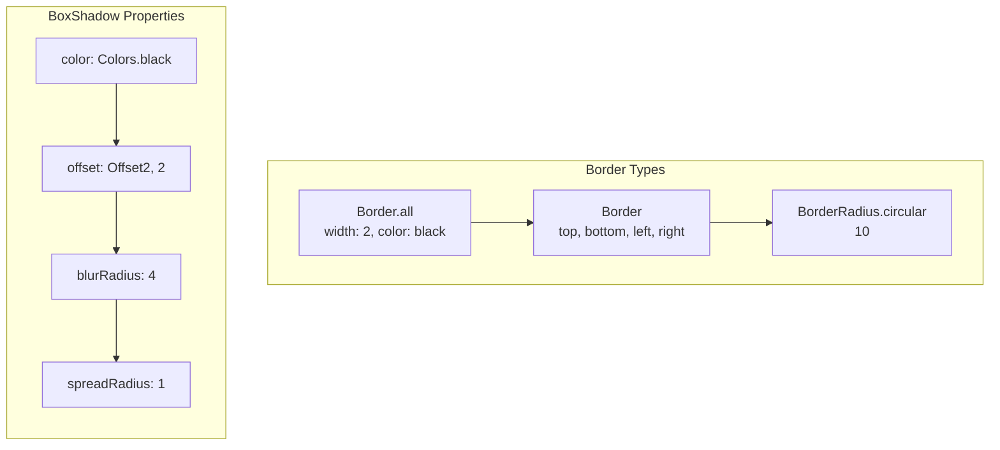
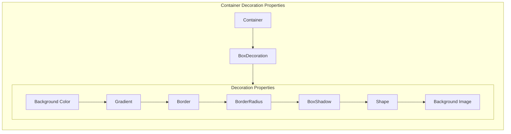
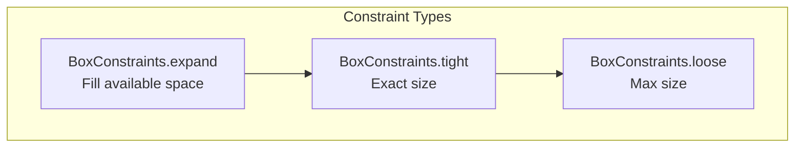
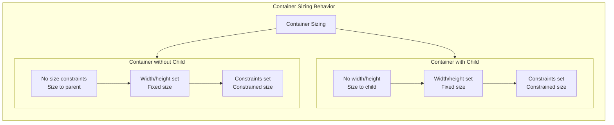

The Container widget is extremely versatile and serves as the building block for most Flutter UIs, providing a convenient way to combine multiple styling and layout properties in a single widget.

## Container Overview

A `Container` is a versatile widget that combines common painting, positioning, and sizing functionalities. It's one of the most frequently used widgets in Flutter for creating visual elements.

### Most Used Attributes and Values

| Attribute              | Description                                   | Common Values                                                                                       |
| ---------------------- | --------------------------------------------- | --------------------------------------------------------------------------------------------------- |
| `child`                | The single widget contained by this container | Any `Widget` (`Text`, `Image`, `Column`, etc.)                                                      |
| `alignment`            | Aligns the child within the container         | `Alignment.center`, `topLeft`, `topRight`, `bottomLeft`, `bottomRight`, `centerLeft`, `centerRight` |
| `padding`              | Empty space to surround the child             | `EdgeInsets.all(10)`, `only()`, `symmetric()`, `fromLTRB()`                                         |
| `margin`               | Empty space to surround the container         | `EdgeInsets.all(10)`, `only()`, `symmetric()`, `fromLTRB()`                                         |
| `color`                | Background color of the container             | `Colors.red`, `Colors.blue[500]`, `Color(0xFFAABBCC)`                                               |
| `decoration`           | The decoration to paint behind the child      | `BoxDecoration` with color, border, gradient, etc.                                                  |
| `foregroundDecoration` | The decoration to paint in front of the child | `BoxDecoration`                                                                                     |
| `width`                | The width of the container                    | `double` values, `double.infinity`                                                                  |
| `height`               | The height of the container                   | `double` values, `double.infinity`                                                                  |
| `constraints`          | Additional constraints on the container       | `BoxConstraints.expand()`, `tight()`, `loose()`                                                     |
| `transform`            | Transform matrix to apply before painting     | `Matrix4.rotationZ()`, `translation()`, `scale()`                                                   |
| `clipBehavior`         | How to clip the decoration and child          | `Clip.none`, `hardEdge`, `antiAlias`, `antiAliasWithSaveLayer`                                      |

## BoxDecoration Properties

Since `decoration` is a key property, here are its common attributes:

| Attribute      | Description                                    | Common Values                                  |
| -------------- | ---------------------------------------------- | ---------------------------------------------- |
| `color`        | Background color (overrides Container's color) | `Colors.blue`, `Colors.green[400]`             |
| `border`       | Border around the container                    | `Border.all()`, `Border()`                     |
| `borderRadius` | Rounded corners                                | `BorderRadius.circular(10)`, `only()`, `all()` |
| `boxShadow`    | Shadow effects                                 | `[BoxShadow()]` list                           |
| `gradient`     | Color gradient background                      | `LinearGradient()`, `RadialGradient()`         |
| `shape`        | Shape of the container                         | `BoxShape.rectangle`, `circle`                 |
| `image`        | Background image                               | `DecorationImage()`                            |

## Example Usage

```dart
Container(
  width: 200,
  height: 100,
  padding: EdgeInsets.all(16),
  margin: EdgeInsets.symmetric(vertical: 10, horizontal: 20),
  decoration: BoxDecoration(
    color: Colors.blue,
    borderRadius: BorderRadius.circular(12),
    boxShadow: [
      BoxShadow(
        color: Colors.black26,
        blurRadius: 6,
        offset: Offset(0, 2),
      ),
    ],
    gradient: LinearGradient(
      begin: Alignment.topLeft,
      end: Alignment.bottomRight,
      colors: [Colors.blue, Colors.lightBlue],
    ),
  ),
  alignment: Alignment.center,
  child: Text(
    'Hello Container!',
    style: TextStyle(color: Colors.white, fontSize: 16),
  ),
)
```

## Visual Representation with Mermaid Diagrams

### Container Structure Visualization





### Container with Decoration Properties





### Container Sizing and Constraints





### Practical Container Examples


## Key Behaviors and Characteristics

### 1. **Sizing Behavior**

- **With child**: Container sizes itself to its child (unless dimensions are specified)
- **Without child**: Container expands to fill available space (unless dimensions are specified)
- **With dimensions**: Container uses explicit width/height values

### 2. **Decoration vs Color**

- Use `color` for simple background colors
- Use `decoration` for advanced styling (borders, gradients, shadows)
- **Cannot use both** - if `decoration` is provided, any `color` must be specified in the decoration

### 3. **Layout Order**

1. Apply constraints
2. Apply padding
3. Apply alignment
4. Draw child (if any)

## Common Use Cases

### 1. **Basic Styled Box**

```dart
Container(
  padding: EdgeInsets.all(16),
  margin: EdgeInsets.all(8),
  decoration: BoxDecoration(
    color: Colors.white,
    borderRadius: BorderRadius.circular(8),
    border: Border.all(color: Colors.grey),
  ),
  child: Text('Content'),
)
```

### 2. **Card with Shadow**

```dart
Container(
  margin: EdgeInsets.all(10),
  decoration: BoxDecoration(
    color: Colors.white,
    borderRadius: BorderRadius.circular(12),
    boxShadow: [
      BoxShadow(
        color: Colors.black12,
        blurRadius: 6,
        offset: Offset(0, 3),
      ),
    ],
  ),
  child: // content
)
```

### 3. **Circle Avatar**

```dart
Container(
  width: 100,
  height: 100,
  decoration: BoxDecoration(
    shape: BoxShape.circle,
    color: Colors.blue,
    image: DecorationImage(
      image: NetworkImage('url'),
      fit: BoxFit.cover,
    ),
  ),
)
```

### 4. **Gradient Background**

```dart
Container(
  decoration: BoxDecoration(
    gradient: LinearGradient(
      begin: Alignment.topCenter,
      end: Alignment.bottomCenter,
      colors: [Colors.blue, Colors.purple],
    ),
  ),
)
```

## Performance Considerations

1. **Avoid excessive nesting**: Deep container trees can impact performance
2. **Use const constructors**: When possible, use `const Container()` for better performance
3. **Reuse decorations**: Consider reusing `BoxDecoration` objects if they're identical
4. **Clip behavior**: Use appropriate clipBehavior to avoid unnecessary clipping operations
