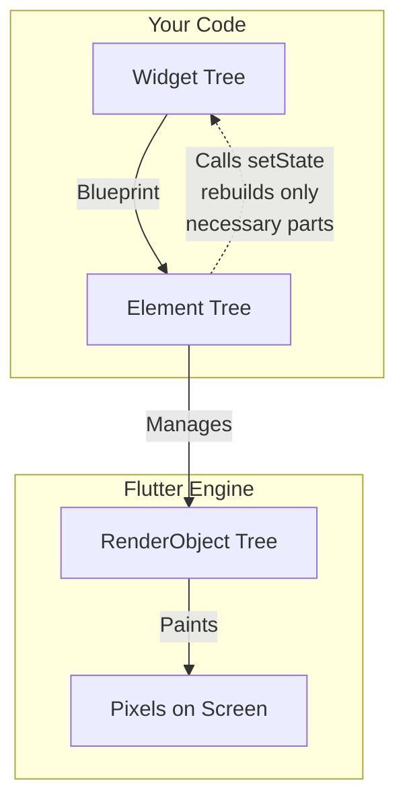

Let's break down the Flutter widget structure. It's the most fundamental and powerful concept in Flutter.

### The Core Idea: "Everything is a Widget"

Think of building a user interface like building with **LEGO blocks**. You start with small, simple blocks (basic widgets) and combine them to form larger, more complex structures (composite widgets), which eventually create an entire model (your app screen).

In Flutter, every single component—from a simple piece of text to a complex screen layout, and even the app itself—**is a widget.**

---

### 1. The Widget Tree: The Hierarchy of Everything

The entire UI of a Flutter app is organized as a **tree of widgets**, known as the **Widget Tree**. This is a hierarchical structure where widgets nest inside other widgets.

Let's visualize a simple login screen:

```dart
// The Widget Tree is built in code like this:
Scaffold(
  body: Center(
    child: Column(
      mainAxisAlignment: MainAxisAlignment.center,
      children: [
        Text('Welcome Back!'),
        SizedBox(height: 20),
        TextField(decoration: InputDecoration(hintText: 'Email')),
        TextField(decoration: InputDecoration(hintText: 'Password')),
        SizedBox(height: 20),
        ElevatedButton(
          onPressed: () {},
          child: Text('Login'),
        ),
      ],
    ),
  ),
)
```

This code creates the following Widget Tree:


**Insight:** The widget tree is a **configuration**. It's a lightweight blueprint that tells Flutter _how_ to build the user interface. It is **not** the visible UI elements on the screen itself. This is a crucial distinction.

---

### 2. Types of Widgets: The Two Key Families

Widgets can be categorized in many ways, but the most important distinction is between **Stateless** and **Stateful** widgets.

#### A) Stateless Widget

A **StatelessWidget** is like a **photograph**. It describes a part of the UI that depends only on its initial configuration. It cannot change on its own.

- **When to use:** For static content that doesn't need to change (e.g., text, icons, static images).
- **Example:** `Text`, `Icon`, `SizedBox`.

```dart
// A simple StatelessWidget
class WelcomeText extends StatelessWidget {
  // Constructor - the initial configuration
  const WelcomeText({super.key});

  @override
  Widget build(BuildContext context) {
    // This text will never change on its own.
    return const Text('Hello, World!');
  }
}
```

#### B) Stateful Widget

A **StatefulWidget** is like a **music player with a play button**. It is dynamic. It has internal data (**State**) that can change over time, causing the UI to redraw.

- **When to use:** For interactive or dynamic content (e.g., a counter, a checkbox, data fetched from the internet).
- **Example:** `Checkbox`, `TextField`, `Slider`.

```dart
// A simple StatefulWidget
class Counter extends StatefulWidget {
  const Counter({super.key});

  @override
  State<Counter> createState() => _CounterState();
}

// The State class holds the mutable data
class _CounterState extends State<Counter> {
  int _count = 0; // This is the mutable state

  void _increment() {
    setState(() { // Calling setState tells Flutter to rebuild the widget!
      _count++;
    });
  }

  @override
  Widget build(BuildContext context) {
    // The UI is rebuilt every time setState is called, using the new _count value.
    return ElevatedButton(
      onPressed: _increment,
      child: Text('You pressed me $_count times'),
    );
  }
}
```

**The Key Difference:**
| Feature | StatelessWidget | StatefulWidget |
| :--- | :--- | :--- |
| **Mutability** | Immutable (unchanging) | Mutable (changing) |
| **Data** | Relies only on final properties passed to it (`final String title`). | Has internal, mutable data in a separate `State` class. |
| **Performance** | Generally lighter weight. | Slightly heavier due to the State object. |
| **Analogy** | A photograph | A music player |

---

### 3. The Three Trees: How Flutter Actually Renders

This is the most advanced but critical insight. When your app runs, Flutter doesn't just manage the Widget Tree. It creates two other parallel trees from your widget tree:



1.  **Widget Tree (What you write):** The lightweight configuration/blueprint. It's **immutable** and rebuilt frequently (e.g., every time `setState` is called).

2.  **Element Tree (The Manager):** This tree is the "glue" that holds everything together. Each `Element` is created by Flutter and references a widget. Its job is to:

    - Manage the lifecycle of widgets.
    - Hold the actual state (`State` object) for StatefulWidgets.
    - Determine if a widget needs to be updated by comparing the old and new widgets. This is the core of Flutter's high performance—it only updates what has changed.

3.  **RenderObject Tree (The Painter):** This tree does the heavy lifting of layout, painting, and calculating sizes. `RenderObject` widgets (like `RenderBox`) are expensive and are only updated if the `Element` determines it's necessary.

**Why this matters:** This architecture is why Flutter is so fast. When you call `setState()`, the entire Widget Tree for that branch is rebuilt. However, the **Element Tree compares the new widget to the old one.** If the `runtimeType` and `key` are the same, it simply updates the reference to the new widget and, only if absolutely necessary, tells the **RenderObject** to update. This means the expensive layout and paint operations are minimized.

### Summary & Key Insights

1.  **Composition over Inheritance:** You build complex UIs by composing simple widgets, not by extending base classes. (You use a `Column` widget _containing_ other widgets, not by creating a `MyColumn` class that inherits from some base).
2.  **Widgets are Blueprints:** They are cheap to create and destroy because they are just configurations, not the actual visual elements.
3.  **The Tree is Everything:** Understanding how to nest widgets to form a widget tree is the primary skill in Flutter development.
4.  **State Drives the UI:** For dynamic interfaces, you change the data in the `State` object and call `setState()` to trigger a rebuild. The UI is a function of the state.
5.  **Flutter is Efficient by Design:** The separation of the Widget, Element, and RenderObject trees allows Flutter to be highly performant by only updating the parts of the UI that actually need to change.
