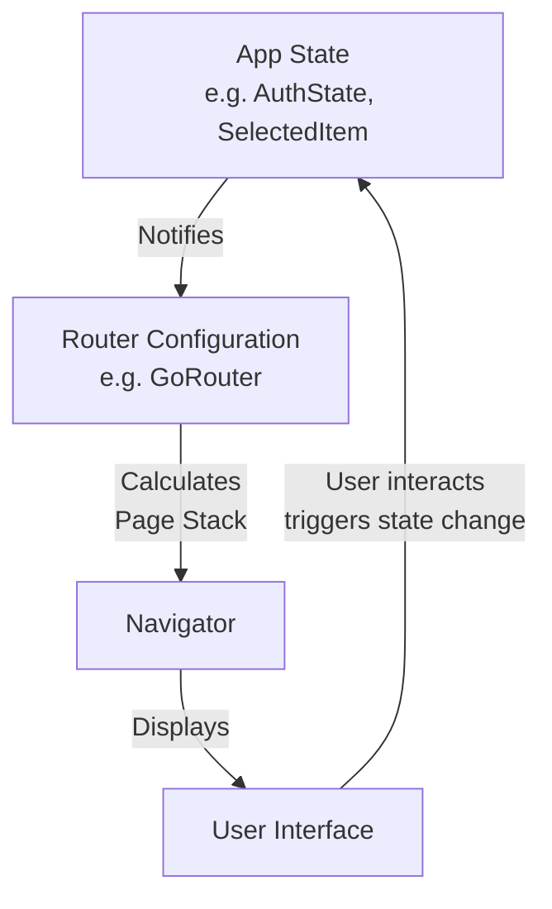

Having covered the imperative approach, let's dive into the **declarative navigation** paradigm. This is the modern, scalable, and powerful way to handle navigation in complex Flutter apps.

### What is Declarative Navigation?

- **Imperative navigation** is like giving turn-by-turn directions: "push this screen, now pop that one."

- **Declarative navigation** is like having a map and a destination. You just declare _where you want to be_ ("I need to be on the `/user/123` page"), and the system figures out how to render the correct stack of pages for you. The UI is a **function of your application state**.

This approach is essential for:

- **Deep Linking:** Opening any screen in the app via a URL.
- **Web Apps:** Having a meaningful URL for every screen.
- **State Restoration:** Rebuilding the exact navigation state when the app restarts.
- **Complex, State-Driven UIs:** Where the navigation stack is determined by user authentication or other app state.

---

### Core Architecture: The `Router` Widget

In declarative navigation, you don't use `Navigator.push` directly. Instead, you configure a top-level `Router` widget (or use a package like `go_router` that provides one).

The architecture involves three main players:



Let's break down how to implement this using the popular **`go_router`** package, which simplifies the complex low-level `Router` API.

---

### Deep Dive with `go_router`

#### 1. Setup and Basic Routing

First, add the package: `flutter pub add go_router`

**Define your routes:** You declare all possible paths in your app upfront.

```dart
import 'package:go_router/go_router.dart';

// This is your global navigation state manager
final GoRouter router = GoRouter(
  // Optional: What to show when the app starts
  initialLocation: '/',
  // Define every path your app can handle
  routes: <RouteBase>[
    // A basic route for the home screen
    GoRoute(
      path: '/',
      builder: (BuildContext context, GoRouterState state) => const HomeScreen(),
    ),
    // A route with a parameter (e.g., /product/456)
    GoRoute(
      path: '/product/:id', // The `:id` is a dynamic segment
      builder: (BuildContext context, GoRouterState state) {
        // Extract the parameter from the state
        String productId = state.pathParameters['id']!;
        return ProductDetailScreen(id: productId);
      },
    ),
    // A route for a profile tab, which is part of a parent shell
    GoRoute(
      path: '/profile',
      builder: (BuildContext context, GoRouterState state) => const ProfileScreen(),
    ),
  ],
);

// Use it in your MaterialApp.router constructor
class MyApp extends StatelessWidget {
  const MyApp({super.key});

  @override
  Widget build(BuildContext context) {
    return MaterialApp.router( // <- Not MaterialApp, but MaterialApp.router
      routerConfig: router, // Provide the GoRouter configuration
      title: 'Declarative Navigation Demo',
    );
  }
}
```

#### 2. Navigation (The Declarative Way)

You navigate by **describing the destination**, not the action.

```dart
// Inside any widget, use the GoRouter extension on BuildContext
onPressed: () {
  // Navigate to a simple route
  context.push('/profile');

  // Navigate to a route with parameters
  context.push('/product/123'); // state.pathParameters['id'] will be '123'

  // Pass extra complex data (not in the URL)
  context.push('/product/123', extra: ProductModel(id: 123, name: 'Phone'));

  // Replace the current screen instead of pushing onto the stack
  context.go('/profile'); // 'go' is like a replacement navigation
}
```

#### 3. Advanced: Shell Navigation (Bottom Nav Bars, Drawers)

This is where declarative navigation truly shines. You can define a "shell" (a persistent UI layout) that stays the same while the content inside it changes.

```dart
final GoRouter router = GoRouter(
  initialLocation: '/',
  routes: [
    // ShellRoute defines a scaffold with a bottom navbar
    ShellRoute(
      builder: (context, state, child) {
        // This `child` is the changing content based on the route
        return MyScaffoldWithBottomNavBar(child: child);
      },
      routes: [
        // These routes will be displayed inside the Shell
        GoRoute(
          path: '/',
          builder: (context, state) => const HomeScreen(),
        ),
        GoRoute(
          path: '/feed',
          builder: (context, state) => const FeedScreen(),
        ),
        GoRoute(
          path: '/profile',
          builder: (context, state) => const ProfileScreen(),
        ),
      ],
    ),
  ],
);

// The Shell widget
class MyScaffoldWithBottomNavBar extends StatelessWidget {
  final Widget child;
  const MyScaffoldWithBottomNavBar({super.key, required this.child});

  @override
  Widget build(BuildContext context) {
    return Scaffold(
      body: child, // The content from the active sub-route
      bottomNavigationBar: BottomNavigationBar(
        items: const [
          BottomNavigationBarItem(icon: Icon(Icons.home), label: 'Home'),
          BottomNavigationBarItem(icon: Icon(Icons.feed), label: 'Feed'),
          BottomNavigationBarItem(icon: Icon(Icons.person), label: 'Profile'),
        ],
        // The current index is determined by the current LOCATION
        currentIndex: _calculateCurrentIndex(context),
        onTap: (index) {
          // On tap, change the ROUTE, which will rebuild the shell with new child
          switch (index) {
            case 0:
              context.go('/');
            case 1:
              context.go('/feed');
            case 2:
              context.go('/profile');
          }
        },
      ),
    );
  }

  // A function to sync the UI with the navigation state
  int _calculateCurrentIndex(BuildContext context) {
    final String location = GoRouterState.of(context).location;
    if (location.startsWith('/feed')) return 1;
    if (location.startsWith('/profile')) return 2;
    return 0; // default to Home
  }
}
```

#### 4. State-Driven Redirects

The most powerful feature. You can control navigation based on app state (e.g., authentication).

```dart
final GoRouter router = GoRouter(
  // ... routes ...
  redirect: (BuildContext context, GoRouterState state) async {
    // Get your app state (e.g., from a provider, bloc, or singleton)
    final bool isLoggedIn = await AuthRepository.isUserLoggedIn();
    final String currentLocation = state.location;

    // If the user is not logged in and trying to access a protected page...
    if (!isLoggedIn && _isProtectedRoute(currentLocation)) {
      // Redirect them to the login page
      return '/login';
    }

    // If the user is logged in and trying to go to login...
    if (isLoggedIn && currentLocation == '/login') {
      // Redirect them to the home page
      return '/';
    }

    // No redirect needed, allow the navigation to proceed
    return null;
  },
);

// Helper function to define protected routes
bool _isProtectedRoute(String location) {
  return location.startsWith('/profile') || location.startsWith('/feed');
}
```

### Key Benefits Summarized

1.  **URL = Truth:** The browser's URL bar (on web) or the system's intent/URL (on mobile) is the single source of truth for your app's navigation state.
2.  **Deep Linking for Free:** To deep link to any screen, you just use its URL (`myapp://product/123`). The router handles the rest.
3.  **State Synchronization:** Your navigation is always in sync with your app's state (like login status). The `redirect` logic ensures users can't see screens they shouldn't.
4.  **No Navigation Key Anti-Pattern:** You avoid the messy global `NavigatorKey` needed for imperative navigation from anywhere in your app.
5.  **Complex Layouts Made Simple:** `ShellRoute` elegantly handles persistent UI elements like bottom navigation bars and side drawers.

**When to Use Declarative Navigation:** For any app that requires web support, deep linking, complex authentication flows, or has a bottom navigation bar. For very simple apps without these needs, imperative navigation might be quicker to implement. However, declarative navigation with `go_router` is becoming the standard for most production applications.
