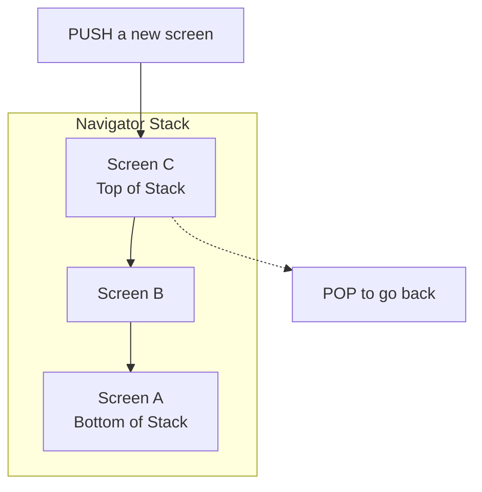

**Navigation** (or `routing`) is how users move between different screens (pages) in your app.

---

### 1. The Two Main Navigation Approaches

| Approach                      | Description                                                                                                                                                    | Best For                                                                          |
| :---------------------------- | :------------------------------------------------------------------------------------------------------------------------------------------------------------- | :-------------------------------------------------------------------------------- |
| **1. Imperative Navigation**  | You explicitly tell the Navigator to `push()` or `pop()` routes using a unique `Route` object.                                                                 | Simple apps, learning, scenarios where you need full control over the transition. |
| **2. Declarative Navigation** | You define the **entire set of possible screens** (a `route graph`) and the app's state determines which screen is shown. The Navigator updates automatically. | Complex apps with deep linking, web URLs, "bottom nav" bars, and state-driven UI. |

This guide will focus on **Imperative Navigation**, which is the most common starting point.

---

### 2. Core Concepts: Navigator & Routes

- **Navigator:** A widget that manages a stack of `Route` objects. It's like a history stack of visited screens. You don't create a `Navigator` directly; it's provided by your `App` structure (like `MaterialApp`).
- **Route:** An object that represents a screen or overlay. The most common type is a `PageRoute` (like `MaterialPageRoute`), which represents a full-screen modal screen.

Think of the `Navigator` as a stack of cards (the `Routes`). To see a new screen, you push a new card onto the stack. To go back, you pop the top card off the stack.



---

### 3. Basic Navigation Methods (Imperative)

#### Pushing a New Screen (`Navigator.push()`)

To navigate to a new screen, you **push** a new route onto the Navigator's stack.

```dart
// Inside a button's onPressed or similar callback
onPressed: () {
  Navigator.push(
    context, // The BuildContext is required to find the Navigator
    MaterialPageRoute(
      builder: (context) => const NewScreen(), // The widget for your new screen
    ),
  );
}
```

**What happens:** `NewScreen` slides in from the right (on iOS) or bottom (on Android).

#### Popping (Going Back) (`Navigator.pop()`)

To close the current screen and return to the previous one, you **pop** the current route off the Navigator's stack. You usually put this in an `AppBar`'s `leading` button or your own back button.

```dart
// Inside the "NewScreen" widget
AppBar(
  leading: IconButton(
    icon: const Icon(Icons.arrow_back),
    onPressed: () {
      Navigator.pop(context); // Pops the current screen off the stack
    },
  ),
)
// Or in a button in the body:
TextButton(
  onPressed: () => Navigator.pop(context),
  child: const Text('Go Back'),
)
```

**What happens:** `NewScreen` slides out, revealing the previous screen.

---

### 4. Passing Data Between Screens

#### Passing Data _To_ a New Screen

You pass data by simply passing it through the constructor of the widget you're navigating to.

```dart
// 1. Define a screen that accepts data
class DetailScreen extends StatelessWidget {
  final String itemName; // Data to be received
  final int itemId;

  const DetailScreen({super.key, required this.itemName, required this.itemId});

  @override
  Widget build(BuildContext context) {
    return Scaffold(
      appBar: AppBar(title: Text(itemName)),
      body: Center(child: Text('Details for item #$itemId')),
    );
  }
}

// 2. Push the screen and pass the data
onPressed: () {
  Navigator.push(
    context,
    MaterialPageRoute(
      builder: (context) => DetailScreen(
        itemName: 'Awesome Product', // Pass data here
        itemId: 42,
      ),
    ),
  );
}
```

#### Returning Data _From_ a Popped Screen

Sometimes you need to get a result back from the screen you're pushing (e.g., a user selection).

1.  **Push the screen and `await` a result** using `push()` which returns a `Future`.
2.  **In the second screen, pop with data** using `Navigator.pop(context, data)`.

```dart
// 1. Push and wait for a result
final result = await Navigator.push(
  context,
  MaterialPageRoute(builder: (context) => const SelectionScreen()),
);

// This line will execute only after SelectionScreen pops
print('User selected: $result');

// 2. In the SelectionScreen, pop with data
TextButton(
  onPressed: () {
    Navigator.pop(context, 'Yes'); // 'Yes' is the returned data
  },
  child: const Text('Yes'),
)
```

---

### 5. Named Routes (A More Organized Imperative Approach)

For more complex apps, managing all your `MaterialPageRoute` builders can get messy. Named routes offer a cleaner solution.

#### Step 1: Define the Routes Table

Define a map of route names to widget builders in your `MaterialApp`.

```dart
MaterialApp(
  title: 'Named Routes Demo',
  // Define the available routes and the screens they lead to
  routes: {
    '/': (context) => const HomeScreen(), // The app starts here
    '/details': (context) => const DetailScreen(),
    '/profile': (context) => const ProfileScreen(),
  },
  // If a route that isn't defined is requested, this builder is called.
  onGenerateRoute: (settings) {
    // You could handle dynamic paths here, e.g., '/details/:id'
    return MaterialPageRoute(builder: (context) => const UnknownScreen());
  },
);
```

#### Step 2: Navigate Using Route Names

Use `Navigator.pushNamed()` and related methods.

```dart
// Basic named navigation
Navigator.pushNamed(context, '/details');

// Push named and pass arguments (less common, requires setup)
Navigator.pushNamed(
  context,
  '/details',
  arguments: {'id': 100, 'name': 'My Item'}, // Arguments is an Object
);
// In the DetailScreen, access arguments:
ModalRoute.of(context)!.settings.arguments;
```

---

### Quick Cheat Sheet: Navigator Methods

| Method                                                  | Purpose                                         |
| :------------------------------------------------------ | :---------------------------------------------- |
| `Navigator.push(...)`                                   | Go to a new screen.                             |
| `Navigator.pop(context)`                                | Go back to the previous screen.                 |
| `Navigator.pushNamed(context, '/route')`                | Go to a screen defined by a named route.        |
| `Navigator.popUntil(context, (route) => route.isFirst)` | Pop until the very first screen.                |
| `Navigator.pushReplacement(...)`                        | Push a new screen and replace the current one.  |
| `Navigator.pushAndRemoveUntil(...)`                     | Push a new screen and remove all previous ones. |

### Summary & Recommendation

- **Start with `Navigator.push`:** Use basic `push` and `pop` with `MaterialPageRoute` to understand the fundamentals.
- **Upgrade to Named Routes:** As your app grows, switch to named routes defined in `MaterialApp` for better organization.
- **Use Constructors for Data:** Passing data through constructors is the simplest and most common method.
- **Use `await` and `pop(context, data)`** for returning data from a screen.

Mastering these imperative navigation basics will allow you to build the vast majority of app flows. The declarative approach (using `Router` and `GoRouter`) is a powerful next step for advanced use cases.
