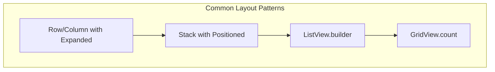
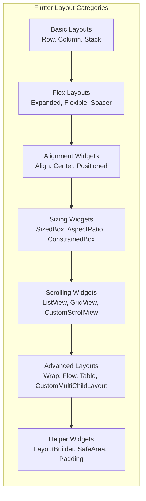

This comprehensive list covers all major Flutter layout widgets with their key attributes and purposes. Each widget serves specific layout needs, from basic arrangements to complex custom layouts.

## Core Layout Widgets

### 1. **Container**

Versatile widget that combines painting, positioning, and sizing capabilities.

```dart
Container(
  padding: EdgeInsets.all(16),
  margin: EdgeInsets.all(8),
  decoration: BoxDecoration(
    color: Colors.blue,
    borderRadius: BorderRadius.circular(8),
  ),
  child: Text('Content'),
)
```

**Most Used Attributes**:

- `child`: The widget contained
- `padding`: EdgeInsets around child
- `margin`: EdgeInsets around container
- `color`: Background color
- `decoration`: BoxDecoration for advanced styling
- `width`/`height`: Explicit dimensions
- `alignment`: Alignment of child
- `constraints`: BoxConstraints

---

### 2. **Row**

Arranges children horizontally in a line.

```dart
Row(
  mainAxisAlignment: MainAxisAlignment.spaceBetween,
  crossAxisAlignment: CrossAxisAlignment.center,
  children: [Icon(Icons.star), Text('Rating'), Text('4.5')],
)
```

**Most Used Attributes**:

- `children`: List of widgets
- `mainAxisAlignment`: Main axis alignment (start, center, end, spaceBetween, spaceAround, spaceEvenly)
- `crossAxisAlignment`: Cross axis alignment (start, center, end, stretch)
- `mainAxisSize`: Main axis size (max, min)
- `textDirection`: Text direction (ltr, rtl)
- `verticalDirection`: Vertical direction (down, up)

---

### 3. **Column**

Arranges children vertically in a column.

```dart
Column(
  mainAxisAlignment: MainAxisAlignment.center,
  crossAxisAlignment: CrossAxisAlignment.start,
  children: [Text('Title'), Text('Subtitle'), Button()],
)
```

**Most Used Attributes**:

- `children`: List of widgets
- `mainAxisAlignment`: Main axis alignment
- `crossAxisAlignment`: Cross axis alignment
- `mainAxisSize`: Main axis size
- `textDirection`: Text direction
- `verticalDirection`: Vertical direction

---

### 4. **Stack**

Overlays children on top of each other.

```dart
Stack(
  alignment: Alignment.bottomCenter,
  children: [
    Image.network('url'),
    Positioned(bottom: 10, child: Text('Caption')),
  ],
)
```

**Most Used Attributes**:

- `children`: List of widgets
- `alignment`: Alignment of non-positioned children
- `fit`: How to size non-positioned children (loose, expand, passthrough)
- `clipBehavior`: Clip behavior (none, hardEdge, antiAlias)

---

### 5. **ListView**

Scrollable list of widgets.

```dart
ListView(
  padding: EdgeInsets.all(16),
  scrollDirection: Axis.vertical,
  children: List.generate(20, (i) => ListTile(title: Text('Item $i'))),
)
```

**Most Used Attributes**:

- `children`: List of widgets (for non-lazy)
- `itemBuilder`: Builder for lazy rendering
- `scrollDirection`: Scroll direction (vertical, horizontal)
- `padding`: EdgeInsets
- `physics`: Scroll physics
- `shrinkWrap`: Whether to shrink-wrap content

---

### 6. **GridView**

Scrollable grid of widgets.

```dart
GridView.count(
  crossAxisCount: 2,
  crossAxisSpacing: 10,
  mainAxisSpacing: 10,
  children: List.generate(10, (i) => Card(child: Text('Item $i'))),
)
```

**Most Used Attributes**:

- `gridDelegate`: SliverGridDelegate (count, extent, custom)
- `children`: List of widgets
- `padding`: EdgeInsets
- `scrollDirection`: Scroll direction
- `physics`: Scroll physics

---

### 7. **Expanded**

Expands a child of Row/Column to fill available space.

```dart
Row(
  children: [
    Expanded(flex: 2, child: Container(color: Colors.red)),
    Expanded(flex: 1, child: Container(color: Colors.blue)),
  ],
)
```

**Most Used Attributes**:

- `child`: The widget to expand
- `flex\*\*: Flex factor (default: 1)

---

### 8. **Flexible**

Controls how a child fills available space.

```dart
Row(
  children: [
    Flexible(fit: FlexFit.loose, child: Container()),
    Flexible(fit: FlexFit.tight, child: Container()),
  ],
)
```

**Most Used Attributes**:

- `child`: The widget
- `flex\*\*: Flex factor
- `fit\*\*: Flex fit (loose, tight)

---

### 9. **SizedBox**

Box with specified dimensions.

```dart
SizedBox(
  width: 100,
  height: 50,
  child: Text('Sized Box'),
)
```

**Most Used Attributes**:

- `child`: The widget
- `width`: Width dimension
- `height`: Height dimension

---

### 10. **Spacer**

Creates adjustable empty space.

```dart
Row(
  children: [
    Text('Start'),
    Spacer(flex: 2),
    Text('End'),
  ],
)
```

**Most Used Attributes**:

- `flex\*\*: Flex factor (default: 1)

---

## Alignment & Positioning Widgets

### 11. **Align**

Aligns a child within itself.

```dart
Align(
  alignment: Alignment.bottomRight,
  child: FloatingActionButton(),
)
```

**Most Used Attributes**:

- `child`: The widget to align
- `alignment\*\*: Alignment (topLeft, center, bottomRight, etc.)
- `widthFactor\*\*: Width factor
- `heightFactor\*\*: Height factor

---

### 12. **Center**

Centers its child within itself.

```dart
Center(
  child: CircularProgressIndicator(),
)
```

**Most Used Attributes**:

- `child\*\*: The widget to center
- `widthFactor\*\*: Width factor
- `heightFactor\*\*: Height factor

---

### 13. **Positioned**

Positions a child within a Stack.

```dart
Stack(
  children: [
    Positioned(top: 10, left: 20, child: Icon(Icons.close)),
    Positioned.fill(child: BackgroundWidget()),
  ],
)
```

**Most Used Attributes**:

- `child\*\*: The widget to position
- `top**, `bottom**, `left**, `right\*\*: Position offsets
- `width**, `height\*\*: Dimensions

---

### 14. **AspectRatio**

Sizes child to specified aspect ratio.

```dart
AspectRatio(
  aspectRatio: 16 / 9,
  child: Image.network('url'),
)
```

**Most Used Attributes**:

- `child\*\*: The widget
- `aspectRatio\*\*: Aspect ratio (width/height)

---

### 15. **FractionallySizedBox**

Sizes child to fraction of available space.

```dart
FractionallySizedBox(
  widthFactor: 0.8,
  heightFactor: 0.5,
  child: Container(color: Colors.blue),
)
```

**Most Used Attributes**:

- `child\*\*: The widget
- `widthFactor\*\*: Width factor (0.0 to 1.0)
- `heightFactor\*\*: Height factor (0.0 to 1.0)
- `alignment\*\*: Alignment of child

---

## Constraint & Sizing Widgets

### 16. **ConstrainedBox**

Imposes additional constraints on its child.

```dart
ConstrainedBox(
  constraints: BoxConstraints(
    minWidth: 100,
    maxWidth: 300,
    minHeight: 50,
    maxHeight: 200,
  ),
  child: Container(color: Colors.green),
)
```

**Most Used Attributes**:

- `child\*\*: The widget
- `constraints\*\*: BoxConstraints

---

### 17. **UnconstrainedBox**

Removes constraints from parent.

```dart
UnconstrainedBox(
  child: Container(width: 500, height: 500), // Can exceed parent
)
```

**Most Used Attributes**:

- `child\*\*: The widget
- `alignment\*\*: Alignment
- `constrainedAxis\*\*: Which axis to constrain

---

### 18. **SizedBox.expand**

SizedBox that expands to fill available space.

```dart
SizedBox.expand(
  child: Container(color: Colors.blue),
)
```

**Most Used Attributes**:

- `child\*\*: The widget

---

### 19. **LimitedBox**

Limits size only when unconstrained.

```dart
LimitedBox(
  maxWidth: 100,
  maxHeight: 100,
  child: Container(color: Colors.red),
)
```

**Most Used Attributes**:

- `child\*\*: The widget
- `maxWidth\*\*: Maximum width
- `maxHeight\*\*: Maximum height

---

### 20. **OverflowBox**

Allows child to overflow parent.

```dart
OverflowBox(
  minWidth: 0.0,
  maxWidth: 100.0,
  minHeight: 0.0,
  maxHeight: 100.0,
  child: Container(width: 150, height: 150),
)
```

**Most Used Attributes**:

- `child\*\*: The widget
- `alignment\*\*: Alignment
- `minWidth**, `maxWidth**, `minHeight**, `maxHeight\*\*: Constraints

---

## Specialized Layout Widgets

### 21. **Wrap**

Flow layout that wraps to next line.

```dart
Wrap(
  spacing: 8.0,
  runSpacing: 4.0,
  children: List.generate(10, (i) => Chip(label: Text('Tag $i'))),
)
```

**Most Used Attributes**:

- `children\*\*: List of widgets
- `spacing\*\*: Spacing between children
- `runSpacing\*\*: Spacing between lines
- `alignment\*\*: Main axis alignment
- `runAlignment\*\*: Cross axis alignment
- `direction\*\*: Axis (horizontal, vertical)

---

### 22. **Flow**

Efficient flow layout with custom delegate.

```dart
Flow(
  delegate: FlowDelegate(),
  children: [Widget1(), Widget2(), Widget3()],
)
```

**Most Used Attributes**:

- `children\*\*: List of widgets
- `delegate\*\*: FlowDelegate
- `clipBehavior\*\*: Clip behavior

---

### 23. **Table**

Table layout with rows and columns.

```dart
Table(
  border: TableBorder.all(),
  children: [
    TableRow(children: [Text('A'), Text('B'), Text('C')]),
    TableRow(children: [Text('1'), Text('2'), Text('3')]),
  ],
)
```

**Most Used Attributes**:

- `children\*\*: List of TableRow
- `border\*\*: TableBorder
- `columnWidths\*\*: Map of column widths
- `defaultColumnWidth\*\*: Default column width
- `textDirection\*\*: Text direction

---

### 24. **DataTable**

Material Design data table.

```dart
DataTable(
  columns: [
    DataColumn(label: Text('Name')),
    DataColumn(label: Text('Age')),
  ],
  rows: [
    DataRow(cells: [
      DataCell(Text('John')),
      DataCell(Text('25')),
    ]),
  ],
)
```

**Most Used Attributes**:

- `columns\*\*: List of DataColumn
- `rows\*\*: List of DataRow
- `sortColumnIndex\*\*: Sort column index
- `sortAscending\*\*: Sort direction

---

### 25. **CustomMultiChildLayout**

Custom layout with multiple children.

```dart
CustomMultiChildLayout(
  delegate: MyLayoutDelegate(),
  children: [
    LayoutId(id: 'header', child: Text('Header')),
    LayoutId(id: 'content', child: Text('Content')),
  ],
)
```

**Most Used Attributes**:

- `delegate\*\*: MultiChildLayoutDelegate
- `children\*\*: List of LayoutId widgets

---

## Scrolling & Viewport Widgets

### 26. **SingleChildScrollView**

Scrollable widget with single child.

```dart
SingleChildScrollView(
  scrollDirection: Axis.horizontal,
  child: Row(children: [/* many widgets */]),
)
```

**Most Used Attributes**:

- `child\*\*: The widget to scroll
- `scrollDirection\*\*: Scroll direction
- `padding\*\*: EdgeInsets
- `physics\*\*: Scroll physics
- `reverse\*\*: Reverse scrolling

---

### 27. **CustomScrollView**

Scroll view with custom scroll effects.

```dart
CustomScrollView(
  slivers: [
    SliverAppBar(expandedHeight: 200),
    SliverList(delegate: SliverChildListDelegate([/* items */])),
  ],
)
```

**Most Used Attributes**:

- `slivers\*\*: List of Sliver widgets
- `scrollDirection\*\*: Scroll direction
- `physics\*\*: Scroll physics

---

### 28. **PageView**

Scrollable pages.

```dart
PageView(
  controller: PageController(),
  children: [Page1(), Page2(), Page3()],
)
```

**Most Used Attributes**:

- `children\*\*: List of pages
- `controller\*\*: PageController
- `scrollDirection\*\*: Scroll direction
- `physics\*\*: Scroll physics

---

## Layout Helper Widgets

### 29. **LayoutBuilder**

Builds widget tree based on parent constraints.

```dart
LayoutBuilder(
  builder: (context, constraints) {
    if (constraints.maxWidth > 600) {
      return WideLayout();
    } else {
      return NarrowLayout();
    }
  },
)
```

**Most Used Attributes**:

- `builder\*\*: LayoutBuilder callback

---

### 30. **Builder**

Builds widgets with current BuildContext.

```dart
Builder(
  builder: (context) {
    return Text('Built with context: $context');
  },
)
```

**Most Used Attributes**:

- `builder\*\*: Builder callback

---

### 31. **SafeArea**

Insets child to avoid system UI.

```dart
SafeArea(
  child: Text('Avoids status bar and notches'),
)
```

**Most Used Attributes**:

- `child\*\*: The widget
- `left**, `top**, `right**, `bottom\*\*: Which edges to avoid

---

### 32. **Padding**

Adds padding around child.

```dart
Padding(
  padding: EdgeInsets.all(16),
  child: Text('Padded text'),
)
```

**Most Used Attributes**:

- `child\*\*: The widget
- `padding\*\*: EdgeInsets

---

## Visual Layout Diagram




