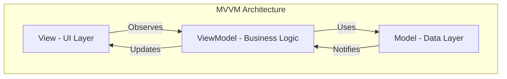
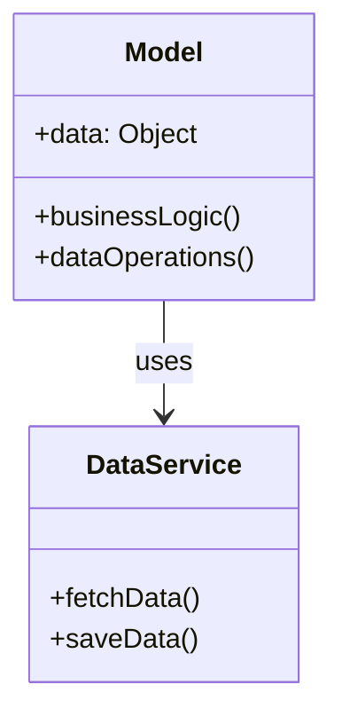
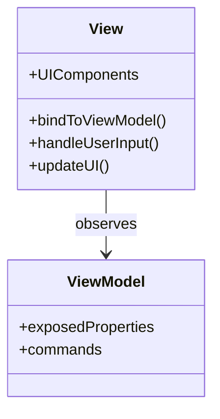
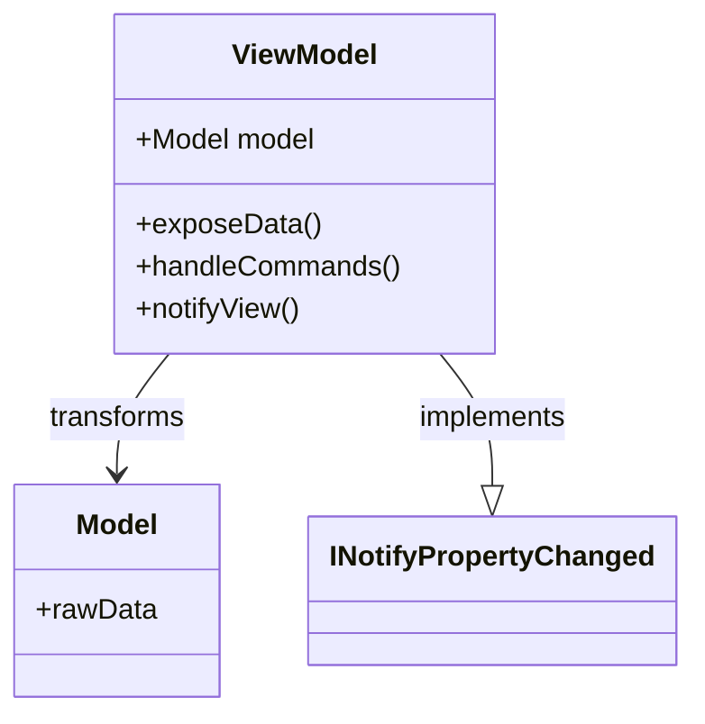
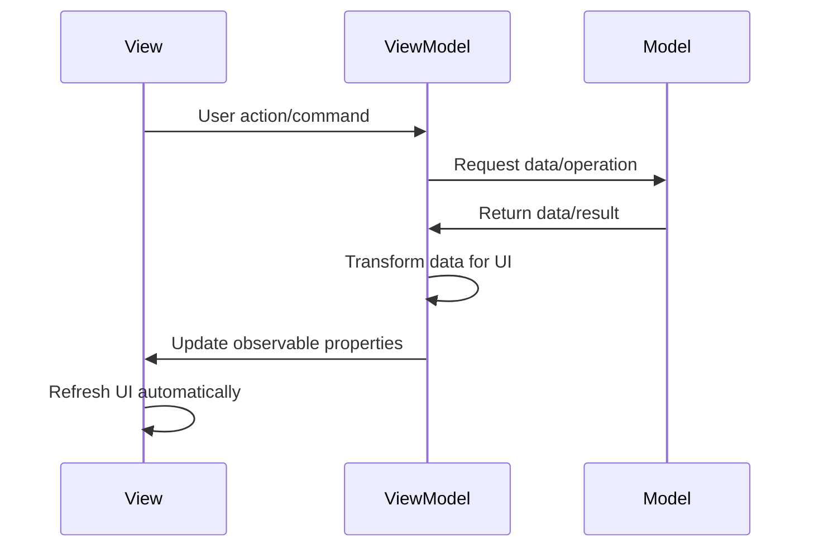

MVVM (Model-View-ViewModel) is an architectural pattern that separates an application into three main components, promoting separation of concerns and testability.

- View
- ViewModel
- Model



## Core Components

### 1. Model

<table width="100%">
<tr><td valign="top">



</td><td valign="top">

**Responsibility**: Represents data and business logic

- Data structures
- Business rules
- Data access operations
- API communications

</td></tr>
</table>

### 2. View

<table width="100%">
<tr><td valign="top">



</td><td valign="top">

**Responsibility**: Handles UI presentation

- User interface elements
- Displays data from ViewModel
- Captures user input
- No business logic
</td></tr>
</table>

### 3. ViewModel

<table width="100%">
<tr><td valign="top">



</td><td valign="top">

**Responsibility**: Mediator between View and Model

- Transforms Model data for View
- Handles View commands
- Maintains View state
- Implements data binding
</td></tr>
</table>

## Data Flow



## Implementation in Mobile Platforms

### Android (Jetpack Compose + ViewModel)

```kotlin
// Model
data class User(val id: Int, val name: String, val email: String)

// Repository
class UserRepository {
    suspend fun getUser(): User {
        // API call or database operation
        return User(1, "John", "john@email.com")
    }
}

// ViewModel
class UserViewModel : ViewModel() {
    private val repository = UserRepository()
    var userState by mutableStateOf<User?>(null)
        private set

    fun loadUser() {
        viewModelScope.launch {
            userState = repository.getUser()
        }
    }
}

// View
@Composable
fun UserScreen(viewModel: UserViewModel = hiltViewModel()) {
    val user by viewModel.userState

    LaunchedEffect(Unit) {
        viewModel.loadUser()
    }

    user?.let { user ->
        Text(text = user.name)
        Text(text = user.email)
    }
}
```

### iOS (SwiftUI + Combine)

```swift
// Model
struct User: Identifiable, Codable {
    let id: Int
    let name: String
    let email: String
}

// Service
class UserService {
    func fetchUser() async throws -> User {
        // API call implementation
        return User(id: 1, name: "John", email: "john@email.com")
    }
}

// ViewModel
@MainActor
class UserViewModel: ObservableObject {
    @Published var user: User?
    private let service = UserService()

    func loadUser() async {
        do {
            user = try await service.fetchUser()
        } catch {
            print("Error loading user: \(error)")
        }
    }
}

// View
struct UserView: View {
    @StateObject private var viewModel = UserViewModel()

    var body: some View {
        VStack {
            if let user = viewModel.user {
                Text(user.name)
                Text(user.email)
            }
        }
        .task {
            await viewModel.loadUser()
        }
    }
}
```

### Flutter (Provider/Bloc/Riverpod)

```dart
// Model
class User {
  final int id;
  final String name;
  final String email;

  User({required this.id, required this.name, required this.email});
}

// Repository
class UserRepository {
  Future<User> getUser() async {
    // API call implementation
    return User(id: 1, name: 'John', email: 'john@email.com');
  }
}

// ViewModel (using ChangeNotifier)
class UserViewModel with ChangeNotifier {
  final UserRepository _repository = UserRepository();
  User? _user;

  User? get user => _user;

  Future<void> loadUser() async {
    _user = await _repository.getUser();
    notifyListeners(); // Notify View to rebuild
  }
}

// View
class UserScreen extends StatelessWidget {
  @override
  Widget build(BuildContext context) {
    final viewModel = Provider.of<UserViewModel>(context);

    return FutureBuilder(
      future: viewModel.loadUser(),
      builder: (context, snapshot) {
        if (viewModel.user != null) {
          return Column(
            children: [
              Text(viewModel.user!.name),
              Text(viewModel.user!.email),
            ],
          );
        }
        return CircularProgressIndicator();
      },
    );
  }
}
```

## Benefits of MVVM

1. **Separation of Concerns**: Clear separation between UI, business logic, and data
2. **Testability**: ViewModel can be tested without UI dependencies
3. **Maintainability**: Easier to modify and extend
4. **Data Binding**: Reduces boilerplate code for UI updates
5. **Team Collaboration**: Different team members can work on different components

## Common Data Binding Mechanisms

- **Android**: LiveData, StateFlow, Observable fields
- **iOS**: @Published, Combine framework, ObservableObject
- **Flutter**: Provider, Riverpod, Bloc, ValueNotifier
- **Cross-platform**: RxJava/RxSwift, MobX

MVVM is particularly well-suited for mobile development due to its ability to handle complex UI state management while maintaining clean separation between components.
