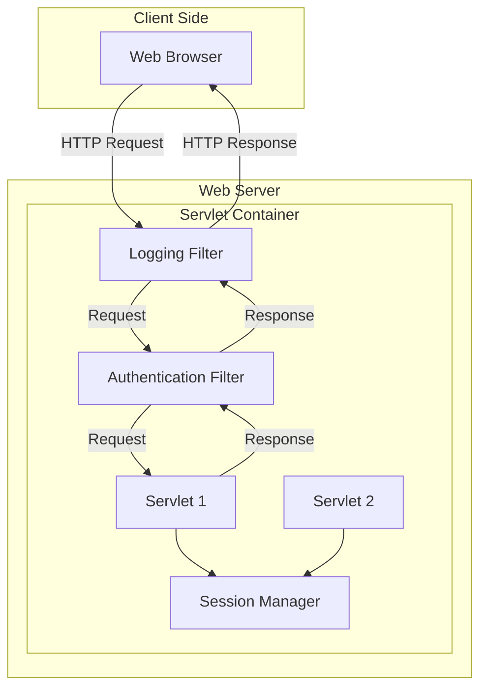

---

## What are Servlets?
* **Servlets** are **Java programs** that run **on a web server** 
* It handle client requests. 
* They extend the capabilities of servers that host applications accessed via **request-response programming model**.

## Servlet Lifecycle


This diagram shows the complete servlet lifecycle:
1. Client request arrives at the servlet container
2. Servlet class is loaded and instantiated if needed
3. `init()` method is called for initialization
4. `service()` method routes to appropriate handler (`doGet`, `doPost`, etc.)
5. Request is processed and response generated
6. Response is sent back to client
7. On container shutdown, `destroy()` method is called for cleanup

The lifecycle has three main phases:
- **Initialization**: `init()` method
- **Request handling**: `service()`, `doGet()`, `doPost()` methods
- **Destruction**: `destroy()` method

## Basic Servlet Structure

```java
import java.io.*;
import javax.servlet.*;
import javax.servlet.http.*;

public class HelloServlet extends HttpServlet {
    
    // Initialize servlet
    public void init() throws ServletException {
        // Initialization code
    }
    
    // Handle GET requests
    protected void doGet(HttpServletRequest request, 
                        HttpServletResponse response)
            throws ServletException, IOException {
        
        response.setContentType("text/html");
        PrintWriter out = response.getWriter();
        
        out.println("<html><body>");
        out.println("<h1>Hello World Servlet!</h1>");
        out.println("</body></html>");
    }
    
    // Handle POST requests
    protected void doPost(HttpServletRequest request, 
                         HttpServletResponse response)
            throws ServletException, IOException {
        doGet(request, response);
    }
    
    // Clean up resources
    public void destroy() {
        // Cleanup code
    }
}
```

## Web.xml Configuration (Traditional)

```xml
<web-app>
    <servlet>
        <servlet-name>HelloServlet</servlet-name>
        <servlet-class>com.example.HelloServlet</servlet-class>
    </servlet>
    
    <servlet-mapping>
        <servlet-name>HelloServlet</servlet-name>
        <url-pattern>/hello</url-pattern>
    </servlet-mapping>
</web-app>
```

## Annotation-based Configuration (Servlet 3.0+)

```java
@WebServlet(
    name = "HelloServlet",
    urlPatterns = {"/hello", "/greet"},
    loadOnStartup = 1
)
public class HelloServlet extends HttpServlet {
    // Servlet code
}
```

## Request Handling Example

```java
@WebServlet("/user")
public class UserServlet extends HttpServlet {
    
    protected void doGet(HttpServletRequest request, 
                        HttpServletResponse response)
            throws ServletException, IOException {
        
        // Get request parameters
        String name = request.getParameter("name");
        String age = request.getParameter("age");
        
        // Set response type
        response.setContentType("text/html");
        PrintWriter out = response.getWriter();
        
        out.println("<h1>User Information</h1>");
        out.println("<p>Name: " + name + "</p>");
        out.println("<p>Age: " + age + "</p>");
    }
    
    protected void doPost(HttpServletRequest request, 
                         HttpServletResponse response)
            throws ServletException, IOException {
        
        // Handle form submission
        String username = request.getParameter("username");
        String password = request.getParameter("password");
        
        // Process data (simple authentication example)
        if ("admin".equals(username) && "password".equals(password)) {
            response.sendRedirect("welcome.jsp");
        } else {
            response.sendRedirect("error.jsp");
        }
    }
}
```

## Session Management

```java
@WebServlet("/session")
public class SessionServlet extends HttpServlet {
    
    protected void doGet(HttpServletRequest request, 
                        HttpServletResponse response)
            throws ServletException, IOException {
        
        // Get or create session
        HttpSession session = request.getSession(true);
        
        // Set session attributes
        session.setAttribute("user", "JohnDoe");
        session.setAttribute("visitCount", 1);
        
        // Get session attributes
        Integer count = (Integer) session.getAttribute("visitCount");
        if (count != null) {
            session.setAttribute("visitCount", count + 1);
        }
        
        response.getWriter().println("Visit count: " + 
            session.getAttribute("visitCount"));
    }
}
```

## Servlet Context and Initialization Parameters

```java
@WebServlet(
    urlPatterns = "/config",
    initParams = {
        @WebInitParam(name = "dbUrl", value = "jdbc:mysql://localhost:3306/mydb"),
        @WebInitParam(name = "maxUsers", value = "100")
    }
)
public class ConfigServlet extends HttpServlet {
    
    private String dbUrl;
    private int maxUsers;
    
    public void init() throws ServletException {
        // Get init parameters
        dbUrl = getInitParameter("dbUrl");
        maxUsers = Integer.parseInt(getInitParameter("maxUsers"));
        
        // Get context parameters
        ServletContext context = getServletContext();
        String appName = context.getInitParameter("appName");
    }
    
    protected void doGet(HttpServletRequest request, 
                        HttpServletResponse response)
            throws ServletException, IOException {
        
        response.getWriter().println("DB URL: " + dbUrl);
        response.getWriter().println("Max Users: " + maxUsers);
    }
}
```

## Filter Example

```java
@WebFilter("/*")
public class LoggingFilter implements Filter {
    
    public void init(FilterConfig config) throws ServletException {
        // Initialization code
    }
    
    public void doFilter(ServletRequest request, 
                        ServletResponse response, 
                        FilterChain chain)
            throws IOException, ServletException {
        
        // Pre-processing
        System.out.println("Request received at: " + new Date());
        long startTime = System.currentTimeMillis();
        
        // Pass request to next filter or servlet
        chain.doFilter(request, response);
        
        // Post-processing
        long endTime = System.currentTimeMillis();
        System.out.println("Request processed in: " + 
                          (endTime - startTime) + "ms");
    }
    
    public void destroy() {
        // Cleanup code
    }
}
```

## Servlet Architecture



## Common Interview Questions with Code Examples

### 1. How to handle file upload?

```java
@WebServlet("/upload")
@MultipartConfig
public class FileUploadServlet extends HttpServlet {
    
    protected void doPost(HttpServletRequest request,
                         HttpServletResponse response)
            throws ServletException, IOException {
        
        // Get uploaded file
        Part filePart = request.getPart("file");
        String fileName = filePart.getSubmittedFileName();
        
        // Save file
        InputStream fileContent = filePart.getInputStream();
        Files.copy(fileContent, Paths.get("/uploads/" + fileName));
        
        response.getWriter().println("File uploaded successfully!");
    }
}
```

### 2. How to implement redirect and forward?

```java
@WebServlet("/router")
public class RouterServlet extends HttpServlet {
    
    protected void doGet(HttpServletRequest request,
                        HttpServletResponse response)
            throws ServletException, IOException {
        
        String action = request.getParameter("action");
        
        if ("redirect".equals(action)) {
            // Client-side redirect
            response.sendRedirect("https://example.com");
        } else if ("forward".equals(action)) {
            // Server-side forward
            RequestDispatcher dispatcher = 
                request.getRequestDispatcher("/targetServlet");
            dispatcher.forward(request, response);
        } else if ("include".equals(action)) {
            // Include another resource
            RequestDispatcher dispatcher = 
                request.getRequestDispatcher("/header.jsp");
            dispatcher.include(request, response);
        }
    }
}
```

### 3. How to handle cookies?

```java
@WebServlet("/cookie")
public class CookieServlet extends HttpServlet {
    
    protected void doGet(HttpServletRequest request,
                        HttpServletResponse response)
            throws ServletException, IOException {
        
        // Create cookie
        Cookie userCookie = new Cookie("username", "JohnDoe");
        userCookie.setMaxAge(3600); // 1 hour
        response.addCookie(userCookie);
        
        // Read cookies
        Cookie[] cookies = request.getCookies();
        if (cookies != null) {
            for (Cookie cookie : cookies) {
                if ("username".equals(cookie.getName())) {
                    response.getWriter().println(
                        "Welcome back " + cookie.getValue());
                }
            }
        }
    }
}
```

## Key Points to Remember for Interview:

1. **Lifecycle Methods**: init(), service(), doGet(), doPost(), destroy()
2. **Thread Safety**: Servlets are multithreaded - avoid instance variables
3. **Session vs Request**: Session persists across requests, request is per-request
4. **GET vs POST**: GET for data retrieval, POST for data modification
5. **Filters**: For cross-cutting concerns (logging, security, etc.)
6. **Annotations vs web.xml**: Annotations are simpler, web.xml offers more configuration options
7. **Servlet Context**: Application-wide scope, shared by all servlets
8. **Response Types**: setContentType() is crucial for proper response handling

