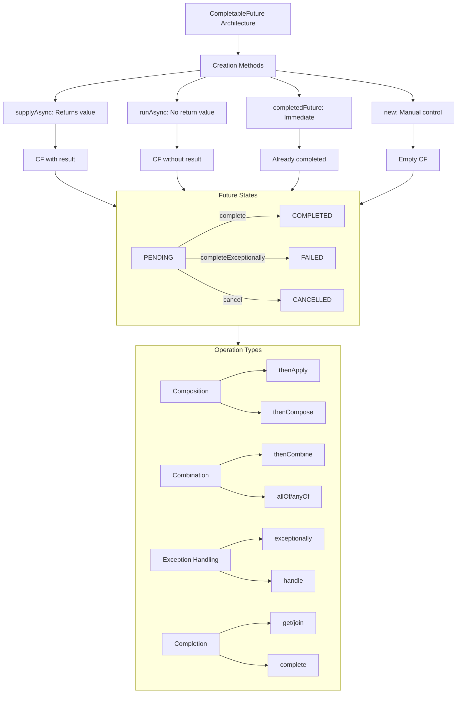
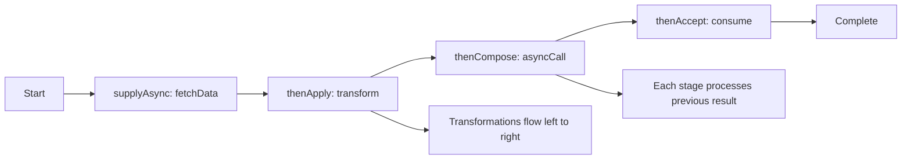
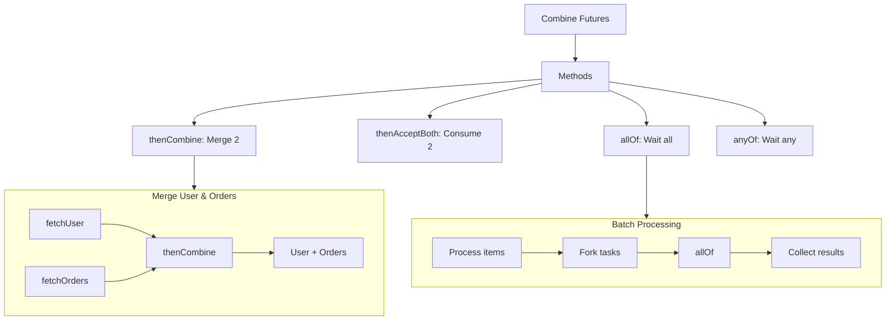
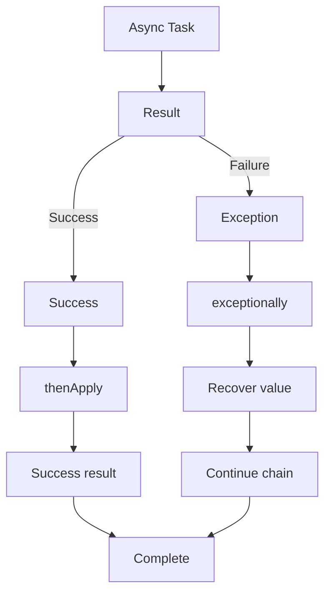
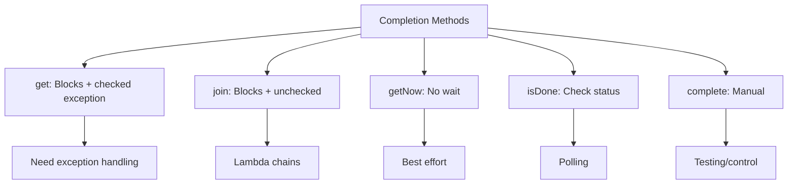
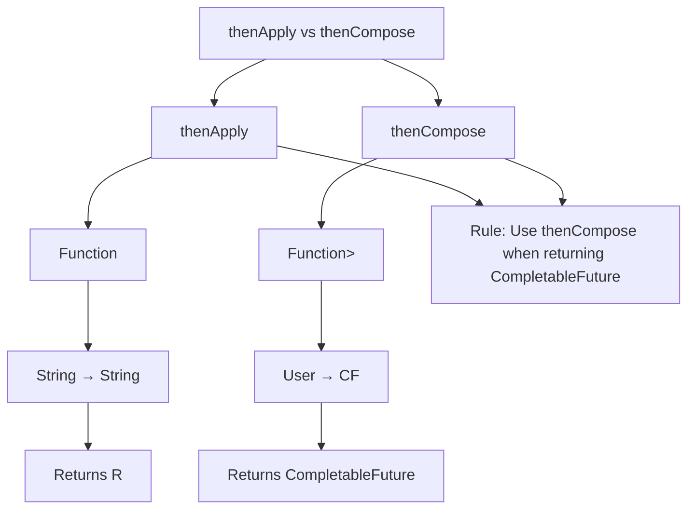
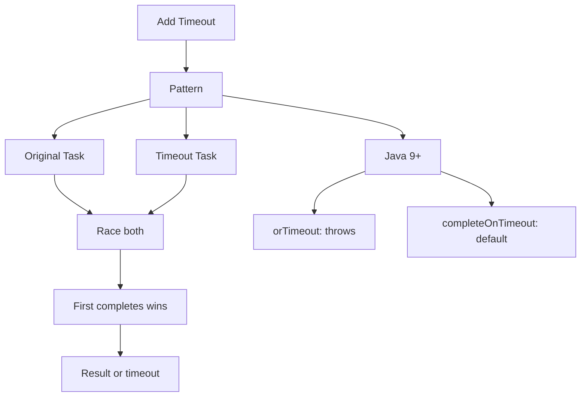
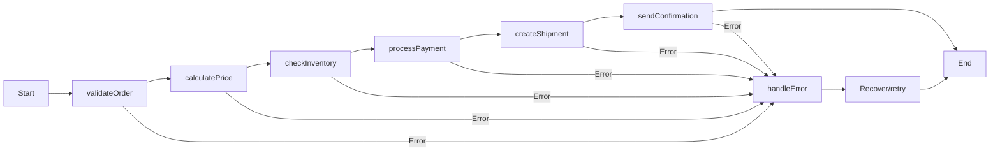
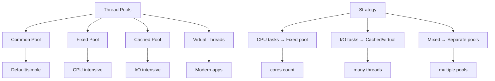
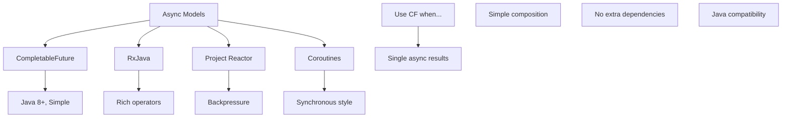

_Mastering Asynchronous Programming in Modern Java_

As you continue your journey with CompletableFuture, you'll find that it changes not just how you write code, but how you design systems. You'll start seeing concurrency opportunities everywhere, and you'll build applications that are scalable, responsive, and resilient.

---

## **Prologue: The Asynchronous Revolution**

Imagine you're in a busy restaurant. In the synchronous world, a waiter would take your order, stand in the kitchen waiting for it to be cooked, then serve it to you before attending to the next customer. The restaurant would serve only a handful of customers per hour. In the asynchronous world, the waiter takes your order, gives it to the kitchen, then immediately helps other customers while your food is being prepared. This is the power of CompletableFuture—it allows your application to be that efficient waiter, handling multiple operations concurrently without blocking.

## **Chapter 1: The Foundations of CompletableFuture**

### **1.1 The Evolution: From Future to CompletableFuture**

Before Java 8, we had the `Future` interface. It was like ordering food at a drive-thru: you place your order (submit a task), get a receipt (Future object), and periodically check if your food is ready. There was no way to say, "When my burger is ready, automatically add fries."

```java
// The old way - manual checking
ExecutorService executor = Executors.newSingleThreadExecutor();
Future<String> future = executor.submit(() -> {
    Thread.sleep(1000);
    return "Result";
});

// Painful manual checking
while(!future.isDone()) {
    // Do other work... but how to know when to check again?
    Thread.sleep(100);
}
String result = future.get(); // Blocks if not ready
```

**Enter CompletableFuture**—a game-changer that brought functional programming to asynchronous operations. It's not just a container for a future value; it's a promise that you can compose, combine, and transform.

### **1.2 The Dual Identity**

CompletableFuture wears two hats:

- **As a Future**: It can hold a value that will be available later
- **As a CompletionStage**: It can be part of a pipeline of computations

Think of it as a **Russian nesting doll** that can contain either a value or another CompletableFuture, allowing you to build complex asynchronous workflows.

### **1.3 The Mental Model: Restaurant Kitchen Analogy**

Let's build our understanding through an analogy:

```java
// The kitchen staff (threads)
ExecutorService chefs = Executors.newFixedThreadPool(4);  // Main chefs
ExecutorService assistants = Executors.newCachedThreadPool();  // Kitchen helpers

// Order taking (initiating async operation)
CompletableFuture<Order> orderFuture = CompletableFuture.supplyAsync(
    () -> takeOrder(customer),  // Task
    chefs                       // Who does it
);

// Preparing food (transforming result)
CompletableFuture<Meal> mealFuture = orderFuture.thenApplyAsync(
    order -> prepareMeal(order),  // Transformation
    assistants                    // Different pool for different work
);

// Serving (consuming result)
mealFuture.thenAcceptAsync(
    meal -> serveToTable(meal),   // Action
    waitersPool                   // Yet another specialized pool
);
```

## **Chapter 2: Creating the Promise**

### **2.1 The Birth of a CompletableFuture**

There are several ways to create a CompletableFuture, each serving different purposes:

#### **2.1.1 The Simple Promise: `new CompletableFuture<>()`**

This creates a "blank check" that you can fill in later. It's useful when you need to manually control when and how the future completes.

```java
// Creating a manual future is like giving someone a blank check
CompletableFuture<String> blankCheck = new CompletableFuture<>();

// Someone else fills it in later
new Thread(() -> {
    try {
        String value = expensiveComputation();
        blankCheck.complete(value);  // Filling the check
    } catch (Exception e) {
        blankCheck.completeExceptionally(e);  // Writing "VOID" on the check
    }
}).start();
```

#### **2.1.2 The Immediate Promise: `completedFuture()`**

Sometimes you already have the value, but your API requires a Future. This is like giving someone cash instead of a check.

```java
// When you have the result ready
CompletableFuture<String> immediateCash =
    CompletableFuture.completedFuture("I already have this!");

// Useful in conditional logic
public CompletableFuture<String> getUserData(String userId) {
    if (cache.containsKey(userId)) {
        // Already have it - return completed future
        return CompletableFuture.completedFuture(cache.get(userId));
    } else {
        // Need to fetch it - return async future
        return CompletableFuture.supplyAsync(() -> fetchFromDatabase(userId));
    }
}
```

#### **2.1.3 The Async Worker: `supplyAsync()` and `runAsync()`**

These are your workhorses. They immediately start working on a task in another thread.

```java
// supplyAsync - returns a value (like a function)
CompletableFuture<String> baker = CompletableFuture.supplyAsync(() -> {
    System.out.println("Baker: Starting to bake bread");
    try {
        Thread.sleep(2000);  // Simulating baking time
    } catch (InterruptedException e) {
        throw new IllegalStateException(e);
    }
    System.out.println("Baker: Bread is ready!");
    return "Freshly baked bread";
});

// runAsync - performs an action without returning (like a procedure)
CompletableFuture<Void> cleaner = CompletableFuture.runAsync(() -> {
    System.out.println("Cleaner: Cleaning the kitchen");
    try {
        Thread.sleep(1000);
    } catch (InterruptedException e) {
        throw new IllegalStateException(e);
    }
    System.out.println("Cleaner: Kitchen is clean!");
});
```

**Important Distinction:**

- `supplyAsync(() -> value)` → Returns `CompletableFuture<ValueType>`
- `runAsync(() -> {})` → Returns `CompletableFuture<Void>`

### **2.2 Choosing the Right Thread Pool**

By default, CompletableFuture uses the common `ForkJoinPool`. But like a restaurant assigning tasks to specialists, you should choose your executors wisely.

```java
// The kitchen hierarchy
ExecutorService headChef = Executors.newSingleThreadExecutor();  // For critical tasks
ExecutorService lineCooks = Executors.newFixedThreadPool(4);     // For cooking
ExecutorService prepCooks = Executors.newCachedThreadPool();     // For preparation
ExecutorService dishwasher = Executors.newSingleThreadExecutor(); // For cleanup

// Assigning tasks to the right people
CompletableFuture<Ingredient> chopped = CompletableFuture.supplyAsync(
    () -> chopVegetables(),   // Task
    prepCooks                 // Prep cooks do preparation
);

CompletableFuture<Dish> cooked = CompletableFuture.supplyAsync(
    () -> cookDish(chopped.get()),  // Getting result from previous future
    lineCooks                       // Line cooks do cooking
);
```

## **Chapter 3: Waiting for Results - The Art of Patience**

### **3.1 Blocking Methods: When You Must Wait**

Sometimes, like at a doctor's office, you have no choice but to wait. CompletableFuture provides several ways to wait, each with different characteristics.

#### **3.1.1 `get()` - The Polite Waiter**

This method blocks until the result is available, but it politely asks you to handle the checked exceptions.

```java
CompletableFuture<String> future = CompletableFuture.supplyAsync(() -> {
    Thread.sleep(1000);
    return "Dinner is served";
});

try {
    // Like waiting politely with your hands folded
    String result = future.get();  // Blocks indefinitely

    // Or wait with a timeout
    String resultWithTimeout = future.get(2, TimeUnit.SECONDS);
} catch (InterruptedException e) {
    // Someone interrupted your wait
    Thread.currentThread().interrupt();
    System.out.println("I was interrupted while waiting");
} catch (ExecutionException e) {
    // The chef burned the food
    System.out.println("The cooking failed: " + e.getCause());
} catch (TimeoutException e) {
    // The chef is taking too long
    System.out.println("I can't wait any longer!");
}
```

#### **3.1.2 `join()` - The Impatient Customer**

This is like `get()` but throws unchecked exceptions. Use it when you're sure the future will complete successfully, or you want the exception to bubble up.

```java
CompletableFuture<String> future = CompletableFuture.supplyAsync(() -> "Quick service");

// No try-catch needed, but throws CompletionException
String result = future.join();  // Throws unchecked CompletionException
```

#### **3.1.3 `getNow()` - The Grab-and-Go**

This doesn't wait at all. If the value isn't ready, it returns the default value immediately.

```java
CompletableFuture<String> slowChef = CompletableFuture.supplyAsync(() -> {
    try {
        Thread.sleep(5000);
        return "Gourmet meal";
    } catch (InterruptedException e) {
        return "Interrupted meal";
    }
});

// Don't want to wait? Get fast food instead
String fastFood = slowChef.getNow("Fast food burger");
System.out.println(fastFood);  // Prints "Fast food burger" immediately

// Later, if you want to check if the gourmet meal is ready
if (slowChef.isDone()) {
    String gourmet = slowChef.join();
    System.out.println("Now I have: " + gourmet);
}
```

### **3.2 Non-blocking Checks**

These methods let you check the status without blocking:

```java
CompletableFuture<String> future = /* ... */;

// Status checks
if (future.isDone()) {
    System.out.println("Task completed");
}

if (future.isCompletedExceptionally()) {
    System.out.println("Task failed with exception");
}

if (future.isCancelled()) {
    System.out.println("Task was cancelled");
}

// Get exception if failed
future.exceptionally(ex -> {
    System.out.println("Failed because: " + ex.getMessage());
    return "default";
});
```

## **Chapter 4: Transforming Results - The Assembly Line**

This is where CompletableFuture truly shines. You can create pipelines of transformations, like an assembly line where each station adds value.

### **4.1 `thenApply()` - The Single Transformation**

Think of `thenApply()` as a worker on an assembly line who takes a part, modifies it, and passes it along.

```java
// Assembly line analogy
CompletableFuture<String> assemblyLine = CompletableFuture
    .supplyAsync(() -> "raw material")           // Station 1: Get raw material
    .thenApply(material -> material + " cut")    // Station 2: Cut it
    .thenApply(cut -> cut + " polished")         // Station 3: Polish it
    .thenApply(polished -> polished + " packaged"); // Station 4: Package it

// Result: "raw material cut polished packaged"
```

**Important:** `thenApply()` runs synchronously in the thread that completes the previous stage. If the previous stage completes in a background thread, `thenApply()` runs in that same thread.

### **4.2 `thenApplyAsync()` - The Parallel Station**

Sometimes a station needs its own dedicated worker. `thenApplyAsync()` ensures the transformation happens in a separate thread.

```java
ExecutorService cuttingStation = Executors.newSingleThreadExecutor();
ExecutorService polishingStation = Executors.newSingleThreadExecutor();

CompletableFuture<String> parallelLine = CompletableFuture
    .supplyAsync(() -> {
        System.out.println("Getting material in thread: " + Thread.currentThread().getName());
        return "raw material";
    })
    .thenApplyAsync(material -> {
        System.out.println("Cutting in thread: " + Thread.currentThread().getName());
        return material + " cut";
    }, cuttingStation)  // Use dedicated cutter
    .thenApplyAsync(cut -> {
        System.out.println("Polishing in thread: " + Thread.currentThread().getName());
        return cut + " polished";
    }, polishingStation);  // Use dedicated polisher
```

### **4.3 Real-World Example: Processing a User Order**

```java
public CompletableFuture<OrderConfirmation> processOrder(Order order) {
    return CompletableFuture
        // Step 1: Validate order (CPU-intensive)
        .supplyAsync(() -> validateOrder(order), validationPool)

        // Step 2: Calculate price (CPU-intensive)
        .thenApplyAsync(validatedOrder -> calculatePrice(validatedOrder), pricingPool)

        // Step 3: Check inventory (I/O bound)
        .thenComposeAsync(pricedOrder -> checkInventory(pricedOrder), ioPool)

        // Step 4: Process payment (I/O bound, external service)
        .thenComposeAsync(availableOrder -> processPayment(availableOrder), ioPool)

        // Step 5: Send confirmation (I/O bound, email)
        .thenApplyAsync(paidOrder -> sendConfirmation(paidOrder), notificationPool);
}
```

## **Chapter 5: Chaining Futures - The Dependency Chain**

Sometimes, one task depends on the result of another. This is where `thenCompose()` comes in—it's like saying, "When you finish that, start this new task that depends on your result."

### **5.1 The Problem: The "Pyramid of Doom"**

Without `thenCompose()`, you'd nest futures inside futures:

```java
// The dreaded pyramid (anti-pattern)
CompletableFuture<CompletableFuture<CompletableFuture<String>>> pyramid =
    getUser(userId)
        .thenApply(user ->
            getOrders(user)
                .thenApply(orders ->
                    getLatestOrder(orders)
                        .thenApply(order ->
                            getOrderDetails(order))));
```

### **5.2 The Solution: `thenCompose()` (FlatMap for Futures)**

`thenCompose()` flattens the structure, creating a linear pipeline:

```java
// Linear, readable pipeline
CompletableFuture<String> pipeline = getUser(userId)
    .thenCompose(user -> getOrders(user))
    .thenCompose(orders -> getLatestOrder(orders))
    .thenCompose(order -> getOrderDetails(order));
```

**Analogy:** It's like a relay race where each runner must finish before handing the baton to the next.

### **5.3 Detailed Example: Online Shopping**

```java
public class ShoppingService {

    // Simulating database/API calls
    private CompletableFuture<User> findUser(String userId) {
        return CompletableFuture.supplyAsync(() -> {
            System.out.println("Finding user " + userId + " in database...");
            sleep(100);  // Simulate DB latency
            return new User(userId, "john@example.com");
        });
    }

    private CompletableFuture<List<Order>> findOrders(User user) {
        return CompletableFuture.supplyAsync(() -> {
            System.out.println("Finding orders for user " + user.id() + "...");
            sleep(200);
            return List.of(
                new Order("order1", user.id()),
                new Order("order2", user.id())
            );
        });
    }

    private CompletableFuture<OrderDetails> getOrderDetails(Order order) {
        return CompletableFuture.supplyAsync(() -> {
            System.out.println("Getting details for order " + order.id() + "...");
            sleep(150);
            return new OrderDetails(order.id(), 99.99, "USD");
        });
    }

    public CompletableFuture<OrderDetails> getUserLatestOrderDetails(String userId) {
        return findUser(userId)
            .thenCompose(this::findOrders)           // Get orders for the user
            .thenApply(orders -> orders.get(0))      // Take first order (synchronous)
            .thenCompose(this::getOrderDetails);     // Get details for that order
    }

    private void sleep(int millis) {
        try { Thread.sleep(millis); } catch (InterruptedException e) {}
    }
}
```

## **Chapter 6: Combining Independent Futures - The Conference Call**

Sometimes you have multiple independent tasks that you want to combine when they're all done. It's like waiting for all participants to join a conference call before starting the meeting.

### **6.1 `thenCombine()` - Merging Two Results**

This is like waiting for both the main course and dessert to be ready before serving the full meal.

```java
// Kitchen analogy
CompletableFuture<String> mainCourse = CompletableFuture.supplyAsync(() -> {
    System.out.println("Chef: Cooking steak...");
    sleep(2000);
    return "Steak";
});

CompletableFuture<String> dessert = CompletableFuture.supplyAsync(() -> {
    System.out.println("Pastry chef: Baking cake...");
    sleep(1500);
    return "Chocolate cake";
});

// When both are ready, serve them together
CompletableFuture<String> fullMeal = mainCourse.thenCombine(dessert,
    (steak, cake) -> "Meal: " + steak + " with " + cake + " for dessert"
);

fullMeal.thenAccept(System.out::println);  // Prints after ~2000ms (longest task)
```

### **6.2 `thenAcceptBoth()` - Consuming Two Results**

When you want to do something with both results but don't need to return anything:

```java
CompletableFuture<Void> serveMeal = mainCourse.thenAcceptBoth(dessert,
    (steak, cake) -> {
        System.out.println("Waiter: Serving " + steak);
        System.out.println("Waiter: Will bring " + cake + " later");
    }
);
```

### **6.3 `runAfterBoth()` - Action After Both Complete**

When you only care that both are done, not their actual values:

```java
CompletableFuture<Void> cleanup = mainCourse.runAfterBoth(dessert,
    () -> System.out.println("Kitchen: Both dishes done, cleaning stations")
);
```

### **6.4 Combining Multiple Futures: `allOf()`**

What if you have more than two futures? `allOf()` is your solution.

```java
// Party planning: multiple vendors working independently
List<CompletableFuture<String>> vendors = List.of(
    CompletableFuture.supplyAsync(() -> { sleep(1000); return "Catering ready"; }),
    CompletableFuture.supplyAsync(() -> { sleep(2000); return "Music ready"; }),
    CompletableFuture.supplyAsync(() -> { sleep(1500); return "Decorations ready"; }),
    CompletableFuture.supplyAsync(() -> { sleep(800); return "Invitations sent"; })
);

// Wait for all vendors
CompletableFuture<Void> allVendors = CompletableFuture.allOf(
    vendors.toArray(new CompletableFuture[0])
);

// When all are done, check their status
CompletableFuture<List<String>> allResults = allVendors.thenApply(v ->
    vendors.stream()
        .map(CompletableFuture::join)  // Safe to call join() since all are done
        .collect(Collectors.toList())
);

allResults.thenAccept(results ->
    System.out.println("All vendors ready: " + results)
);
```

### **6.5 Racing Futures: `anyOf()`**

Sometimes you just need the first result, like calling multiple taxi companies and taking the first one that arrives.

```java
CompletableFuture<String> taxiCompany1 = CompletableFuture.supplyAsync(() -> {
    sleep(3000);  // Slow response
    return "Yellow Cab: ETA 30 mins";
});

CompletableFuture<String> taxiCompany2 = CompletableFuture.supplyAsync(() -> {
    sleep(1000);  // Fast response
    return "Uber: ETA 5 mins";
});

CompletableFuture<String> taxiCompany3 = CompletableFuture.supplyAsync(() -> {
    sleep(2000);  // Medium response
    return "Lyft: ETA 15 mins";
});

// Take whichever responds first
CompletableFuture<Object> firstTaxi = CompletableFuture.anyOf(
    taxiCompany1, taxiCompany2, taxiCompany3
);

firstTaxi.thenAccept(result ->
    System.out.println("Taking: " + result)
);  // Will print Uber's response after 1 second
```

## **Chapter 7: Exception Handling - The Safety Net**

In the asynchronous world, exceptions can't be caught with traditional try-catch blocks. CompletableFuture provides several ways to handle failures gracefully.

### **7.1 The Challenge: Exceptions in Async Chains**

```java
// This won't work as expected
try {
    CompletableFuture.supplyAsync(() -> {
        throw new RuntimeException("Boom!");
    });
} catch (Exception e) {
    // Never reaches here - exception happens in another thread
    System.out.println("Caught: " + e.getMessage());
}
```

### **7.2 `exceptionally()` - The Fallback Value**

This is like having a backup plan. If the main plan fails, use the backup.

```java
CompletableFuture<String> fragileOperation = CompletableFuture
    .supplyAsync(() -> {
        if (Math.random() > 0.5) {
            throw new RuntimeException("Database connection failed");
        }
        return "Data from database";
    })
    .exceptionally(ex -> {
        // This is your fallback
        System.err.println("Operation failed: " + ex.getMessage());
        return "Default data from cache";
    });

// Regardless of failure, you'll get a result
String result = fragileOperation.join();
```

### **7.3 `handle()` - Handling Success and Failure**

When you need to handle both cases and potentially transform the result:

```java
CompletableFuture<String> operation = CompletableFuture
    .supplyAsync(() -> {
        if (Math.random() > 0.5) {
            throw new RuntimeException("Service unavailable");
        }
        return "Success result";
    })
    .handle((result, exception) -> {
        if (exception != null) {
            // Transform the exception into a valid result
            return "Recovered from: " + exception.getMessage();
        } else {
            // Transform the successful result
            return "Processed: " + result;
        }
    });
```

### **7.4 `whenComplete()` - The Observer**

Use this when you want to observe the completion (for logging, metrics, etc.) but don't want to change the result:

```java
CompletableFuture<String> monitoredOperation = CompletableFuture
    .supplyAsync(() -> "Sensitive operation")
    .whenComplete((result, exception) -> {
        // This runs whether successful or failed
        long endTime = System.currentTimeMillis();

        if (exception != null) {
            metrics.recordFailure(exception.getClass().getSimpleName());
        } else {
            metrics.recordSuccess();
        }

        System.out.println("Operation completed at " + endTime);
    });
// Note: whenComplete returns the same result/exception, doesn't transform
```

### **7.5 Real-World Error Recovery Pattern**

```java
public CompletableFuture<String> resilientServiceCall(String serviceUrl) {
    return callPrimaryService(serviceUrl)
        .exceptionally(primaryEx -> {
            System.out.println("Primary failed: " + primaryEx.getMessage());
            System.out.println("Falling back to secondary...");
            return null;  // Trigger secondary
        })
        .thenCompose(result -> {
            if (result == null) {
                return callSecondaryService(serviceUrl)
                    .exceptionally(secondaryEx -> {
                        System.out.println("Secondary failed: " + secondaryEx.getMessage());
                        return "Using cached data from last week";
                    });
            } else {
                return CompletableFuture.completedFuture(result);
            }
        })
        .whenComplete((finalResult, finalEx) -> {
            if (finalEx != null) {
                alertSystem.sendAlert("All services down for: " + serviceUrl);
            }
        });
}
```

## **Chapter 8: Advanced Patterns - The Master Chef's Techniques**

### **8.1 Timeout Pattern - The Impatient Customer**

```java
public CompletableFuture<String> withTimeout(
    CompletableFuture<String> future,
    long timeout,
    TimeUnit unit,
    String defaultValue
) {
    // Create a future that completes with default value after timeout
    CompletableFuture<String> timeoutFuture = CompletableFuture
        .supplyAsync(() -> {
            try {
                unit.sleep(timeout);
                return defaultValue;
            } catch (InterruptedException e) {
                Thread.currentThread().interrupt();
                return defaultValue;
            }
        });

    // Return whichever completes first
    return future.applyToEither(timeoutFuture, Function.identity())
        .exceptionally(ex -> {
            // If original future fails, return default
            return defaultValue;
        });
}

// Usage
CompletableFuture<String> slowService = CompletableFuture.supplyAsync(() -> {
    sleep(5000);  // Service takes 5 seconds
    return "Service result";
});

CompletableFuture<String> result = withTimeout(
    slowService, 2, TimeUnit.SECONDS, "Timeout default"
);

System.out.println(result.join());  // Prints "Timeout default" after 2 seconds
```

### **8.2 Retry Pattern - The Persistent Salesman**

```java
public <T> CompletableFuture<T> retryAsync(
    Supplier<CompletableFuture<T>> taskSupplier,
    int maxRetries,
    Duration initialDelay,
    Duration maxDelay
) {
    return taskSupplier.get()
        .handle((result, exception) -> {
            if (exception != null && maxRetries > 0) {
                // Calculate delay with exponential backoff
                long delay = Math.min(
                    initialDelay.toMillis() * (long) Math.pow(2, maxRetries),
                    maxDelay.toMillis()
                );

                System.out.println("Retrying in " + delay + "ms...");

                // Wait and retry
                return CompletableFuture
                    .delayedExecutor(delay, TimeUnit.MILLISECONDS)
                    .submit(() -> retryAsync(taskSupplier, maxRetries - 1, initialDelay, maxDelay))
                    .thenCompose(CompletableFuture::completedFuture);
            }
            return CompletableFuture.completedFuture(result);
        })
        .thenCompose(future -> future);
}

// Usage
CompletableFuture<String> unreliableTask = retryAsync(
    () -> CompletableFuture.supplyAsync(() -> {
        if (Math.random() > 0.7) {
            throw new RuntimeException("Temporary failure");
        }
        return "Success!";
    }),
    3,  // max retries
    Duration.ofMillis(100),  // initial delay
    Duration.ofSeconds(5)    // max delay
);
```

### **8.3 Circuit Breaker Pattern - The Smart System**

```java
public class CircuitBreaker {
    private enum State { CLOSED, OPEN, HALF_OPEN }

    private State state = State.CLOSED;
    private int failures = 0;
    private long lastFailureTime = 0;
    private final int failureThreshold = 3;
    private final long resetTimeout = 5000; // 5 seconds

    public <T> CompletableFuture<T> protect(Supplier<CompletableFuture<T>> task) {
        synchronized (this) {
            long now = System.currentTimeMillis();

            if (state == State.OPEN) {
                if (now - lastFailureTime > resetTimeout) {
                    state = State.HALF_OPEN;
                    System.out.println("Circuit half-open - testing");
                } else {
                    return CompletableFuture.failedFuture(
                        new RuntimeException("Circuit breaker is OPEN")
                    );
                }
            }
        }

        return task.get()
            .whenComplete((result, exception) -> {
                synchronized (this) {
                    if (exception != null) {
                        failures++;
                        lastFailureTime = System.currentTimeMillis();

                        if (state == State.HALF_OPEN || failures >= failureThreshold) {
                            state = State.OPEN;
                            System.out.println("Circuit OPEN - failures: " + failures);
                        }
                    } else {
                        // Success - reset circuit
                        if (state == State.HALF_OPEN) {
                            state = State.CLOSED;
                            failures = 0;
                            System.out.println("Circuit CLOSED - service recovered");
                        }
                    }
                }
            });
    }
}
```

### **8.4 Bulkhead Pattern - Isolating Failures**

```java
public class BulkheadExecutor {
    private final ExecutorService criticalService = Executors.newFixedThreadPool(2);
    private final ExecutorService nonCriticalService = Executors.newFixedThreadPool(10);
    private final ExecutorService backgroundService = Executors.newSingleThreadExecutor();

    public CompletableFuture<String> processCritical(String data) {
        return CompletableFuture.supplyAsync(() -> {
            // Critical payment processing
            return processPayment(data);
        }, criticalService);
    }

    public CompletableFuture<Void> sendNotification(String message) {
        return CompletableFuture.runAsync(() -> {
            // Non-critical notification
            sendEmail(message);
        }, nonCriticalService);
    }

    public CompletableFuture<Void> cleanupOldData() {
        return CompletableFuture.runAsync(() -> {
            // Background maintenance
            deleteOldRecords();
        }, backgroundService);
    }

    // Even if background tasks hang, critical services keep working
}
```

## **Chapter 9: Best Practices - The Wisdom of Experience**

### **9.1 Thread Pool Strategy**

```java
public class ThreadPoolFactory {
    // CPU-bound tasks (computations, transformations)
    private static final ExecutorService CPU_POOL = Executors.newFixedThreadPool(
        Runtime.getRuntime().availableProcessors()
    );

    // I/O-bound tasks (network, database)
    private static final ExecutorService IO_POOL = Executors.newCachedThreadPool();

    // Scheduled/periodic tasks
    private static final ScheduledExecutorService SCHEDULER =
        Executors.newScheduledThreadPool(2);

    // Critical tasks that must not be blocked
    private static final ExecutorService CRITICAL_POOL =
        Executors.newWorkStealingPool();

    public static CompletableFuture<String> processCpuIntensive(String input) {
        return CompletableFuture.supplyAsync(() -> {
            return expensiveComputation(input);
        }, CPU_POOL);
    }

    public static CompletableFuture<String> fetchFromNetwork(String url) {
        return CompletableFuture.supplyAsync(() -> {
            return httpClient.get(url);
        }, IO_POOL);
    }
}
```

### **9.2 Avoiding Common Pitfalls**

**Pitfall 1: Blocking in callbacks**

```java
// BAD: Blocking in thenApply
CompletableFuture.supplyAsync(() -> "data")
    .thenApply(data -> {
        // BAD: Blocking call in transformation!
        return database.save(data);  // This blocks!
    });

// GOOD: Use thenCompose for async operations
CompletableFuture.supplyAsync(() -> "data")
    .thenCompose(data ->
        CompletableFuture.supplyAsync(() -> database.save(data))
    );
```

**Pitfall 2: Forgetting to handle exceptions**

```java
// BAD: Exception disappears into the void
CompletableFuture.supplyAsync(() -> {
    throw new RuntimeException("Oops");
}).thenAccept(result -> {
    System.out.println("Never reached");
});

// GOOD: Always have exception handling
CompletableFuture.supplyAsync(() -> {
    throw new RuntimeException("Oops");
})
.exceptionally(ex -> {
    System.err.println("Handled: " + ex.getMessage());
    return null;
});
```

**Pitfall 3: Memory leaks from uncompleted futures**

```java
public class FutureRegistry {
    private final Map<String, CompletableFuture<?>> pendingFutures =
        new ConcurrentHashMap<>();
    private final ScheduledExecutorService cleaner =
        Executors.newSingleThreadScheduledExecutor();

    public FutureRegistry() {
        // Clean up old futures every minute
        cleaner.scheduleAtFixedRate(this::cleanup, 1, 1, TimeUnit.MINUTES);
    }

    public <T> CompletableFuture<T> register(String id, CompletableFuture<T> future) {
        pendingFutures.put(id, future);

        // Remove when complete (success or failure)
        future.whenComplete((result, ex) -> {
            pendingFutures.remove(id);
        });

        return future;
    }

    private void cleanup() {
        long now = System.currentTimeMillis();
        // Implementation: remove futures older than threshold
    }
}
```

### **9.3 Testing CompletableFuture**

```java
public class CompletableFutureTest {

    @Test
    public void testAsyncComputation() throws Exception {
        // Given
        CompletableFuture<String> future = CompletableFuture
            .supplyAsync(() -> "Hello")
            .thenApply(s -> s + " World");

        // When/Then
        assertThat(future.get()).isEqualTo("Hello World");
    }

    @Test
    public void testExceptionPropagation() {
        CompletableFuture<String> future = CompletableFuture
            .supplyAsync(() -> { throw new RuntimeException("Error"); })
            .exceptionally(ex -> "Recovered: " + ex.getMessage());

        assertThat(future.join()).startsWith("Recovered:");
    }

    @Test(timeout = 1000)
    public void testTimeout() {
        CompletableFuture<String> future = CompletableFuture
            .supplyAsync(() -> {
                try { Thread.sleep(2000); } catch (InterruptedException e) {}
                return "Slow";
            })
            .orTimeout(500, TimeUnit.MILLISECONDS)
            .exceptionally(ex -> "Timeout occurred");

        assertThat(future.join()).isEqualTo("Timeout occurred");
    }

    // Testing with virtual threads (Java 21+)
    @Test
    public void testWithVirtualThreads() {
        try (var executor = Executors.newVirtualThreadPerTaskExecutor()) {
            CompletableFuture<String> future = CompletableFuture
                .supplyAsync(() -> "Virtual", executor);

            assertThat(future.join()).isEqualTo("Virtual");
        }
    }
}
```

## **Chapter 10: Java 9+ Enhancements - The Evolution Continues**

### **10.1 Timeout Support (Java 9)**

```java
// Java 8 way (manual)
CompletableFuture<String> future = new CompletableFuture<>();
executor.schedule(() ->
    future.completeExceptionally(new TimeoutException()),
    1, TimeUnit.SECONDS
);

// Java 9 way (built-in)
CompletableFuture<String> future = CompletableFuture
    .supplyAsync(() -> slowOperation())
    .orTimeout(1, TimeUnit.SECONDS)  // Throws TimeoutException
    .completeOnTimeout("default", 1, TimeUnit.SECONDS);  // Returns default

// Delayed executor
CompletableFuture<String> delayed = CompletableFuture
    .supplyAsync(() -> "result")
    .completeAsync(() -> "delayed",
        CompletableFuture.delayedExecutor(1, TimeUnit.SECONDS));
```

### **10.2 Factory Methods (Java 9)**

```java
// Failed future (replaces exceptionally() for immediate failures)
CompletableFuture<String> failed = CompletableFuture
    .failedFuture(new RuntimeException("Immediate failure"));

// Minimal completion stage (for libraries)
CompletionStage<String> minimal = future.minimalCompletionStage();

// Completed stage with value
CompletionStage<String> completed = CompletableFuture
    .completedStage("Immediate value");
```

### **10.3 Java 12: `exceptionallyAsync()`**

```java
// Java 8: exceptionally runs in caller's thread
CompletableFuture.supplyAsync(() -> { throw new RuntimeException(); })
    .exceptionally(ex -> {
        // Runs in whatever thread completed the previous stage
        return "recovered";
    });

// Java 12: exceptionallyAsync runs async
CompletableFuture.supplyAsync(() -> { throw new RuntimeException(); })
    .exceptionallyAsync(ex -> {
        // Runs in ForkJoinPool or specified executor
        return "async recovery";
    });
```

## **Epilogue: The Art of Asynchronous Thinking**

Mastering CompletableFuture is more than learning an API—it's adopting a new way of thinking about programming. It's about seeing your application as a symphony of independent, collaborating processes rather than a single-threaded narrative.

### **The CompletableFuture Mindset:**

1. **Think in pipelines**, not procedures
2. **Embrace non-blocking** operations
3. **Plan for failure** at every stage
4. **Optimize thread usage** like a resource manager
5. **Compose, don't nest** your asynchronous operations

### **Final Words of Wisdom:**

> "The synchronous programmer sees a sequence of steps. The asynchronous programmer sees a network of possibilities. CompletableFuture is your toolkit for building that network."

Remember that with great power comes great responsibility. Use CompletableFuture judiciously:

- Not every operation needs to be async
- Debugging async code requires different skills
- Monitor your thread pools and memory usage
- Always have a fallback plan

## **1. CompletableFuture Architecture & Basic Flow**



## **2. Chaining Operations Pipeline**



## **3. Combining Multiple Futures**



## **4. Exception Handling Flow**



## **5. Completion Methods**



## **6. thenApply vs thenCompose**



## **7. Timeout Pattern**



## **8. Real-World Pipeline**



## **9. Thread Pool Strategy**



## **10. CompletableFuture vs Alternatives**



These diagrams use simple, standard Mermaid syntax that should work reliably in all Mermaid viewers. Each diagram focuses on one key concept with minimal complexity.
