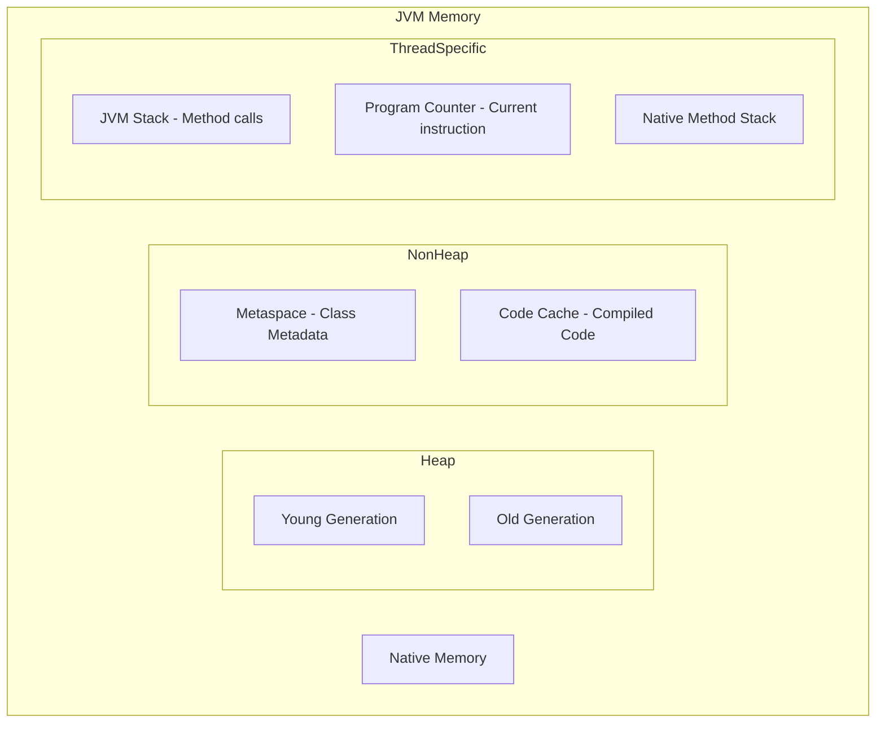
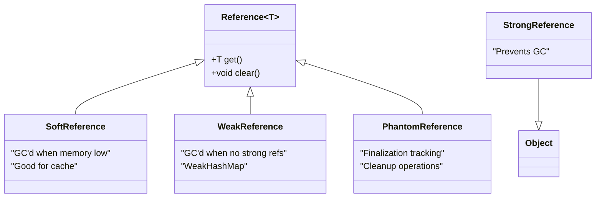

_Java Memory Management_

## 1. **Java Memory Architecture** [Understand JVM memory structure]

JVM memory is divided into Heap (object storage) and Non-Heap (metadata, code). Understanding this is fundamental for memory optimization.



## 2. **Stack Memory in Detail** [Know thread-specific memory]

**Stack Memory** is per-thread memory for method execution:

- Stores primitive values and object references (not objects themselves)
- Each method call creates a new stack frame
- Follows LIFO (Last-In-First-Out) principle
- Memory allocated/deallocated automatically

**Stack Frame Contains**:

1. Local Variables
2. Operand Stack (intermediate calculations)
3. Frame Data (return address, exception table)

**Example**:

```java
public void calculate() {
    int x = 10;           // Primitive - stored in stack
    String str = "Hello"; // Reference in stack, object in heap
    Object obj = new Object(); // Reference in stack, object in heap
}
```

## 3. **Heap Memory Components** [Know where objects live]

**Eden**: New objects born here  
**Survivor Spaces (S0, S1)**: Surviving objects move between these  
**Old Generation**: Long-lived objects promoted here  
**Metaspace**: Replaced PermGen in Java 8, stores class metadata

## 4. **Stack vs Heap Comparison** [Critical differentiation]

| Aspect            | Stack Memory             | Heap Memory                  |
| ----------------- | ------------------------ | ---------------------------- |
| **Scope**         | Thread-specific          | Shared across threads        |
| **Size**          | Fixed (small)            | Dynamic (large)              |
| **Speed**         | Very fast                | Slower                       |
| **Allocation**    | Automatic (compile-time) | Manual (runtime)             |
| **Deallocation**  | Automatic (scope ends)   | Via Garbage Collection       |
| **Contents**      | Primitives, references   | Objects, arrays              |
| **Thread Safety** | Yes (per thread)         | No (requires synchronization |
| **Memory**        | Limited                  | Large (configurable)         |
| **Example**       | `int x = 10;`            | `new Object();`              |

## 5. **Garbage Collection Fundamentals** [Understand how GC works]

GC identifies dead objects using GC Roots (active references). Process: Mark → Sweep → Compact (optional).

**GC Roots include**:

- Local variables (in stack)
- Active threads
- Static variables
- JNI references

## 6. **Minor GC vs Major GC** [Differentiate collection types]

| Aspect        | Minor GC              | Major GC (Full GC)         |
| ------------- | --------------------- | -------------------------- |
| **Scope**     | Young Generation only | Entire Heap                |
| **Speed**     | Fast (ms)             | Slow (seconds+)            |
| **Trigger**   | Eden full             | Old Gen full / System.gc() |
| **Pause**     | Short                 | Long (Stop-the-World)      |
| **Frequency** | High                  | Low                        |

## 7. **GC Algorithms Comparison** [Know different collectors]

| Collector      | Type          | Best For        | Key Feature           |
| -------------- | ------------- | --------------- | --------------------- |
| **Serial**     | Single-thread | Small apps      | Simple                |
| **Parallel**   | Multi-thread  | Throughput      | Multiple GC threads   |
| **CMS**        | Concurrent    | Low latency     | Minimizes pauses      |
| **G1**         | Region-based  | Balanced        | Predictable pauses    |
| **ZGC**        | Concurrent    | Large heaps     | <10ms pauses          |
| **Shenandoah** | Concurrent    | Responsive apps | Concurrent compaction |

## 8. **Reference Types** [Memory management control]



**1. Strong Reference** (default):

```java
Object obj = new Object(); // Only removed when obj = null
```

**2. Soft Reference** (memory-sensitive cache):

```java
SoftReference<Object> softRef = new SoftReference<>(obj);
// GC clears only under memory pressure
```

**3. Weak Reference** (temporary mappings):

```java
WeakReference<Object> weakRef = new WeakReference<>(obj);
// GC clears when no strong references remain
```

**4. Phantom Reference** (cleanup tasks):

```java
PhantomReference<Object> phantomRef = new PhantomReference<>(obj, queue);
// Used for post-mortem cleanup operations
```

## 9. **Memory Management Best Practices**

### **Do's**:

```java
// 1. Use local scope for better stack usage
public void process() {
    List<String> tempList = new ArrayList<>(); // Good: Stack reference
    // ... use tempList
} // Stack frame cleared automatically

// 2. Reuse objects when possible
private static final SimpleDateFormat formatter =
    new SimpleDateFormat("yyyy-MM-dd");

// 3. Use StringBuilder for string concatenation in loops
StringBuilder sb = new StringBuilder();
for (String item : items) {
    sb.append(item);
}
```

### **Don'ts**:

```java
// 1. Memory leak - static collections
private static final List<Object> CACHE = new ArrayList<>();
public void addToCache(Object obj) {
    CACHE.add(obj); // Objects never GC'd
}

// 2. Unnecessary object creation in loops
for (int i = 0; i < 1000; i++) {
    String s = new String("constant"); // Creates 1000 objects!
    // Use: String s = "constant";
}

// 3. Premature optimization
ObjectPool pool = new ObjectPool(); // Unless proven needed
```

## 10. **Common JVM Flags** [Must know for interviews]

```bash
# Heap Configuration
-Xms512m               # Initial heap size
-Xmx2g                 # Maximum heap size
-Xss1m                 # Thread stack size
-XX:MetaspaceSize=256m # Metaspace initial size

# GC Selection
-XX:+UseG1GC           # Use G1 collector
-XX:+UseParallelGC     # Use Parallel collector
-XX:+UseZGC            # Use ZGC (Java 11+)

# GC Tuning
-XX:NewRatio=2         # Old:Young = 2:1
-XX:SurvivorRatio=8    # Eden:Survivor = 8:1
-XX:MaxGCPauseMillis=200 # Target max pause

# Monitoring
-XX:+HeapDumpOnOutOfMemoryError
-XX:HeapDumpPath=./heapdump.hprof
-Xlog:gc*:file=gc.log
```

## 11. **Top 20 Interview Q&A**

### **Q1: What's the difference between Stack and Heap memory?**

Stack stores method calls and local primitives/references (fast, thread-specific, limited). Heap stores objects (shared, larger, GC-managed). Stack variables exist only during method execution, while heap objects persist until GC'd.

### **Q2: What is Garbage Collection and how does it work?**

GC automatically reclaims memory by identifying unreachable objects. Process: 1) Mark reachable objects from GC Roots, 2) Sweep unreachable objects, 3) Compact to reduce fragmentation.

### **Q3: Explain Minor vs Major GC**

Minor GC cleans Young Generation (Eden + Survivor). Fast, frequent. Major GC (Full GC) cleans entire heap. Slow, causes "stop-the-world" pause, should be minimized.

### **Q4: What are GC Roots?**

Starting points for reachability analysis:

- Active thread stacks (local variables)
- Static variables
- JNI references
- Monitor/synchronized objects

### **Q5: What is the difference between SoftReference and WeakReference?**

SoftReferences are cleared when JVM needs memory (good for cache). WeakReferences are cleared immediately when no strong references remain (good for temporary mappings).

### **Q6: When does an object become eligible for GC?**

When no references point to it (unreachable) AND it's not a GC Root. Circular references without external references are also eligible.

### **Q7: What is PermGen/Metaspace?**

PermGen (≤Java7) stored class metadata. Replaced by Metaspace (≥Java8) which uses native memory and auto-expands. OutOfMemoryError: PermGen space → OutOfMemoryError: Metaspace.

### **Q8: How to avoid memory leaks in Java?**

1. Close resources (try-with-resources),
2. Avoid static collections holding objects,
3. Use WeakReference for listeners/caches, 4) Nullify references after use.

### **Q9: What is stop-the-world pause in GC?**

When GC stops application threads to safely identify live objects. Different collectors minimize this: CMS (concurrent), G1 (predictable pauses), ZGC (<10ms pauses).

### **Q10: What is TLAB?**

Thread-Local Allocation Buffer. Each thread gets a private Eden region to allocate objects without synchronization, improving performance.

### **Q11: What is Card Table in GC?**

A remembered set that tracks Old Generation references pointing to Young Generation objects. Optimizes Minor GC by avoiding full heap scans.

### **Q12: How does System.gc() work?**

Suggests JVM to run GC. Not guaranteed! Use Runtime.getRuntime().gc() as alternative. Generally avoid - interferes with JVM's GC strategy.

### **Q13: What is escape analysis?**

JVM optimization that identifies objects not escaping method scope, allowing stack allocation instead of heap allocation.

### **Q14: How to choose a GC algorithm?**

**A**:

- **Throughput**: Parallel GC
- **Low latency**: G1, ZGC, Shenandoah
- **Small apps**: Serial GC
- **Large heaps**: G1 or ZGC

### **Q15: What is memory fragmentation?**

When free memory is scattered in small chunks. Solved by compaction (moving objects together). CMS suffers from fragmentation, G1/ZGC handle it better.

### **Q16: What happens during object creation?**

1. Memory allocated in Eden, 2) Header initialized (hashcode, GC age), 3) Fields initialized, 4) Constructor executed, 5) Reference returned.

### **Q17: What is the young generation age threshold?**

Objects surviving multiple Minor GCs get promoted to Old Generation. Default threshold is 15 (max 4-bit counter). Tuned via -XX:MaxTenuringThreshold.

### **Q18: How to monitor memory usage?**

Tools: jconsole, jvisualvm, jstat, jmap. Commands: `jstat -gc <pid>`, `jmap -heap <pid>`, `jcmd <pid> VM.info`.

### **Q19: What is the difference between Shallow and Deep heap size?**

Shallow heap - memory of object itself. Deep heap - object + all referenced objects. Important for memory leak analysis.

### **Q20: How does finalize() method affect GC?**

Objects with finalize() go to finalization queue, requiring extra GC cycle. Deprecated in Java 9. Use Cleaner/PhantomReference instead.

## 12. **Practical Scenarios & Solutions**

### **Scenario 1: Memory Leak Detection**

```java
// Symptom: Increasing heap usage over time
// Solution: Use heap dump analysis
jmap -dump:live,format=b,file=heap.bin <pid>
// Analyze with Eclipse MAT or VisualVM
```

### **Scenario 2: High GC Frequency**

```bash
# Symptom: Frequent pauses, low throughput
# Solution: Increase heap or adjust generation sizes
-Xmx4g -Xms4g  # Larger heap
-XX:NewRatio=1 # More space for young generation
```

### **Scenario 3: Long GC Pauses**

```bash
# Symptom: Application freezes for seconds
# Solution: Switch to low-pause collector
-XX:+UseG1GC -XX:MaxGCPauseMillis=200
# Or for Java 11+:
-XX:+UseZGC
```

## 13. **Quick Reference Cheatsheet**

### **Memory Areas**:

- **Stack**: Methods, local variables (primitives/references)
- **Heap**: Objects, arrays
- **Metaspace**: Class metadata, static variables
- **Code Cache**: Compiled native code

### **GC Types**:

- **Minor GC**: Young generation only, fast
- **Major GC**: Full heap, slow, avoid
- **Concurrent GC**: Runs with application (CMS, G1)

### **Reference Types**:

- **Strong**: Default, prevents GC
- **Soft**: Cache, cleared under memory pressure
- **Weak**: Temporary associations, immediate GC
- **Phantom**: Cleanup operations, finalization

### **Key Commands**:

```bash
jps                    # List Java processes
jstat -gc <pid> 1000   # Monitor GC every second
jmap -histo:live <pid> # Heap histogram
jstack <pid>           # Thread dump
```

## 14. **Recent Updates (Java 11-17)**

1. **ZGC Production Ready** (Java 15+): Sub-10ms pauses, TB heaps
2. **Shenandoah in OpenJDK**: Low pause concurrent collector
3. **Epsilon GC**: No-op collector for performance testing
4. **Deprecated Finalization** (Java 9+): Use Cleaner API

## 15. **Final Tips for Interviews**

1. **Be Practical**: Relate concepts to real projects
2. **Use Examples**: "In my project, we used G1 GC because..."
3. **Know Trade-offs**: Every design choice has pros/cons
4. **Monitor First**: Always emphasize profiling before tuning
5. **Stay Updated**: Know recent Java version changes

**Remember**: Understanding Java memory management isn't just about theory - it's about writing efficient, scalable applications and troubleshooting production issues effectively.

# Try-with-Resources

## **Traditional Try-Catch-Finally**

```java
import java.io.*;

public class OldWay {
    public static void main(String[] args) {
        BufferedReader reader = null;
        try {
            reader = new BufferedReader(new FileReader("test.txt"));
            System.out.println(reader.readLine());
        } catch (IOException e) {
            e.printStackTrace();
        } finally {
            try {
                if (reader != null) reader.close(); // Manual cleanup
            } catch (IOException e) {
                e.printStackTrace();
            }
        }
    }
}
```

## **Try-with-Resources (Modern Way)**

```java
import java.io.*;

public class NewWay {
    public static void main(String[] args) {
        // Resource auto-closes after try block
        try (BufferedReader reader = new BufferedReader(new FileReader("test.txt"))) {
            System.out.println(reader.readLine());
        } catch (IOException e) {
            e.printStackTrace();
        }
        // No finally needed - reader automatically closed!
    }
}
```

## **Key Difference**

**Traditional**: `finally { if (reader != null) reader.close(); }` ← Manual cleanup  
**Modern**: `try (BufferedReader reader = ...)` ← Auto cleanup

## **Even Shorter Real Example:**

```java
// Old way - verbose
BufferedReader br = null;
try { br = new BufferedReader(...); }
finally { if (br != null) br.close(); }

// New way - clean
try (BufferedReader br = new BufferedReader(...)) {
    // use br
}
// br automatically closed
```

**Try-with-resources is cleaner, safer, and eliminates resource leak bugs!**
