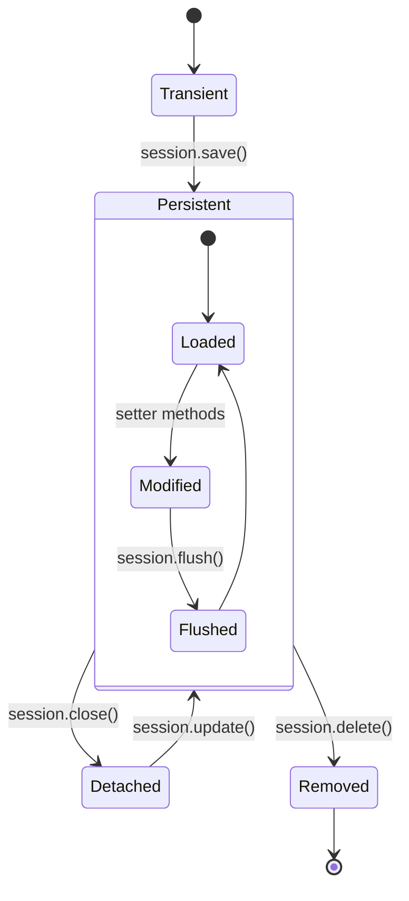

- Hibernate simplifies CRUD (Create, Read, Update, Delete) operations through its Session API. 
- These operations manage the persistence lifecycle of entities, handling SQL generation, transaction management, and object state transitions automatically.



```java
// Create
Session session = sessionFactory.openSession();
Transaction tx = session.beginTransaction();
User user = new User("john_doe", "john@example.com");
session.save(user);
tx.commit();
session.close();

// Read
User user = session.get(User.class, 1L); // Immediate load
User user = session.load(User.class, 1L); // Proxy, lazy load

// Update
session.update(user); // For detached objects
// For persistent objects, changes are automatically detected

// Delete
session.delete(user);
```
