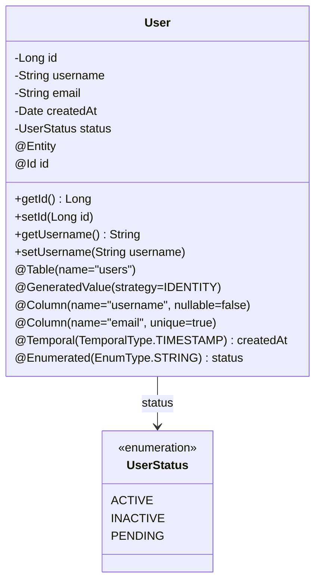

- Hibernate uses **annotations** to define how `Java objects are mapped to database` tables. 
- These annotations provide metadata about the object-relational mapping, including table names, column mappings, relationships, and constraints. 



### Basic Entity
```java
@Entity
@Table(name = "users")
public class User {
    
    @Id
    @GeneratedValue(strategy = GenerationType.IDENTITY)
    @Column(name = "user_id")
    private Long id;
    
    @Column(name = "username", nullable = false, unique = true, length = 50)
    private String username;
    
    @Column(name = "email", nullable = false, unique = true)
    private String email;
    
    @Temporal(TemporalType.TIMESTAMP)
    @Column(name = "created_at")
    private Date createdAt;
    
    @Enumerated(EnumType.STRING)
    @Column(name = "status")
    private UserStatus status;
    
    // Constructors, getters, setters
}
```

### Common Annotations

**Class Level:**
- `@Entity`: Marks class as entity
- `@Table`: Specifies table details
- `@SecondaryTable`: Maps entity to multiple tables

**Field Level:**
- `@Id`: Primary key
- `@GeneratedValue`: Auto-generation strategy
- `@Column`: Column mapping
- `@Transient`: Field not persisted
- `@Temporal`: Date/time mapping
- `@Enumerated`: Enum mapping
- `@Lob`: Large object mapping
