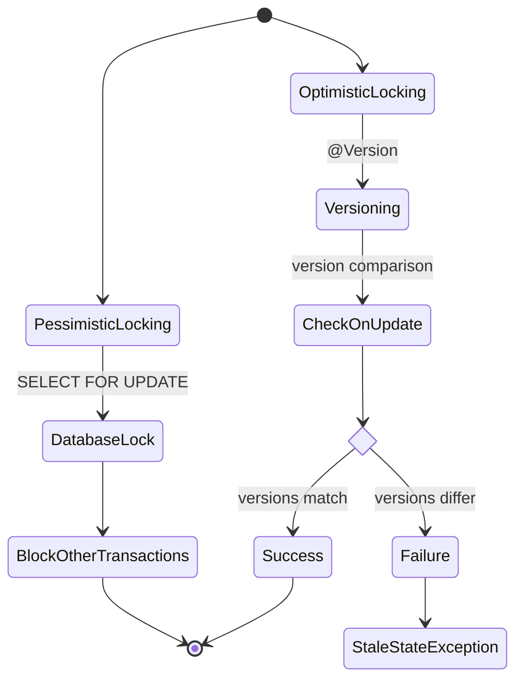

- Hibernate provides comprehensive transaction management and concurrency control mechanisms. 

- It supports both optimistic and pessimistic locking strategies to handle concurrent data access. 



### Isolation Levels
```xml
<property name="hibernate.connection.isolation">2</property>
<!-- 1: READ_UNCOMMITTED, 2: READ_COMMITTED, 4: REPEATABLE_READ, 8: SERIALIZABLE -->
```

### Optimistic Locking
```java
@Entity
public class Account {
    @Id
    @GeneratedValue
    private Long id;
    
    private BigDecimal balance;
    
    @Version
    private Long version; // Optimistic lock version
}
```

### Pessimistic Locking
```java
// Lock during transaction
Session session = sessionFactory.openSession();
Transaction tx = session.beginTransaction();
User user = session.get(User.class, 1L, LockMode.PESSIMISTIC_WRITE);
// Modify user
tx.commit();
session.close();

// Lock with query
Query<User> query = session.createQuery("FROM User WHERE id = :id", User.class);
query.setParameter("id", 1L);
query.setLockMode("user", LockMode.PESSIMISTIC_WRITE);
User user = query.uniqueResult();
```