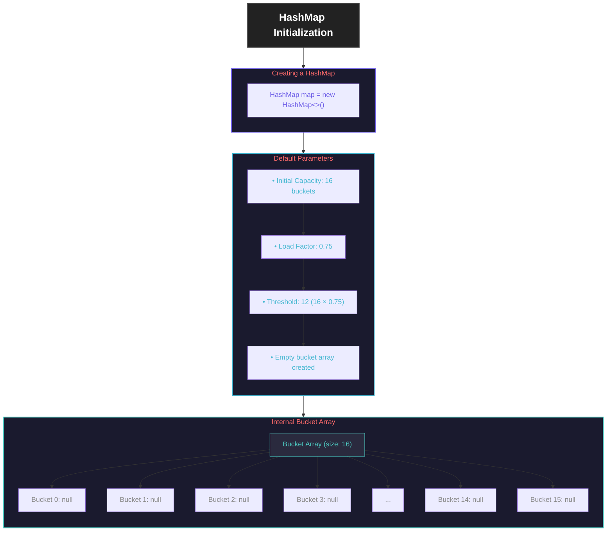
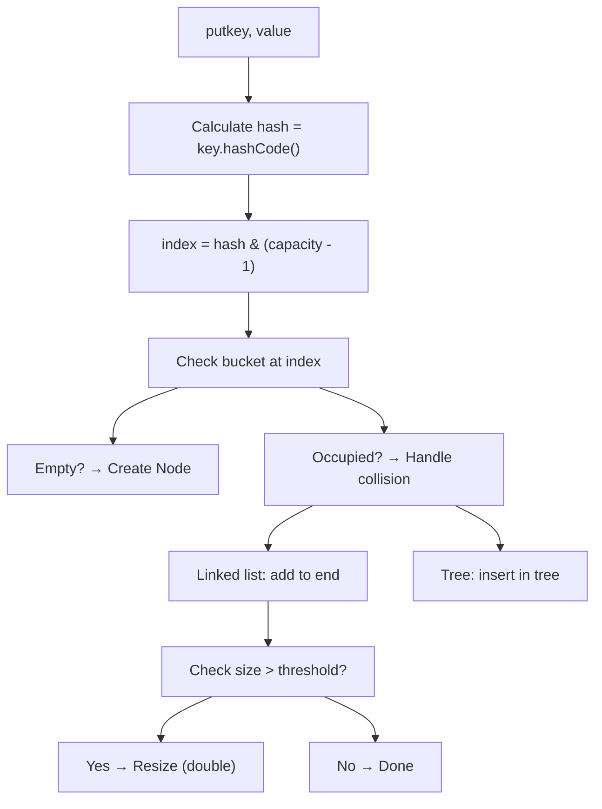

# **HashMap Internals - Simple & Interview Ready**

## **Overview: What is HashMap?**

A HashMap stores key-value pairs using **hashing** for fast access. Think of it as a **smart dictionary** where words (keys) instantly point to definitions (values).

---

## **HashMap Initialization**

## **How does put() work?**

**Interview Answer:** _"HashMap uses an array of buckets. When we insert a key-value pair, it calculates which bucket to use based on the key's hash."_

---

## **HashMap Time Complexity Summary**

| Operation         | Average Case | Worst Case (Pre-Java 8) | Worst Case (Java 8+) |
| ----------------- | ------------ | ----------------------- | -------------------- |
| **get()**         | O(1)         | O(n)                    | O(log n)             |
| **put()**         | O(1)         | O(n)                    | O(log n)             |
| **remove()**      | O(1)         | O(n)                    | O(log n)             |
| **containsKey()** | O(1)         | O(n)                    | O(log n)             |

**Interview Answer:** _"HashMap gives O(1) average time for get/put/remove. Worst case is O(n) with many collisions, improved to O(log n) with trees in Java 8. Load factor 0.75 balances time vs space."_

---

## **Quick Interview Cheat Sheet**

### **Q: How does HashMap work internally?**

**A:** It uses an array of buckets. When you put a key-value pair:

1. Calculate hash of key
2. Find bucket: `hash & (array.length - 1)`
3. If bucket empty → add Node
4. If bucket occupied → handle collision (linked list/tree)
5. If size exceeds threshold → resize (double capacity)

### **Q: What is collision?**

**A:** When two keys end up in the same bucket.

### **Q: What happens during collision?**

**A:** Keys with same bucket form a linked list. In Java 8+, when list exceeds 8 elements, it converts to Red-Black tree for better performance.

### **Q: When does HashMap resize?**

**A:** When number of entries exceeds `capacity × load factor` (default: 16 × 0.75 = 12). It doubles capacity and rehashes all entries.

### **Q: Why is load factor 0.75?**

**A:** It's a trade-off: higher values save memory but cause more collisions, lower values reduce collisions but waste memory. 0.75 is the sweet spot.

### **Q: What's the time complexity?**

**A:** Average case O(1) for all operations. Worst case O(n) with many collisions, improved to O(log n) with trees in Java 8+.

### **Key Points to Remember:**

1. **Buckets array** + **Linked lists** + **Trees** (Java 8+)
2. **Resize when 75% full** (doubles capacity)
3. **Tree conversion at 8+ collisions**
4. **O(1) average**, **O(log n)** worst with trees
5. **Not thread-safe** (use ConcurrentHashMap for threads)
