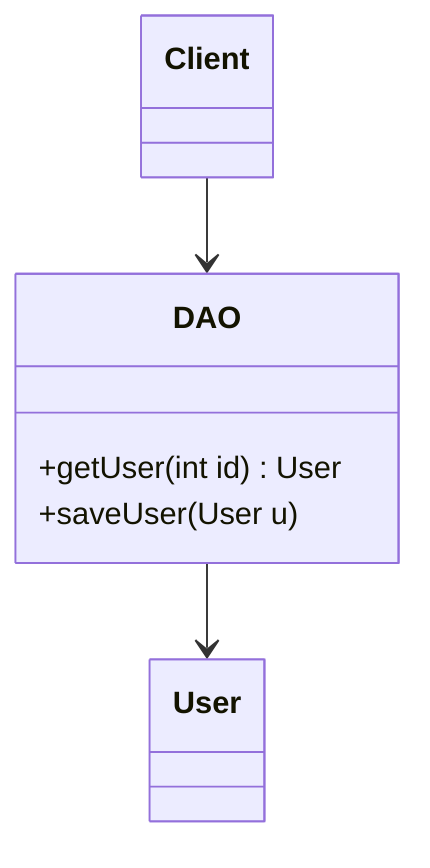
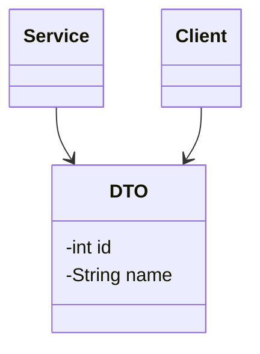
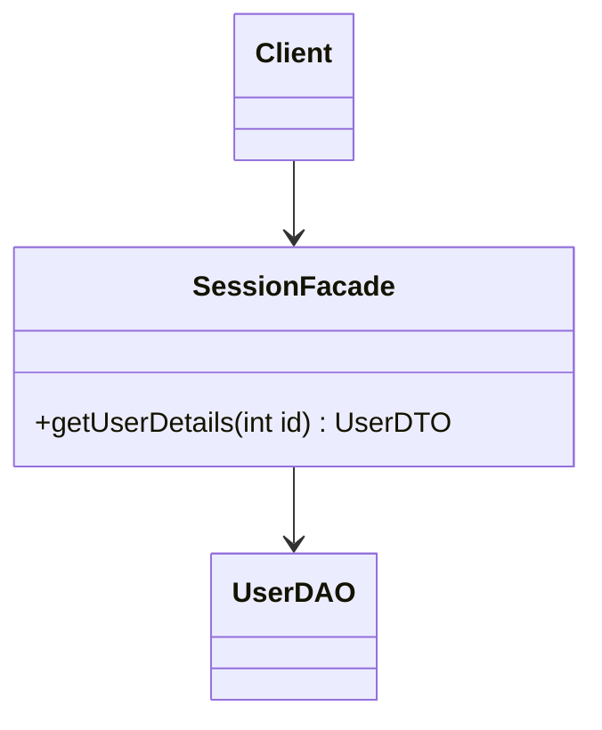
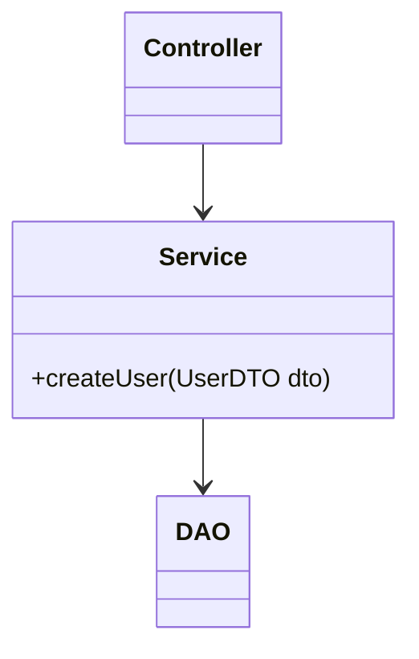
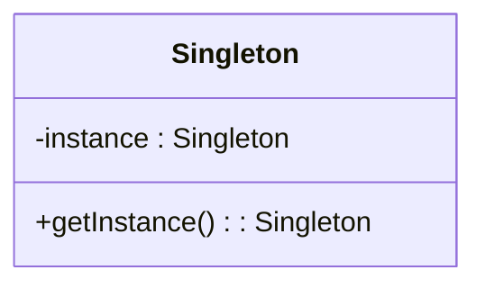
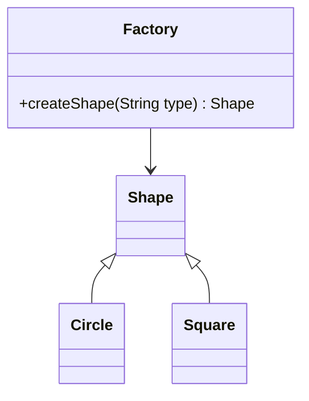
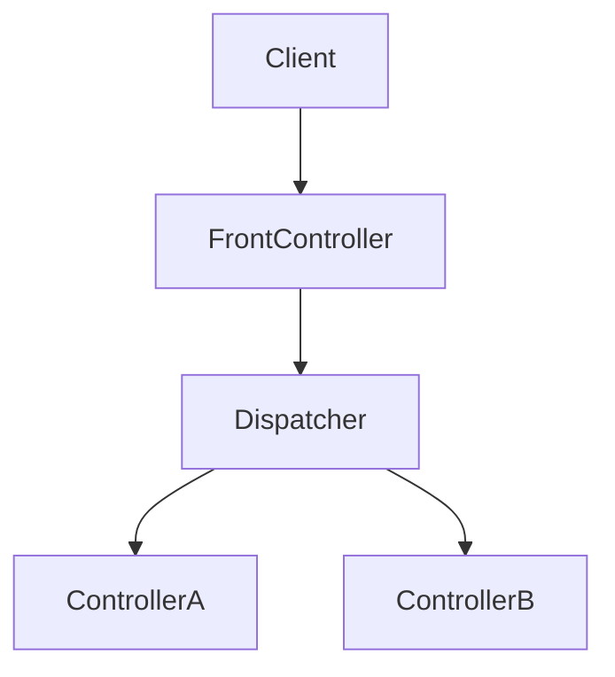

## 1. Data Access Object (DAO)

**Introduction:**
DAO encapsulates persistence logic (CRUD operations). It hides the database details from the business logic layer.

**Use Cases:**

- When you want to decouple DB code from business logic.
- Enterprise apps where DB technology (MySQL, Oracle, MongoDB) might change.


**Diagram**




**Code Sample**

```java
public interface UserDAO {
    User getUser(int id);
    void saveUser(User user);
}

public class UserDAOImpl implements UserDAO {
    public User getUser(int id) { /* DB logic */ return new User(); }
    public void saveUser(User user) { /* DB insert */ }
}
```

<table>
<tr><td valign="top">

**Pros: ✅**

- Decouples persistence logic.
- Easy to switch databases.
- Simplifies testing (mock DAOs).
</td><td valign="top">

**Cons: ⚠️**

- Extra boilerplate.
- More layers to manage.
</td></tr>
</table>


## 2. Data Transfer Object (DTO)

**Introduction:**
DTO carries data across layers (UI ↔ Service ↔ DB). Contains no business logic. Often **serializable**.

**Use Cases:**

- Passing data in **remote calls** (REST, SOAP, RMI).
- Aggregating multiple entities into one response.

**Diagram**



**Code Sample**

```java
public class UserDTO implements Serializable {
    private int id;
    private String name;
    // getters and setters
}
```
<table>
<tr><td valign="top">

**Pros: ✅**

- Reduces number of remote calls.
- Prevents exposing entities directly.
- Lightweight and serializable.
</td><td valign="top">

**Cons: ⚠️**

- Adds extra mapping code.
- More classes to maintain.
</td></tr>
</table>

## 3. Session Facade

**Introduction:**
Provides a **single entry point** for business logic, hiding underlying complexity.

**Use Cases:**

- In **EJB/Spring apps** to reduce network calls.
- Simplify service access for clients.

**Mermaid Diagram**



**Code Sample**

```java
public class UserFacade {
    private UserDAO userDAO = new UserDAOImpl();

    public UserDTO getUserDetails(int id) {
        User u = userDAO.getUser(id);
        return new UserDTO(u.getId(), u.getName());
    }
}
```

<table>
<tr><td valign="top">

**Pros: ✅**

- Simplifies client interaction.
- Reduces network traffic.
- Hides complexity.
</td><td valign="top">

**Cons: ⚠️**

- Can become a **god object** if too much logic is added.
- Adds extra indirection.

</td></tr>
</table>

## 4. Service Layer

**Introduction:**
Encapsulates **business logic** and coordinates DAOs and controllers. Defines application boundaries.

**Use Cases:**

- Large applications needing centralized business rules.
- When controllers should not directly call DAOs.

**Mermaid Diagram**



**Code Sample**

```java
public class UserService {
    private UserDAO userDAO = new UserDAOImpl();

    public void createUser(UserDTO dto) {
        User u = new User(dto.getId(), dto.getName());
        userDAO.saveUser(u);
    }
}
```
<table>
<tr><td valign="top">

**Pros: ✅**

- Reusable business logic.
- Easy to test.
- Clean separation of concerns.
</td><td valign="top">

**Cons: ⚠️**

- Extra abstraction layer.
- May be overkill for small apps.
</td></tr>
</table>

## 5. Singleton

**Introduction:**
Ensures only **one instance** exists and provides a global access point.

**Use Cases:**

- Config managers.
- Logging frameworks.
- Database connection pools.

**Mermaid Diagram**



**Code Sample**

```java
public class Singleton {
    private static Singleton instance;
    private Singleton() {}
    public static synchronized Singleton getInstance() {
        if (instance == null) instance = new Singleton();
        return instance;
    }
}
```
<table>
<tr><td valign="top">

**Pros: ✅**

- Controlled instance creation.
- Saves memory for shared resources.
</td><td valign="top">

**Cons: ⚠️**

- Can become a bottleneck.
- Harder to unit test.
- Risk of hidden dependencies.
</td></tr>
</table>

## 6. Factory

**Introduction:**
Creates objects without exposing instantiation logic.

**Use Cases:**

- When class type depends on input.
- For plug-in architectures.
- To avoid `new` scattered across code.

**Mermaid Diagram**



**Code Sample**

```java
interface Shape { void draw(); }
class Circle implements Shape { public void draw() { System.out.println("Circle"); } }
class Square implements Shape { public void draw() { System.out.println("Square"); } }

class ShapeFactory {
    public Shape createShape(String type) {
        return switch (type) {
            case "circle" -> new Circle();
            case "square" -> new Square();
            default -> throw new IllegalArgumentException();
        };
    }
}
```
<table>
<tr><td valign="top">

**Pros: ✅**

- Encapsulates object creation.
- Increases flexibility.
- Reduces duplication.
</td><td valign="top">

**Cons: ⚠️**

- Adds complexity.
- Too many factories → code bloat.
</td></tr>
</table>


---

## 7. Front Controller

**Introduction:**
Provides a **central entry point** for handling requests (like a dispatcher). Used in MVC frameworks.

**Use Cases:**

- Web apps (Spring MVC, Struts).
- Centralized request preprocessing (logging, authentication, validation).

**Mermaid Diagram**



**Code Sample**

```java
public class FrontController {
    private Dispatcher dispatcher = new Dispatcher();

    public void handleRequest(String request) {
        dispatcher.dispatch(request);
    }
}

class Dispatcher {
    void dispatch(String request) {
        if ("HOME".equals(request)) new HomeController().show();
        else if ("USER".equals(request)) new UserController().show();
    }
}
```
<table>
<tr><td valign="top">

**Pros: ✅**

- Centralized request handling.
- Easier to add logging/security.
- Consistent navigation.
</td><td valign="top">

**Cons: ⚠️**

- Single point of failure.
- Can become complex if overloaded.
</td></tr>
</table>

