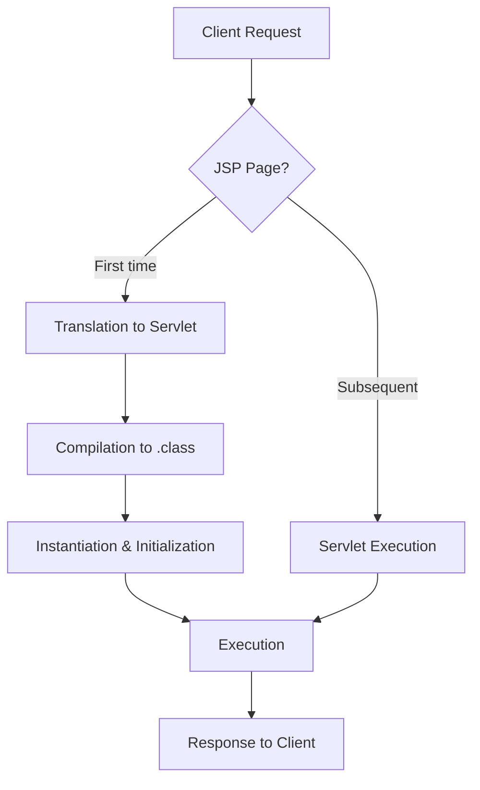

## 1. What are JSPs? - The Big Picture

* **JavaServer Pages (JSP) is a server-side technology** that enables developers to create dynamically generated web pages based on HTML, XML, or other document types. 

* **JSP allows Java code to be embedded directly into HTML pages**, making it easier to develop web applications by separating presentation logic from business logic.

* **JSP simplifies web development** by allowing developers to write HTML-like pages with embedded Java code, which gets compiled into servlets on the server side. 

* This approach **combines the power of Java with the simplicity** of HTML templating.

```jsp
<%@ page contentType="text/html;charset=UTF-8" language="java" %>
<html>
<head>
    <title>Simple JSP</title>
</head>
<body>
    <h1>Hello, <%= request.getParameter("name") %>!</h1>
    <p>Current time: <%= new java.util.Date() %></p>
</body>
</html>
```

This basic JSP page demonstrates how Java code (`<%= ... %>`) can be embedded directly within HTML. When accessed, the server executes the Java code, generates the dynamic content, and sends the resulting HTML to the client browser.

## 2. JSP Lifecycle - How JSPs Work Internally

Understanding the JSP lifecycle is crucial because it explains how JSP pages are processed by the web container and converted into servlets. This knowledge helps in optimizing performance and debugging issues.



* The first time a JSP is requested, it goes through a translation phase where it's converted to a servlet. 

* Then compiled. Subsequent requests are much faster as they directly execute the compiled servlet. 

* This helps explain why the first request is slower and how JSPs maintain state.

## 3. JSP Elements - The Building Blocks

JSP provides several types of elements that allow you to embed Java code in HTML pages. Each serves a specific purpose in the MVC (Model-View-Controller) architecture.

### Scripting Elements
Declarations: `<%! %>`, Scriptlets: `<% %>` and Expressions `<%= %>`
```jsp
<%-- Declaration: defines variables/methods at class level --%>
<%! 
    private int counter = 0;
    public String getMessage() {
        return "Hello World";
    }
%>

<%-- Scriptlet: contains Java code that goes into _jspService() method --%>
<%
    String username = request.getParameter("user");
    if(username != null) {
        session.setAttribute("user", username);
    }
%>

<%-- Expression: evaluates and outputs Java expressions --%>
<p>Welcome, <%= session.getAttribute("user") %></p>
<p>Page visited: <%= ++counter %> times</p>
```

* Declarations: `<%! %>` create class-level variables/methods
* Scriptlets: `<% %>` contain logic in the service method 
* Expressions `<%= %>` output values directly to the HTML response. 
* Understanding these helps organize code properly.

### Directives

```jsp
<%@ page import="java.util.Date, com.example.User" %>
<%@ page contentType="text/html;charset=UTF-8" %>
<%@ page errorPage="error.jsp" %>

<%@ include file="header.jsp" %>

<%@ taglib prefix="c" uri="http://java.sun.com/jsp/jstl/core" %>
```

* **Directives** provide global information about the JSP page. 
* The `page` directive defines attributes like imports and content type. 
* The `include` directive statically includes other files during translation. 
* The `taglib` directive enables JSTL tags.

### Action Elements

```jsp
<jsp:include page="navigation.jsp" />

<jsp:useBean id="user" class="com.example.User" scope="session">
    <jsp:setProperty name="user" property="name" value="John" />
</jsp:useBean>

<jsp:getProperty name="user" property="name" />

<jsp:forward page="welcome.jsp" />
```

* **Action elements** provide dynamic behavior at request time. 
* `<jsp:include>` dynamically includes content
* `<jsp:useBean>` accesses Java beans
* `<jsp:forward>` transfers request to another page. 
* These are essential for building modular applications.

## 4. Implicit Objects - The Built-in Helpers

JSP provides several implicit objects that are automatically available in scriptlets and expressions. These objects are initialized by the container and provide access to various servlet-related features.

```jsp
<%
    // Request object - provides access to HTTP request data
    String param = request.getParameter("id");
    
    // Response object - allows manipulating HTTP response
    response.setContentType("text/html");
    
    // Session object - maintains user-specific data across requests
    session.setAttribute("cart", shoppingCart);
    
    // Application object - shared across entire web application
    Integer count = (Integer) application.getAttribute("visitorCount");
    
    // Out object - used to write directly to response output stream
    out.println("Direct output");
    
    // Exception object (only in error pages) - access to exception information
    String errorMsg = exception.getMessage();
%>
```

* These implicit objects eliminate the need to manually obtain references to common servlet objects
* Simplifying code and reducing boilerplate. 
* Understanding their scope (request, session, application) is crucial for proper data management.

## 5. JSTL (JSP Standard Tag Library) - The Clean Code Solution

JSTL provides a standard set of tags for common tasks, reducing the need for scriptlet code and making JSP pages cleaner and more maintainable.

```jsp
<%@ taglib prefix="c" uri="http://java.sun.com/jsp/jstl/core" %>
<%@ taglib prefix="fmt" uri="http://java.sun.com/jsp/jstl/fmt" %>

<!-- Set a variable -->
<c:set var="salary" value="${2000*2}" />

<!-- Format numbers -->
<p>Salary: <fmt:formatNumber value="${salary}" type="currency"/></p>

<!-- Conditional processing -->
<c:if test="${salary > 2000}">
    <p>Salary is above average</p>
</c:if>

<!-- Switch-like statement -->
<c:choose>
    <c:when test="${salary <= 1000}">Low</c:when>
    <c:when test="${salary <= 3000}">Medium</c:when>
    <c:otherwise>High</c:otherwise>
</c:choose>

<!-- Looping -->
<c:forEach var="i" begin="1" end="5">
    Item <c:out value="${i}"/><br/>
</c:forEach>
```

* **JSTL eliminates** the need for most Java scriptlets
* Making pages easier to read and maintain
* It also separates presentation logic from business logic more effectively, following best practices in web development.

## 6. Expression Language (EL) - The Simplified Access Language

EL provides a simplified way to access data stored in JavaBeans components, arrays, collections, and other objects. It's designed specifically for web developers who may not be familiar with Java programming.

```jsp
<p>User: ${user.name}</p>
<p>Age: ${user.age + 5}</p>
<p>Empty check: ${empty user}</p>
<p>Param: ${param.id}</p>
<p>Header: ${header['User-Agent']}</p>
<p>Cookie: ${cookie.userName.value}</p>
```

* **EL simplifies** access to object properties and collection elements without needing scriptlet code. 

* It automatically handles null values, provides built-in operators, and follows a concise syntax that's easier for web designers to understand.


## Key things to remember:

1. **Explain the JSP lifecycle** - Translation, compilation, initialization, execution
2. **Compare JSP with servlets** - JSPs are for presentation, servlets for control logic
3. **Discuss implicit objects** - Know request, response, session, application, out
4. **Demonstrate JSTL usage** - Show how it reduces scriptlet code
5. **Explain MVC pattern** - How JSP fits into the View component
6. **Mention best practices** - Avoid scriptlets, use JSTL/EL, follow MVC
