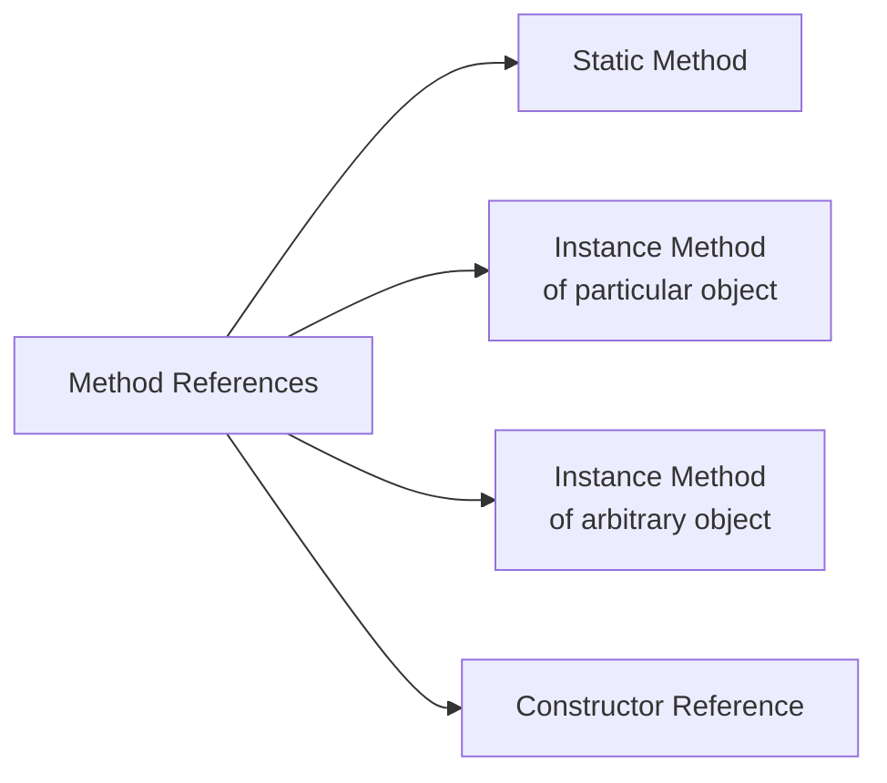

1. [Lambda Expressions](#lambda-expressions)
2. [Functional Interfaces](#functional-interfaces)
3. [Method References](#method-references)
4. [Stream API](#stream-api)
5. [Optional Class](#optional-class)
6. [Default Methods](#default-methods)
7. [Date and Time API](#date-and-time-api)
8. [Nashorn JavaScript Engine](#nashorn)
9. [Parallel Arrays](#parallel-arrays)

---

## Lambda Expressions

### Syntax
```java
(parameters) -> expression
(parameters) -> { statements; }
```

### Examples
```java
// Traditional approach
Runnable r1 = new Runnable() {
    @Override
    public void run() {
        System.out.println("Hello World");
    }
};

// Lambda approach
Runnable r2 = () -> System.out.println("Hello World");

// With parameters
Comparator<Integer> comp = (a, b) -> a.compareTo(b);

// Multiple statements
Function<String, Integer> func = (s) -> {
    System.out.println("Processing: " + s);
    return s.length();
};
```

### Key Points
- Enable functional programming in Java
- Reduce boilerplate code
- Type inference allows omitting parameter types
- Must be compatible with functional interface

---

## Functional Interfaces `SAM`
An interface with exactly one abstract method, often called `SAM`. 
It can contain multiple default or static methods.


### Key Characteristics
1. **Single Abstract Method (SAM)**: Must have exactly one abstract method
2. **Default Methods**: Can have any number of default methods with implementations
3. **Static Methods**: Can have any number of static methods
4. **Inheritance**: Can extend another interface only if it doesn't add any abstract methods
5. **Annotation**: `@FunctionalInterface` is optional but provides compile-time checking

### Built-in Functional Interfaces Table

| Interface | Method Signature | Description | Common Use Cases |
|-----------|------------------|-------------|------------------|
| **Function<T,R>** | `R apply(T t)` | Takes one argument, produces a result | Transformations, mapping operations |
| **Predicate<T>** | `boolean test(T t)` | Takes one argument, returns boolean | Filtering, conditional checks |
| **Consumer<T>** | `void accept(T t)` | Takes one argument, returns void | Side-effects, consuming operations |
| **Supplier<T>** | `T get()` | Takes no arguments, returns a value | Lazy initialization, factory methods |
| **UnaryOperator<T>** | `T apply(T t)` | Takes one argument, returns same type | Operations where input = output type |
| **BinaryOperator<T>** | `T apply(T t1, T t2)` | Takes two arguments, returns same type | Reduction operations, mathematical operations |

### Examples

```java
// Function example - convert String to Integer
Function<String, Integer> stringToInt = s -> Integer.parseInt(s);
Integer result = stringToInt.apply("123"); // Returns 123

// Predicate example - check if string is empty
Predicate<String> isEmpty = s -> s.isEmpty();
boolean test = isEmpty.test(""); // Returns true

// Consumer example - print element
Consumer<String> printer = s -> System.out.println(s);
printer.accept("Hello World"); // Prints "Hello World"

// Supplier example - generate random number
Supplier<Double> randomSupplier = () -> Math.random();
Double random = randomSupplier.get(); // Returns random number

// Method reference examples
Function<String, Integer> parser = Integer::parseInt;
Consumer<String> printerRef = System.out::println;
Supplier<List<String>> listSupplier = ArrayList::new;
```

### Custom Functional Interface

```java
@FunctionalInterface
interface StringProcessor {
    String process(String input);
    
    // Default method
    default StringProcessor andThen(StringProcessor after) {
        return input -> after.process(this.process(input));
    }
    
    // Static method
    static StringProcessor createDefault() {
        return input -> input.toUpperCase();
    }
}

// Usage
StringProcessor toUpper = String::toUpperCase;
StringProcessor addExclamation = s -> s + "!";
StringProcessor combined = toUpper.andThen(addExclamation);

String result = combined.process("hello"); // Returns "HELLO!"
```

**Q: What makes an interface a functional interface?**
A: A functional interface must have exactly one abstract method, but can have any number of default or static methods.

**Q: Why is @FunctionalInterface annotation useful?**
A: It's optional but provides compile-time checking to ensure the interface has exactly one abstract method, preventing accidental addition of extra abstract methods.

**Q: Can a functional interface extend another interface?**
A: Yes, but only if the parent interface doesn't have any abstract methods, or if it has exactly one abstract method that the child interface doesn't override with another abstract method.

**Q: What are the most commonly used functional interfaces?**
A: The most common are Function, Predicate, Consumer, and Supplier from java.util.function package.


## Method References

### Types of Method References



### Syntax Examples
```java
// Static method reference
Function<String, Integer> parser = Integer::parseInt;

// Instance method of particular object
String prefix = "Hello";
Predicate<String> startsWith = prefix::startsWith;

// Instance method of arbitrary object
Function<String, String> upperCase = String::toUpperCase;

// Constructor reference
Supplier<List<String>> listSupplier = ArrayList::new;
Function<Integer, String[]> arrayCreator = String[]::new;
```

### Equivalent Lambda Expressions
```java
// Method reference
Consumer<String> printer = System.out::println;

// Equivalent lambda
Consumer<String> printerLambda = s -> System.out.println(s);
```

---

## Stream API

### Stream Pipeline Concept


### Stream Creation
```java
// From Collection
List<String> list = Arrays.asList("a", "b", "c");
Stream<String> stream = list.stream();

// From Arrays
Stream<String> arrayStream = Arrays.stream(new String[]{"a", "b", "c"});

// Static factory methods
Stream<String> ofStream = Stream.of("a", "b", "c");
Stream<Integer> iterateStream = Stream.iterate(0, n -> n + 2).limit(10);
Stream<Double> generateStream = Stream.generate(Math::random).limit(5);
```

### Intermediate Operations
| Operation | Description | Example |
|-----------|-------------|---------|
| `filter()` | Filters elements | `.filter(s -> s.length() > 3)` |
| `map()` | Transforms elements | `.map(String::toUpperCase)` |
| `flatMap()` | Flattens streams | `.flatMap(list -> list.stream())` |
| `distinct()` | Removes duplicates | `.distinct()` |
| `sorted()` | Sorts elements | `.sorted()` |
| `peek()` | Debugging operation | `.peek(System.out::println)` |
| `limit()` | Limits size | `.limit(10)` |
| `skip()` | Skips elements | `.skip(5)` |

### Terminal Operations
| Operation | Description | Return Type |
|-----------|-------------|-------------|
| `forEach()` | Iterates elements | `void` |
| `collect()` | Collects to collection | `Collection` |
| `toArray()` | Converts to array | `Array` |
| `reduce()` | Reduces to single value | `Optional` |
| `min()/max()` | Finds min/max | `Optional` |
| `count()` | Counts elements | `long` |
| `anyMatch()/allMatch()/noneMatch()` | Condition checking | `boolean` |
| `findFirst()/findAny()` | Finds elements | `Optional` |

### Examples
```java
// Filter and collect
List<String> filtered = list.stream()
    .filter(s -> s.startsWith("A"))
    .collect(Collectors.toList());

// Map and reduce
int totalLength = list.stream()
    .map(String::length)
    .reduce(0, Integer::sum);

// Grouping
Map<Integer, List<String>> groupedByLength = list.stream()
    .collect(Collectors.groupingBy(String::length));

// Parallel stream
List<String> parallelResult = list.parallelStream()
    .map(String::toUpperCase)
    .collect(Collectors.toList());
```

---

## Optional Class

### Purpose
Container object which may or may not contain a non-null value

### Creation Methods
```java
Optional<String> empty = Optional.empty();
Optional<String> of = Optional.of("value"); // throws NPE if null
Optional<String> ofNullable = Optional.ofNullable(maybeNull);
```

### Usage Patterns
```java
// Traditional null check
if (value != null) {
    System.out.println(value);
}

// Optional approach
optionalValue.ifPresent(System.out::println);

// With default value
String result = optionalValue.orElse("default");

// With supplier for default
String result = optionalValue.orElseGet(() -> generateDefault());

// Throw exception if empty
String result = optionalValue.orElseThrow(() -> new IllegalArgumentException());
```

### Method Chaining
```java
Optional<String> result = Optional.ofNullable(user)
    .map(User::getAddress)
    .map(Address::getCity)
    .filter(city -> city.startsWith("New"))
    .orElse("Unknown");
```

---

## Default Methods

### Definition
Methods in interfaces with implementation

```java
interface Vehicle {
    // Traditional abstract method
    String getBrand();
    
    // Default method
    default String turnAlarmOn() {
        return "Turning vehicle alarm on";
    }
    
    // Static method
    static int getHorsePower(int rpm, int torque) {
        return (rpm * torque) / 5252;
    }
}
```

### Multiple Inheritance Resolution
```java
interface A {
    default void hello() { System.out.println("A"); }
}

interface B {
    default void hello() { System.out.println("B"); }
}

class C implements A, B {
    @Override
    public void hello() {
        A.super.hello(); // Explicitly choose which to call
    }
}
```

---

## Date and Time API

### Key Classes


### Examples
```java
// Current date/time
LocalDate today = LocalDate.now();
LocalTime now = LocalTime.now();
LocalDateTime current = LocalDateTime.now();

// Specific date/time
LocalDate date = LocalDate.of(2023, Month.DECEMBER, 25);
LocalTime time = LocalTime.of(14, 30, 0);

// Manipulation
LocalDate tomorrow = today.plusDays(1);
LocalTime earlier = now.minusHours(2);

// Formatting
DateTimeFormatter formatter = DateTimeFormatter.ofPattern("yyyy-MM-dd HH:mm");
String formatted = current.format(formatter);

// Parsing
LocalDateTime parsed = LocalDateTime.parse("2023-12-25 14:30", formatter);

// Duration and Period
Duration duration = Duration.between(startTime, endTime);
Period period = Period.between(startDate, endDate);
```

---

## Nashorn JavaScript Engine

### Usage
```java
// Create JavaScript engine
ScriptEngineManager manager = new ScriptEngineManager();
ScriptEngine engine = manager.getEngineByName("nashorn");

// Execute JavaScript
engine.eval("print('Hello from JavaScript!');");

// Call Java from JavaScript
engine.eval("var ArrayList = Java.type('java.util.ArrayList');");
engine.eval("var list = new ArrayList();");
```

---

## Parallel Arrays

### Parallel Operations
```java
int[] numbers = {1, 2, 3, 4, 5, 6, 7, 8, 9, 10};

// Parallel array processing
Arrays.parallelSort(numbers);
Arrays.parallelPrefix(numbers, (a, b) -> a + b);
Arrays.parallelSetAll(numbers, i -> i * 2);
```

---

## Interview Questions & Answers

### Q: What are the main advantages of Lambda Expressions?
**A:** Reduced boilerplate code, improved readability, enable functional programming, better API design, and parallel processing support.

### Q: Explain the difference between `map()` and `flatMap()`
**A:** `map()` transforms each element to another element, while `flatMap()` transforms each element to a stream and then flattens all streams into one.

### Q: When would you use `Optional`?
**A:** When a method might return null, to avoid NullPointerException, and to explicitly indicate that a value might be absent.

### Q: What is the purpose of default methods?
**A:** To add new methods to interfaces without breaking existing implementations, enabling interface evolution.

### Q: How do streams support parallel processing?
**A:** Through `parallelStream()` and intermediate operations that can be executed concurrently, leveraging multi-core processors.

### Q: Difference between `Predicate` and `Function`?
**A:** `Predicate` takes input and returns boolean, `Function` takes input and returns output of any type.

---

## Performance Considerations

- Use parallel streams for large datasets only
- Prefer method references over lambdas for better readability
- Avoid stateful lambdas in parallel streams
- Use primitive streams (IntStream, etc.) for better performance
- Consider using `Arrays.parallelSort()` for large arrays

