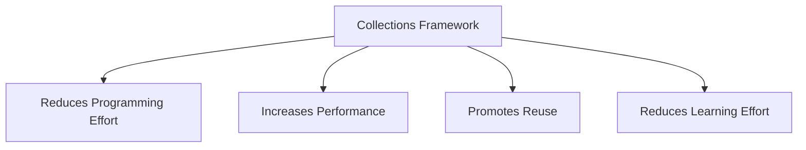
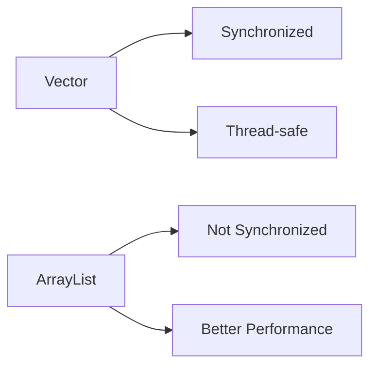
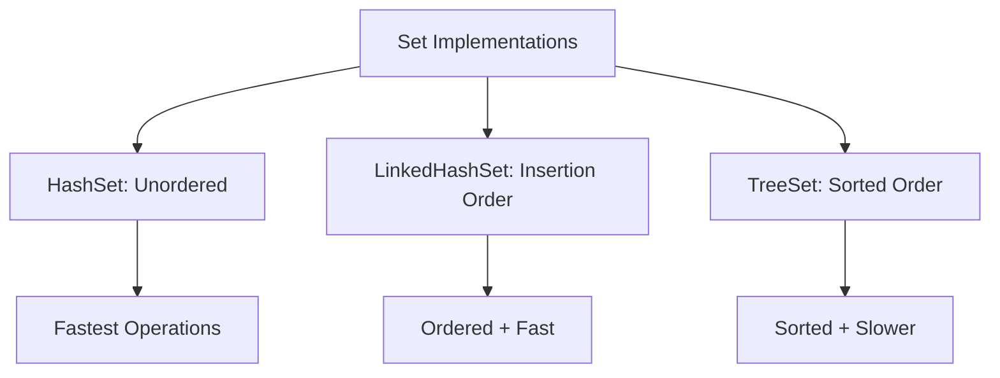
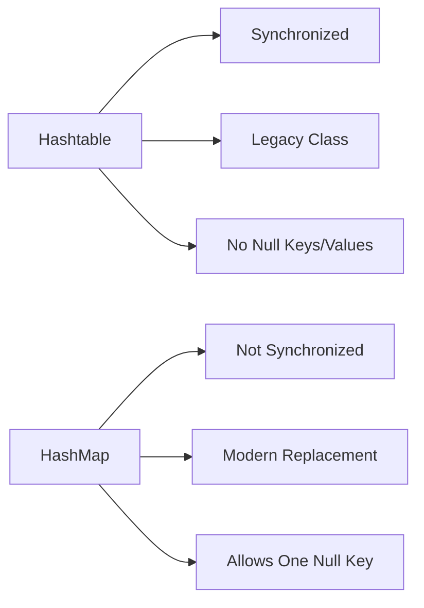
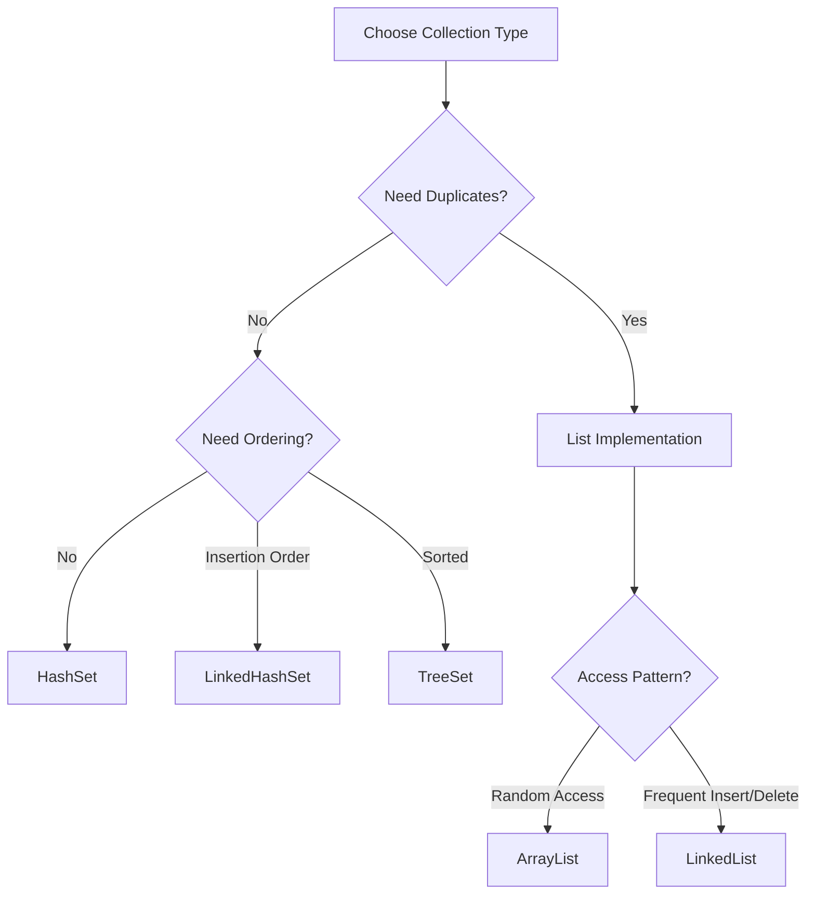
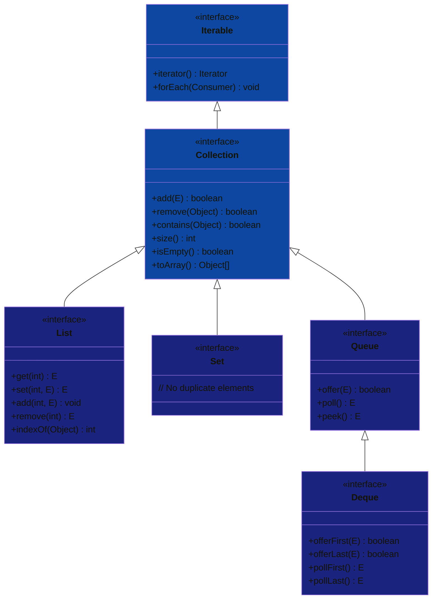
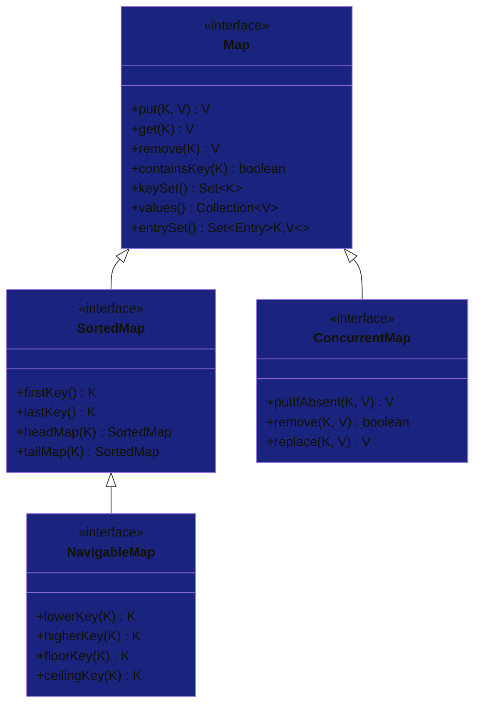
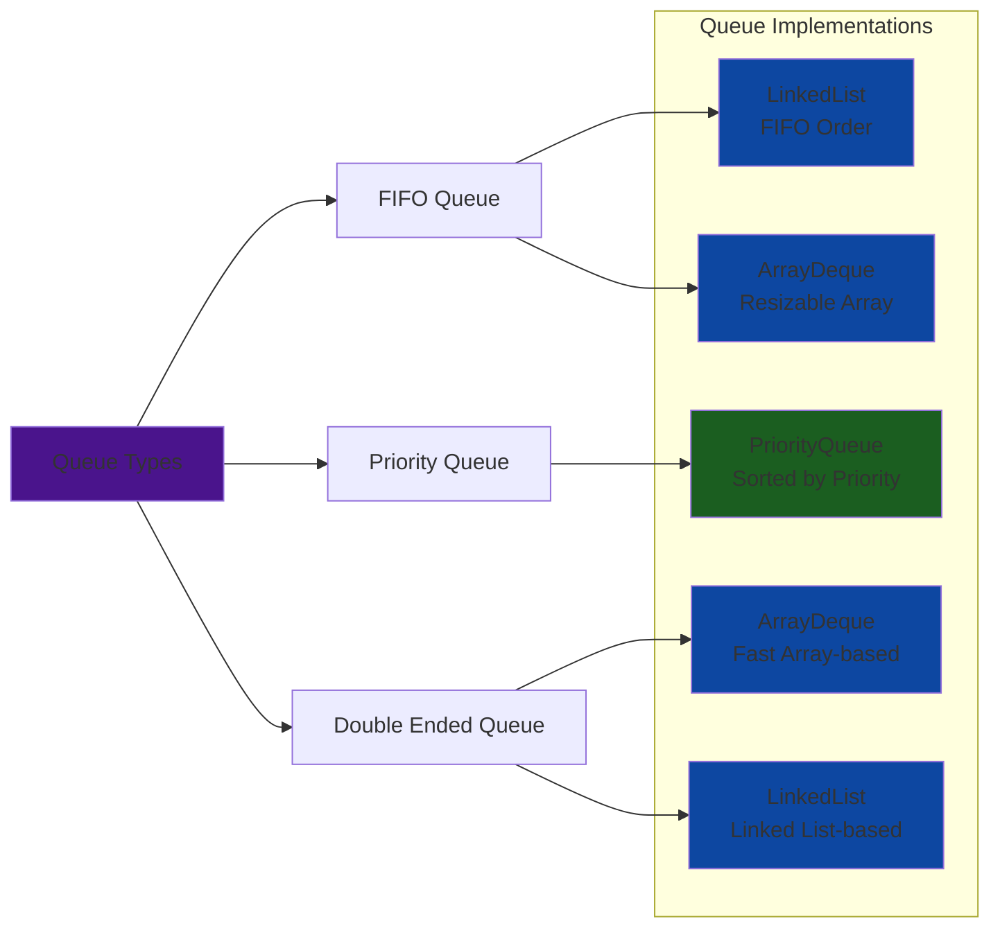
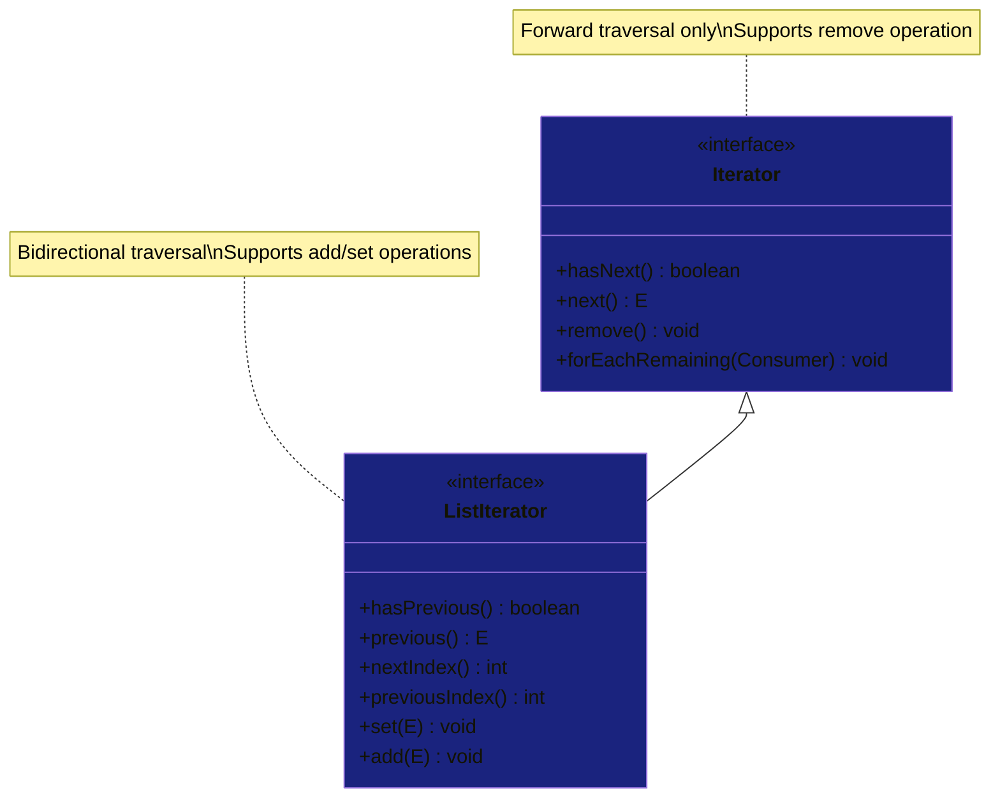

### What is Collections Framework?

- **Unified architecture** for representing and manipulating collections
- **Reduces programming effort** by providing data structures and algorithms
- **Increases performance** with high-performance implementations
- **Promotes reuse** - interoperable collections API

### Key Benefits



### Hierarchy Overview

```java
// Basic collection usage example
List<String> list = new ArrayList<>();
Set<Integer> set = new HashSet<>();
Map<String, Integer> map = new HashMap<>();
```

---

## Core Collection Interfaces

### Collection Interface

- **Root interface** of collection hierarchy
- **Basic operations**: add, remove, contains, size, etc.
- **Bulk operations**: addAll, removeAll, retainAll
- **Array operations**: toArray()

```java
Collection<String> collection = new ArrayList<>();
collection.add("Apple");
collection.add("Banana");
collection.remove("Apple");
System.out.println(collection.size()); // 1
```

### Iterable Interface

- **Enables for-each loops**
- **Provides Iterator** for sequential access
- **Default methods**: forEach

```java
List<String> fruits = Arrays.asList("Apple", "Banana", "Cherry");
for (String fruit : fruits) {
    System.out.println(fruit);
}
```

### Iterator vs ListIterator

- **Iterator**: Forward traversal only, remove operation
- **ListIterator**: Bidirectional, add/set operations

```java
List<String> list = new ArrayList<>();
ListIterator<String> iterator = list.listIterator();
while (iterator.hasNext()) {
    String element = iterator.next();
    iterator.set(element.toUpperCase());
}
```

---

## List Implementations

### ArrayList

- **Resizable array** implementation
- **Fast random access** - O(1)
- **Slow insertions/deletions** in middle - O(n)
- **Not synchronized**

```java
List<String> arrayList = new ArrayList<>();
arrayList.add("Element1");
arrayList.add(0, "Element0"); // Add at index
String element = arrayList.get(1); // Fast access
```

### LinkedList

- **Doubly-linked list** implementation
- **Fast insertions/deletions** - O(1)
- **Slow random access** - O(n)
- **Implements Queue** interface

```java
List<String> linkedList = new LinkedList<>();
linkedList.add("First");
linkedList.add("Last");
linkedList.add(1, "Middle"); // Efficient insertion
```

### Vector vs ArrayList



```java
Vector<String> vector = new Vector<>(); // Synchronized
List<String> arrayList = new ArrayList<>(); // Not synchronized
List<String> syncList = Collections.synchronizedList(arrayList); // Make synchronized
```

### Performance Comparison

| Operation           | ArrayList      | LinkedList |
| ------------------- | -------------- | ---------- |
| get(index)          | O(1)           | O(n)       |
| add(element)        | O(1) amortized | O(1)       |
| add(index, element) | O(n)           | O(1)       |
| remove(index)       | O(n)           | O(1)       |

---

## Set Implementations

### HashSet

- **Hash table** implementation
- **No ordering** guaranteed
- **Constant time** operations - O(1)
- **Permits null** elements

```java
Set<String> hashSet = new HashSet<>();
hashSet.add("Apple");
hashSet.add("Banana");
hashSet.add("Apple"); // Duplicate ignored
System.out.println(hashSet.size()); // 2
```

### LinkedHashSet

- **Hash table + linked list**
- **Maintains insertion order**
- **Slightly slower** than HashSet
- **Predictable iteration order**

```java
Set<String> linkedHashSet = new LinkedHashSet<>();
linkedHashSet.add("Zebra");
linkedHashSet.add("Apple");
linkedHashSet.add("Banana");
// Iteration order: Zebra, Apple, Banana
```

### TreeSet

- **Red-Black tree** implementation
- **Elements sorted** in natural order
- **Logarithmic time** operations - O(log n)
- **Implements NavigableSet**

```java
Set<String> treeSet = new TreeSet<>();
treeSet.add("Orange");
treeSet.add("Apple");
treeSet.add("Banana");
// Sorted order: Apple, Banana, Orange
```

### Set Characteristics



---

## Queue Implementations

### Queue Interface

- **Designed for holding elements** prior to processing
- **FIFO** (First-In-First-Out) typically
- **Core operations**: offer, poll, peek

```java
Queue<String> queue = new LinkedList<>();
queue.offer("First");
queue.offer("Second");
queue.offer("Third");

while (!queue.isEmpty()) {
    System.out.println(queue.poll()); // First, Second, Third
}
```

### PriorityQueue

- **Elements ordered** by natural ordering or comparator
- **No null elements** allowed
- **Head is least** element according to ordering

```java
Queue<Integer> pq = new PriorityQueue<>();
pq.offer(5);
pq.offer(1);
pq.offer(3);

while (!pq.isEmpty()) {
    System.out.println(pq.poll()); // 1, 3, 5 (sorted order)
}
```

### Deque Interface

- **Double ended queue**
- **Supports insertion/removal** at both ends
- **Can be used as LIFO** stack

```java
Deque<String> deque = new ArrayDeque<>();
deque.offerFirst("Front");
deque.offerLast("End");
deque.pollFirst(); // Remove front
```

### Queue Types Comparison

```java
// Regular Queue - FIFO
Queue<String> queue = new LinkedList<>();

// Priority Queue - Sorted
Queue<String> priorityQueue = new PriorityQueue<>();

// Deque - Double ended
Deque<String> deque = new ArrayDeque<>();

// Stack behavior using Deque
Deque<String> stack = new ArrayDeque<>();
stack.push("Element"); // LIFO
```

---

## Map Implementations

### HashMap

- **Hash table** based implementation
- **No ordering** guarantees
- **Permits one null key** and multiple null values
- **Constant time performance** for basic operations

```java
Map<String, Integer> hashMap = new HashMap<>();
hashMap.put("Apple", 1);
hashMap.put("Banana", 2);
hashMap.put("Cherry", 3);

Integer value = hashMap.get("Apple"); // 1
boolean exists = hashMap.containsKey("Banana"); // true
```

### LinkedHashMap

- **Maintains insertion order**
- **Slower iteration** than HashMap
- **Useful for LRU caches**

```java
Map<String, Integer> linkedHashMap = new LinkedHashMap<>();
linkedHashMap.put("Zebra", 1);
linkedHashMap.put("Apple", 2);
linkedHashMap.put("Banana", 3);
// Iteration order: Zebra, Apple, Banana
```

### TreeMap

- **Red-Black tree** implementation
- **Sorted according** to natural ordering
- **Logarithmic time** cost for operations

```java
Map<String, Integer> treeMap = new TreeMap<>();
treeMap.put("Orange", 1);
treeMap.put("Apple", 2);
treeMap.put("Banana", 3);
// Keys sorted: Apple, Banana, Orange
```

### Hashtable vs HashMap



```java
// Legacy - synchronized
Hashtable<String, Integer> hashtable = new Hashtable<>();

// Modern - not synchronized
HashMap<String, Integer> hashMap = new HashMap<>();

// Thread-safe version
Map<String, Integer> syncMap = Collections.synchronizedMap(hashMap);
```

### Map Operations

```java
Map<String, Integer> map = new HashMap<>();

// Basic operations
map.put("Key", 100);
map.get("Key"); // 100
map.remove("Key");

// Bulk operations
map.putAll(anotherMap);
map.clear();

// Collection views
Set<String> keys = map.keySet();
Collection<Integer> values = map.values();
Set<Map.Entry<String, Integer>> entries = map.entrySet();
```

---

## Utility Classes

### Collections Class

- **Static methods** for collection operations
- **Algorithms**: sort, shuffle, reverse, rotate
- **Wrapper methods**: synchronized, unmodifiable

```java
List<String> list = new ArrayList<>();
Collections.addAll(list, "C", "A", "B");

// Sorting
Collections.sort(list); // [A, B, C]

// Searching
int index = Collections.binarySearch(list, "B"); // 1

// Synchronized wrapper
List<String> syncList = Collections.synchronizedList(list);
```

### Arrays Class

- **Utility methods** for array manipulation
- **Conversion** between arrays and collections
- **Sorting and searching** arrays

```java
String[] array = {"Apple", "Banana", "Cherry"};

// Sorting
Arrays.sort(array);

// Binary search
int index = Arrays.binarySearch(array, "Banana");

// Convert to list
List<String> list = Arrays.asList(array);
```

### Common Utility Methods

```java
// Collections utilities
List<Integer> numbers = Arrays.asList(3, 1, 4, 1, 5);
Collections.sort(numbers);
Collections.reverse(numbers);
Collections.shuffle(numbers);
Collections.fill(numbers, 0);

// Arrays utilities
int[] arr = {5, 2, 8, 1};
Arrays.sort(arr);
Arrays.fill(arr, 10);
int[] copy = Arrays.copyOf(arr, arr.length);
```

---

## Sorting and Comparison

### Comparable Interface

- **Natural ordering** of objects
- **Single sorting sequence**
- **compareTo method** implementation

```java
class Person implements Comparable<Person> {
    String name;
    int age;

    @Override
    public int compareTo(Person other) {
        return this.name.compareTo(other.name);
    }
}

List<Person> people = new ArrayList<>();
Collections.sort(people); // Uses natural ordering
```

### Comparator Interface

- **Multiple sorting sequences**
- **Flexible comparison** logic
- **compare method** implementation

```java
// Sort by age
Comparator<Person> ageComparator = new Comparator<Person>() {
    @Override
    public int compare(Person p1, Person p2) {
        return Integer.compare(p1.age, p2.age);
    }
};

// Sort by name length
Comparator<Person> nameLengthComparator =
    (p1, p2) -> Integer.compare(p1.name.length(), p2.name.length());

Collections.sort(people, ageComparator);
```

### Java 8+ Comparison Enhancements

```java
List<Person> people = new ArrayList<>();

// Method references
people.sort(Comparator.comparing(Person::getName));
people.sort(Comparator.comparing(Person::getAge).reversed());

// Multiple criteria
people.sort(Comparator
    .comparing(Person::getLastName)
    .thenComparing(Person::getFirstName));

// Null friendly
people.sort(Comparator.comparing(Person::getName,
    Comparator.nullsLast(String::compareTo)));
```

---

## Best Practices

### Collection Selection Guide



### Memory and Performance

- **ArrayList**: Good for read-heavy, random access
- **LinkedList**: Good for frequent insertions/deletions
- **HashSet**: Fastest set operations, unordered
- **TreeSet**: Slower but sorted
- **HashMap**: General purpose mapping

### Thread Safety

```java
// Not thread-safe
List<String> unsafeList = new ArrayList<>();

// Synchronized wrapper
List<String> syncList = Collections.synchronizedList(new ArrayList<>());

// Concurrent collections (Java 5+)
ConcurrentHashMap<String, Integer> concurrentMap = new ConcurrentHashMap<>();
CopyOnWriteArrayList<String> copyOnWriteList = new CopyOnWriteArrayList<>();
```

### Common Pitfalls and Solutions

```java
// 1. Concurrent Modification
List<String> list = new ArrayList<>();
// WRONG: for (String item : list) { list.remove(item); }
// RIGHT: Use Iterator.remove()
Iterator<String> iterator = list.iterator();
while (iterator.hasNext()) {
    String item = iterator.next();
    iterator.remove();
}

// 2. Proper equals() and hashCode()
class Student {
    String id;

    @Override
    public boolean equals(Object o) {
        if (this == o) return true;
        if (!(o instanceof Student)) return false;
        Student student = (Student) o;
        return Objects.equals(id, student.id);
    }

    @Override
    public int hashCode() {
        return Objects.hash(id);
    }
}

// 3. Choosing right initial capacity
List<String> list = new ArrayList<>(1000); // Avoid resizing
Map<String, Integer> map = new HashMap<>(16, 0.75f); // Initial capacity, load factor
```

### Java 8+ Features

```java
// Streams with collections
List<String> filtered = list.stream()
    .filter(s -> s.startsWith("A"))
    .collect(Collectors.toList());

// Map operations
map.computeIfAbsent("key", k -> calculateValue(k));
map.merge("key", 1, Integer::sum);

// Collection factories (Java 9+)
List<String> immutableList = List.of("A", "B", "C");
Set<Integer> immutableSet = Set.of(1, 2, 3);
Map<String, Integer> immutableMap = Map.of("A", 1, "B", 2);
```

# Java Collections Framework With Diagrams

## 1. Collections Framework Hierarchy


## 2. Collection Interface Hierarchy



## 3. List Implementations Comparison


## 4. Set Implementations Characteristics


## 5. Map Interface Hierarchy



## 6. Map Implementations Decision Tree

```mermaid
flowchart TD
    A[Choose Map Implementation] --> B{Need Sorting?}

    B -->|Yes| C[TreeMap<br/>Red-Black Tree<br/>Sorted Keys]

    B -->|No| D{Need Insertion Order?}

    D -->|Yes| E[LinkedHashMap<br/>Hash Table + Linked List<br/>Insertion Order]

    D -->|No| F{Thread Safety Required?}

    F -->|Yes| G[ConcurrentHashMap<br/>Thread-Safe<br/>Better Performance]

    F -->|No| H[HashMap<br/>Hash Table<br/>Best Performance]

    style A fill:#004d40
    style C fill:#1b5e20
    style E fill:#1b5e20
    style G fill:#bf360c
    style H fill:#0d47a1
```



## 7. Queue Implementations Overview



## 8. Performance Characteristics


## 9. Thread Safety Overview


## 10. Collection Selection Guide


## 11. Iterator Types and Usage



## 12. Collections Utility Methods


## 13. Java 8+ Streams with Collections


## 14. Memory Usage Comparison


## 15. Time Complexity Overview


These dark-themed diagrams provide the same comprehensive overview of the Java Collections Framework with improved visual contrast and modern dark color schemes. The color coding helps differentiate between:

- **🟢 Green**: General implementations and efficient operations
- **🔵 Blue**: Interface definitions and standard collections
- **🟠 Orange**: Thread-safe and synchronized collections
- **🟣 Purple**: Utility classes and special operations
- **🟤 Brown**: Legacy classes and specific use cases

The dark theme makes the diagrams easier to view in low-light environments and provides better contrast for presentations and documentation.
