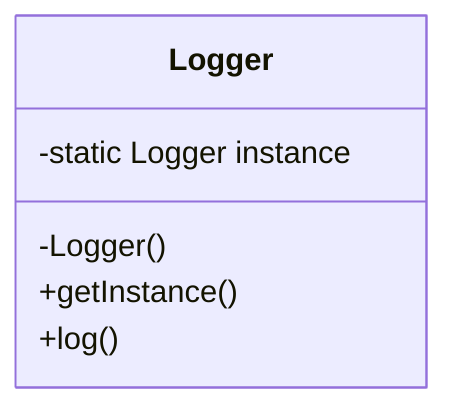
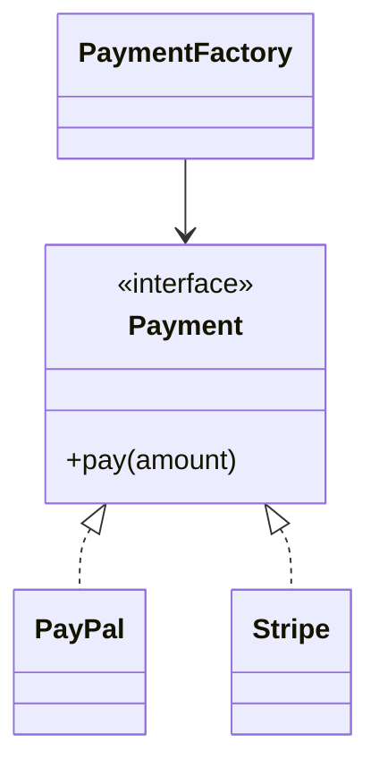
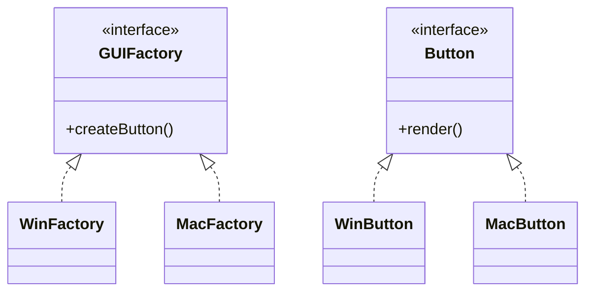
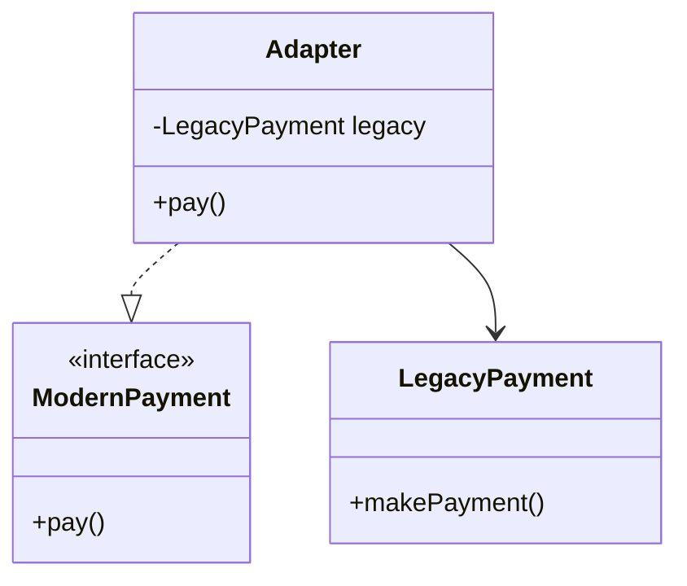
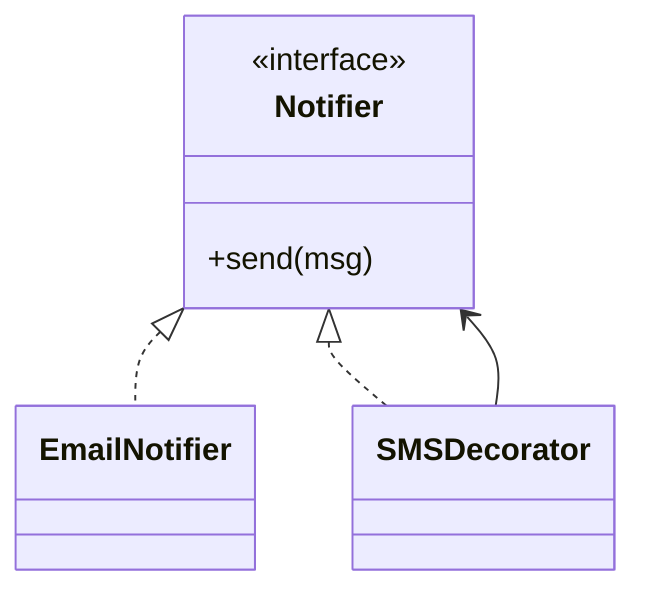
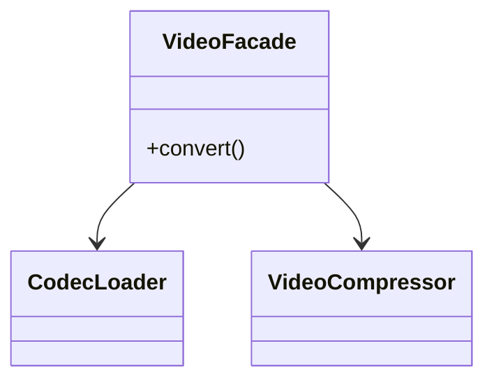
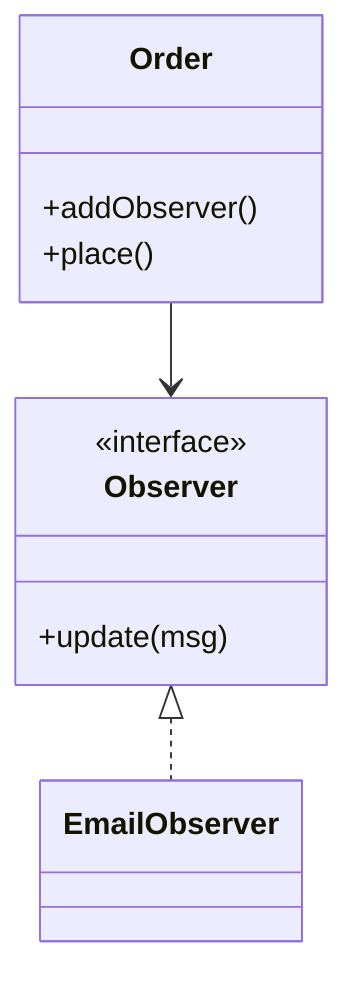
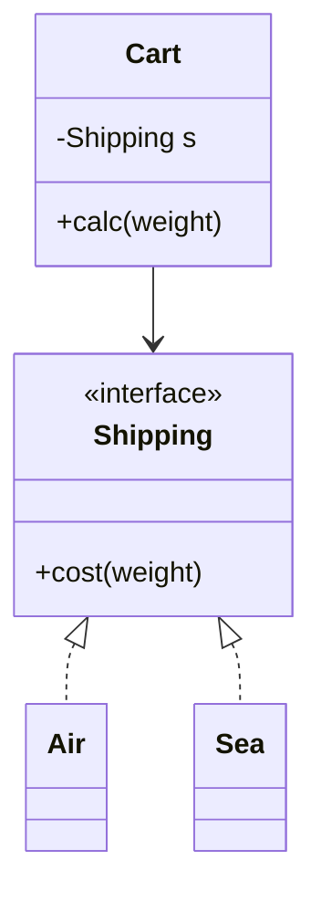
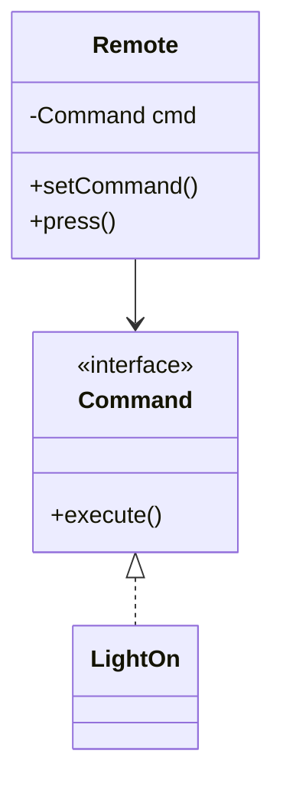
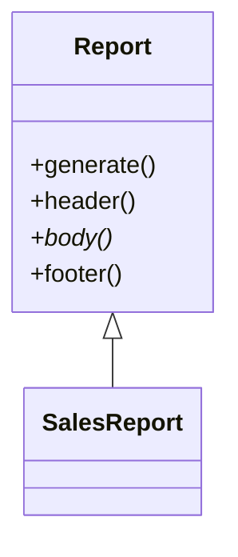

## Creational Patterns

### 1. Singleton
<table>
<tr>
<td valign="top">

**Problem:** Ensure only one instance exists, global access.

**Use Case:** Config manager, logging service, DB Connection
</td>
<td valign="top" style="width: 50%">


</td>
</tr>
</table>

#### Code Sample

```java
class Logger {
    private static Logger instance;
    private Logger() {}
    public static Logger getInstance() {
        if (instance == null) instance = new Logger();
        return instance;
    }
    public void log(String msg) { System.out.println(msg); }
}
```


---

### 2. Factory Method

<table>
<tr>
<td valign="top">

**Problem:** Create objects without exposing instantiation logic.

**Use Case:** Payment processor selection.

</td>
<td valign="top" style="width: 50%">


</td>
</tr>
</table>

#### Code Sample

```java
interface Payment {
    void pay(double amount);
}
class PayPal implements Payment { 
    public void pay(double a){ System.out.println("PayPal "+a); } 
}

class Stripe implements Payment { 
    public void pay(double a){ System.out.println("Stripe "+a); } 
}

class PaymentFactory {
    static Payment getPayment(String type) {
        return type.equals("paypal") ? new PayPal() : new Stripe();
    }
}
```


### 3. Abstract Factory

<table>
<tr>
<td valign="top">

**Problem:** Provide an interface for creating families of related objects.

**Use Case:** GUI toolkit (Windows vs Mac).

</td>
<td valign="top" style="width: 50%">


</td>
</tr>
</table>

#### Code Sample

```java
interface Button { void render(); }

class WinButton implements Button { 
    public void render(){ System.out.println("Win Button"); } 
}

class MacButton implements Button { 
    public void render(){ System.out.println("Mac Button"); } 
}

interface GUIFactory { Button createButton(); }

class WinFactory implements GUIFactory { 
    public Button createButton(){ return new WinButton(); } 
}

class MacFactory implements GUIFactory { 
    public Button createButton(){ return new MacButton(); } 
}
```

## Structural Patterns

### 4. Adapter

<table>
<tr>
<td valign="top">

**Problem:** Convert one interface into another.

**Use Case:** Old payment library → New checkout system.

</td>
<td valign="top" style="width: 50%">


</td>
</tr>
</table>

#### Code Sample

```java
class LegacyPayment { 
    void makePayment(){ System.out.println("Legacy Paid"); } 
}

interface ModernPayment { 
    void pay(); 
}

class Adapter implements ModernPayment {
    private LegacyPayment legacy = new LegacyPayment();
    public void pay(){ legacy.makePayment(); }
}
```

### 5. Decorator

<table>
<tr>
<td valign="top">

**Problem:** Add responsibilities dynamically without altering code.

**Use Case:** Logging, compression, encryption for data streams.

</td>
<td valign="top" style="width: 50%">



</td>
</tr>
</table>

#### Code Sample

```java
interface Notifier { 
    void send(String msg); 
}
class EmailNotifier implements Notifier { 
    public void send(String m){ System.out.println("Email: "+m); } 
}

class SMSDecorator implements Notifier {
    private Notifier wrap;

    SMSDecorator(Notifier n){ 
        wrap=n; 
    }

    public void send(String m) { 
        wrap.send(m); 
        System.out.println("SMS: "+m); 
    }
}
```

### 6. Facade

<table>
<tr>
<td valign="top">

**Problem:** Simplify a complex subsystem.

**Use Case:** Video conversion API.

</td>
<td valign="top" style="width: 50%">


</td>
</tr>
</table>

#### Code Sample

```java
class CodecLoader { 
    void load(){ System.out.println("Codec Loaded"); } 
}

class VideoCompressor { 
    void compress(){ System.out.println("Compressed"); } 
}

class VideoFacade {
    private CodecLoader loader = new CodecLoader();
    private VideoCompressor comp = new VideoCompressor();
    void convert(){ loader.load(); comp.compress(); }
}
```
## Behavioral Patterns

### 7. Observer

<table>
<tr>
<td valign="top">

**Problem:** One-to-many dependency.

**Use Case:** Order placed → notify email, update inventory.

</td>
<td valign="top" style="width: 50%">


</td>
</tr>
</table>

#### Code Sample

```java
interface Observer { 
    void update(String msg); 
}

class EmailObserver implements Observer { 
    public void update(String m){ System.out.println("Email: "+m); } 
}

class Order {
    List<Observer> observers = new ArrayList<>();
    void addObserver(Observer o){ observers.add(o); }
    void place(){ for(Observer o: observers) o.update("Order placed"); }
}
```

### 8. Strategy

<table>
<tr>
<td valign="top">

**Problem:** Choose algorithm at runtime.

**Use Case:** Different shipping cost strategies.

</td>
<td valign="top" style="width: 50%">


</td>
</tr>
</table>

#### Code Sample

```java
interface Shipping { 
    double cost(double w); 
}

class Air implements Shipping { 
    public double cost(double w){ return w*10; } 
}

class Sea implements Shipping { 
    public double cost(double w){ return w*5; } 
}

class Cart {
    Shipping s;
    Cart(Shipping s){ this.s=s; }
    double calc(double w){ return s.cost(w); }
}
```


### 9. Command

<table>
<tr>
<td valign="top">

**Problem:** Encapsulate requests as objects.

**Use Case:** Undo/redo in editors.

</td>
<td valign="top" style="width: 50%">


</td>
</tr>
</table>

#### Code Sample

```java
interface Command { 
    void execute(); 
}

class LightOn implements Command { 
    public void execute(){ System.out.println("Light ON"); } 
}

class Remote {
    Command cmd;
    void setCommand(Command c){ cmd=c; }
    void press(){ cmd.execute(); }
}
```

### 10. Template Method

<table>
<tr>
<td valign="top">

**Problem:** Define algorithm skeleton, let subclasses fill details.

**Use Case:** Report generation.
</td>
<td valign="top" style="width: 50%">


</td>
</tr>
</table>

#### Code Sample

```java
abstract class Report {

    final void generate(){ 
        header(); body(); footer(); 
    }

    void header(){ 
        System.out.println("Header"); 
    }
    abstract void body();

    void footer(){ 
        System.out.println("Footer"); 
    }
}
class SalesReport extends Report {
    void body(){ System.out.println("Sales Data"); }
}
```
