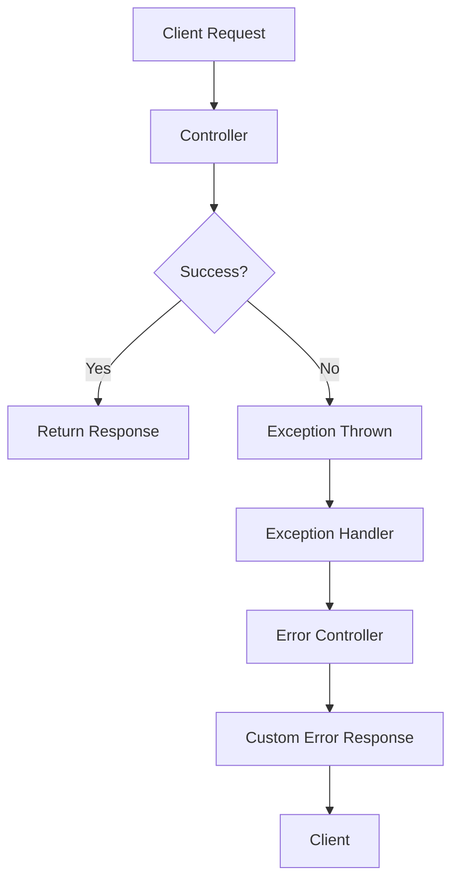
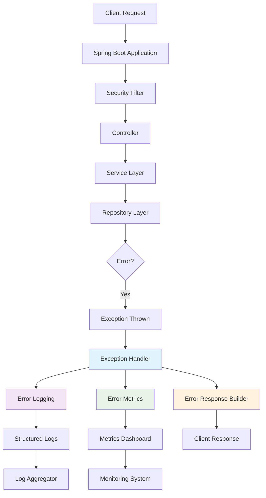

Spring Boot provides comprehensive error handling mechanisms that help you build robust applications. Proper error handling improves user experience and makes debugging easier.

### Error Handling Flow



## 2. Basic Error Handling

### Default Error Handling

Spring Boot provides a default error handling mechanism through `ErrorController`:

```java
@RestController
public class BasicController {

    @GetMapping("/resource/{id}")
    public ResponseEntity<String> getResource(@PathVariable Long id) {
        if (id <= 0) {
            throw new IllegalArgumentException("Invalid ID: " + id);
        }
        return ResponseEntity.ok("Resource: " + id);
    }
}
```

### Custom Error Page (for traditional web apps)

```properties
# application.properties
server.error.whitelabel.enabled=false
server.error.path=/error
```

```java
@Controller
public class CustomErrorController implements ErrorController {

    @RequestMapping("/error")
    public String handleError(HttpServletRequest request) {
        Object status = request.getAttribute(RequestDispatcher.ERROR_STATUS_CODE);

        if (status != null) {
            Integer statusCode = Integer.valueOf(status.toString());

            if (statusCode == HttpStatus.NOT_FOUND.value()) {
                return "error-404";
            } else if (statusCode == HttpStatus.INTERNAL_SERVER_ERROR.value()) {
                return "error-500";
            }
        }
        return "error";
    }
}
```

## 3. Global Exception Handling

### Using @ControllerAdvice

```java
@RestControllerAdvice
public class GlobalExceptionHandler {

    private static final Logger logger = LoggerFactory.getLogger(GlobalExceptionHandler.class);

    // Handle specific exceptions
    @ExceptionHandler(ResourceNotFoundException.class)
    public ResponseEntity<ErrorResponse> handleResourceNotFound(
            ResourceNotFoundException ex, WebRequest request) {

        ErrorResponse errorResponse = new ErrorResponse(
            HttpStatus.NOT_FOUND.value(),
            ex.getMessage(),
            request.getDescription(false),
            Instant.now()
        );

        return new ResponseEntity<>(errorResponse, HttpStatus.NOT_FOUND);
    }

    // Handle validation exceptions
    @ExceptionHandler(MethodArgumentNotValidException.class)
    public ResponseEntity<ErrorResponse> handleValidationErrors(
            MethodArgumentNotValidException ex) {

        List<String> errors = ex.getBindingResult()
            .getFieldErrors()
            .stream()
            .map(FieldError::getDefaultMessage)
            .collect(Collectors.toList());

        ErrorResponse errorResponse = new ErrorResponse(
            HttpStatus.BAD_REQUEST.value(),
            "Validation failed",
            errors.toString(),
            Instant.now()
        );

        return new ResponseEntity<>(errorResponse, HttpStatus.BAD_REQUEST);
    }

    // Handle generic exceptions
    @ExceptionHandler(Exception.class)
    public ResponseEntity<ErrorResponse> handleGlobalException(
            Exception ex, WebRequest request) {

        logger.error("Unexpected error occurred: ", ex);

        ErrorResponse errorResponse = new ErrorResponse(
            HttpStatus.INTERNAL_SERVER_ERROR.value(),
            "An unexpected error occurred",
            request.getDescription(false),
            Instant.now()
        );

        return new ResponseEntity<>(errorResponse, HttpStatus.INTERNAL_SERVER_ERROR);
    }
}
```

### Custom Exception Classes

```java
public class ResourceNotFoundException extends RuntimeException {
    public ResourceNotFoundException(String message) {
        super(message);
    }

    public ResourceNotFoundException(String resourceName, String fieldName, Object fieldValue) {
        super(String.format("%s not found with %s: '%s'",
            resourceName, fieldName, fieldValue));
    }
}

public class BusinessException extends RuntimeException {
    private final String errorCode;

    public BusinessException(String message, String errorCode) {
        super(message);
        this.errorCode = errorCode;
    }

    public String getErrorCode() {
        return errorCode;
    }
}
```

## 4. Custom Error Responses

### Error Response DTO

```java
public class ErrorResponse {
    private final int status;
    private final String message;
    private final String details;
    private final Instant timestamp;
    private final String path;
    private final String errorCode;
    private final List<ValidationError> validationErrors;

    // Constructors
    public ErrorResponse(int status, String message, String details, Instant timestamp) {
        this.status = status;
        this.message = message;
        this.details = details;
        this.timestamp = timestamp;
        this.path = null;
        this.errorCode = null;
        this.validationErrors = null;
    }

    public ErrorResponse(HttpStatus status, String message, String path) {
        this.status = status.value();
        this.message = message;
        this.details = null;
        this.timestamp = Instant.now();
        this.path = path;
        this.errorCode = null;
        this.validationErrors = null;
    }

    // Getters
    // Builder pattern implementation recommended
}

public class ValidationError {
    private final String field;
    private final String message;
    private final Object rejectedValue;

    public ValidationError(String field, String message, Object rejectedValue) {
        this.field = field;
        this.message = message;
        this.rejectedValue = rejectedValue;
    }

    // Getters
}
```

### Enhanced Global Exception Handler

```java
@RestControllerAdvice
public class EnhancedGlobalExceptionHandler {

    @ExceptionHandler(BusinessException.class)
    public ResponseEntity<ErrorResponse> handleBusinessException(
            BusinessException ex, WebRequest request) {

        ErrorResponse errorResponse = ErrorResponse.builder()
            .status(HttpStatus.BAD_REQUEST.value())
            .message(ex.getMessage())
            .errorCode(ex.getErrorCode())
            .path(getRequestPath(request))
            .timestamp(Instant.now())
            .build();

        return new ResponseEntity<>(errorResponse, HttpStatus.BAD_REQUEST);
    }

    @ExceptionHandler(AccessDeniedException.class)
    public ResponseEntity<ErrorResponse> handleAccessDenied(
            AccessDeniedException ex, WebRequest request) {

        ErrorResponse errorResponse = ErrorResponse.builder()
            .status(HttpStatus.FORBIDDEN.value())
            .message("Access denied")
            .details("You don't have permission to access this resource")
            .path(getRequestPath(request))
            .timestamp(Instant.now())
            .build();

        return new ResponseEntity<>(errorResponse, HttpStatus.FORBIDDEN);
    }

    private String getRequestPath(WebRequest request) {
        if (request instanceof ServletWebRequest servletWebRequest) {
            return servletWebRequest.getRequest().getRequestURI();
        }
        return null;
    }
}
```

## 5. Validation Error Handling

### Request Validation

```java
public class CreateUserRequest {

    @NotBlank(message = "Name is required")
    @Size(min = 2, max = 50, message = "Name must be between 2 and 50 characters")
    private String name;

    @Email(message = "Email should be valid")
    @NotBlank(message = "Email is required")
    private String email;

    @Min(value = 18, message = "Age must be at least 18")
    @Max(value = 120, message = "Age must be less than 120")
    private Integer age;

    // Constructors, getters, setters
}
```

### Enhanced Validation Error Handler

```java
@RestControllerAdvice
public class ValidationExceptionHandler {

    @ExceptionHandler(MethodArgumentNotValidException.class)
    public ResponseEntity<ErrorResponse> handleMethodArgumentNotValid(
            MethodArgumentNotValidException ex, WebRequest request) {

        List<ValidationError> validationErrors = ex.getBindingResult()
            .getFieldErrors()
            .stream()
            .map(error -> new ValidationError(
                error.getField(),
                error.getDefaultMessage(),
                error.getRejectedValue()
            ))
            .collect(Collectors.toList());

        ErrorResponse errorResponse = ErrorResponse.builder()
            .status(HttpStatus.BAD_REQUEST.value())
            .message("Validation failed")
            .path(getRequestPath(request))
            .timestamp(Instant.now())
            .validationErrors(validationErrors)
            .build();

        return new ResponseEntity<>(errorResponse, HttpStatus.BAD_REQUEST);
    }

    @ExceptionHandler(ConstraintViolationException.class)
    public ResponseEntity<ErrorResponse> handleConstraintViolation(
            ConstraintViolationException ex, WebRequest request) {

        List<ValidationError> validationErrors = ex.getConstraintViolations()
            .stream()
            .map(violation -> new ValidationError(
                getFieldName(violation.getPropertyPath().toString()),
                violation.getMessage(),
                violation.getInvalidValue()
            ))
            .collect(Collectors.toList());

        ErrorResponse errorResponse = ErrorResponse.builder()
            .status(HttpStatus.BAD_REQUEST.value())
            .message("Validation failed")
            .path(getRequestPath(request))
            .timestamp(Instant.now())
            .validationErrors(validationErrors)
            .build();

        return new ResponseEntity<>(errorResponse, HttpStatus.BAD_REQUEST);
    }

    private String getFieldName(String propertyPath) {
        return propertyPath.substring(propertyPath.lastIndexOf('.') + 1);
    }
}
```

## 6. Security Error Handling

### Custom Authentication Entry Point

```java
@Component
public class JwtAuthenticationEntryPoint implements AuthenticationEntryPoint {

    @Override
    public void commence(HttpServletRequest request,
                        HttpServletResponse response,
                        AuthenticationException authException) throws IOException {

        ErrorResponse errorResponse = ErrorResponse.builder()
            .status(HttpStatus.UNAUTHORIZED.value())
            .message("Authentication failed")
            .details(authException.getMessage())
            .path(request.getRequestURI())
            .timestamp(Instant.now())
            .build();

        response.setStatus(HttpStatus.UNAUTHORIZED.value());
        response.setContentType(MediaType.APPLICATION_JSON_VALUE);
        response.getWriter().write(convertObjectToJson(errorResponse));
    }

    private String convertObjectToJson(Object object) throws JsonProcessingException {
        ObjectMapper mapper = new ObjectMapper();
        return mapper.writeValueAsString(object);
    }
}
```

### Security Configuration

```java
@Configuration
@EnableWebSecurity
public class SecurityConfig {

    private final JwtAuthenticationEntryPoint authenticationEntryPoint;

    public SecurityConfig(JwtAuthenticationEntryPoint authenticationEntryPoint) {
        this.authenticationEntryPoint = authenticationEntryPoint;
    }

    @Bean
    public SecurityFilterChain filterChain(HttpSecurity http) throws Exception {
        http
            .csrf(csrf -> csrf.disable())
            .exceptionHandling(exception ->
                exception.authenticationEntryPoint(authenticationEntryPoint))
            .sessionManagement(session ->
                session.sessionCreationPolicy(SessionCreationPolicy.STATELESS))
            .authorizeHttpRequests(auth ->
                auth.requestMatchers("/api/auth/**").permitAll()
                    .anyRequest().authenticated()
            );

        return http.build();
    }
}
```

## 7. Async Error Handling

### CompletableFuture Error Handling

```java
@RestController
public class AsyncController {

    @GetMapping("/async-data")
    public CompletableFuture<ResponseEntity<?>> getAsyncData() {
        return CompletableFuture
            .supplyAsync(() -> {
                // Simulate business logic
                if (Math.random() > 0.5) {
                    throw new BusinessException("Async operation failed", "ASYNC_ERROR");
                }
                return "Async data";
            })
            .thenApply(ResponseEntity::ok)
            .exceptionally(ex -> {
                if (ex.getCause() instanceof BusinessException) {
                    ErrorResponse errorResponse = ErrorResponse.builder()
                        .status(HttpStatus.BAD_REQUEST.value())
                        .message(ex.getCause().getMessage())
                        .timestamp(Instant.now())
                        .build();
                    return new ResponseEntity<>(errorResponse, HttpStatus.BAD_REQUEST);
                }
                ErrorResponse errorResponse = ErrorResponse.builder()
                    .status(HttpStatus.INTERNAL_SERVER_ERROR.value())
                    .message("Async operation failed")
                    .timestamp(Instant.now())
                    .build();
                return new ResponseEntity<>(errorResponse, HttpStatus.INTERNAL_SERVER_ERROR);
            });
    }
}
```

### @Async Method Error Handling

```java
@Service
public class AsyncService {

    private static final Logger logger = LoggerFactory.getLogger(AsyncService.class);

    @Async
    public CompletableFuture<String> processAsync() {
        try {
            // Business logic
            return CompletableFuture.completedFuture("Success");
        } catch (Exception ex) {
            logger.error("Async processing failed", ex);
            throw new BusinessException("Async processing failed", "ASYNC_PROCESSING_ERROR");
        }
    }
}

@RestControllerAdvice
public class AsyncExceptionHandler {

    @ExceptionHandler(BusinessException.class)
    @ResponseStatus(HttpStatus.INTERNAL_SERVER_ERROR)
    public ErrorResponse handleAsyncBusinessException(BusinessException ex) {
        return ErrorResponse.builder()
            .status(HttpStatus.INTERNAL_SERVER_ERROR.value())
            .message(ex.getMessage())
            .errorCode(ex.getErrorCode())
            .timestamp(Instant.now())
            .build();
    }
}
```

## 8. Best Practices

### 1. Consistent Error Response Structure

```java
public class ApiResponse<T> {
    private final boolean success;
    private final T data;
    private final ErrorResponse error;
    private final Instant timestamp;

    public static <T> ApiResponse<T> success(T data) {
        return new ApiResponse<>(true, data, null, Instant.now());
    }

    public static <T> ApiResponse<T> error(ErrorResponse error) {
        return new ApiResponse<>(false, null, error, Instant.now());
    }

    // Constructors and getters
}
```

### 2. Use HTTP Status Codes Appropriately

```java
public class HttpStatusBestPractices {
    /*
     * 2xx - Success
     * 200 OK - Generic success
     * 201 Created - Resource created
     * 204 No Content - Success but no content
     *
     * 4xx - Client Errors
     * 400 Bad Request - Validation errors, malformed request
     * 401 Unauthorized - Authentication required
     * 403 Forbidden - Authenticated but not authorized
     * 404 Not Found - Resource not found
     * 409 Conflict - Resource conflict
     *
     * 5xx - Server Errors
     * 500 Internal Server Error - Generic server error
     * 503 Service Unavailable - Temporary server issue
     */
}
```

### 3. Comprehensive Exception Hierarchy

```java
// Base exception
public abstract class BaseException extends RuntimeException {
    private final String errorCode;
    private final Map<String, Object> details;

    protected BaseException(String message, String errorCode) {
        super(message);
        this.errorCode = errorCode;
        this.details = new HashMap<>();
    }

    // Getters and addDetail method
}

// Specific exceptions
public class ValidationException extends BaseException {
    public ValidationException(String message) {
        super(message, "VALIDATION_ERROR");
    }
}

public class DatabaseException extends BaseException {
    public DatabaseException(String message) {
        super(message, "DATABASE_ERROR");
    }
}
```

### 4. Global Exception Handler Best Practices

```java
@RestControllerAdvice
@Order(Ordered.HIGHEST_PRECEDENCE)
public class BestPracticeExceptionHandler {

    private final Logger logger = LoggerFactory.getLogger(BestPracticeExceptionHandler.class);

    // Handle specific exceptions first
    @ExceptionHandler(ResourceNotFoundException.class)
    public ResponseEntity<ApiResponse<?>> handleResourceNotFound(
            ResourceNotFoundException ex, WebRequest request) {

        logger.warn("Resource not found: {}", ex.getMessage());

        ErrorResponse errorResponse = buildErrorResponse(
            HttpStatus.NOT_FOUND,
            ex.getMessage(),
            request
        );

        return ResponseEntity
            .status(HttpStatus.NOT_FOUND)
            .body(ApiResponse.error(errorResponse));
    }

    // Handle validation exceptions
    @ExceptionHandler(MethodArgumentNotValidException.class)
    public ResponseEntity<ApiResponse<?>> handleValidationException(
            MethodArgumentNotValidException ex, WebRequest request) {

        List<ValidationError> errors = ex.getBindingResult()
            .getFieldErrors()
            .stream()
            .map(this::mapToValidationError)
            .collect(Collectors.toList());

        ErrorResponse errorResponse = buildValidationErrorResponse(
            HttpStatus.BAD_REQUEST,
            "Validation failed",
            errors,
            request
        );

        return ResponseEntity
            .status(HttpStatus.BAD_REQUEST)
            .body(ApiResponse.error(errorResponse));
    }

    // Handle all other exceptions
    @ExceptionHandler(Exception.class)
    public ResponseEntity<ApiResponse<?>> handleAllUncaughtException(
            Exception ex, WebRequest request) {

        logger.error("Unhandled exception occurred", ex);

        ErrorResponse errorResponse = buildErrorResponse(
            HttpStatus.INTERNAL_SERVER_ERROR,
            "An unexpected error occurred",
            request
        );

        return ResponseEntity
            .status(HttpStatus.INTERNAL_SERVER_ERROR)
            .body(ApiResponse.error(errorResponse));
    }

    private ErrorResponse buildErrorResponse(HttpStatus status, String message, WebRequest request) {
        return ErrorResponse.builder()
            .status(status.value())
            .message(message)
            .path(getRequestPath(request))
            .timestamp(Instant.now())
            .build();
    }

    private ValidationError mapToValidationError(FieldError fieldError) {
        return new ValidationError(
            fieldError.getField(),
            fieldError.getDefaultMessage(),
            fieldError.getRejectedValue()
        );
    }
}
```

## 9. Monitoring and Logging

### Structured Logging

```java
@Component
public class ErrorLoggingService {

    private static final Logger logger = LoggerFactory.getLogger(ErrorLoggingService.class);

    public void logError(Exception ex, HttpServletRequest request) {
        Map<String, Object> logData = new HashMap<>();
        logData.put("timestamp", Instant.now());
        logData.put("method", request.getMethod());
        logData.put("path", request.getRequestURI());
        logData.put("queryString", request.getQueryString());
        logData.put("userAgent", request.getHeader("User-Agent"));
        logData.put("exceptionType", ex.getClass().getSimpleName());
        logData.put("exceptionMessage", ex.getMessage());

        if (ex instanceof BaseException baseException) {
            logData.put("errorCode", baseException.getErrorCode());
        }

        logger.error("Error occurred: {}", logData, ex);
    }
}
```

### Error Metrics

```java
@Component
public class ErrorMetrics {

    private final MeterRegistry meterRegistry;
    private final Counter businessErrorCounter;
    private final Counter validationErrorCounter;
    private final Counter systemErrorCounter;

    public ErrorMetrics(MeterRegistry meterRegistry) {
        this.meterRegistry = meterRegistry;
        this.businessErrorCounter = Counter.builder("application.errors")
            .tag("type", "business")
            .register(meterRegistry);

        this.validationErrorCounter = Counter.builder("application.errors")
            .tag("type", "validation")
            .register(meterRegistry);

        this.systemErrorCounter = Counter.builder("application.errors")
            .tag("type", "system")
            .register(meterRegistry);
    }

    public void recordBusinessError() {
        businessErrorCounter.increment();
    }

    public void recordValidationError() {
        validationErrorCounter.increment();
    }

    public void recordSystemError() {
        systemErrorCounter.increment();
    }
}
```

### Complete Error Handling Architecture


