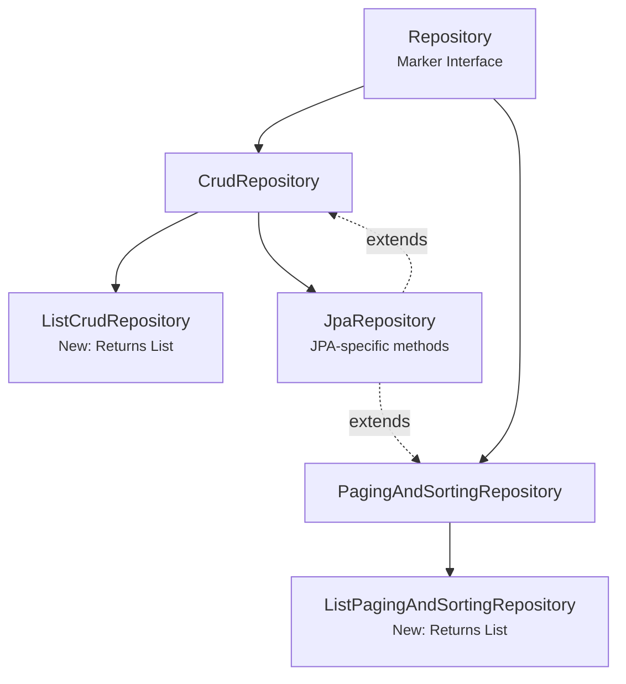
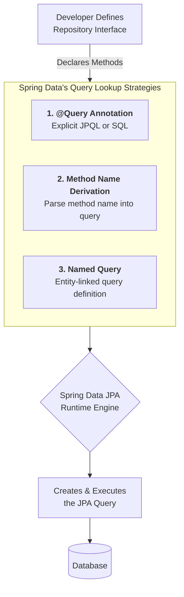
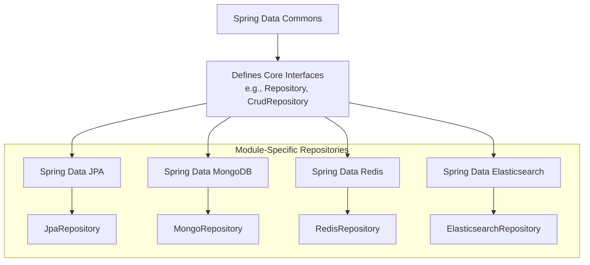
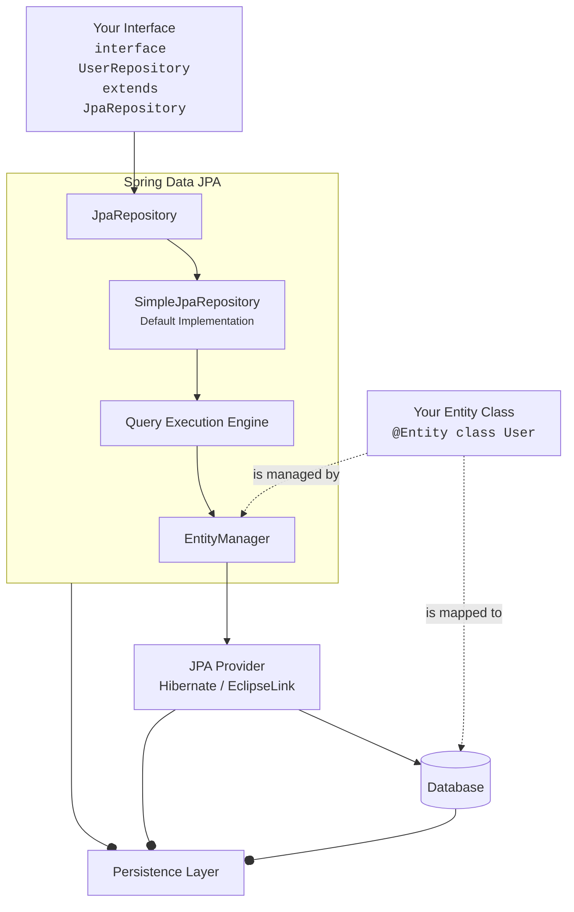

### 1. Repository Interface Hierarchy

This diagram shows the core repository hierarchy, starting from the base `Repository` marker interface up to the new, more specialized interfaces like `ListCrudRepository`.



**Key Takeaway:** The new `ListCrudRepository` and `ListPagingAndSortingRepository` (introduced in recent Spring Data versions) are now the recommended starting points, returning `List` instead of `Iterable`.

---

### 2. Repository Query Methods

This diagram illustrates the various ways to define queries in a Spring Data repository interface.



**Key Takeaway:** You don't write the implementation. Spring Data JPA parses the method name or annotation at runtime to create the query.

---

### 3. Additional Repository Modules (MongoDB, etc.)

This diagram shows how the Spring Data umbrella project provides a consistent programming model across different data stores through its module-specific repositories.



**Key Takeaway:** The common interfaces from Spring Data Commons allow you to switch between different persistence technologies (e.g., from JPA to MongoDB) with minimal changes to your service layer code.

---

### 4. The Complete Spring Data JPA Architecture

This diagram provides an overview of how all the components fit together, from your interface definition to the database.



### Breakdown of the Query Strategies:

**1. `@Query` Annotation (Explicit & Most Powerful)**
```java
public interface UserRepository extends JpaRepository<User, Long> {
    @Query("SELECT u FROM User u WHERE u.email = ?1") // JPQL
    // @Query(value = "SELECT * FROM users WHERE email = ?1", nativeQuery = true) // SQL
    User findByEmailAddress(String email);
}
```

**2. Method Name Derivation (Declarative & Concise)**
```java
public interface UserRepository extends JpaRepository<User, Long> {
    // Parsed as: WHERE active = true AND lastName = :name
    List<User> findByActiveTrueAndLastName(String name);
    
    // Keywords: findBy, readBy, queryBy, getBy, existsBy, countBy, deleteBy/removeBy
    // Supports: And, Or, Between, LessThan, Like, IgnoreCase, OrderBy
}
```

**3. Named Query (Externalized Definition)**
```java
@Entity
@NamedQuery(name = "User.findByActiveStatus",
            query = "SELECT u FROM User u WHERE u.active = ?1")
public class User { ... }

// In the repository interface
public interface UserRepository extends JpaRepository<User, Long> {
    User findByActiveStatus(boolean active); // Automatically uses named query
}
```

The runtime engine evaluates these strategies in a specific order (typically `@Query` first, then Named Query, then Method Name parsing) to provide the implementation for your interface.

## Key Components Explained:

### **Core Repository Interfaces:**
- **CrudRepository**: Basic CRUD operations (save, findById, delete, etc.)
- **PagingAndSortingRepository**: Adds pagination and sorting capabilities
- **JpaRepository**: JPA-specific methods (flush, saveAndFlush, deleteInBatch)

### **Query Types:**
- **Derived Query Methods**: Auto-generated from method names
- **JPQL Queries**: Custom queries using `@Query` annotation
- **Native Queries**: SQL queries with `nativeQuery = true`
- **Projection Queries**: Interface-based data projections

### **Special Repositories:**
- **Reactive Repositories**: For reactive programming support
- **MongoDB Repositories**: MongoDB-specific repository support
- **Data REST Repositories**: REST exposure with `@RepositoryRestResource`

### **Configuration:**
- **@EnableJpaRepositories**: Manual repository configuration
- **Auto-configuration**: Spring Boot's automatic setup

This hierarchy represents the repository structure available in Spring Boot 3.4 and later versions, showing the inheritance chain and various repository types supported.