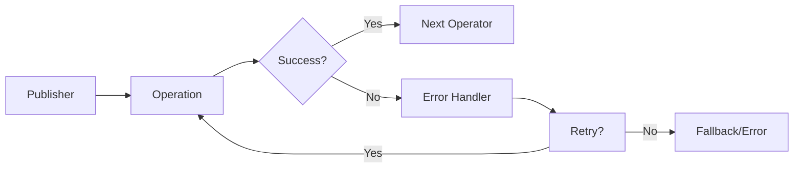

Gracefully handle errors in reactive streams without breaking the flow.

### Error Handling Strategies

```java
// Basic error handling
Flux<String> flux = Flux.just("data")
    .map(this::riskyOperation)
    .onErrorReturn("fallback")              // Return fallback on error
    .onErrorResume(error -> {               // Resume with alternative flux
        if (error instanceof TimeoutException) {
            return Flux.just("timeout", "fallback");
        }
        return Flux.error(error);
    })
    .retry(3)                               // Retry up to 3 times
    .retryWhen(Retry.fixedDelay(3, Duration.ofSeconds(1))); // Retry with delay
```

### Advanced Error Recovery

```java
// Timeout handling
Flux<String> withTimeout = dataFlux
    .timeout(Duration.ofSeconds(5))
    .onErrorResume(TimeoutException.class,
        error -> Flux.just("default-data"));

// Circuit breaker pattern
CircuitBreaker circuitBreaker = CircuitBreaker.ofDefaults("service");
Flux<String> resilient = externalService.call()
    .transformDeferred(CircuitBreakerOperator.of(circuitBreaker));

// Error classification
Flux<String> classifiedErrors = dataFlux
    .onErrorMap(IOException.class, ServiceUnavailableException::new)
    .onErrorMap(IllegalArgumentException.class, BadRequestException::new);
```

### Error Flow


