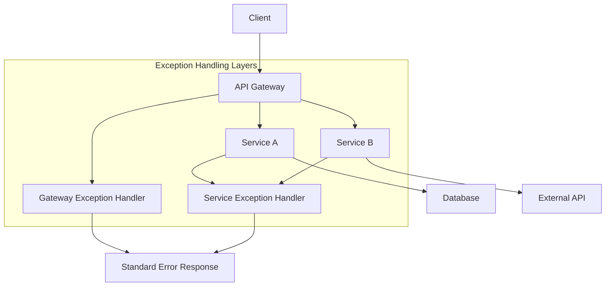

## 1. Overview & Architecture 🏗️



### Key Principles:

1. **Consistency**: Same error format across all services
2. **Propagation**: Errors should propagate with context
3. **Traceability**: Every error should be traceable
4. **Graceful Degradation**: Services should fail gracefully

---

## 2. Common Exception Patterns 📊

### 2.1 Exception Categories

```java
// Base exception for all business exceptions
public abstract class BaseException extends RuntimeException {
    private final String errorCode;
    private final HttpStatus httpStatus;
    private final Map<String, Object> details;

    public BaseException(String message, String errorCode, HttpStatus httpStatus) {
        super(message);
        this.errorCode = errorCode;
        this.httpStatus = httpStatus;
        this.details = new HashMap<>();
    }
}

// Business exceptions
public class BusinessException extends BaseException {
    public BusinessException(String message) {
        super(message, "BUSINESS_ERROR", HttpStatus.BAD_REQUEST);
    }
}

// Validation exceptions
public class ValidationException extends BaseException {
    public ValidationException(String message, Map<String, String> errors) {
        super(message, "VALIDATION_ERROR", HttpStatus.BAD_REQUEST);
        this.addDetail("fieldErrors", errors);
    }
}

// Resource not found
public class ResourceNotFoundException extends BaseException {
    public ResourceNotFoundException(String resource, String identifier) {
        super(
            String.format("%s with id %s not found", resource, identifier),
            "RESOURCE_NOT_FOUND",
            HttpStatus.NOT_FOUND
        );
    }
}

// External service failures
public class ExternalServiceException extends BaseException {
    public ExternalServiceException(String serviceName, String message) {
        super(
            String.format("Service %s failed: %s", serviceName, message),
            "EXTERNAL_SERVICE_ERROR",
            HttpStatus.SERVICE_UNAVAILABLE
        );
    }
}
```

### 2.2 Exception Hierarchy

```java
// Complete exception hierarchy
RuntimeException
└── BaseException
    ├── BusinessException
    ├── ValidationException
    ├── ResourceNotFoundException
    ├── AuthenticationException
    ├── AuthorizationException
    ├── ExternalServiceException
    └── SystemException
```

---

## 3. Gateway-Level Exception Handling 🌉

### 3.1 Global Exception Handler for Gateway

```java
@Configuration
@Order(-1) // High priority
public class GatewayGlobalExceptionHandler extends AbstractErrorWebExceptionHandler {

    public GatewayGlobalExceptionHandler(
            ErrorAttributes errorAttributes,
            ApplicationContext applicationContext,
            ServerCodecConfigurer serverCodecConfigurer) {
        super(errorAttributes, new WebProperties.Resources(), applicationContext);
        setMessageWriters(serverCodecConfigurer.getWriters());
        setMessageReaders(serverCodecConfigurer.getReaders());
    }

    @Override
    protected RouterFunction<ServerResponse> getRoutingFunction(ErrorAttributes errorAttributes) {
        return RouterFunctions.route(
            RequestPredicates.all(), this::renderErrorResponse);
    }

    private Mono<ServerResponse> renderErrorResponse(ServerRequest request) {
        Map<String, Object> errorProperties = getErrorAttributes(request, ErrorAttributeOptions.defaults());

        // Extract error details
        HttpStatus status = HttpStatus.valueOf((int) errorProperties.get("status"));
        String path = (String) errorProperties.get("path");
        String message = (String) errorProperties.get("message");
        String traceId = MDC.get("traceId");

        // Build standardized error response
        ErrorResponse errorResponse = ErrorResponse.builder()
            .timestamp(Instant.now())
            .status(status.value())
            .error(status.getReasonPhrase())
            .message(message)
            .path(path)
            .traceId(traceId)
            .code("GATEWAY_ERROR")
            .build();

        return ServerResponse.status(status)
            .contentType(MediaType.APPLICATION_JSON)
            .body(BodyInserters.fromValue(errorResponse));
    }
}
```

### 3.2 Rate Limiting Exception Handler

```java
@Component
public class RateLimitExceptionHandler implements WebExceptionHandler {

    @Override
    public Mono<Void> handle(ServerWebExchange exchange, Throwable ex) {
        if (ex instanceof RateLimitExceededException) {
            ServerHttpResponse response = exchange.getResponse();
            response.setStatusCode(HttpStatus.TOO_MANY_REQUESTS);
            response.getHeaders().setContentType(MediaType.APPLICATION_JSON);

            ErrorResponse errorResponse = ErrorResponse.builder()
                .timestamp(Instant.now())
                .status(HttpStatus.TOO_MANY_REQUESTS.value())
                .error("Too Many Requests")
                .message("Rate limit exceeded. Please try again later.")
                .code("RATE_LIMIT_EXCEEDED")
                .retryAfter(((RateLimitExceededException) ex).getRetryAfter().toSeconds())
                .build();

            DataBuffer buffer = response.bufferFactory()
                .wrap(errorResponse.toJson().getBytes(StandardCharsets.UTF_8));

            return response.writeWith(Mono.just(buffer));
        }
        return Mono.error(ex);
    }
}
```

### 3.3 Circuit Breaker Fallback

```java
@Component
public class CircuitBreakerFallbackHandler {

    @Bean
    public RouteLocator circuitBreakerRoutes(RouteLocatorBuilder builder) {
        return builder.routes()
            .route("user-service", r -> r
                .path("/api/users/**")
                .filters(f -> f
                    .circuitBreaker(config -> config
                        .setName("userServiceCB")
                        .setFallbackUri("forward:/fallback/user-service")
                    )
                )
                .uri("lb://user-service"))
            .build();
    }

    @RestController
    @RequestMapping("/fallback")
    public class FallbackController {

        @PostMapping("/user-service")
        public Mono<ErrorResponse> userServiceFallback(ServerHttpRequest request) {
            return Mono.just(ErrorResponse.builder()
                .timestamp(Instant.now())
                .status(HttpStatus.SERVICE_UNAVAILABLE.value())
                .error("Service Unavailable")
                .message("User service is temporarily unavailable")
                .code("SERVICE_UNAVAILABLE")
                .path(request.getPath().value())
                .suggestedAction("Retry after 30 seconds or contact support")
                .build());
        }
    }
}
```

---

## 4. Service-Level Exception Handling ⚙️

### 4.1 Common Exception Handler (Spring Boot)

```java
@RestControllerAdvice
@Slf4j
public class GlobalExceptionHandler {

    private static final String INTERNAL_SERVER_ERROR_CODE = "INTERNAL_ERROR";
    private static final String TRACE_ID_KEY = "traceId";

    @ExceptionHandler(BaseException.class)
    public ResponseEntity<ErrorResponse> handleBaseException(
            BaseException ex,
            HttpServletRequest request) {

        logErrorWithContext(ex, request);

        ErrorResponse errorResponse = ErrorResponse.builder()
            .timestamp(Instant.now())
            .status(ex.getHttpStatus().value())
            .error(ex.getHttpStatus().getReasonPhrase())
            .message(ex.getMessage())
            .code(ex.getErrorCode())
            .path(request.getRequestURI())
            .traceId(MDC.get(TRACE_ID_KEY))
            .details(ex.getDetails())
            .build();

        return ResponseEntity.status(ex.getHttpStatus()).body(errorResponse);
    }

    @ExceptionHandler(MethodArgumentNotValidException.class)
    public ResponseEntity<ErrorResponse> handleValidationException(
            MethodArgumentNotValidException ex,
            HttpServletRequest request) {

        Map<String, String> errors = ex.getBindingResult()
            .getFieldErrors()
            .stream()
            .collect(Collectors.toMap(
                FieldError::getField,
                fieldError -> fieldError.getDefaultMessage() != null ?
                    fieldError.getDefaultMessage() : "Invalid value"
            ));

        ValidationException validationEx = new ValidationException(
            "Validation failed", errors);

        return handleBaseException(validationEx, request);
    }

    @ExceptionHandler(DataIntegrityViolationException.class)
    public ResponseEntity<ErrorResponse> handleDataIntegrityViolation(
            DataIntegrityViolationException ex,
            HttpServletRequest request) {

        BusinessException businessEx = new BusinessException(
            "Database constraint violation: " + extractConstraintMessage(ex));

        return handleBaseException(businessEx, request);
    }

    @ExceptionHandler(Exception.class)
    public ResponseEntity<ErrorResponse> handleGenericException(
            Exception ex,
            HttpServletRequest request) {

        log.error("Unhandled exception: ", ex);

        ErrorResponse errorResponse = ErrorResponse.builder()
            .timestamp(Instant.now())
            .status(HttpStatus.INTERNAL_SERVER_ERROR.value())
            .error("Internal Server Error")
            .message("An unexpected error occurred")
            .code(INTERNAL_SERVER_ERROR_CODE)
            .path(request.getRequestURI())
            .traceId(MDC.get(TRACE_ID_KEY))
            .build();

        // Don't expose internal details in production
        if (Arrays.asList(environment.getActiveProfiles()).contains("prod")) {
            errorResponse.setMessage("An unexpected error occurred");
        } else {
            errorResponse.setDetails(Map.of("exception", ex.toString()));
        }

        return ResponseEntity
            .status(HttpStatus.INTERNAL_SERVER_ERROR)
            .body(errorResponse);
    }

    private void logErrorWithContext(Throwable ex, HttpServletRequest request) {
        Map<String, Object> logContext = new HashMap<>();
        logContext.put("traceId", MDC.get(TRACE_ID_KEY));
        logContext.put("path", request.getRequestURI());
        logContext.put("method", request.getMethod());
        logContext.put("query", request.getQueryString());
        logContext.put("userAgent", request.getHeader("User-Agent"));

        if (ex instanceof BaseException baseEx) {
            logContext.put("errorCode", baseEx.getErrorCode());
            log.warn("Business exception occurred: {}", logContext, ex);
        } else {
            log.error("Unexpected exception occurred: {}", logContext, ex);
        }
    }

    private String extractConstraintMessage(DataIntegrityViolationException ex) {
        // Extract meaningful constraint violation message
        Throwable rootCause = getRootCause(ex);
        if (rootCause instanceof ConstraintViolationException) {
            return rootCause.getMessage();
        }
        return "Database constraint violation";
    }

    private Throwable getRootCause(Throwable throwable) {
        Throwable rootCause = throwable;
        while (rootCause.getCause() != null && rootCause.getCause() != rootCause) {
            rootCause = rootCause.getCause();
        }
        return rootCause;
    }
}
```

### 4.2 Feign Client Exception Handler

```java
@Component
public class FeignErrorDecoder implements ErrorDecoder {

    private final ErrorDecoder defaultErrorDecoder = new Default();

    @Override
    public Exception decode(String methodKey, Response response) {
        // Read error response from feign client
        String body = null;
        try {
            if (response.body() != null) {
                body = Util.toString(response.body().asReader(StandardCharsets.UTF_8));
            }
        } catch (IOException e) {
            log.error("Failed to read error response body", e);
        }

        // Parse the error response
        ErrorResponse errorResponse = parseErrorResponse(body);

        // Map to appropriate exception
        return switch (response.status()) {
            case 400 -> new BusinessException(errorResponse.getMessage());
            case 401 -> new AuthenticationException("Authentication failed");
            case 403 -> new AuthorizationException("Access denied");
            case 404 -> new ResourceNotFoundException("Resource", "unknown");
            case 429 -> new RateLimitExceededException(Duration.ofSeconds(
                errorResponse.getRetryAfter() != null ? errorResponse.getRetryAfter() : 60));
            case 503 -> new ExternalServiceException(
                extractServiceName(methodKey),
                errorResponse.getMessage());
            default -> defaultErrorDecoder.decode(methodKey, response);
        };
    }

    private ErrorResponse parseErrorResponse(String body) {
        if (StringUtils.isBlank(body)) {
            return ErrorResponse.builder()
                .message("Unknown error from downstream service")
                .build();
        }

        try {
            ObjectMapper mapper = new ObjectMapper();
            return mapper.readValue(body, ErrorResponse.class);
        } catch (Exception e) {
            return ErrorResponse.builder()
                .message(body)
                .build();
        }
    }

    private String extractServiceName(String methodKey) {
        // methodKey format: ServiceName#methodName(ParamType)
        if (methodKey.contains("#")) {
            return methodKey.split("#")[0];
        }
        return "unknown-service";
    }
}
```

---

## 5. Common Error Response Structure 📄

### 5.1 Standard Error Response Class

```java
@Data
@Builder
@NoArgsConstructor
@AllArgsConstructor
@JsonInclude(JsonInclude.Include.NON_NULL)
public class ErrorResponse {

    @JsonProperty("timestamp")
    @JsonFormat(shape = JsonFormat.Shape.STRING, pattern = "yyyy-MM-dd'T'HH:mm:ss.SSS'Z'", timezone = "UTC")
    private Instant timestamp;

    @JsonProperty("status")
    private Integer status;

    @JsonProperty("error")
    private String error;

    @JsonProperty("message")
    private String message;

    @JsonProperty("code")
    private String code;

    @JsonProperty("path")
    private String path;

    @JsonProperty("traceId")
    private String traceId;

    @JsonProperty("correlationId")
    private String correlationId;

    @JsonProperty("details")
    private Map<String, Object> details;

    @JsonProperty("subErrors")
    private List<SubError> subErrors;

    @JsonProperty("suggestedAction")
    private String suggestedAction;

    @JsonProperty("retryAfter")
    private Long retryAfter; // in seconds

    @Data
    @Builder
    @NoArgsConstructor
    @AllArgsConstructor
    public static class SubError {
        private String field;
        private String message;
        private Object rejectedValue;
    }

    public String toJson() {
        try {
            ObjectMapper mapper = new ObjectMapper();
            return mapper.writeValueAsString(this);
        } catch (JsonProcessingException e) {
            return "{\"message\":\"Error serializing error response\"}";
        }
    }

    // Example response:
    // {
    //   "timestamp": "2024-01-15T10:30:00.000Z",
    //   "status": 400,
    //   "error": "Bad Request",
    //   "message": "Validation failed",
    //   "code": "VALIDATION_ERROR",
    //   "path": "/api/users",
    //   "traceId": "abc123-def456",
    //   "subErrors": [
    //     {
    //       "field": "email",
    //       "message": "must be a well-formed email address",
    //       "rejectedValue": "invalid-email"
    //     }
    //   ],
    //   "suggestedAction": "Check the field errors and try again"
    // }
}
```

### 5.2 Error Codes Enum

```java
public enum ErrorCode {

    // Common errors (000-099)
    INTERNAL_ERROR("00001", "Internal server error"),
    SERVICE_UNAVAILABLE("00002", "Service temporarily unavailable"),
    VALIDATION_ERROR("00003", "Request validation failed"),

    // Authentication errors (100-199)
    AUTHENTICATION_FAILED("10001", "Authentication failed"),
    INVALID_TOKEN("10002", "Invalid or expired token"),
    MISSING_CREDENTIALS("10003", "Missing authentication credentials"),

    // Authorization errors (200-299)
    ACCESS_DENIED("20001", "Access denied"),
    INSUFFICIENT_PERMISSIONS("20002", "Insufficient permissions"),

    // Resource errors (300-399)
    RESOURCE_NOT_FOUND("30001", "Resource not found"),
    RESOURCE_CONFLICT("30002", "Resource already exists"),

    // Business errors (400-499)
    BUSINESS_RULE_VIOLATION("40001", "Business rule violation"),
    INVALID_STATE("40002", "Invalid operation in current state"),

    // Rate limiting (500-599)
    RATE_LIMIT_EXCEEDED("50001", "Rate limit exceeded"),

    // External service errors (600-699)
    EXTERNAL_SERVICE_ERROR("60001", "External service error"),

    // Database errors (700-799)
    DATABASE_ERROR("70001", "Database operation failed"),
    CONSTRAINT_VIOLATION("70002", "Database constraint violation");

    private final String code;
    private final String description;

    ErrorCode(String code, String description) {
        this.code = code;
        this.description = description;
    }

    public String getCode() { return code; }
    public String getDescription() { return description; }
}
```

---

## 6. Propagation & Correlation 🔗

### 6.1 Correlation ID Filter

```java
@Component
public class CorrelationFilter implements WebFilter {

    private static final String CORRELATION_ID_HEADER = "X-Correlation-ID";
    private static final String TRACE_ID_HEADER = "X-Trace-ID";
    private static final String MDC_TRACE_ID = "traceId";
    private static final String MDC_CORRELATION_ID = "correlationId";

    @Override
    public Mono<Void> filter(ServerWebExchange exchange, WebFilterChain chain) {
        HttpHeaders headers = exchange.getRequest().getHeaders();

        // Get or generate correlation ID
        String correlationId = headers.getFirst(CORRELATION_ID_HEADER);
        if (correlationId == null) {
            correlationId = generateId();
        }

        // Get or generate trace ID
        String traceId = headers.getFirst(TRACE_ID_HEADER);
        if (traceId == null) {
            traceId = generateId();
        }

        // Set in MDC for logging
        MDC.put(MDC_CORRELATION_ID, correlationId);
        MDC.put(MDC_TRACE_ID, traceId);

        // Add to response headers
        ServerHttpResponse response = exchange.getResponse();
        response.getHeaders().add(CORRELATION_ID_HEADER, correlationId);
        response.getHeaders().add(TRACE_ID_HEADER, traceId);

        // Add to request for downstream services
        ServerHttpRequest mutatedRequest = exchange.getRequest().mutate()
            .header(CORRELATION_ID_HEADER, correlationId)
            .header(TRACE_ID_HEADER, traceId)
            .build();

        return chain.filter(exchange.mutate().request(mutatedRequest).build())
            .doFinally(signal -> MDC.clear());
    }

    private String generateId() {
        return UUID.randomUUID().toString();
    }
}
```

### 6.2 Exception Propagation with Feign

```java
@Configuration
public class FeignConfig {

    @Bean
    public RequestInterceptor correlationIdInterceptor() {
        return requestTemplate -> {
            // Propagate correlation and trace IDs
            String correlationId = MDC.get("correlationId");
            String traceId = MDC.get("traceId");

            if (correlationId != null) {
                requestTemplate.header("X-Correlation-ID", correlationId);
            }
            if (traceId != null) {
                requestTemplate.header("X-Trace-ID", traceId);
            }

            // Propagate original error context if available
            String errorContext = MDC.get("errorContext");
            if (errorContext != null) {
                requestTemplate.header("X-Error-Context", errorContext);
            }
        };
    }
}
```

---

## 7. Circuit Breaker Integration ⚡

### 7.1 Resilience4J Configuration

```java
@Configuration
@Slf4j
public class ResilienceConfig {

    @Bean
    public Customizer<Resilience4JCircuitBreakerFactory> defaultCustomizer() {
        return factory -> {
            factory.configureDefault(id -> new Resilience4JConfigBuilder(id)
                .circuitBreakerConfig(CircuitBreakerConfig.custom()
                    .failureRateThreshold(50)
                    .waitDurationInOpenState(Duration.ofSeconds(30))
                    .slidingWindowSize(10)
                    .permittedNumberOfCallsInHalfOpenState(5)
                    .build())
                .timeLimiterConfig(TimeLimiterConfig.custom()
                    .timeoutDuration(Duration.ofSeconds(5))
                    .build())
                .build());

            // Add event listeners for monitoring
            factory.addCircuitBreakerCustomizer(circuitBreaker ->
                circuitBreaker.getEventPublisher()
                    .onStateTransition(event -> {
                        log.warn("Circuit breaker {} changed state from {} to {}",
                            event.getCircuitBreakerName(),
                            event.getStateTransition().getFromState(),
                            event.getStateTransition().getToState());
                    }), "userService");
        };
    }

    @Bean
    public FallbackFactory<ServiceClient> serviceClientFallbackFactory() {
        return new FallbackFactory<>() {
            @Override
            public ServiceClient create(Throwable cause) {
                return new ServiceClientFallback(cause);
            }
        };
    }

    // Fallback implementation
    public static class ServiceClientFallback implements ServiceClient {
        private final Throwable cause;

        public ServiceClientFallback(Throwable cause) {
            this.cause = cause;
        }

        @Override
        public User getUser(String id) {
            // Return fallback response or throw appropriate exception
            throw new ExternalServiceException("user-service",
                "Service unavailable: " + cause.getMessage());
        }
    }
}
```

---

## 8. Monitoring & Logging 📊

### 8.1 Structured Logging with Exceptions

```yaml
# application.yml logging configuration
logging:
  pattern:
    console: "%d{yyyy-MM-dd HH:mm:ss} [%thread] %-5level %logger{36} - traceId=%X{traceId} correlationId=%X{correlationId} - %msg%n"
  level:
    com.example: DEBUG

management:
  endpoints:
    web:
      exposure:
        include: health,metrics,prometheus
  metrics:
    export:
      prometheus:
        enabled: true
  tracing:
    sampling:
      probability: 1.0
```

### 8.2 Exception Metrics

```java
@Component
public class ExceptionMetrics {

    private final MeterRegistry meterRegistry;
    private final Map<String, Counter> exceptionCounters = new ConcurrentHashMap<>();

    public ExceptionMetrics(MeterRegistry meterRegistry) {
        this.meterRegistry = meterRegistry;
    }

    public void recordException(BaseException exception) {
        String errorCode = exception.getErrorCode();
        Counter counter = exceptionCounters.computeIfAbsent(
            errorCode,
            code -> Counter.builder("application.exceptions")
                .tag("error_code", code)
                .tag("service", "user-service")
                .description("Count of exceptions by error code")
                .register(meterRegistry)
        );
        counter.increment();
    }

    public void recordException(String errorCode, String serviceName) {
        Counter.builder("application.exceptions")
            .tag("error_code", errorCode)
            .tag("service", serviceName)
            .register(meterRegistry)
            .increment();
    }
}
```

### 8.3 Distributed Tracing with Sleuth/Zipkin

```java
@Configuration
public class TracingConfig {

    @Bean
    public Sampler defaultSampler() {
        return Sampler.ALWAYS_SAMPLE;
    }

    @Bean
    public Propagator propagator() {
        return new Propagator() {
            @Override
            public List<String> fields() {
                return Arrays.asList("traceId", "spanId", "parentSpanId", "sampled");
            }

            @Override
            public <C> void inject(TraceContext context, C carrier, Setter<C> setter) {
                setter.set(carrier, "X-B3-TraceId", context.traceId());
                setter.set(carrier, "X-B3-SpanId", context.spanId());
                setter.set(carrier, "X-B3-ParentSpanId", context.parentIdString());
                setter.set(carrier, "X-B3-Sampled", "1");
            }

            @Override
            public <C> TraceContext extract(C carrier, Getter<C> getter) {
                // Implementation
                return null;
            }
        };
    }
}
```

---

## 9. Complete Implementation Example 🚀

### 9.1 Service Exception Handler (Complete)

```java
@RestControllerAdvice
@Slf4j
public class CompleteExceptionHandler {

    @Autowired
    private ExceptionMetrics exceptionMetrics;

    @Autowired
    private Environment environment;

    @ExceptionHandler(Exception.class)
    public ResponseEntity<ErrorResponse> handleAllUncaughtException(
            Exception exception,
            HttpServletRequest request) {

        ErrorResponse errorResponse = buildErrorResponse(exception, request);
        logException(exception, errorResponse, request);

        // Record metrics
        exceptionMetrics.recordException(
            errorResponse.getCode(),
            environment.getProperty("spring.application.name", "unknown-service"));

        return ResponseEntity
            .status(errorResponse.getStatus())
            .contentType(MediaType.APPLICATION_JSON)
            .header("X-Error-Code", errorResponse.getCode())
            .header("X-Trace-ID", errorResponse.getTraceId())
            .body(errorResponse);
    }

    private ErrorResponse buildErrorResponse(Exception exception, HttpServletRequest request) {
        if (exception instanceof BaseException baseException) {
            return ErrorResponse.builder()
                .timestamp(Instant.now())
                .status(baseException.getHttpStatus().value())
                .error(baseException.getHttpStatus().getReasonPhrase())
                .message(baseException.getMessage())
                .code(baseException.getErrorCode())
                .path(request.getRequestURI())
                .traceId(MDC.get("traceId"))
                .correlationId(MDC.get("correlationId"))
                .details(baseException.getDetails())
                .suggestedAction(getSuggestedAction(baseException))
                .build();
        }

        // Handle Spring-specific exceptions
        if (exception instanceof MethodArgumentNotValidException validationEx) {
            return buildValidationErrorResponse(validationEx, request);
        }

        if (exception instanceof HttpMessageNotReadableException) {
            return ErrorResponse.builder()
                .timestamp(Instant.now())
                .status(HttpStatus.BAD_REQUEST.value())
                .error("Bad Request")
                .message("Malformed JSON request")
                .code("MALFORMED_JSON")
                .path(request.getRequestURI())
                .traceId(MDC.get("traceId"))
                .suggestedAction("Check your request JSON format")
                .build();
        }

        // Generic exception
        return ErrorResponse.builder()
            .timestamp(Instant.now())
            .status(HttpStatus.INTERNAL_SERVER_ERROR.value())
            .error("Internal Server Error")
            .message(isProduction() ?
                "An unexpected error occurred" :
                exception.getMessage())
            .code("INTERNAL_ERROR")
            .path(request.getRequestURI())
            .traceId(MDC.get("traceId"))
            .correlationId(MDC.get("correlationId"))
            .details(isProduction() ?
                Map.of() :
                Map.of("exception", exception.getClass().getName()))
            .build();
    }

    private ErrorResponse buildValidationErrorResponse(
            MethodArgumentNotValidException ex,
            HttpServletRequest request) {

        List<ErrorResponse.SubError> subErrors = ex.getBindingResult()
            .getFieldErrors()
            .stream()
            .map(fieldError -> ErrorResponse.SubError.builder()
                .field(fieldError.getField())
                .message(fieldError.getDefaultMessage())
                .rejectedValue(fieldError.getRejectedValue())
                .build())
            .collect(Collectors.toList());

        return ErrorResponse.builder()
            .timestamp(Instant.now())
            .status(HttpStatus.BAD_REQUEST.value())
            .error("Bad Request")
            .message("Validation failed")
            .code("VALIDATION_ERROR")
            .path(request.getRequestURI())
            .traceId(MDC.get("traceId"))
            .subErrors(subErrors)
            .suggestedAction("Check the field errors and correct your request")
            .build();
    }

    private void logException(Exception exception, ErrorResponse errorResponse,
                             HttpServletRequest request) {
        Map<String, Object> logContext = Map.of(
            "traceId", errorResponse.getTraceId(),
            "correlationId", errorResponse.getCorrelationId(),
            "errorCode", errorResponse.getCode(),
            "path", request.getRequestURI(),
            "method", request.getMethod(),
            "status", errorResponse.getStatus()
        );

        if (errorResponse.getStatus() >= 500) {
            log.error("Server error occurred: {}", logContext, exception);
        } else {
            log.warn("Client error occurred: {}", logContext, exception);
        }
    }

    private String getSuggestedAction(BaseException exception) {
        return switch (exception.getErrorCode()) {
            case "VALIDATION_ERROR" -> "Check the field errors and correct your request";
            case "RESOURCE_NOT_FOUND" -> "Verify the resource identifier and try again";
            case "AUTHENTICATION_FAILED" -> "Check your credentials and try again";
            case "RATE_LIMIT_EXCEEDED" -> "Wait before making more requests";
            default -> "Contact support if the problem persists";
        };
    }

    private boolean isProduction() {
        return Arrays.asList(environment.getActiveProfiles())
            .contains("prod");
    }
}
```

### 9.2 Common Dependencies

```xml
<!-- pom.xml -->
<dependencies>
    <!-- Spring Boot -->
    <dependency>
        <groupId>org.springframework.boot</groupId>
        <artifactId>spring-boot-starter-web</artifactId>
    </dependency>

    <!-- Validation -->
    <dependency>
        <groupId>org.springframework.boot</groupId>
        <artifactId>spring-boot-starter-validation</artifactId>
    </dependency>

    <!-- AOP for @ControllerAdvice -->
    <dependency>
        <groupId>org.springframework.boot</groupId>
        <artifactId>spring-boot-starter-aop</artifactId>
    </dependency>

    <!-- Resilience4J -->
    <dependency>
        <groupId>org.springframework.cloud</groupId>
        <artifactId>spring-cloud-starter-circuitbreaker-resilience4j</artifactId>
    </dependency>

    <!-- OpenFeign -->
    <dependency>
        <groupId>org.springframework.cloud</groupId>
        <artifactId>spring-cloud-starter-openfeign</artifactId>
    </dependency>

    <!-- Sleuth for tracing -->
    <dependency>
        <groupId>org.springframework.cloud</groupId>
        <artifactId>spring-cloud-starter-sleuth</artifactId>
    </dependency>

    <!-- Micrometer for metrics -->
    <dependency>
        <groupId>io.micrometer</groupId>
        <artifactId>micrometer-core</artifactId>
    </dependency>

    <!-- Lombok -->
    <dependency>
        <groupId>org.projectlombok</groupId>
        <artifactId>lombok</artifactId>
        <optional>true</optional>
    </dependency>
</dependencies>
```

### 9.3 Error Handling Test

```java
@SpringBootTest
@AutoConfigureMockMvc
@ActiveProfiles("test")
public class ExceptionHandlingTest {

    @Autowired
    private MockMvc mockMvc;

    @Test
    public void testValidationError() throws Exception {
        mockMvc.perform(post("/api/users")
                .contentType(MediaType.APPLICATION_JSON)
                .content("{\"email\": \"invalid-email\"}"))
            .andExpect(status().isBadRequest())
            .andExpect(jsonPath("$.code").value("VALIDATION_ERROR"))
            .andExpect(jsonPath("$.subErrors").isArray())
            .andExpect(jsonPath("$.traceId").exists())
            .andExpect(jsonPath("$.suggestedAction").exists());
    }

    @Test
    public void testResourceNotFound() throws Exception {
        mockMvc.perform(get("/api/users/99999"))
            .andExpect(status().isNotFound())
            .andExpect(jsonPath("$.code").value("RESOURCE_NOT_FOUND"))
            .andExpect(jsonPath("$.message").exists());
    }

    @Test
    public void testCorrelationIdPropagation() throws Exception {
        String correlationId = UUID.randomUUID().toString();

        mockMvc.perform(get("/api/users/1")
                .header("X-Correlation-ID", correlationId))
            .andExpect(status().isOk())
            .andExpect(header().exists("X-Correlation-ID"))
            .andExpect(header().string("X-Correlation-ID", correlationId));
    }
}
```

---

## 📚 Best Practices Summary

1. **Always use a standard error response format** across all services
2. **Propagate correlation and trace IDs** through all service calls
3. **Categorize exceptions appropriately** (business, technical, external)
4. **Never expose stack traces** in production environments
5. **Log exceptions with context** (traceId, userId, request details)
6. **Monitor exception rates** by type and service
7. **Provide helpful error messages** and suggested actions
8. **Implement proper fallbacks** for external service failures
9. **Use HTTP status codes correctly** (400 for client errors, 500 for server errors)
10. **Document your error codes** and their meanings

## 🚀 Quick Setup Commands

```bash
# Add to all microservices' application.yml
spring:
  application:
    name: your-service-name

management:
  endpoints:
    web:
      exposure:
        include: health,metrics,prometheus
  tracing:
    sampling:
      probability: 1.0

# Add MDC filter to logback-spring.xml
<appender name="CONSOLE" class="ch.qos.logback.core.ConsoleAppender">
    <encoder>
        <pattern>%d{yyyy-MM-dd HH:mm:ss} [%thread] %-5level %logger{36} - traceId=%X{traceId} - %msg%n</pattern>
    </encoder>
</appender>
```
