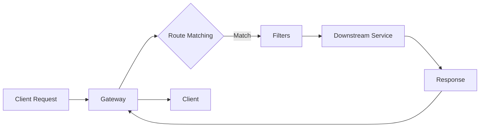

## 1. What is Spring Cloud Gateway? 🚪

Spring Cloud Gateway is a library for building API gateways on top of Spring WebFlux. It provides:

- Route matching based on various criteria
- Predicates and filters
- Circuit breaker integration
- Spring Cloud DiscoveryClient integration



## 2. Core Concepts 🧠

### **Routes**

The basic building block - defines URI to forward requests to.

### **Predicates**

Conditions that must be met for a route to be matched.

### **Filters**

Modify requests/responses before/after routing.

## 3. Sample Application Overview 📦

We'll build a gateway with:

- **Service 1**: User Service (port 8081)
- **Service 2**: Product Service (port 8082)
- **Gateway**: Port 8080 with:
  - JWT Authentication
  - Request/Response Logging
  - Rate Limiting

## 4. Project Setup 🛠️

### 4.1 Create Parent Project (pom.xml)

```xml
<?xml version="1.0" encoding="UTF-8"?>
<project xmlns="http://maven.apache.org/POM/4.0.0">
    <modelVersion>4.0.0</modelVersion>

    <parent>
        <groupId>org.springframework.boot</groupId>
        <artifactId>spring-boot-starter-parent</artifactId>
        <version>3.1.5</version>
    </parent>

    <groupId>com.example</groupId>
    <artifactId>spring-cloud-gateway-demo</artifactId>
    <version>1.0.0</version>
    <packaging>pom</packaging>

    <modules>
        <module>gateway-service</module>
        <module>user-service</module>
        <module>product-service</module>
    </modules>

    <properties>
        <java.version>17</java.version>
        <spring-cloud.version>2022.0.4</spring-cloud.version>
    </properties>

    <dependencyManagement>
        <dependencies>
            <dependency>
                <groupId>org.springframework.cloud</groupId>
                <artifactId>spring-cloud-dependencies</artifactId>
                <version>${spring-cloud.version}</version>
                <type>pom</type>
                <scope>import</scope>
            </dependency>
        </dependencies>
    </dependencyManagement>
</project>
```

### 4.2 Gateway Service Dependencies

```xml
<!-- gateway-service/pom.xml -->
<dependencies>
    <dependency>
        <groupId>org.springframework.cloud</groupId>
        <artifactId>spring-cloud-starter-gateway</artifactId>
    </dependency>

    <dependency>
        <groupId>org.springframework.boot</groupId>
        <artifactId>spring-boot-starter-data-redis-reactive</artifactId>
    </dependency>

    <dependency>
        <groupId>io.jsonwebtoken</groupId>
        <artifactId>jjwt-api</artifactId>
        <version>0.11.5</version>
    </dependency>

    <dependency>
        <groupId>io.jsonwebtoken</groupId>
        <artifactId>jjwt-impl</artifactId>
        <version>0.11.5</version>
        <scope>runtime</scope>
    </dependency>

    <dependency>
        <groupId>io.jsonwebtoken</groupId>
        <artifactId>jjwt-jackson</artifactId>
        <version>0.11.5</version>
        <scope>runtime</scope>
    </dependency>

    <dependency>
        <groupId>org.springframework.boot</groupId>
        <artifactId>spring-boot-starter-actuator</artifactId>
    </dependency>
</dependencies>
```

## 5. Basic Gateway Configuration ⚙️

### 5.1 Application Properties

```yaml
# application.yml
server:
  port: 8080

spring:
  application:
    name: api-gateway
  redis:
    host: localhost
    port: 6379

  cloud:
    gateway:
      routes:
        # User Service Routes
        - id: user-service
          uri: http://localhost:8081
          predicates:
            - Path=/api/users/**
          filters:
            - StripPrefix=1

        # Product Service Routes
        - id: product-service
          uri: http://localhost:8082
          predicates:
            - Path=/api/products/**
          filters:
            - StripPrefix=1

        # Public Auth Endpoint (No authentication needed)
        - id: auth-service-public
          uri: http://localhost:8081
          predicates:
            - Path=/api/auth/**
          filters:
            - StripPrefix=1

logging:
  level:
    org.springframework.cloud.gateway: DEBUG
    com.example.gateway: DEBUG

management:
  endpoints:
    web:
      exposure:
        include: "*"
```

### 5.2 Gateway Main Application

```java
@SpringBootApplication
public class GatewayApplication {
    public static void main(String[] args) {
        SpringApplication.run(GatewayApplication.class, args);
    }
}
```

## 6. Authentication (JWT) 🔐

### 6.1 JWT Utility Class

```java
@Component
public class JwtUtil {

    private final String SECRET_KEY = "your-secret-key-minimum-256-bits-long-for-hs512";

    public Claims extractAllClaims(String token) {
        return Jwts.parserBuilder()
                .setSigningKey(getSignKey())
                .build()
                .parseClaimsJws(token)
                .getBody();
    }

    public boolean validateToken(String token) {
        try {
            Jwts.parserBuilder()
                .setSigningKey(getSignKey())
                .build()
                .parseClaimsJws(token);
            return true;
        } catch (Exception e) {
            return false;
        }
    }

    private Key getSignKey() {
        byte[] keyBytes = SECRET_KEY.getBytes();
        return Keys.hmacShaKeyFor(keyBytes);
    }

    public String extractUsername(String token) {
        return extractAllClaims(token).getSubject();
    }
}
```

### 6.2 Authentication Filter

```java
@Component
public class AuthenticationFilter implements GlobalFilter {

    @Autowired
    private JwtUtil jwtUtil;

    @Override
    public Mono<Void> filter(ServerWebExchange exchange, GatewayFilterChain chain) {
        ServerHttpRequest request = exchange.getRequest();

        // Skip authentication for public endpoints
        if (request.getURI().getPath().contains("/api/auth")) {
            return chain.filter(exchange);
        }

        // Check for Authorization header
        if (!request.getHeaders().containsKey(HttpHeaders.AUTHORIZATION)) {
            return onError(exchange, "No authorization header", HttpStatus.UNAUTHORIZED);
        }

        String authHeader = request.getHeaders().getFirst(HttpHeaders.AUTHORIZATION);
        if (authHeader != null && authHeader.startsWith("Bearer ")) {
            String token = authHeader.substring(7);

            if (jwtUtil.validateToken(token)) {
                String username = jwtUtil.extractUsername(token);

                // Add custom header with username for downstream services
                ServerHttpRequest mutatedRequest = exchange.getRequest().mutate()
                    .header("X-User-Id", username)
                    .build();

                return chain.filter(exchange.mutate().request(mutatedRequest).build());
            }
        }

        return onError(exchange, "Invalid or expired token", HttpStatus.UNAUTHORIZED);
    }

    private Mono<Void> onError(ServerWebExchange exchange, String err, HttpStatus status) {
        ServerHttpResponse response = exchange.getResponse();
        response.setStatusCode(status);

        DataBuffer buffer = response.bufferFactory()
            .wrap(err.getBytes(StandardCharsets.UTF_8));

        return response.writeWith(Mono.just(buffer));
    }
}
```

### 6.3 Route-Specific Authentication

```java
@Configuration
public class GatewayConfig {

    @Bean
    public RouteLocator customRouteLocator(RouteLocatorBuilder builder) {
        return builder.routes()
            .route("secure-user-service", r -> r
                .path("/api/users/**")
                .filters(f -> f
                    .filter(authenticationFilter())
                    .addRequestHeader("X-Secure", "true")
                )
                .uri("http://localhost:8081"))
            .build();
    }

    @Bean
    public AuthenticationFilter authenticationFilter() {
        return new AuthenticationFilter();
    }
}
```

## 7. Logging 📝

### 7.1 Logging Filter

```java
@Component
public class LoggingFilter implements GlobalFilter {

    private static final Logger logger = LoggerFactory.getLogger(LoggingFilter.class);

    @Override
    public Mono<Void> filter(ServerWebExchange exchange, GatewayFilterChain chain) {
        long startTime = System.currentTimeMillis();
        String requestId = UUID.randomUUID().toString();

        ServerHttpRequest request = exchange.getRequest();

        // Log request
        logger.info("Request ID: {} | Method: {} | Path: {} | Headers: {}",
            requestId,
            request.getMethod(),
            request.getPath(),
            request.getHeaders());

        // Log request body if present
        if (request.getHeaders().getContentLength() > 0) {
            return request.getBody()
                .collectList()
                .flatMap(dataBuffers -> {
                    byte[] bytes = new byte[dataBuffers.stream()
                        .mapToInt(DataBuffer::readableByteCount).sum()];

                    int offset = 0;
                    for (DataBuffer dataBuffer : dataBuffers) {
                        byte[] bufferBytes = new byte[dataBuffer.readableByteCount()];
                        dataBuffer.read(bufferBytes);
                        System.arraycopy(bufferBytes, 0, bytes, offset, bufferBytes.length);
                        offset += bufferBytes.length;
                    }

                    logger.info("Request Body: {}", new String(bytes));
                    return chain.filter(exchange);
                });
        }

        return chain.filter(exchange)
            .then(Mono.fromRunnable(() -> {
                ServerHttpResponse response = exchange.getResponse();
                long duration = System.currentTimeMillis() - startTime;

                logger.info("Request ID: {} | Status: {} | Duration: {}ms",
                    requestId,
                    response.getStatusCode(),
                    duration);
            }));
    }
}
```

### 7.2 Custom Request Logger

```java
@Component
public class RequestLogger {

    public static class RequestLog {
        private String requestId;
        private String method;
        private String path;
        private Map<String, List<String>> headers;
        private String remoteAddress;
        private Instant timestamp;

        // Getters and Setters

        @Override
        public String toString() {
            return String.format(
                "RequestLog[ID=%s, Method=%s, Path=%s, IP=%s, Time=%s]",
                requestId, method, path, remoteAddress, timestamp);
        }
    }

    @Bean
    public GlobalFilter requestLoggerFilter() {
        return (exchange, chain) -> {
            RequestLog log = new RequestLog();
            log.setRequestId(UUID.randomUUID().toString());
            log.setMethod(exchange.getRequest().getMethod().name());
            log.setPath(exchange.getRequest().getPath().value());
            log.setHeaders(new HashMap<>(exchange.getRequest().getHeaders()));
            log.setRemoteAddress(
                exchange.getRequest().getRemoteAddress() != null ?
                exchange.getRequest().getRemoteAddress().getAddress().getHostAddress() :
                "unknown");
            log.setTimestamp(Instant.now());

            MDC.put("requestId", log.getRequestId());

            // Log to file or external system
            System.out.println("Request logged: " + log);

            return chain.filter(exchange)
                .doFinally(signalType -> MDC.clear());
        };
    }
}
```

## 8. Rate Limiting 🚦

### 8.1 Redis Configuration

```java
@Configuration
public class RedisConfig {

    @Bean
    public ReactiveRedisTemplate<String, String> reactiveRedisTemplate(
            ReactiveRedisConnectionFactory factory) {
        StringRedisSerializer keySerializer = new StringRedisSerializer();
        Jackson2JsonRedisSerializer<String> valueSerializer =
            new Jackson2JsonRedisSerializer<>(String.class);

        RedisSerializationContext.RedisSerializationContextBuilder<String, String> builder =
            RedisSerializationContext.newSerializationContext(keySerializer);

        RedisSerializationContext<String, String> context =
            builder.value(valueSerializer).build();

        return new ReactiveRedisTemplate<>(factory, context);
    }
}
```

### 8.2 Rate Limiter Configuration

```java
@Configuration
public class RateLimiterConfig {

    @Bean
    public RedisRateLimiter redisRateLimiter(ReactiveRedisTemplate<String, String> redisTemplate) {
        return new RedisRateLimiter(redisTemplate);
    }

    @Bean
    public KeyResolver userKeyResolver() {
        return exchange -> {
            // Rate limit by user ID from JWT token
            String token = exchange.getRequest()
                .getHeaders()
                .getFirst(HttpHeaders.AUTHORIZATION);

            if (token != null && token.startsWith("Bearer ")) {
                // Extract user from token (simplified)
                return Mono.just(token.substring(7, Math.min(token.length(), 20)));
            }

            // Fallback to IP address
            return Mono.just(exchange.getRequest()
                .getRemoteAddress()
                .getAddress()
                .getHostAddress());
        };
    }

    @Bean
    public KeyResolver ipKeyResolver() {
        return exchange -> Mono.just(
            exchange.getRequest()
                .getRemoteAddress()
                .getAddress()
                .getHostAddress()
        );
    }
}
```

### 8.3 Rate Limiting Filter

```java
@Component
public class RateLimitingFilter implements GlobalFilter {

    @Autowired
    private RedisRateLimiter rateLimiter;

    @Autowired
    @Qualifier("userKeyResolver")
    private KeyResolver keyResolver;

    @Override
    public Mono<Void> filter(ServerWebExchange exchange, GatewayFilterChain chain) {
        return keyResolver.resolve(exchange)
            .flatMap(key -> rateLimiter.isAllowed(key,
                new RequestLimitConfig(10, 1, Duration.ofMinutes(1))))
            .flatMap(response -> {
                if (response.isAllowed()) {
                    // Add remaining requests header
                    exchange.getResponse().getHeaders()
                        .add("X-RateLimit-Remaining",
                            String.valueOf(response.getRemainingRequests()));

                    return chain.filter(exchange);
                } else {
                    // Rate limit exceeded
                    exchange.getResponse().setStatusCode(HttpStatus.TOO_MANY_REQUESTS);
                    exchange.getResponse().getHeaders()
                        .add("X-RateLimit-Retry-After",
                            String.valueOf(response.getRetryAfter().toSeconds()));

                    return exchange.getResponse().setComplete();
                }
            });
    }

    public static class RequestLimitConfig {
        private int limit;
        private int burstCapacity;
        private Duration period;

        // Constructor, getters, setters
    }
}
```

### 8.4 Route-Specific Rate Limiting

```yaml
# application.yml additional config
spring:
  cloud:
    gateway:
      routes:
        - id: user-service-limited
          uri: http://localhost:8081
          predicates:
            - Path=/api/users/**
          filters:
            - name: RequestRateLimiter
              args:
                redis-rate-limiter.replenishRate: 10
                redis-rate-limiter.burstCapacity: 20
                redis-rate-limiter.requestedTokens: 1
                key-resolver: "#{@userKeyResolver}"
```

## 9. Testing the Application 🧪

### 9.1 Test Endpoints

```java
// Test Controller for Gateway
@RestController
@RequestMapping("/test")
public class TestController {

    @GetMapping("/health")
    public Mono<String> health() {
        return Mono.just("Gateway is running!");
    }

    @GetMapping("/config")
    public Mono<Map<String, String>> getConfig() {
        Map<String, String> config = new HashMap<>();
        config.put("gateway-version", "1.0.0");
        config.put("rate-limiting-enabled", "true");
        config.put("authentication-enabled", "true");
        return Mono.just(config);
    }
}
```

### 9.2 Integration Test

```java
@SpringBootTest(webEnvironment = SpringBootTest.WebEnvironment.RANDOM_PORT)
@TestPropertySource(properties = {
    "spring.cloud.gateway.routes[0].id=test-service",
    "spring.cloud.gateway.routes[0].uri=http://httpbin.org:80",
    "spring.cloud.gateway.routes[0].predicates[0]=Path=/get/**",
    "spring.cloud.gateway.routes[0].filters[0]=StripPrefix=1"
})
public class GatewayIntegrationTest {

    @LocalServerPort
    private int port;

    @Autowired
    private WebTestClient webClient;

    @Test
    public void testGatewayRouting() {
        webClient.get()
            .uri("/get")
            .exchange()
            .expectStatus().isOk()
            .expectBody()
            .jsonPath("$.headers.Host").isEqualTo("httpbin.org");
    }

    @Test
    public void testRateLimiting() {
        IntStream.range(0, 15)
            .forEach(i -> {
                webClient.get()
                    .uri("/api/users/1")
                    .header("Authorization", "Bearer test-token")
                    .exchange()
                    .expectStatus().isEqualTo(i < 10 ? HttpStatus.OK : HttpStatus.TOO_MANY_REQUESTS);
            });
    }
}
```

### 9.3 Sample Test Scripts

```bash
#!/bin/bash

# 1. Start Redis
redis-server &

# 2. Start services
java -jar user-service/target/*.jar &
java -jar product-service/target/*.jar &

# 3. Start gateway
java -jar gateway-service/target/*.jar &

# 4. Test endpoints
echo "Testing gateway..."

# Get JWT token
TOKEN=$(curl -s -X POST http://localhost:8080/api/auth/login \
  -H "Content-Type: application/json" \
  -d '{"username":"test","password":"test"}' | jq -r '.token')

# Test authenticated endpoint
curl -H "Authorization: Bearer $TOKEN" \
  http://localhost:8080/api/users/123

# Test rate limiting
for i in {1..15}; do
  echo "Request $i:"
  curl -w " HTTP Status: %{http_code}\n" \
    -H "Authorization: Bearer $TOKEN" \
    http://localhost:8080/api/products/456
done
```

## 10. Best Practices ✅

### 10.1 Security Best Practices

```yaml
# security.yml
security:
  cors:
    allowed-origins: "https://trusted-domain.com"
    allowed-methods: "GET,POST,PUT,DELETE"
    allowed-headers: "*"
    max-age: 3600

  headers:
    content-security-policy: "default-src 'self'"
    x-frame-options: "DENY"
    x-content-type-options: "nosniff"
    x-xss-protection: "1; mode=block"
```

### 10.2 Monitoring Configuration

```java
@Configuration
public class MonitoringConfig {

    @Bean
    public MeterRegistryCustomizer<MeterRegistry> metricsCommonTags() {
        return registry -> registry.config()
            .commonTags("application", "api-gateway");
    }

    @Bean
    public Customizer<Resilience4JCircuitBreakerFactory> circuitBreakerMetrics() {
        return factory -> factory.configureDefault(id -> new Resilience4JConfigBuilder(id)
            .circuitBreakerConfig(CircuitBreakerConfig.custom()
                .failureRateThreshold(50)
                .waitDurationInOpenState(Duration.ofSeconds(30))
                .slidingWindowSize(10)
                .build())
            .build());
    }
}
```

### 10.3 Performance Optimization

```yaml
# application-performance.yml
spring:
  cloud:
    gateway:
      httpclient:
        connect-timeout: 1000
        response-timeout: 5s
        pool:
          type: elastic
          max-idle-time: 60s
          max-life-time: 60s

      metrics:
        enabled: true

server:
  netty:
    connection-timeout: 30s
    idle-timeout: 60s
```

### 10.4 Circuit Breaker Pattern

```java
@Configuration
public class CircuitBreakerConfig {

    @Bean
    public Customizer<ReactiveResilience4JCircuitBreakerFactory> defaultCustomizer() {
        return factory -> factory.configureDefault(id -> new Resilience4JConfigBuilder(id)
            .circuitBreakerConfig(CircuitBreakerConfig.ofDefaults())
            .timeLimiterConfig(TimeLimiterConfig.custom()
                .timeoutDuration(Duration.ofSeconds(4))
                .build())
            .build());
    }

    @Bean
    public RouteLocator circuitBreakerRoutes(RouteLocatorBuilder builder) {
        return builder.routes()
            .route("circuit-breaker-route", r -> r
                .path("/api/fallback/**")
                .filters(f -> f
                    .circuitBreaker(config -> config
                        .setName("myCircuitBreaker")
                        .setFallbackUri("forward:/fallback"))
                    .rewritePath("/api/fallback/(?<segment>.*)", "/${segment}"))
                .uri("http://localhost:8081"))
            .build();
    }

    @RestController
    @RequestMapping("/fallback")
    public class FallbackController {

        @GetMapping("/user")
        public Mono<Map<String, String>> userFallback() {
            Map<String, String> response = new HashMap<>();
            response.put("message", "User service is temporarily unavailable");
            response.put("timestamp", Instant.now().toString());
            return Mono.just(response);
        }
    }
}
```

## 📁 Complete Project Structure

```
spring-cloud-gateway-demo/
├── gateway-service/
│   ├── src/main/java/com/example/gateway/
│   │   ├── GatewayApplication.java
│   │   ├── config/
│   │   │   ├── GatewayConfig.java
│   │   │   ├── RedisConfig.java
│   │   │   └── RateLimiterConfig.java
│   │   ├── filter/
│   │   │   ├── AuthenticationFilter.java
│   │   │   ├── LoggingFilter.java
│   │   │   └── RateLimitingFilter.java
│   │   ├── util/
│   │   │   └── JwtUtil.java
│   │   └── controller/
│   │       └── FallbackController.java
│   ├── src/main/resources/
│   │   ├── application.yml
│   │   └── application-security.yml
│   └── pom.xml
├── user-service/
│   └── (Simple REST service on port 8081)
├── product-service/
│   └── (Simple REST service on port 8082)
└── pom.xml
```

## 🚀 Quick Start Commands

```bash
# 1. Clone and setup
git clone <your-repo>
cd spring-cloud-gateway-demo

# 2. Build all modules
mvn clean package

# 3. Start Redis (required for rate limiting)
docker run -p 6379:6379 redis:alpine

# 4. Start services in order
java -jar user-service/target/*.jar &
java -jar product-service/target/*.jar &
java -jar gateway-service/target/*.jar &

# 5. Verify gateway is running
curl http://localhost:8080/actuator/health
```

## 🔍 Troubleshooting Common Issues

| Issue                     | Solution                                                    |
| ------------------------- | ----------------------------------------------------------- |
| Routes not working        | Check predicates and ensure downstream services are running |
| JWT validation fails      | Verify secret key and token format                          |
| Rate limiting not working | Check Redis connection and key resolver configuration       |
| CORS issues               | Configure CORS properly in application.yml                  |
| Memory leaks              | Monitor with Actuator and adjust Netty configurations       |

## 📚 Additional Resources

- [Spring Cloud Gateway Documentation](https://spring.io/projects/spring-cloud-gateway)
- [Resilience4J Documentation](https://resilience4j.readme.io/docs)
- [JWT.io](https://jwt.io/) for JWT debugging
- [Redis Commands](https://redis.io/commands/) for rate limiting debugging

---

This guide provides a comprehensive implementation of Spring Cloud Gateway with authentication, logging, and rate limiting. The sample application demonstrates real-world scenarios and best practices for building production-ready API gateways.
