**Remember**: Good observability is not a luxury; it's a necessity for any production system. Start small, iterate, and gradually build your observability muscle. Your future self (and your on-call engineers) will thank you! 🙏

**Complete Guide to Observability in Spring Boot**

## 🎯 **Introduction**

### **What Are Logging & Tracing?**

Imagine you're a detective investigating a crime scene.

- **Logging** = Taking **photos** of individual clues (each service's activities)
- **Tracing** = Following the **footprints** between crime scenes (request flow across services)
- **Monitoring** = Watching **security cameras** (real-time system observation)

### **The "Why" - Real-World Analogy** 🏥

Think of a hospital system:

- **Patient (Request)** arrives at Emergency (API Gateway)
- Goes to Registration (Service A)
- Then to Lab Tests (Service B)
- Then to Pharmacy (Service C)
- Finally gets Discharged (Response)

**Without logging & tracing:**

> "Patient had issues somewhere in the hospital today"

**With logging & tracing:**

> "Patient John (ID:123) arrived at 2:30 PM, waited 15 mins at Registration, Lab test failed due to machine error at 3:15 PM, alternative test completed at 3:45 PM, prescription filled at 4:00 PM, discharged at 4:15 PM"

### **Business Impact** 💰

| Without Proper Logging                   | With Proper Logging                  |
| ---------------------------------------- | ------------------------------------ |
| 4 hours to find a bug                    | 10 minutes                           |
| 80% customer complaints about "slow app" | Specific: "Checkout takes 30s"       |
| "System is down"                         | "Database connection pool exhausted" |
| Blame game between teams                 | Clear ownership                      |

---

## 🔍 **Core Concepts**

### **The Observability Pillars**


### **Logging vs Tracing vs Metrics**

| Aspect          | Logging           | Tracing                           | Metrics                |
| --------------- | ----------------- | --------------------------------- | ---------------------- |
| **What**        | Discrete events   | Request journey                   | Numerical measurements |
| **When**        | Something happens | Request starts→ends               | Continuously           |
| **Granularity** | Service-level     | End-to-end request                | System-level           |
| **Example**     | "User logged in"  | "Login took 2s across 3 services" | "100 logins/minute"    |
| **Use Case**    | Debug errors      | Find bottlenecks                  | Set alerts             |

---

## 📝 **Spring Boot Logging Basics**

### **Level 1: Baby Steps 🍼**

#### **1.1 The Simplest Logging**

```java
import org.slf4j.Logger;
import org.slf4j.LoggerFactory;

@RestController
public class HelloController {

    // Create logger instance (Best Practice)
    private static final Logger logger = LoggerFactory.getLogger(HelloController.class);

    @GetMapping("/hello")
    public String hello() {
        // Different log levels
        logger.trace("Entering hello method");  // Most verbose
        logger.debug("User requested /hello");
        logger.info("Hello endpoint called");
        logger.warn("This is a warning");
        logger.error("This is an error!");

        return "Hello World!";
    }
}
```

#### **1.2 Understanding Log Levels**

Think of log levels as **urgency levels** in a hospital:

```mermaid
graph TD
    A[TRACE<br/>🩺 Routine Checkup] -->
    B[DEBUG<br/>🔍 Doctor's Notes] -->
    C[INFO<br/>📋 Patient Admission] -->
    D[WARN<br/>⚠️ High Fever Alert] -->
    E[ERROR<br/>🚨 Heart Attack!]
```



**When to use each:**

- **TRACE**: "Method X entered with parameters: a=1, b=2"
- **DEBUG**: "Database query executed, took 15ms"
- **INFO**: "User registration completed for email@example.com"
- **WARN**: "Cache miss rate is 40% (threshold: 30%)"
- **ERROR**: "Failed to connect to database"

#### **1.3 Basic Configuration (application.yml)**

```yaml
# Level 1: Basic configuration
logging:
  level:
    # Set package-specific levels
    com.yourcompany: DEBUG
    org.springframework: INFO
    org.hibernate: WARN

  # Console output
  pattern:
    console: "%d{yyyy-MM-dd HH:mm:ss} - %msg%n"

  # File output
  file:
    name: application.log
    max-size: 10MB
    max-history: 7
```

### **Level 2: Getting Serious 🎓**

#### **2.1 Structured Logging**

Instead of: `"User john logged in"`
Use: `{"event":"user_login", "userId":"john", "timestamp":"..."}`

```java
// Bad (string concatenation)
logger.info("User " + userId + " logged in from " + ipAddress);

// Good (parameterized)
logger.info("User {} logged in from {}", userId, ipAddress);

// Better (structured)
Map<String, String> logData = new HashMap<>();
logData.put("userId", userId);
logData.put("ipAddress", ipAddress);
logData.put("event", "LOGIN");
logger.info("User activity", logData);
```

#### **2.2 MDC (Mapped Diagnostic Context)**

MDC = **Thread-local storage for request context**

```java
@Component
public class LoggingFilter implements Filter {

    @Override
    public void doFilter(ServletRequest request,
                        ServletResponse response,
                        FilterChain chain) {

        // Add to MDC (available in all logs during this request)
        MDC.put("requestId", UUID.randomUUID().toString());
        MDC.put("userId", extractUserId(request));
        MDC.put("clientIp", request.getRemoteAddr());

        try {
            chain.doFilter(request, response);
        } finally {
            // Clean up after request
            MDC.clear();
        }
    }
}

// In any other class:
logger.info("Processing request");
// Automatically includes: [requestId=abc, userId=123, clientIp=192.168.1.1]
```

#### **2.3 Logback Configuration**

Create `src/main/resources/logback-spring.xml`:

```xml
<?xml version="1.0" encoding="UTF-8"?>
<configuration>
    <!-- Console Appender -->
    <appender name="CONSOLE" class="ch.qos.logback.core.ConsoleAppender">
        <encoder>
            <pattern>%d{yyyy-MM-dd HH:mm:ss} [%thread] %-5level %logger{36} - %msg%n</pattern>
        </encoder>
    </appender>

    <!-- File Appender with rotation -->
    <appender name="FILE" class="ch.qos.logback.core.rolling.RollingFileAppender">
        <file>logs/application.log</file>
        <encoder>
            <pattern>%d{yyyy-MM-dd HH:mm:ss} [%thread] %-5level %logger{36} - %msg%n</pattern>
        </encoder>
        <rollingPolicy class="ch.qos.logback.core.rolling.TimeBasedRollingPolicy">
            <fileNamePattern>logs/application.%d{yyyy-MM-dd}.log</fileNamePattern>
            <maxHistory>30</maxHistory>
        </rollingPolicy>
    </appender>

    <!-- Root logger -->
    <root level="INFO">
        <appender-ref ref="CONSOLE"/>
        <appender-ref ref="FILE"/>
    </root>
</configuration>
```

---

## 🚀 **Advanced Logging Patterns**

### **Level 3: Production Ready 🏭**

#### **3.1 JSON Logging for ELK Stack**

```xml
<!-- Add to pom.xml -->
<dependency>
    <groupId>net.logstash.logback</groupId>
    <artifactId>logstash-logback-encoder</artifactId>
    <version>7.4</version>
</dependency>
```

```xml
<!-- JSON appender in logback-spring.xml -->
<appender name="JSON_CONSOLE" class="ch.qos.logback.core.ConsoleAppender">
    <encoder class="net.logstash.logback.encoder.LoggingEventCompositeJsonEncoder">
        <providers>
            <timestamp/>
            <logLevel/>
            <loggerName/>
            <message/>
            <mdc/>  <!-- Includes MDC values! -->
            <stackTrace/>
        </providers>
    </encoder>
</appender>
```

**Output:**

```json
{
  "@timestamp": "2024-01-15T10:30:00.123Z",
  "level": "INFO",
  "logger": "com.example.UserController",
  "message": "User logged in",
  "requestId": "abc-123",
  "userId": "user-456",
  "thread": "http-nio-8080-exec-1"
}
```

#### **3.2 Async Logging for Performance**

```xml
<appender name="ASYNC_FILE" class="ch.qos.logback.classic.AsyncAppender">
    <appender-ref ref="FILE"/>
    <queueSize>10000</queueSize>
    <neverBlock>true</neverBlock>
</appender>
```

**Why async?**

- Synchronous: Request → Log to disk → Response (slow)
- Async: Request → Memory Queue → Response → Background logging (fast!)

#### **3.3 Conditional Logging**

```java
// Only log if DEBUG is enabled (prevents string building overhead)
if (logger.isDebugEnabled()) {
    logger.debug("Expensive calculation result: {}", expensiveMethod());
}

// Using lambda (Java 8+)
logger.debug("Expensive: {}", () -> expensiveMethod());
```

#### **3.4 Sensitive Data Masking**

```java
@Component
public class SensitiveDataMasker {

    private static final Pattern[] PATTERNS = {
        Pattern.compile("(\"password\"\\s*:\\s*\")[^\"]*(\")"),
        Pattern.compile("(\"ssn\"\\s*:\\s*\")[^\"]*(\")"),
        Pattern.compile("(Bearer\\s+)[^\\s\"]+")
    };

    public String mask(String input) {
        String masked = input;
        for (Pattern p : PATTERNS) {
            masked = p.matcher(masked).replaceAll("$1***MASKED***$2");
        }
        return masked;
    }
}
```

---

## 🔗 **Distributed Tracing**

### **The Microservices Challenge** 🧩

**Without Tracing:**

```
Service A: "I got a request at 2:00"
Service B: "I got a request at 2:01"
Service C: "I got a request at 2:02"
```

❓ **Are these the same request?**

**With Tracing:**

```
TraceId: abc-123
├── Service A Span (2:00-2:01)
│   └── Service B Span (2:01-2:02)
│       └── Service C Span (2:02-2:03)
```

✅ **Clearly shows the request journey!**

### **Spring Cloud Sleuth** 🕵️

#### **4.1 Basic Setup**

```xml
<!-- Add to pom.xml -->
<dependency>
    <groupId>org.springframework.cloud</groupId>
    <artifactId>spring-cloud-starter-sleuth</artifactId>
</dependency>
```

That's it! Sleuth automatically:

1. Adds `traceId` and `spanId` to logs
2. Propagates them across HTTP calls
3. Integrates with Feign, RestTemplate, etc.

**Log output becomes:**

```
2024-01-15 10:30:00 INFO [service-a,abc123,def456] - Processing request
```

Where:

- `service-a` = Application name
- `abc123` = Trace ID (same for all services in this request)
- `def456` = Span ID (unique to this operation)

#### **4.2 Custom Spans**

```java
import brave.Tracer;

@Service
public class OrderService {

    @Autowired
    private Tracer tracer;

    public void processOrder(Order order) {
        // Start custom span
        Span span = tracer.nextSpan().name("process-order").start();

        try (Tracer.SpanInScope ws = tracer.withSpanInScope(span)) {
            // Business logic
            validateOrder(order);  // Sub-operations get child spans automatically
            chargePayment(order);
            shipOrder(order);
        } finally {
            span.finish();
        }
    }
}
```

#### **4.3 Baggage (Custom Headers)**

```yaml
spring:
  sleuth:
    baggage:
      enabled: true
      remote-fields: userId,tenantId,correlationId
```

```java
// Set baggage (propagates across services)
tracer.currentSpan().setBaggageItem("userId", "user-123");

// Read baggage
String userId = tracer.currentSpan().getBaggageItem("userId");
```

### **Zipkin Integration** 📊

#### **5.1 Setup Zipkin**

```bash
# Quick start with Docker
docker run -d -p 9411:9411 openzipkin/zipkin
```

```xml
<!-- Add to pom.xml -->
<dependency>
    <groupId>org.springframework.cloud</groupId>
    <artifactId>spring-cloud-starter-sleuth</artifactId>
</dependency>
<dependency>
    <groupId>org.springframework.cloud</groupId>
    <artifactId>spring-cloud-sleuth-zipkin</artifactId>
</dependency>
```

```yaml
spring:
  zipkin:
    base-url: http://localhost:9411
  sleuth:
    sampler:
      probability: 1.0 # 1.0=100% tracing, 0.1=10% in production
```

#### **5.2 Viewing Traces**

Open `http://localhost:9411`:


**You can see:**

- Total request time: 200ms
- Payment service took 30ms (15% of total)
- Order service is the bottleneck (100ms)

---

## 🏗️ **Production-Ready Setup**

### **The Complete Stack** 🎪


### **6.1 Complete Configuration**

```yaml
# application-production.yml
spring:
  application:
    name: user-service

  sleuth:
    enabled: true
    sampler:
      probability: 0.1 # Sample 10% of requests in production
    propagation:
      type: B3,W3C # Multiple propagation formats
    baggage:
      enabled: true
      remote-fields: userId,tenantId,correlationId

  zipkin:
    enabled: true
    base-url: ${ZIPKIN_URL:http://zipkin:9411}
    sender:
      type: web

logging:
  config: classpath:logback-production.xml
  level:
    root: WARN
    com.yourcompany: INFO

management:
  endpoints:
    web:
      exposure:
        include: health,metrics,prometheus
  metrics:
    export:
      prometheus:
        enabled: true
    distribution:
      percentiles-histogram:
        http.server.requests: true
```

### **6.2 Docker Compose Setup**

```yaml
# docker-compose.yml
version: "3.8"
services:
  # Your services
  user-service:
    image: user-service:latest
    environment:
      - SPRING_PROFILES_ACTIVE=production
      - ZIPKIN_URL=http://zipkin:9411
      - LOGSTASH_HOST=logstash
    depends_on:
      - zipkin
      - logstash

  # Observability stack
  elasticsearch:
    image: docker.elastic.co/elasticsearch/elasticsearch:8.10.0
    ports:
      - "9200:9200"

  logstash:
    image: docker.elastic.co/logstash/logstash:8.10.0
    ports:
      - "5000:5000"
    volumes:
      - ./logstash.conf:/usr/share/logstash/pipeline/logstash.conf

  kibana:
    image: docker.elastic.co/kibana/kibana:8.10.0
    ports:
      - "5601:5601"

  zipkin:
    image: openzipkin/zipkin
    ports:
      - "9411:9411"

  prometheus:
    image: prom/prometheus
    ports:
      - "9090:9090"

  grafana:
    image: grafana/grafana
    ports:
      - "3000:3000"
```

---

## 🛠️ **Tools & Libraries**

### **7.1 Logging Libraries**

| Library              | Purpose           | When to Use              |
| -------------------- | ----------------- | ------------------------ |
| **SLF4J**            | Abstraction layer | Always (it's the API)    |
| **Logback**          | Implementation    | Default in Spring Boot   |
| **Log4j2**           | Alternative impl  | Need extreme performance |
| **Logstash Encoder** | JSON logging      | Using ELK stack          |

### **7.2 Tracing Libraries**

| Library                 | Purpose              | Best For                   |
| ----------------------- | -------------------- | -------------------------- |
| **Spring Cloud Sleuth** | Auto-instrumentation | Spring Boot apps           |
| **OpenTelemetry**       | Vendor-neutral       | Multi-language/multi-cloud |
| **Jaeger**              | Tracing backend      | CNCF environments          |
| **Zipkin**              | Tracing backend      | Simplicity                 |

### **7.3 Monitoring & Visualization**

| Tool              | Purpose             | Good For               |
| ----------------- | ------------------- | ---------------------- |
| **ELK Stack**     | Log aggregation     | Text search, analysis  |
| **Prometheus**    | Metrics collection  | Numerical data, alerts |
| **Grafana**       | Visualization       | Dashboards             |
| **Jaeger/Zipkin** | Trace visualization | Performance analysis   |

---

## ✅ **Best Practices**

### **The Golden Rules** 🏆

1. **Use structured logging** (JSON) from day one
2. **Include correlation IDs** in every log
3. **Never log sensitive data** (PII, passwords, tokens)
4. **Set appropriate log levels** (ERROR for errors, INFO for business events)
5. **Use parameterized messages** (`logger.info("User {} logged in", userId)`)
6. **Centralize logs** (don't SSH into servers)
7. **Implement log retention** (30-90 days typically)
8. **Monitor your logs** (errors, patterns, anomalies)
9. **Test logging in development**
10. **Document your log format**

### **Anti-Patterns to Avoid** ❌

```java
// ❌ DON'T: String concatenation (creates objects even if not logged)
logger.debug("User " + userId + " from " + ip + " with data " + bigObject);

// ✅ DO: Parameterized logging
logger.debug("User {} from {} with data", userId, ip);

// ❌ DON'T: Log sensitive data
logger.info("User {} logged in with password {}", userId, password);

// ✅ DO: Mask or exclude sensitive data
logger.info("User {} logged in", userId);

// ❌ DON'T: Use System.out.println
System.out.println("Something happened");

// ✅ DO: Use proper logger
logger.info("Something happened");
```

### **Performance Considerations** ⚡

1. **Use async appenders** for file/network logging
2. **Sample debug/trace logs** in production
3. **Avoid logging in hot paths** (loops, streaming)
4. **Use `isDebugEnabled()` checks** for expensive operations
5. **Compress old logs**
6. **Use bulk/batch shipping** to log aggregators

---

## 📚 **Glossary**

### **Core Terms**

| Term               | Definition                                   | Analogy                                          |
| ------------------ | -------------------------------------------- | ------------------------------------------------ |
| **Log**            | A timestamped record of an event             | Diary entry                                      |
| **Trace**          | End-to-end journey of a request              | GPS route from home to work                      |
| **Span**           | A single operation within a trace            | One segment of the route (e.g., highway drive)   |
| **MDC**            | Mapped Diagnostic Context                    | Post-it notes on a file folder                   |
| **Appender**       | Where logs are written (file, console, etc.) | Printer (output destination)                     |
| **Layout/Encoder** | How logs are formatted                       | Paper size and font                              |
| **Sampling**       | Recording only a percentage of traces        | Security camera that records 1 min every 10 mins |
| **Baggage**        | Custom data propagated across services       | Passing a note between coworkers                 |
| **Correlation ID** | Unique identifier for a request              | Package tracking number                          |

### **Technology-Specific Terms**

| Term                   | Technology          | Meaning                           |
| ---------------------- | ------------------- | --------------------------------- |
| **Sleuth**             | Spring Cloud        | Automatic tracing instrumentation |
| **Zipkin**             | Distributed Tracing | Visualization tool for traces     |
| **ELK Stack**          | Log Management      | Elasticsearch + Logstash + Kibana |
| **OpenTelemetry**      | Observability       | Standard for instrumenting apps   |
| **Prometheus**         | Monitoring          | Time-series database for metrics  |
| **Grafana**            | Visualization       | Dashboard tool for metrics        |
| **Fluentd/Fluent Bit** | Log Shipper         | Collects and forwards logs        |
| **Filebeat**           | Log Shipper         | Lightweight log forwarder         |

### **Patterns & Concepts**

| Term                    | Concept                             | Example                            |
| ----------------------- | ----------------------------------- | ---------------------------------- |
| **Structured Logging**  | Logs as key-value pairs             | JSON instead of plain text         |
| **Centralized Logging** | All logs in one place               | ELK Stack                          |
| **Distributed Tracing** | Track requests across services      | Zipkin/Jaeger                      |
| **Observability**       | Understanding system internals      | Logs + Traces + Metrics            |
| **Telemetry**           | Data about system behavior          | All observability data             |
| **Instrumentation**     | Adding observability code           | Adding @Slf4j annotations          |
| **Cardinality**         | Number of unique label combinations | High cardinality: per-user metrics |

---

## 🎓 **Learning Path**

### **Beginner Track (Week 1-2)**

1. Add `@Slf4j` to your classes
2. Use different log levels appropriately
3. Configure basic logback.xml
4. Add MDC for request correlation
5. View logs in console and file

### **Intermediate Track (Week 3-4)**

1. Implement JSON logging
2. Set up ELK stack locally
3. Add Spring Cloud Sleuth
4. View traces in Zipkin
5. Create basic Grafana dashboard

### **Advanced Track (Week 5-6)**

1. Implement custom spans
2. Set up production monitoring
3. Configure alerting rules
4. Optimize logging performance
5. Implement log retention policies

### **Expert Track (Week 7-8)**

1. Build custom tracing instrumentation
2. Implement OpenTelemetry
3. Set up multi-region logging
4. Create SLOs based on metrics
5. Automate observability setup

---

## 📋 **Quick Reference Cheat Sheet**

### **Annotations**

```java
@Slf4j                    // Lombok - creates 'log' variable
@SpringBootApplication    // Main app class
@RestController           // For controllers
@Service                  // For services
```

### **Common Configurations**

```yaml
# application.yml snippets:
logging:
  level:
    root: INFO
    com.example: DEBUG
  file:
    name: app.log
    max-size: 10MB

spring:
  sleuth:
    sampler:
      probability: 0.1
  zipkin:
    base-url: http://localhost:9411
```

### **Useful Commands**

```bash
# View logs
tail -f logs/application.log

# Search logs
grep "ERROR" logs/application.log

# Start Zipkin
docker run -d -p 9411:9411 openzipkin/zipkin

# Check log file sizes
find logs/ -name "*.log" -exec ls -lh {} \;

# Test log configuration
curl http://localhost:8080/actuator/loggers/com.example
```

### **Common MDC Keys**

```java
MDC.put("requestId", "...");      // Unique per request
MDC.put("userId", "...");         // Current user
MDC.put("sessionId", "...");      // User session
MDC.put("clientIp", "...");       // Client IP
MDC.put("correlationId", "...");  // Business correlation
```

---

## 🚨 **Troubleshooting Guide**

### **Common Issues & Solutions**

| Problem             | Symptom                  | Solution                                 |
| ------------------- | ------------------------ | ---------------------------------------- |
| No logs appearing   | Silent application       | Check logback.xml, verify dependencies   |
| Missing traceIds    | Logs show `[,,]`         | Add Sleuth dependency, check propagation |
| High disk usage     | Logs growing too fast    | Implement rotation, adjust levels        |
| Slow application    | Logging causing latency  | Use async appenders, reduce verbosity    |
| Missing logs in ELK | Logs not reaching Kibana | Check Logstash connection, network       |

### **Debug Checklist**

- [ ] Is the logger initialized? (`@Slf4j` or manual)
- [ ] Are log levels set correctly?
- [ ] Is MDC being cleared properly?
- [ ] Are async appenders configured?
- [ ] Is sampling rate appropriate?
- [ ] Are sensitive fields masked?

---

## 🏁 **Conclusion**

### **The Journey Recap** 🗺️

1. **Start simple**: Use `@Slf4j` and basic configuration
2. **Add structure**: Implement JSON logging and MDC
3. **Go distributed**: Add Sleuth for tracing
4. **Visualize**: Set up Zipkin/ELK
5. **Monitor**: Add metrics and alerts
6. **Optimize**: Tune for performance

### **Final Wisdom** 💡

> "Logging is not about finding bugs you know exist; it's about understanding system behavior you didn't expect."

> "A good logging system is like a black box in an airplane. You hope you never need it, but when you do, it's the most important thing in the world."

### **Next Steps** 🚀

1. **Implement** basic logging in your current project
2. **Set up** a local ELK stack with Docker
3. **Experiment** with different log levels and patterns
4. **Read** the official Spring Boot logging documentation
5. **Join** observability communities (CNCF, etc.)

---

## 📞 **Getting Help**

### **Resources**

- [Spring Boot Logging Docs](https://docs.spring.io/spring-boot/docs/current/reference/html/features.html#features.logging)
- [Sleuth Documentation](https://spring.io/projects/spring-cloud-sleuth)
- [Logback Manual](http://logback.qos.ch/manual/)
- [OpenTelemetry](https://opentelemetry.io/)

### **Community**

- Stack Overflow: `spring-boot`, `logging`, `sleuth`
- GitHub Issues: Spring Boot, Sleuth, Zipkin repos
- Discord/Slack: CNCF, Grafana communities

---

Happy Logging! 📝✨
