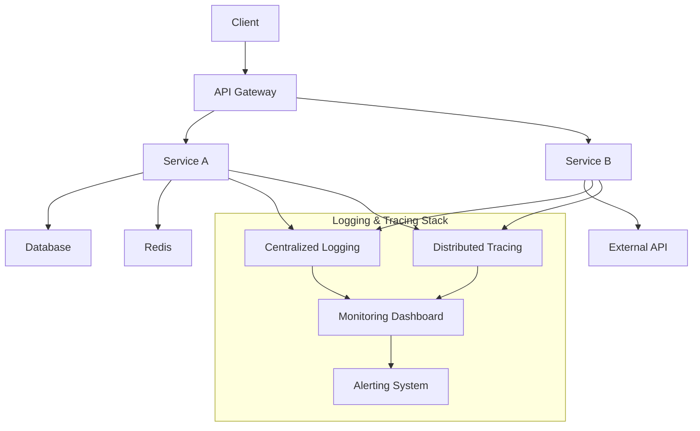

## 1. Architecture Overview 🏗️



### Components:

- **Log Collection**: Aggregate logs from all services
- **Tracing**: Track requests across service boundaries
- **Monitoring**: Real-time visibility into system health
- **Alerting**: Proactive notification of issues

---

## 2. Logging Fundamentals 📝

### 2.1 Logging Levels and Strategy

```java
// Logging Strategy Configuration
@Configuration
public class LoggingConfig {

    @Bean
    public Logger.Level feignLoggerLevel() {
        return Logger.Level.FULL; // BASIC, HEADERS, FULL, NONE
    }

    @Bean
    public FilterRegistrationBean<MDCFilter> mdcFilter() {
        FilterRegistrationBean<MDCFilter> registrationBean = new FilterRegistrationBean<>();
        registrationBean.setFilter(new MDCFilter());
        registrationBean.addUrlPatterns("/*");
        registrationBean.setOrder(1);
        return registrationBean;
    }
}

// Log Level Strategy
public enum LogLevelStrategy {
    DEBUG("Detailed debugging information"),
    INFO("Normal operational messages"),
    WARN("Warning conditions"),
    ERROR("Error conditions"),
    TRACE("Very detailed tracing");

    private final String description;

    LogLevelStrategy(String description) {
        this.description = description;
    }
}
```

### 2.2 Logback Configuration (logback-spring.xml)

```xml
<?xml version="1.0" encoding="UTF-8"?>
<configuration>
    <!-- Include Spring Boot defaults -->
    <include resource="org/springframework/boot/logging/logback/defaults.xml"/>

    <!-- Property files -->
    <property name="LOG_PATH" value="${LOG_PATH:-./logs}"/>
    <property name="LOG_ARCHIVE" value="${LOG_PATH}/archive"/>
    <property name="APP_NAME" value="${spring.application.name:-microservice}"/>

    <!-- JSON Layout for structured logging -->
    <appender name="JSON_CONSOLE" class="ch.qos.logback.core.ConsoleAppender">
        <encoder class="net.logstash.logback.encoder.LoggingEventCompositeJsonEncoder">
            <providers>
                <timestamp>
                    <fieldName>timestamp</fieldName>
                    <pattern>yyyy-MM-dd'T'HH:mm:ss.SSS'Z'</pattern>
                    <timeZone>UTC</timeZone>
                </timestamp>
                <pattern>
                    <pattern>
                        {
                            "level": "%level",
                            "service": "${APP_NAME}",
                            "pid": "${PID:-}",
                            "thread": "%thread",
                            "logger": "%logger{40}"
                        }
                    </pattern>
                </pattern>
                <message/>
                <mdc/>
                <arguments/>
                <stackTrace>
                    <fieldName>stacktrace</fieldName>
                </stackTrace>
                <logstashMarkers/>
                <context/>
            </providers>
        </encoder>
    </appender>

    <!-- File Appender -->
    <appender name="FILE" class="ch.qos.logback.core.rolling.RollingFileAppender">
        <file>${LOG_PATH}/${APP_NAME}.log</file>
        <encoder class="net.logstash.logback.encoder.LoggingEventCompositeJsonEncoder">
            <providers>
                <timestamp>
                    <fieldName>timestamp</fieldName>
                    <pattern>yyyy-MM-dd'T'HH:mm:ss.SSS'Z'</pattern>
                    <timeZone>UTC</timeZone>
                </timestamp>
                <pattern>
                    <pattern>
                        {
                            "level": "%level",
                            "service": "${APP_NAME}",
                            "pid": "${PID:-}",
                            "thread": "%thread",
                            "logger": "%logger{40}"
                        }
                    </pattern>
                </pattern>
                <message/>
                <mdc/>
                <arguments/>
                <stackTrace>
                    <fieldName>stacktrace</fieldName>
                </stackTrace>
            </providers>
        </encoder>
        <rollingPolicy class="ch.qos.logback.core.rolling.TimeBasedRollingPolicy">
            <fileNamePattern>${LOG_ARCHIVE}/${APP_NAME}.%d{yyyy-MM-dd}.%i.log</fileNamePattern>
            <timeBasedFileNamingAndTriggeringPolicy
                class="ch.qos.logback.core.rolling.SizeAndTimeBasedFNATP">
                <maxFileSize>100MB</maxFileSize>
            </timeBasedFileNamingAndTriggeringPolicy>
            <maxHistory>30</maxHistory>
            <totalSizeCap>3GB</totalSizeCap>
        </rollingPolicy>
    </appender>

    <!-- Async Appender for better performance -->
    <appender name="ASYNC_FILE" class="ch.qos.logback.classic.AsyncAppender">
        <appender-ref ref="FILE"/>
        <queueSize>10000</queueSize>
        <discardingThreshold>0</discardingThreshold>
        <includeCallerData>false</includeCallerData>
        <neverBlock>true</neverBlock>
    </appender>

    <!-- Logger Levels -->
    <logger name="com.example" level="DEBUG"/>
    <logger name="org.springframework" level="INFO"/>
    <logger name="org.hibernate" level="WARN"/>

    <!-- Root Logger -->
    <root level="INFO">
        <appender-ref ref="JSON_CONSOLE"/>
        <appender-ref ref="ASYNC_FILE"/>
    </root>
</configuration>
```

---

## 3. Distributed Tracing 🕵️

### 3.1 Spring Cloud Sleuth Configuration

```yaml
# application.yml
spring:
  application:
    name: user-service

  sleuth:
    enabled: true
    web:
      client:
        enabled: true
      server:
        enabled: true

    # Sampling configuration
    sampler:
      probability: 1.0 # 1.0 = 100% sampling in dev, 0.1 = 10% in prod

    # Propagation configuration
    propagation:
      type: B3 # B3, W3C, or hybrid

    # Baggage (custom headers propagation)
    baggage:
      enabled: true
      remote-fields:
        - user-id
        - tenant-id
        - correlation-id
      correlation:
        enabled: true
        fields:
          - user-id
          - tenant-id

    # Trace ID configuration
    trace-id128: true # Use 128-bit trace IDs

logging:
  pattern:
    level: "%5p [${spring.application.name:},%X{traceId:-},%X{spanId:-}]"
```

### 3.2 Custom Trace Configuration

```java
@Configuration
@Slf4j
public class TracingConfig {

    @Bean
    public CurrentTraceContext.ScopeDecorator mdcScopeDecorator() {
        return MDCScopeDecorator.newBuilder()
            .clear()
            .add(SingleCorrelationField.newBuilder(TraceContext.class, "traceId")
                .name("X-B3-TraceId")
                .build())
            .add(SingleCorrelationField.newBuilder(TraceContext.class, "spanId")
                .name("X-B3-SpanId")
                .build())
            .build();
    }

    @Bean
    public Sampler sampler() {
        // Dynamic sampling based on request
        return new Sampler() {
            @Override
            public boolean isSampled(long traceId) {
                // Sample all errors, but only 10% of successful requests
                HttpServletRequest request =
                    ((ServletRequestAttributes) RequestContextHolder
                        .getRequestAttributes()).getRequest();

                String path = request.getRequestURI();
                String method = request.getMethod();

                // Always sample certain endpoints
                if (path.contains("/admin") || path.contains("/debug")) {
                    return true;
                }

                // Sample 100% of errors, 10% of others
                return Math.random() < 0.1;
            }
        };
    }

    @Bean
    public Tracing tracing(Sampler sampler) {
        return Tracing.newBuilder()
            .localServiceName("user-service")
            .sampler(sampler)
            .currentTraceContext(ThreadLocalCurrentTraceContext.newBuilder()
                .addScopeDecorator(mdcScopeDecorator())
                .build())
            .build();
    }
}
```

### 3.3 Zipkin Integration

```yaml
# Zipkin configuration
spring:
  zipkin:
    enabled: true
    base-url: http://localhost:9411
    service:
      name: ${spring.application.name}
    sender:
      type: web # web, kafka, rabbit

management:
  tracing:
    sampling:
      probability: 1.0
    baggage:
      remote-fields: userId,tenantId,correlationId
```

```java
// Custom span tags and baggage
@Component
public class TracingInterceptor implements HandlerInterceptor {

    @Autowired
    private Tracer tracer;

    @Override
    public boolean preHandle(HttpServletRequest request,
                           HttpServletResponse response,
                           Object handler) {

        Span currentSpan = tracer.currentSpan();
        if (currentSpan != null) {
            // Add custom tags
            currentSpan.tag("http.method", request.getMethod());
            currentSpan.tag("http.path", request.getRequestURI());
            currentSpan.tag("user.agent", request.getHeader("User-Agent"));
            currentSpan.tag("client.ip", request.getRemoteAddr());

            // Add baggage
            String userId = request.getHeader("X-User-Id");
            if (userId != null) {
                currentSpan.setBaggageItem("userId", userId);
            }

            String correlationId = request.getHeader("X-Correlation-ID");
            if (correlationId == null) {
                correlationId = UUID.randomUUID().toString();
            }
            currentSpan.setBaggageItem("correlationId", correlationId);

            // Set in MDC for logging
            MDC.put("userId", userId);
            MDC.put("correlationId", correlationId);
        }

        return true;
    }

    @Override
    public void afterCompletion(HttpServletRequest request,
                              HttpServletResponse response,
                              Object handler,
                              Exception ex) {
        Span currentSpan = tracer.currentSpan();
        if (currentSpan != null) {
            currentSpan.tag("http.status_code",
                String.valueOf(response.getStatus()));

            if (ex != null) {
                currentSpan.tag("error", ex.getMessage());
            }
        }

        // Clean up MDC
        MDC.remove("userId");
        MDC.remove("correlationId");
    }
}
```

---

## 4. Centralized Logging 🗃️

### 4.1 ELK Stack Integration (Elasticsearch, Logstash, Kibana)

```yaml
# Logstash configuration (logstash.conf)
input {
  tcp {
    port => 5000
    codec => json_lines
  }

  beats {
    port => 5044
  }
}

filter {
  # Parse JSON logs
  json {
    source => "message"
  }

  # Add metadata
  mutate {
    add_field => {
      "[@metadata][index]" => "microservices-logs-%{+YYYY.MM.dd}"
    }
  }

  # Grok patterns for non-JSON logs
  grok {
    match => { "message" => "%{TIMESTAMP_ISO8601:timestamp} %{LOGLEVEL:level} \[%{DATA:service},%{DATA:traceId},%{DATA:spanId}\] %{GREEDYDATA:log_message}" }
  }

  # Date parsing
  date {
    match => [ "timestamp", "ISO8601" ]
  }

  # User agent parsing
  if [userAgent] {
    useragent {
      source => "userAgent"
      target => "userAgentInfo"
    }
  }
}

output {
  elasticsearch {
    hosts => ["localhost:9200"]
    index => "%{[@metadata][index]}"
    user => "elastic"
    password => "${ELASTIC_PASSWORD}"
  }

  # Fallback to stdout for debugging
  stdout {
    codec => rubydebug
  }
}
```

### 4.2 Logback ELK Appender

```xml
<!-- ELK Appender in logback-spring.xml -->
<appender name="LOGSTASH" class="net.logstash.logback.appender.LogstashTcpSocketAppender">
    <destination>localhost:5000</destination>
    <encoder class="net.logstash.logback.encoder.LoggingEventCompositeJsonEncoder">
        <providers>
            <timestamp>
                <fieldName>@timestamp</fieldName>
                <pattern>yyyy-MM-dd'T'HH:mm:ss.SSS'Z'</pattern>
                <timeZone>UTC</timeZone>
            </timestamp>
            <version/>
            <logLevel/>
            <loggerName/>
            <pattern>
                <pattern>
                    {
                        "service": "${APP_NAME}",
                        "environment": "${ENVIRONMENT:-dev}"
                    }
                </pattern>
            </pattern>
            <threadName/>
            <message/>
            <mdc/>
            <stackTrace>
                <fieldName>stack_trace</fieldName>
            </stackTrace>
            <context/>
            <pattern>
                <omitEmptyFields>true</omitEmptyFields>
                <pattern>
                    {
                        "trace": {
                            "trace_id": "%mdc{traceId}",
                            "span_id": "%mdc{spanId}",
                            "parent_span_id": "%mdc{parentSpanId}"
                        }
                    }
                </pattern>
            </pattern>
        </providers>
    </encoder>
    <keepAliveDuration>5 minutes</keepAliveDuration>
</appender>
```

### 4.3 Docker Compose for ELK Stack

```yaml
# docker-compose.elk.yml
version: "3.8"
services:
  elasticsearch:
    image: docker.elastic.co/elasticsearch/elasticsearch:8.10.0
    container_name: elasticsearch
    environment:
      - discovery.type=single-node
      - xpack.security.enabled=false
      - "ES_JAVA_OPTS=-Xms512m -Xmx512m"
    ports:
      - "9200:9200"
    volumes:
      - elasticsearch-data:/usr/share/elasticsearch/data
    networks:
      - elk

  logstash:
    image: docker.elastic.co/logstash/logstash:8.10.0
    container_name: logstash
    ports:
      - "5000:5000"
      - "5044:5044"
    volumes:
      - ./logstash.conf:/usr/share/logstash/pipeline/logstash.conf
    environment:
      - LS_JAVA_OPTS=-Xms256m -Xmx256m
    depends_on:
      - elasticsearch
    networks:
      - elk

  kibana:
    image: docker.elastic.co/kibana/kibana:8.10.0
    container_name: kibana
    ports:
      - "5601:5601"
    environment:
      - ELASTICSEARCH_HOSTS=http://elasticsearch:9200
    depends_on:
      - elasticsearch
    networks:
      - elk

networks:
  elk:
    driver: bridge

volumes:
  elasticsearch-data:
    driver: local
```

---

## 5. Correlation IDs 🔗

### 5.1 Correlation Filter

```java
@Component
@Slf4j
public class CorrelationFilter implements Filter {

    private static final String CORRELATION_ID_HEADER = "X-Correlation-ID";
    private static final String SESSION_ID_HEADER = "X-Session-ID";
    private static final String REQUEST_ID_HEADER = "X-Request-ID";
    private static final String USER_ID_HEADER = "X-User-ID";
    private static final String TENANT_ID_HEADER = "X-Tenant-ID";

    @Override
    public void doFilter(ServletRequest request,
                        ServletResponse response,
                        FilterChain chain)
            throws IOException, ServletException {

        HttpServletRequest httpRequest = (HttpServletRequest) request;
        HttpServletResponse httpResponse = (HttpServletResponse) response;

        // Get or generate correlation IDs
        String correlationId = getOrGenerateHeader(httpRequest, CORRELATION_ID_HEADER);
        String sessionId = getOrGenerateHeader(httpRequest, SESSION_ID_HEADER);
        String requestId = UUID.randomUUID().toString();
        String userId = httpRequest.getHeader(USER_ID_HEADER);
        String tenantId = httpRequest.getHeader(TENANT_ID_HEADER);

        // Set in MDC for logging
        MDC.put("correlationId", correlationId);
        MDC.put("sessionId", sessionId);
        MDC.put("requestId", requestId);
        MDC.put("userId", userId);
        MDC.put("tenantId", tenantId);

        // Add to response headers
        httpResponse.setHeader(CORRELATION_ID_HEADER, correlationId);
        httpResponse.setHeader(SESSION_ID_HEADER, sessionId);
        httpResponse.setHeader(REQUEST_ID_HEADER, requestId);

        // Log request
        log.info("Request started: {} {} - Correlation: {}, User: {}",
            httpRequest.getMethod(),
            httpRequest.getRequestURI(),
            correlationId,
            userId);

        long startTime = System.currentTimeMillis();

        try {
            chain.doFilter(request, response);
        } finally {
            long duration = System.currentTimeMillis() - startTime;

            // Log response
            log.info("Request completed: {} {} - Status: {} - Duration: {}ms",
                httpRequest.getMethod(),
                httpRequest.getRequestURI(),
                httpResponse.getStatus(),
                duration);

            // Clear MDC
            MDC.clear();
        }
    }

    private String getOrGenerateHeader(HttpServletRequest request, String headerName) {
        String headerValue = request.getHeader(headerName);
        if (headerValue == null || headerValue.trim().isEmpty()) {
            return UUID.randomUUID().toString();
        }
        return headerValue;
    }

    @Override
    public void init(FilterConfig filterConfig) {
        log.info("Correlation filter initialized");
    }

    @Override
    public void destroy() {
        log.info("Correlation filter destroyed");
    }
}
```

### 5.2 Feign Client Correlation Propagation

```java
@Configuration
public class FeignCorrelationConfig {

    @Bean
    public RequestInterceptor correlationIdInterceptor() {
        return requestTemplate -> {
            // Propagate all correlation headers
            Map<String, String> correlationHeaders = Map.of(
                "X-Correlation-ID", MDC.get("correlationId"),
                "X-Session-ID", MDC.get("sessionId"),
                "X-Request-ID", MDC.get("requestId"),
                "X-User-ID", MDC.get("userId"),
                "X-Tenant-ID", MDC.get("tenantId"),
                "X-Trace-ID", MDC.get("traceId"),
                "X-Span-ID", MDC.get("spanId"),
                "X-Parent-Span-ID", MDC.get("parentSpanId")
            );

            correlationHeaders.forEach((key, value) -> {
                if (value != null) {
                    requestTemplate.header(key, value);
                }
            });
        };
    }

    @Bean
    public Logger.Level feignLoggerLevel() {
        return Logger.Level.FULL;
    }

    @Bean
    public FeignLogger feignLogger() {
        return new FeignLogger() {
            private final org.slf4j.Logger logger =
                LoggerFactory.getLogger(FeignLogger.class);

            @Override
            protected void log(String configKey, String format, Object... args) {
                String message = String.format(methodTag(configKey) + format, args);
                logger.info(message);
            }
        };
    }
}
```

---

## 6. Structured Logging 🏗️

### 6.1 Log Event Model

```java
@Data
@Builder
@NoArgsConstructor
@AllArgsConstructor
public class LogEvent {

    @JsonProperty("@timestamp")
    @JsonFormat(shape = JsonFormat.Shape.STRING,
                pattern = "yyyy-MM-dd'T'HH:mm:ss.SSS'Z'",
                timezone = "UTC")
    private Instant timestamp;

    @JsonProperty("level")
    private String level;

    @JsonProperty("service")
    private String serviceName;

    @JsonProperty("environment")
    private String environment;

    @JsonProperty("message")
    private String message;

    @JsonProperty("logger")
    private String loggerName;

    @JsonProperty("thread")
    private String threadName;

    // Correlation fields
    @JsonProperty("correlation_id")
    private String correlationId;

    @JsonProperty("trace_id")
    private String traceId;

    @JsonProperty("span_id")
    private String spanId;

    @JsonProperty("parent_span_id")
    private String parentSpanId;

    @JsonProperty("request_id")
    private String requestId;

    @JsonProperty("session_id")
    private String sessionId;

    @JsonProperty("user_id")
    private String userId;

    @JsonProperty("tenant_id")
    private String tenantId;

    // Request context
    @JsonProperty("http_method")
    private String httpMethod;

    @JsonProperty("http_path")
    private String httpPath;

    @JsonProperty("http_status")
    private Integer httpStatus;

    @JsonProperty("http_query")
    private String httpQuery;

    @JsonProperty("client_ip")
    private String clientIp;

    @JsonProperty("user_agent")
    private String userAgent;

    @JsonProperty("response_time_ms")
    private Long responseTimeMs;

    // Business context
    @JsonProperty("business_id")
    private String businessId;

    @JsonProperty("operation")
    private String operation;

    @JsonProperty("resource_type")
    private String resourceType;

    @JsonProperty("resource_id")
    private String resourceId;

    // Error context
    @JsonProperty("error_code")
    private String errorCode;

    @JsonProperty("error_message")
    private String errorMessage;

    @JsonProperty("stack_trace")
    private String stackTrace;

    // Custom fields
    @JsonProperty("custom_fields")
    private Map<String, Object> customFields;

    // Metrics
    @JsonProperty("metrics")
    private Map<String, Object> metrics;

    public void addCustomField(String key, Object value) {
        if (customFields == null) {
            customFields = new HashMap<>();
        }
        customFields.put(key, value);
    }

    public void addMetric(String key, Object value) {
        if (metrics == null) {
            metrics = new HashMap<>();
        }
        metrics.put(key, value);
    }
}
```

### 6.2 Structured Logger Service

```java
@Service
@Slf4j
public class StructuredLogger {

    @Value("${spring.application.name}")
    private String serviceName;

    @Value("${spring.profiles.active:default}")
    private String environment;

    public void info(String message, LogContext context) {
        LogEvent logEvent = buildLogEvent("INFO", message, context);
        log.info(serializeToJson(logEvent));
    }

    public void error(String message, Throwable throwable, LogContext context) {
        LogEvent logEvent = buildLogEvent("ERROR", message, context);
        logEvent.setErrorMessage(throwable.getMessage());
        logEvent.setStackTrace(getStackTrace(throwable));

        log.error(serializeToJson(logEvent));
    }

    public void warn(String message, LogContext context) {
        LogEvent logEvent = buildLogEvent("WARN", message, context);
        log.warn(serializeToJson(logEvent));
    }

    public void debug(String message, LogContext context) {
        LogEvent logEvent = buildLogEvent("DEBUG", message, context);
        log.debug(serializeToJson(logEvent));
    }

    public void audit(String operation, String resourceType,
                     String resourceId, LogContext context) {
        LogEvent logEvent = buildLogEvent("INFO",
            String.format("Audit: %s on %s %s",
                operation, resourceType, resourceId), context);

        logEvent.setOperation(operation);
        logEvent.setResourceType(resourceType);
        logEvent.setResourceId(resourceId);
        logEvent.addCustomField("audit_event", true);

        log.info(serializeToJson(logEvent));
    }

    private LogEvent buildLogEvent(String level, String message, LogContext context) {
        return LogEvent.builder()
            .timestamp(Instant.now())
            .level(level)
            .serviceName(serviceName)
            .environment(environment)
            .message(message)
            .loggerName(Thread.currentThread().getStackTrace()[3].getClassName())
            .threadName(Thread.currentThread().getName())
            .correlationId(MDC.get("correlationId"))
            .traceId(MDC.get("traceId"))
            .spanId(MDC.get("spanId"))
            .parentSpanId(MDC.get("parentSpanId"))
            .requestId(MDC.get("requestId"))
            .sessionId(MDC.get("sessionId"))
            .userId(MDC.get("userId"))
            .tenantId(MDC.get("tenantId"))
            .httpMethod(context.getHttpMethod())
            .httpPath(context.getHttpPath())
            .httpStatus(context.getHttpStatus())
            .httpQuery(context.getHttpQuery())
            .clientIp(context.getClientIp())
            .userAgent(context.getUserAgent())
            .responseTimeMs(context.getResponseTimeMs())
            .businessId(context.getBusinessId())
            .customFields(context.getCustomFields())
            .metrics(context.getMetrics())
            .build();
    }

    private String serializeToJson(LogEvent logEvent) {
        try {
            ObjectMapper mapper = new ObjectMapper();
            return mapper.writeValueAsString(logEvent);
        } catch (JsonProcessingException e) {
            return String.format("{\"message\": \"%s\", \"error\": \"Failed to serialize log\"}",
                logEvent.getMessage());
        }
    }

    private String getStackTrace(Throwable throwable) {
        StringWriter sw = new StringWriter();
        PrintWriter pw = new PrintWriter(sw);
        throwable.printStackTrace(pw);
        return sw.toString();
    }

    @Data
    @Builder
    @NoArgsConstructor
    @AllArgsConstructor
    public static class LogContext {
        private String httpMethod;
        private String httpPath;
        private Integer httpStatus;
        private String httpQuery;
        private String clientIp;
        private String userAgent;
        private Long responseTimeMs;
        private String businessId;
        private Map<String, Object> customFields;
        private Map<String, Object> metrics;
    }
}
```

### 6.3 Logging Aspect for Method Tracing

```java
@Aspect
@Component
@Slf4j
public class MethodLoggingAspect {

    @Autowired
    private StructuredLogger structuredLogger;

    @Around("@annotation(LogExecution)")
    public Object logExecutionTime(ProceedingJoinPoint joinPoint) throws Throwable {
        MethodSignature signature = (MethodSignature) joinPoint.getSignature();
        String className = signature.getDeclaringType().getSimpleName();
        String methodName = signature.getName();

        long startTime = System.currentTimeMillis();

        StructuredLogger.LogContext context = StructuredLogger.LogContext.builder()
            .customFields(Map.of(
                "class", className,
                "method", methodName,
                "args", Arrays.toString(joinPoint.getArgs())
            ))
            .build();

        structuredLogger.debug(
            String.format("Method %s.%s started", className, methodName),
            context);

        try {
            Object result = joinPoint.proceed();
            long executionTime = System.currentTimeMillis() - startTime;

            context.setResponseTimeMs(executionTime);
            context.setMetrics(Map.of("execution_time_ms", executionTime));

            structuredLogger.debug(
                String.format("Method %s.%s completed in %d ms",
                    className, methodName, executionTime),
                context);

            return result;
        } catch (Exception e) {
            long executionTime = System.currentTimeMillis() - startTime;

            context.setResponseTimeMs(executionTime);

            structuredLogger.error(
                String.format("Method %s.%s failed after %d ms",
                    className, methodName, executionTime),
                e, context);

            throw e;
        }
    }

    @Retention(RetentionPolicy.RUNTIME)
    @Target(ElementType.METHOD)
    public @interface LogExecution {
        String value() default "";
    }
}
```

---

## 7. Performance & Security ⚡

### 7.1 Async Logging Configuration

```java
@Configuration
public class AsyncLoggingConfig {

    @Bean
    public TaskExecutor logTaskExecutor() {
        ThreadPoolTaskExecutor executor = new ThreadPoolTaskExecutor();
        executor.setCorePoolSize(2);
        executor.setMaxPoolSize(5);
        executor.setQueueCapacity(10000);
        executor.setThreadNamePrefix("log-async-");
        executor.setRejectedExecutionHandler(new ThreadPoolExecutor.CallerRunsPolicy());
        executor.initialize();
        return executor;
    }

    @Bean
    @ConditionalOnMissingBean
    public AsyncAppenderFactory asyncAppenderFactory() {
        return new AsyncAppenderFactory() {
            @Override
            public Appender<ILoggingEvent> build(String name,
                                               String className,
                                               Filter<ILoggingEvent> filter,
                                               Map<String, String> propertyMap,
                                               Context context) {

                AsyncAppender asyncAppender = new AsyncAppender();
                asyncAppender.setContext(context);
                asyncAppender.setName(name);
                asyncAppender.setQueueSize(10000);
                asyncAppender.setDiscardingThreshold(0);
                asyncAppender.setIncludeCallerData(false);
                asyncAppender.setNeverBlock(true);

                return asyncAppender;
            }
        };
    }
}
```

### 7.2 Sensitive Data Masking

```java
@Component
public class SensitiveDataMasker implements Converter<ILoggingEvent, ILoggingEvent> {

    private final List<Pattern> patterns = Arrays.asList(
        Pattern.compile("(\"password\"\\s*:\\s*\")[^\"]*(\")", Pattern.CASE_INSENSITIVE),
        Pattern.compile("(\"token\"\\s*:\\s*\")[^\"]*(\")", Pattern.CASE_INSENSITIVE),
        Pattern.compile("(\"api[_-]?key\"\\s*:\\s*\")[^\"]*(\")", Pattern.CASE_INSENSITIVE),
        Pattern.compile("(\"credit[_-]?card\"\\s*:\\s*\")[^\"]*(\")", Pattern.CASE_INSENSITIVE),
        Pattern.compile("(\"ssn\"\\s*:\\s*\")[^\"]*(\")", Pattern.CASE_INSENSITIVE),
        Pattern.compile("(\"email\"\\s*:\\s*\")[^\"]*@[^\"]*(\")", Pattern.CASE_INSENSITIVE),
        Pattern.compile("(Authorization: Bearer\\s+)[^\\s]+"),
        Pattern.compile("(Basic\\s+)[^\\s]+")
    );

    @Override
    public ILoggingEvent convert(ILoggingEvent event) {
        String message = event.getFormattedMessage();
        String maskedMessage = maskSensitiveData(message);

        // Create a new logging event with masked data
        return new LoggingEventWrapper(event) {
            @Override
            public String getFormattedMessage() {
                return maskedMessage;
            }

            @Override
            public String getMessage() {
                return maskedMessage;
            }
        };
    }

    private String maskSensitiveData(String input) {
        if (input == null) {
            return null;
        }

        String masked = input;
        for (Pattern pattern : patterns) {
            masked = pattern.matcher(masked)
                .replaceAll("$1***MASKED***$2");
        }

        // Mask in MDC as well
        Map<String, String> mdc = event.getMDCPropertyMap();
        if (mdc != null) {
            mdc = new HashMap<>(mdc);
            mdc.replaceAll((k, v) -> {
                if (k.toLowerCase().contains("password") ||
                    k.toLowerCase().contains("token")) {
                    return "***MASKED***";
                }
                return v;
            });
        }

        return masked;
    }
}
```

### 7.3 Log Retention and Rotation Policy

```yaml
# application-logging.yml
logging:
  file:
    name: ./logs/${spring.application.name}.log
    max-size: 100MB
    max-history: 30
    total-size-cap: 3GB
    clean-history-on-start: false

  logstash:
    enabled: true
    host: localhost
    port: 5000
    queue-size: 10000
    connect-timeout: 5000

  retention:
    # Time-based retention
    daily:
      enabled: true
      max-days: 30

    # Size-based retention
    size:
      enabled: true
      max-size: 10GB

    # Audit logs - keep longer
    audit:
      max-days: 365

  compression:
    enabled: true
    format: gzip
```

---

## 8. Monitoring & Alerting 📊

### 8.1 Metrics Collection

```java
@Component
@Slf4j
public class LogMetricsCollector {

    private final MeterRegistry meterRegistry;
    private final Map<String, Counter> logLevelCounters = new ConcurrentHashMap<>();

    public LogMetricsCollector(MeterRegistry meterRegistry) {
        this.meterRegistry = meterRegistry;
        initializeMetrics();
    }

    private void initializeMetrics() {
        // Log level counters
        Arrays.asList("ERROR", "WARN", "INFO", "DEBUG", "TRACE")
            .forEach(level -> {
                Counter counter = Counter.builder("app.logs.by.level")
                    .tag("level", level)
                    .tag("service", getServiceName())
                    .description("Number of log messages by level")
                    .register(meterRegistry);
                logLevelCounters.put(level, counter);
            });

        // Log rate gauge
        Gauge.builder("app.logs.rate", this, collector ->
                collector.calculateLogRate())
            .tag("service", getServiceName())
            .description("Log messages per minute")
            .register(meterRegistry);
    }

    public void recordLog(String level, String logger) {
        Counter counter = logLevelCounters.get(level.toUpperCase());
        if (counter != null) {
            counter.increment();
        }

        // Record logger-specific metrics
        Counter.builder("app.logs.by.logger")
            .tag("logger", logger)
            .tag("level", level)
            .register(meterRegistry)
            .increment();
    }

    private double calculateLogRate() {
        // Calculate logs per minute
        Counter totalLogs = Counter.builder("app.logs.total")
            .register(meterRegistry);

        // This would need a more sophisticated implementation
        // with timing windows
        return 0.0;
    }

    private String getServiceName() {
        return System.getProperty("spring.application.name", "unknown");
    }
}
```

### 8.2 Alert Rules (Prometheus)

```yaml
# prometheus-rules.yml
groups:
  - name: logging-alerts
    rules:
      - alert: HighErrorRate
        expr: rate(app_logs_by_level{level="ERROR"}[5m]) > 10
        for: 2m
        labels:
          severity: critical
          team: platform
        annotations:
          summary: "High error rate detected in {{ $labels.service }}"
          description: "{{ $labels.service }} has {{ $value }} errors per second"

      - alert: WarningSpike
        expr: rate(app_logs_by_level{level="WARN"}[5m]) > 50
        for: 1m
        labels:
          severity: warning
          team: platform
        annotations:
          summary: "Warning spike detected in {{ $labels.service }}"
          description: "{{ $labels.service }} has {{ $value }} warnings per second"

      - alert: NoLogs
        expr: absent(app_logs_by_level{level="INFO"}[5m])
        for: 5m
        labels:
          severity: warning
          team: platform
        annotations:
          summary: "No logs from {{ $labels.service }}"
          description: "Service {{ $labels.service }} has not produced any logs for 5 minutes"
```

### 8.3 Kibana Dashboard Configuration

```json
{
  "dashboard": {
    "title": "Microservices Logging Dashboard",
    "panels": [
      {
        "type": "timeseries",
        "title": "Logs by Level",
        "metrics": [
          {
            "id": "errors",
            "type": "count",
            "field": "level.keyword",
            "filter": "level.keyword: ERROR"
          },
          {
            "id": "warnings",
            "type": "count",
            "field": "level.keyword",
            "filter": "level.keyword: WARN"
          }
        ],
        "time_range": "last 1 hour"
      },
      {
        "type": "pie",
        "title": "Log Distribution by Service",
        "metrics": [
          {
            "id": "service_distribution",
            "type": "count",
            "field": "service.keyword"
          }
        ]
      },
      {
        "type": "table",
        "title": "Recent Errors",
        "columns": ["timestamp", "service", "message", "trace_id", "user_id"],
        "sort": {
          "column": "timestamp",
          "order": "desc"
        },
        "page_size": 10,
        "filter": "level.keyword: ERROR"
      }
    ]
  }
}
```

---

## 9. Complete Implementation 🚀

### 9.1 Main Application Configuration

```java
@SpringBootApplication
@EnableFeignClients
@EnableAspectJAutoProxy
@EnableScheduling
public class UserServiceApplication {

    public static void main(String[] args) {
        SpringApplication.run(UserServiceApplication.class, args);
    }

    @Bean
    public FilterRegistrationBean<CorrelationFilter> correlationFilter() {
        FilterRegistrationBean<CorrelationFilter> registrationBean =
            new FilterRegistrationBean<>();
        registrationBean.setFilter(new CorrelationFilter());
        registrationBean.addUrlPatterns("/*");
        registrationBean.setOrder(Ordered.HIGHEST_PRECEDENCE);
        return registrationBean;
    }

    @Bean
    public WebMvcConfigurer corsConfigurer() {
        return new WebMvcConfigurer() {
            @Override
            public void addInterceptors(InterceptorRegistry registry) {
                registry.addInterceptor(new TracingInterceptor());
                registry.addInterceptor(new LoggingInterceptor());
            }
        };
    }
}
```

### 9.2 Application Properties

```yaml
# application.yml
spring:
  application:
    name: user-service

  profiles:
    active: ${ENVIRONMENT:dev}

  sleuth:
    enabled: true
    sampler:
      probability: ${TRACING_SAMPLE_RATE:1.0}
    propagation:
      type: B3,W3C
    baggage:
      enabled: true
      remote-fields: userId,tenantId,correlationId,sessionId

  zipkin:
    enabled: ${ZIPKIN_ENABLED:true}
    base-url: ${ZIPKIN_URL:http://localhost:9411}

  # Logging configuration
  logging:
    config: classpath:logback-spring.xml
    level:
      com.example: ${LOG_LEVEL:DEBUG}
      org.springframework: INFO
      org.hibernate: WARN

    # Logstash configuration
    logstash:
      enabled: ${LOGSTASH_ENABLED:true}
      host: ${LOGSTASH_HOST:localhost}
      port: ${LOGSTASH_PORT:5000}

# Custom logging properties
app:
  logging:
    # Mask sensitive data
    mask-sensitive-data: true

    # Async logging
    async-enabled: true
    async-queue-size: 10000

    # Structured logging
    structured-logging: true

    # Audit logging
    audit:
      enabled: true
      endpoints:
        - POST:/api/users
        - PUT:/api/users/*
        - DELETE:/api/users/*

    # Metrics
    metrics:
      enabled: true
      export-interval: 60s

# Management endpoints
management:
  endpoints:
    web:
      exposure:
        include: health,metrics,prometheus,loggers
      base-path: /management

  endpoint:
    health:
      show-details: always
    loggers:
      enabled: true

  metrics:
    export:
      prometheus:
        enabled: true
    distribution:
      percentiles-histogram:
        http.server.requests: true

  tracing:
    sampling:
      probability: ${TRACING_SAMPLE_RATE:1.0}
```

### 9.3 Docker Configuration

```dockerfile
# Dockerfile
FROM openjdk:17-jdk-slim

# Install required packages
RUN apt-get update && apt-get install -y \
    curl \
    jq \
    && rm -rf /var/lib/apt/lists/*

# Create app directory
WORKDIR /app

# Copy application
COPY target/*.jar app.jar

# Create logging directory
RUN mkdir -p /app/logs

# Environment variables
ENV JAVA_OPTS="-Xms512m -Xmx1024m"
ENV LOG_PATH="/app/logs"
ENV TZ="UTC"

# Health check
HEALTHCHECK --interval=30s --timeout=3s --start-period=40s --retries=3 \
    CMD curl -f http://localhost:8080/management/health || exit 1

# Run the application
ENTRYPOINT ["sh", "-c", "java $JAVA_OPTS -Djava.security.egd=file:/dev/./urandom -jar app.jar"]
```

### 9.4 Kubernetes Deployment

```yaml
# deployment.yaml
apiVersion: apps/v1
kind: Deployment
metadata:
  name: user-service
  labels:
    app: user-service
spec:
  replicas: 3
  selector:
    matchLabels:
      app: user-service
  template:
    metadata:
      labels:
        app: user-service
        version: v1.0.0
    spec:
      containers:
        - name: user-service
          image: user-service:latest
          ports:
            - containerPort: 8080
          env:
            - name: ENVIRONMENT
              value: "production"
            - name: LOG_LEVEL
              value: "INFO"
            - name: TRACING_SAMPLE_RATE
              value: "0.1"
            - name: ZIPKIN_URL
              value: "http://zipkin:9411"
            - name: LOGSTASH_HOST
              value: "logstash"
          resources:
            requests:
              memory: "512Mi"
              cpu: "200m"
            limits:
              memory: "1Gi"
              cpu: "500m"
          volumeMounts:
            - name: logs
              mountPath: /app/logs
          livenessProbe:
            httpGet:
              path: /management/health
              port: 8080
            initialDelaySeconds: 60
            periodSeconds: 10
          readinessProbe:
            httpGet:
              path: /management/health/readiness
              port: 8080
            initialDelaySeconds: 30
            periodSeconds: 5
      volumes:
        - name: logs
          emptyDir: {}
---
# Service
apiVersion: v1
kind: Service
metadata:
  name: user-service
spec:
  selector:
    app: user-service
  ports:
    - port: 8080
      targetPort: 8080
  type: ClusterIP
```

### 9.5 Test Controller

```java
@RestController
@RequestMapping("/api/test")
@Slf4j
public class TestController {

    @Autowired
    private StructuredLogger structuredLogger;

    @GetMapping("/log-test")
    public ResponseEntity<String> testLogging() {
        StructuredLogger.LogContext context = StructuredLogger.LogContext.builder()
            .httpMethod("GET")
            .httpPath("/api/test/log-test")
            .clientIp("127.0.0.1")
            .customFields(Map.of("test", "true"))
            .build();

        structuredLogger.info("Test log message", context);

        return ResponseEntity.ok("Check logs for test message");
    }

    @GetMapping("/error-test")
    public ResponseEntity<String> testErrorLogging() {
        try {
            throw new RuntimeException("Test exception for logging");
        } catch (RuntimeException e) {
            StructuredLogger.LogContext context = StructuredLogger.LogContext.builder()
                .httpMethod("GET")
                .httpPath("/api/test/error-test")
                .build();

            structuredLogger.error("Test error occurred", e, context);

            return ResponseEntity.status(500).body("Error logged");
        }
    }

    @PostMapping("/audit-test")
    @StructuredLogger.LogExecution
    public ResponseEntity<String> testAuditLogging(@RequestBody User user) {
        StructuredLogger.LogContext context = StructuredLogger.LogContext.builder()
            .httpMethod("POST")
            .httpPath("/api/test/audit-test")
            .businessId(user.getId())
            .customFields(Map.of("user", user))
            .build();

        structuredLogger.audit("CREATE", "User", user.getId(), context);

        return ResponseEntity.ok("Audit logged");
    }
}
```

---

## 10. Best Practices ✅

### 10.1 Do's and Don'ts

| Do ✅                      | Don't ❌                           |
| -------------------------- | ---------------------------------- |
| Use structured logging     | Use plain string concatenation     |
| Include correlation IDs    | Log without context                |
| Mask sensitive data        | Log passwords/tokens in clear text |
| Use appropriate log levels | Use ERROR for non-error situations |
| Implement log rotation     | Let logs grow indefinitely         |
| Centralize logs            | Keep logs only locally             |
| Monitor log patterns       | Ignore log spikes                  |
| Test logging configuration | Assume logging works               |

### 10.2 Performance Considerations

1. **Use async logging** for non-critical paths
2. **Batch log shipping** to reduce network calls
3. **Compress logs** before transmission
4. **Use sampling** for high-volume debug logs
5. **Implement circuit breakers** for external log services

### 10.3 Security Considerations

1. **Never log**:

   - Passwords or API keys
   - Credit card numbers
   - Personal identification information
   - Session tokens

2. **Implement**:
   - Data masking
   - Log encryption at rest
   - Access controls for log viewing
   - Audit trails for log access

### 10.4 Monitoring Checklist

- [ ] Log volume per service
- [ ] Error rate trends
- [ ] Response time correlation with logs
- [ ] Unusual log patterns
- [ ] Missing logs from services
- [ ] Log ingestion latency

### 10.5 Quick Start Commands

```bash
# Start ELK stack
docker-compose -f docker-compose.elk.yml up -d

# Build and run service
mvn clean package
java -jar target/user-service.jar

# Check logs
tail -f logs/user-service.log

# Query Elasticsearch
curl -X GET "localhost:9200/_cat/indices?v"

# Access Kibana
# Open http://localhost:5601

# View traces in Zipkin
# Open http://localhost:9411

# Check Prometheus metrics
curl http://localhost:8080/management/metrics | jq .
```

## 🎯 Key Takeaways

1. **Correlation is Critical**: Always propagate correlation IDs across service boundaries
2. **Structure is King**: Structured logs enable powerful querying and analysis
3. **Centralize for Visibility**: Aggregate logs in a central system for full visibility
4. **Trace for Debugging**: Distributed tracing is essential for debugging microservices
5. **Monitor Proactively**: Set up alerts for abnormal log patterns
6. **Secure Sensitive Data**: Always mask or exclude sensitive information from logs
7. **Performance Matters**: Implement async logging and batching for production

This comprehensive guide provides everything needed to implement robust logging and tracing in a microservices architecture, from basic configuration to advanced patterns and best practices.
