_The Concurrency Revolution in Modern Java_

---

## **Prologue: The Great Concurrency Shift**

Imagine a factory from the 1950s. For every machine, there's a dedicated operator standing beside it, even when the machine is waiting for materials. That's traditional thread programming—expensive, heavyweight threads blocked waiting for I/O. Now imagine a modern factory where one skilled operator can oversee dozens of machines, moving to each only when it needs attention. That's virtual threads—millions of lightweight workers, managed efficiently by the JVM.

## **Chapter 1: The Threading Crisis and The Virtual Solution**

### **1.1 The Threading Problem: Why Platform Threads Fail Us**

For decades, Java developers have faced the "thread-per-request" dilemma:

```java
// The old way: thread-per-request model
ServerSocket server = new ServerSocket(8080);
ExecutorService executor = Executors.newFixedThreadPool(200); // Max 200 concurrent

while (true) {
    Socket socket = server.accept();
    executor.submit(() -> handleRequest(socket)); // Problem: what if we get 201 requests?
}

void handleRequest(Socket socket) {
    try {
        // Read request (blocking I/O)
        InputStream input = socket.getInputStream();
        byte[] buffer = new byte[1024];
        int bytesRead = input.read(buffer); // THREAD BLOCKS HERE

        // Process (maybe more blocking I/O)
        String response = database.query(extractQuery(buffer));

        // Write response (more blocking)
        OutputStream output = socket.getOutputStream();
        output.write(response.getBytes());
    } finally {
        socket.close();
    }
}
```

**The Problems:**

1. **Threads are expensive** (~1MB stack each)
2. **OS threads are limited** (~1000-10000 per machine)
3. **Blocking I/O wastes resources** (thread sits idle)
4. **Context switching is costly** (OS kernel involvement)

### **1.2 The Reactive Workaround (and Its Pain)**

```java
// The reactive "solution" - callback hell
public Mono<String> getUserWithOrders(String userId) {
    return userRepository.findById(userId)
        .flatMap(user -> orderRepository.findByUserId(user.id())
            .flatMap(orders -> inventoryRepository.checkStock(orders)
                .map(stock -> createResponse(user, orders, stock))
            )
        );
}

// Every method returns Mono/CompletableFuture
// Every operation must be non-blocking
// Debugging stack traces are meaningless
```

### **1.3 The Virtual Threads Revelation**

Virtual threads are **lightweight threads managed by the JVM**, not the OS. Think of them as "tasks" that can be paused and resumed efficiently.

**The Magic Numbers:**

- **Platform Threads**: 1,000 - 10,000 per machine
- **Virtual Threads**: 1,000,000 - 10,000,000 per machine

## **Chapter 2: Understanding Virtual Threads - The Architecture**

### **2.1 The Carrier-Mounted Model**

Virtual threads use a **mounted/unmounted** model:

```java
// Visualizing the carrier-mount relationship
class ThreadVisualization {
    // Carrier threads (platform threads)
    List<PlatformThread> carriers = List.of(
        new PlatformThread("Carrier-1"),
        new PlatformThread("Carrier-2")
    );

    // Virtual threads (tasks)
    List<VirtuaThread> workers = List.of(
        new VirtualThread("Worker-1: HTTP Request"),
        new VirtualThread("Worker-2: DB Query"),
        new VirtualThread("Worker-3: File Read"),
        new VirtualThread("Worker-4: API Call"),
        // ... thousands more
    );

    // Mounting: Virtual threads "ride" on carriers
    // When virtual thread blocks (I/O), it unmounts
    // When I/O completes, it mounts on any available carrier
}
```

### **2.2 The Pinning Problem**

Virtual threads can only unmount when they block at specific points in the JDK. If they get "pinned" to a carrier, they lose their advantage:

```java
// What causes pinning?
synchronized void pinnedMethod() {
    // Inside synchronized block - VIRTUAL THREAD IS PINNED
    // Can't unmount during this block
    doWork();
}

// ReentrantLock doesn't cause pinning
private final ReentrantLock lock = new ReentrantLock();

void virtualThreadFriendlyMethod() {
    lock.lock();
    try {
        // Can unmount here if blocking I/O occurs
        doWork();
    } finally {
        lock.unlock();
    }
}
```

### **2.3 The Scheduler - The Master Dispatcher**

Virtual threads don't have their own scheduler. They use a **ForkJoinPool**-based scheduler by default:

```java
// Default scheduler (ForkJoinPool)
ExecutorService scheduler = Executors.newVirtualThreadPerTaskExecutor();
// Creates a ForkJoinPool with parallelism = number of processors

// Custom scheduler
ExecutorService customScheduler = Executors.newThreadPerTaskExecutor(
    Thread.ofVirtual()
        .name("vt-", 0)  // vt-0, vt-1, etc.
        .factory()
);
```

## **Chapter 3: Creating and Using Virtual Threads**

### **3.1 The Builder Pattern - Creating Virtual Threads**

```java
// Method 1: Using Thread.Builder
Thread.Builder builder = Thread.ofVirtual();

// Basic virtual thread
Thread virtualThread = builder.start(() -> {
    System.out.println("Hello from virtual thread!");
});

// Named virtual thread
Thread namedVirtualThread = builder
    .name("database-query-1")
    .start(() -> queryDatabase());

// Thread with uncaught exception handler
Thread protectedVirtualThread = builder
    .name("api-call")
    .uncaughtExceptionHandler((t, e) -> {
        System.err.println("Virtual thread " + t.getName() + " failed: " + e);
    })
    .start(() -> callExternalApi());

// Method 2: Factory for executors
ThreadFactory virtualThreadFactory = Thread.ofVirtual().factory();
ExecutorService executor = Executors.newThreadPerTaskExecutor(virtualThreadFactory);
```

### **3.2 The Executors API - Production-Ready Patterns**

```java
// Pattern 1: Virtual thread per task (most common)
try (var executor = Executors.newVirtualThreadPerTaskExecutor()) {
    // Submit 10,000 tasks - no problem!
    List<Future<String>> futures = new ArrayList<>();
    for (int i = 0; i < 10_000; i++) {
        Future<String> future = executor.submit(() -> {
            return processItem(i);  // Each gets its own virtual thread
        });
        futures.add(future);
    }

    // Wait for all (non-blocking for the JVM)
    for (Future<String> future : futures) {
        String result = future.get();
        // Process result
    }
}

// Pattern 2: Customizing the executor
ExecutorService customizedExecutor = Executors.newThreadPerTaskExecutor(
    Thread.ofVirtual()
        .name("worker-", 0)        // worker-0, worker-1, etc.
        .allowSetThreadLocals(false)  // Disable thread locals for performance
        .inheritInheritableThreadLocals(false)
        .factory()
);

// Pattern 3: Scheduled tasks with virtual threads
ScheduledExecutorService scheduledExecutor =
    Executors.newScheduledThreadPool(0, Thread.ofVirtual().factory());

scheduledExecutor.schedule(
    () -> System.out.println("Delayed task"),
    5, TimeUnit.SECONDS
);
```

### **3.3 Structured Concurrency - The Game Changer**

Structured Concurrency treats groups of related tasks as a single unit:

```java
// WITHOUT Structured Concurrency (dangerous!)
public UserProfile fetchUserDataUnsafe(String userId) throws Exception {
    ExecutorService executor = Executors.newVirtualThreadPerTaskExecutor();

    Future<String> userFuture = executor.submit(() -> fetchUser(userId));
    Future<List<Order>> ordersFuture = executor.submit(() -> fetchOrders(userId));
    Future<List<Message>> messagesFuture = executor.submit(() -> fetchMessages(userId));

    // What if one fails? Others keep running...
    // What if method returns early? Threads leak...
    return new UserProfile(
        userFuture.get(),
        ordersFuture.get(),
        messagesFuture.get()
    );
}

// WITH Structured Concurrency (Java 21+)
public UserProfile fetchUserDataSafe(String userId) throws Exception {
    try (var scope = new StructuredTaskScope.ShutdownOnFailure()) {
        // Fork subtasks
        Supplier<String> userSupplier = scope.fork(() -> fetchUser(userId));
        Supplier<List<Order>> ordersSupplier = scope.fork(() -> fetchOrders(userId));
        Supplier<List<Message>> messagesSupplier = scope.fork(() -> fetchMessages(userId));

        // Wait for all or fail fast
        scope.join();           // Wait for all
        scope.throwIfFailed();  // Throw if any failed

        // All succeeded
        return new UserProfile(
            userSupplier.get(),
            ordersSupplier.get(),
            messagesSupplier.get()
        );
    }
    // Auto-closing guarantees all threads are done
}

// StructuredTaskScope variants:
try (var scope = new StructuredTaskScope.ShutdownOnFailure()) {
    // Cancel all if any fails
}

try (var scope = new StructuredTaskScope.ShutdownOnSuccess<String>()) {
    // Return first success, cancel others
    scope.fork(() -> callServiceA());
    scope.fork(() -> callServiceB());
    scope.join();
    return scope.result();  // First successful result
}
```

## **Chapter 4: Virtual Threads in Action - Real-World Patterns**

### **4.1 The Web Server Revolution**

```java
// Traditional (platform threads)
@RestController
public class TraditionalController {
    @GetMapping("/user/{id}")
    public User getUser(@PathVariable String id) {
        // Each request holds a platform thread
        User user = userRepository.findById(id);  // Blocks thread
        List<Order> orders = orderRepository.findByUserId(id);  // Blocks thread
        return enrichUser(user, orders);
    }
}

// Virtual Threads enabled (no code changes!)
public class VirtualThreadServer {
    public static void main(String[] args) {
        // Just use virtual threads!
        ExecutorService virtualThreadExecutor =
            Executors.newVirtualThreadPerTaskExecutor();

        ServerSocket server = new ServerSocket(8080);
        while (true) {
            Socket socket = server.accept();
            virtualThreadExecutor.submit(() -> handleConnection(socket));
        }
    }

    static void handleConnection(Socket socket) {
        // Each connection gets its own virtual thread
        // Blocking I/O is now free!
        try (socket) {
            // Read request
            // Process (blocking DB call)
            // Write response
        }
    }
}

// Spring Boot 3+ with Virtual Threads
// application.properties:
// spring.threads.virtual.enabled=true

@Configuration
public class VirtualThreadConfig {
    @Bean
    public TomcatProtocolHandlerCustomizer<?> protocolHandlerVirtualThreadExecutorCustomizer() {
        return protocolHandler -> {
            protocolHandler.setExecutor(Executors.newVirtualThreadPerTaskExecutor());
        };
    }
}
```

### **4.2 Database Connection Pools Reimagined**

```java
// Old pattern: Small pool to conserve threads
HikariConfig config = new HikariConfig();
config.setMaximumPoolSize(20);  // Only 20 concurrent DB operations
config.setJdbcUrl("jdbc:mysql://localhost/db");

// New pattern: Virtual threads enable simpler model
public class DatabaseService {
    // Each query gets its own virtual thread
    public CompletableFuture<User> findUser(String id) {
        return CompletableFuture.supplyAsync(() -> {
            try (Connection conn = dataSource.getConnection()) {
                // Blocking call, but virtual thread unmounts
                return executeQuery(conn, "SELECT * FROM users WHERE id = ?", id);
            }
        }, virtualThreadExecutor);
    }

    // Batch processing with virtual threads
    public List<Result> processBatch(List<Item> items) {
        try (var scope = new StructuredTaskScope.ShutdownOnFailure()) {
            List<Supplier<Result>> suppliers = items.stream()
                .map(item -> scope.fork(() -> processItem(item)))
                .toList();

            scope.join();
            scope.throwIfFailed();

            return suppliers.stream()
                .map(Supplier::get)
                .toList();
        }
    }
}
```

### **4.3 File Processing at Scale**

```java
public class FileProcessor {
    private final ExecutorService executor =
        Executors.newVirtualThreadPerTaskExecutor();

    // Process thousands of files concurrently
    public void processDirectory(Path directory) throws IOException {
        try (Stream<Path> files = Files.list(directory)) {
            List<Future<Void>> futures = files
                .filter(Files::isRegularFile)
                .map(file -> executor.submit(() -> processFile(file)))
                .toList();

            // Wait for completion
            for (Future<Void> future : futures) {
                future.get();  // Will block current thread, but that's OK
            }
        }
    }

    private Void processFile(Path file) {
        try {
            // Read file (blocking I/O, virtual thread unmounts)
            List<String> lines = Files.readAllLines(file);

            // Process each line
            for (String line : lines) {
                // Simulate CPU work
                String processed = line.toUpperCase();

                // Write to another file (more blocking I/O)
                Files.write(
                    getOutputPath(file),
                    processed.getBytes(),
                    StandardOpenOption.APPEND
                );
            }
        } catch (IOException e) {
            throw new RuntimeException("Failed to process " + file, e);
        }
        return null;
    }
}
```

### **4.4 Microservices Communication**

```java
public class ApiGateway {
    private final ExecutorService executor =
        Executors.newVirtualThreadPerTaskExecutor();
    private final HttpClient httpClient = HttpClient.newHttpClient();

    // Aggregate multiple microservices
    public CompletableFuture<AggregatedResponse> aggregateServices(String userId) {
        return CompletableFuture.supplyAsync(() -> {
            try (var scope = new StructuredTaskScope.ShutdownOnFailure()) {
                // Call multiple services in parallel
                var userTask = scope.fork(() -> callUserService(userId));
                var ordersTask = scope.fork(() -> callOrdersService(userId));
                var paymentsTask = scope.fork(() -> callPaymentsService(userId));

                scope.join();
                scope.throwIfFailed();

                return new AggregatedResponse(
                    userTask.get(),
                    ordersTask.get(),
                    paymentsTask.get()
                );
            }
        }, executor);
    }

    private UserResponse callUserService(String userId) {
        HttpRequest request = HttpRequest.newBuilder()
            .uri(URI.create("http://user-service/users/" + userId))
            .build();

        // Blocking call, but virtual thread unmounts
        HttpResponse<String> response = httpClient.send(
            request,
            HttpResponse.BodyHandlers.ofString()
        );

        return parseUserResponse(response.body());
    }
}
```

## **Chapter 5: Pitfalls and Best Practices**

### **5.1 The Pinning Problem in Depth**

```java
public class PinningExamples {
    // BAD: synchronized causes pinning
    private int counter = 0;

    public synchronized void incrementBad() {
        counter++;
        // If I/O happens here, thread stays pinned
        database.save(counter);  // BLOCKING - but thread can't unmount!
    }

    // GOOD: Use ReentrantLock
    private final ReentrantLock lock = new ReentrantLock();

    public void incrementGood() {
        lock.lock();
        try {
            counter++;
            database.save(counter);  // Can unmount here
        } finally {
            lock.unlock();
        }
    }

    // BAD: Native methods and JNI
    public native void nativeMethod();  // Likely causes pinning

    // BAD: Object.wait() inside synchronized
    public synchronized void waitBad() throws InterruptedException {
        while (!condition) {
            wait();  // Pinned during wait!
        }
    }

    // GOOD: Use Lock + Condition
    private final Lock conditionLock = new ReentrantLock();
    private final Condition condition = conditionLock.newCondition();

    public void waitGood() throws InterruptedException {
        conditionLock.lock();
        try {
            while (!condition) {
                condition.await();  // Can unmount
            }
        } finally {
            conditionLock.unlock();
        }
    }
}
```

### **5.2 ThreadLocal Considerations**

```java
public class ThreadLocalManagement {
    // ThreadLocals work but have costs
    private static final ThreadLocal<User> currentUser = new ThreadLocal<>();

    // Problem: Each virtual thread gets its own copy
    // 1M virtual threads = 1M ThreadLocal instances

    // Solution 1: Use ScopedValue (Java 20+)
    private static final ScopedValue<User> SCOPED_USER = ScopedValue.newInstance();

    public void processWithScopedValue(User user) {
        ScopedValue.where(SCOPED_USER, user)
            .run(() -> {
                // All code here sees the same user
                doWork();
            });
    }

    // Solution 2: Clear ThreadLocals when done
    public void withCleanup(Runnable task) {
        try {
            task.run();
        } finally {
            // Clean up to prevent memory leaks
            currentUser.remove();
        }
    }

    // Solution 3: Use InheritableThreadLocal carefully
    private static final InheritableThreadLocal<String> inherited =
        new InheritableThreadLocal<>();

    public void setupInherited() {
        inherited.set("parent-value");

        Thread virtualThread = Thread.ofVirtual()
            .inheritInheritableThreadLocals(true)  // Explicitly enable
            .start(() -> {
                System.out.println(inherited.get());  // Gets parent value
            });
    }
}
```

### **5.3 Resource Management**

```java
public class ResourceManagement {
    // OLD: Connection pools to conserve threads
    private ConnectionPool pool = new ConnectionPool(20);

    // NEW: Each task can open its own connection
    public void processWithVirtualThreads() {
        ExecutorService executor = Executors.newVirtualThreadPerTaskExecutor();

        for (int i = 0; i < 10_000; i++) {
            executor.submit(() -> {
                // Each gets its own connection
                try (Connection conn = DriverManager.getConnection(url)) {
                    // Use connection
                }  // Auto-closed
            });
        }

        // But wait! 10,000 database connections?
        // Need to manage resources differently
    }

    // Better: Use semaphores to limit resources
    private final Semaphore dbConnections = new Semaphore(100);

    public void processWithLimits() {
        ExecutorService executor = Executors.newVirtualThreadPerTaskExecutor();

        for (int i = 0; i < 10_000; i++) {
            executor.submit(() -> {
                // Acquire permit before getting connection
                dbConnections.acquire();
                try (Connection conn = DriverManager.getConnection(url)) {
                    // Use connection
                } finally {
                    dbConnections.release();
                }
            });
        }
    }
}
```

### **5.4 Debugging and Monitoring**

```java
public class VirtualThreadDebugging {
    // Enable debugging
    static {
        System.setProperty("jdk.traceVirtualThreadLocals", "true");
        System.setProperty("jdk.traceVirtualThreadPinning", "true");
    }

    // Monitoring virtual threads
    public void monitorVirtualThreads() {
        ThreadMXBean threadBean = ManagementFactory.getThreadMXBean();

        // Find virtual threads
        Arrays.stream(threadBean.getAllThreadIds())
            .mapToObj(threadBean::getThreadInfo)
            .filter(info -> info != null && info.isVirtual())
            .forEach(info -> {
                System.out.println("Virtual Thread: " + info.getThreadName());
                System.out.println("  State: " + info.getThreadState());
                System.out.println("  Blocked Time: " + info.getBlockedTime());
            });

        // Thread dump includes virtual threads
        // jcmd <pid> Thread.dump_to_file -format=json virtual_threads.json

        // JFR events for virtual threads
        // jcmd <pid> JFR.start settings=profile
        // jcmd <pid> JFR.dump filename=recording.jfr
    }

    // Stack traces work normally
    public void demonstrateStackTrace() {
        Thread virtualThread = Thread.ofVirtual()
            .start(() -> {
                try {
                    deepMethod();
                } catch (Exception e) {
                    e.printStackTrace();  // Full stack trace works!
                }
            });
    }

    void deepMethod() {
        deeperMethod();
    }

    void deeperMethod() {
        throw new RuntimeException("Error in virtual thread");
    }
}
```

## **Chapter 6: Migration Strategies**

### **6.1 Gradual Migration Approach**

```java
public class MigrationStrategy {
    // Phase 1: Identify blocking calls
    public class BlockingDetector {
        public void auditCodebase() {
            // Look for:
            // - synchronized blocks/methods
            // - Thread.sleep()
            // - Object.wait()
            // - Blocking I/O (Files, Socket, JDBC)
            // - Lock.lock() (convert to tryLock with timeout)
        }
    }

    // Phase 2: Create virtual-thread-friendly wrappers
    public class AsyncWrappers {
        private final ExecutorService virtualExecutor =
            Executors.newVirtualThreadPerTaskExecutor();

        // Wrap blocking calls
        public CompletableFuture<String> asyncReadFile(Path file) {
            return CompletableFuture.supplyAsync(() -> {
                try {
                    return Files.readString(file);  // Blocking, but on virtual thread
                } catch (IOException e) {
                    throw new RuntimeException(e);
                }
            }, virtualExecutor);
        }

        // Convert synchronized methods
        public class SynchronizedToLock {
            private final Lock lock = new ReentrantLock();
            private int value;

            // Before:
            // public synchronized void increment() { value++; }

            // After:
            public void increment() {
                lock.lock();
                try {
                    value++;
                } finally {
                    lock.unlock();
                }
            }
        }
    }

    // Phase 3: Migrate thread pools gradually
    public class ThreadPoolMigration {
        // OLD: Platform thread pools
        private ExecutorService oldPool = Executors.newFixedThreadPool(100);

        // NEW: Virtual thread pools
        private ExecutorService newPool = Executors.newVirtualThreadPerTaskExecutor();

        // Migration: Feature flag
        private boolean useVirtualThreads =
            Boolean.getBoolean("app.useVirtualThreads");

        public ExecutorService getExecutor() {
            return useVirtualThreads ? newPool : oldPool;
        }

        public void submitTask(Runnable task) {
            getExecutor().submit(task);
        }
    }
}
```

### **6.2 Framework Integration**

```java
// Spring Boot integration
@Configuration
@EnableAsync
public class VirtualThreadConfig {

    @Bean
    public AsyncTaskExecutor applicationTaskExecutor() {
        return new TaskExecutorAdapter(
            Executors.newVirtualThreadPerTaskExecutor()
        );
    }

    @Bean
    public TomcatProtocolHandlerCustomizer<?> protocolHandlerVirtualThreadExecutorCustomizer() {
        return protocolHandler -> {
            protocolHandler.setExecutor(Executors.newVirtualThreadPerTaskExecutor());
        };
    }

    // For @Async methods
    @Async
    public CompletableFuture<String> asyncMethod() {
        // Runs on virtual thread
        return CompletableFuture.completedFuture("result");
    }
}

// Quarkus integration
// application.properties:
// quarkus.thread-pool.virtual-threads=true
// quarkus.thread-pool.virtual-threads.max-count=10000

// Micronaut integration
// application.yml:
// micronaut:
//   executors:
//     virtual:
//       enabled: true
//       type: virtual
```

### **6.3 Testing Virtual Thread Code**

```java
public class VirtualThreadTest {

    @Test
    public void testVirtualThreadBasics() {
        // Create virtual thread
        Thread virtualThread = Thread.ofVirtual()
            .name("test-thread")
            .start(() -> {
                assertTrue(Thread.currentThread().isVirtual());
                assertEquals("test-thread", Thread.currentThread().getName());
            });

        virtualThread.join();
    }

    @Test
    public void testConcurrentOperations() throws Exception {
        int numTasks = 1000;
        ExecutorService executor = Executors.newVirtualThreadPerTaskExecutor();

        AtomicInteger completed = new AtomicInteger();
        List<CompletableFuture<Void>> futures = new ArrayList<>();

        for (int i = 0; i < numTasks; i++) {
            CompletableFuture<Void> future = CompletableFuture.runAsync(() -> {
                // Simulate work
                Thread.sleep(10);
                completed.incrementAndGet();
            }, executor);
            futures.add(future);
        }

        // Wait for all
        CompletableFuture.allOf(futures.toArray(new CompletableFuture[0]))
            .get(5, TimeUnit.SECONDS);

        assertEquals(numTasks, completed.get());
    }

    @Test
    public void testPinningDetection() {
        // Test that synchronized causes pinning
        Object lock = new Object();
        long start = System.currentTimeMillis();

        Thread virtualThread = Thread.ofVirtual().start(() -> {
            synchronized (lock) {
                try {
                    // This should cause pinning warning if enabled
                    Thread.sleep(100);
                } catch (InterruptedException e) {
                    Thread.currentThread().interrupt();
                }
            }
        });

        virtualThread.join();
        // Check logs for pinning warnings
    }

    @Test
    public void testStructuredConcurrency() throws Exception {
        try (var scope = new StructuredTaskScope.ShutdownOnFailure()) {
            Supplier<String> task1 = scope.fork(() -> {
                Thread.sleep(100);
                return "Task1";
            });

            Supplier<String> task2 = scope.fork(() -> {
                Thread.sleep(200);
                return "Task2";
            });

            scope.join();
            scope.throwIfFailed();

            assertEquals("Task1", task1.get());
            assertEquals("Task2", task2.get());
        }
    }
}
```

## **Chapter 7: Advanced Patterns and Performance**

### **7.1 Work Stealing with Virtual Threads**

```java
public class WorkStealingPattern {

    private final ExecutorService executor =
        Executors.newVirtualThreadPerTaskExecutor();

    // Pattern: Divide and conquer with virtual threads
    public CompletableFuture<BigInteger> computeFactorial(int n) {
        return CompletableFuture.supplyAsync(() -> {
            if (n <= 1) {
                return BigInteger.ONE;
            }

            // Split work
            int mid = n / 2;

            try (var scope = new StructuredTaskScope.ShutdownOnFailure()) {
                var left = scope.fork(() -> computeFactorial(mid).join());
                var right = scope.fork(() -> computeFactorial(n - mid).join());

                scope.join();
                scope.throwIfFailed();

                // Combine results
                return left.get().multiply(right.get());
            }
        }, executor);
    }

    // Pattern: Pipeline processing
    public CompletableFuture<ProcessedData> pipelineProcessing(InputData input) {
        return CompletableFuture.supplyAsync(() -> input, executor)
            .thenApplyAsync(this::validate, executor)
            .thenApplyAsync(this::transform, executor)
            .thenApplyAsync(this::enrich, executor)
            .thenApplyAsync(this::finalize, executor);
    }
}
```

### **7.2 Rate Limiting and Backpressure**

```java
public class RateLimiting {

    private final ExecutorService executor =
        Executors.newVirtualThreadPerTaskExecutor();
    private final RateLimiter rateLimiter = RateLimiter.create(100.0); // 100 ops/sec

    // Traditional approach
    public CompletableFuture<Result> processWithRateLimit(WorkItem item) {
        return CompletableFuture.supplyAsync(() -> {
            rateLimiter.acquire();  // Blocks virtual thread
            return processItem(item);
        }, executor);
    }

    // Better: Use semaphore with virtual threads
    private final Semaphore concurrencyLimiter = new Semaphore(50);

    public CompletableFuture<Result> processWithConcurrencyLimit(WorkItem item) {
        return CompletableFuture.supplyAsync(() -> {
            concurrencyLimiter.acquire();
            try {
                return processItem(item);
            } finally {
                concurrencyLimiter.release();
            }
        }, executor);
    }

    // Pattern: Bounded work submission
    public class BoundedExecutor {
        private final ExecutorService executor;
        private final Semaphore semaphore;

        public BoundedExecutor(int maxConcurrent) {
            this.executor = Executors.newVirtualThreadPerTaskExecutor();
            this.semaphore = new Semaphore(maxConcurrent);
        }

        public CompletableFuture<Result> submit(WorkItem item) {
            // Don't even create virtual thread if at limit
            if (!semaphore.tryAcquire()) {
                return CompletableFuture.failedFuture(
                    new RuntimeException("System busy")
                );
            }

            return CompletableFuture.supplyAsync(() -> {
                try {
                    return processItem(item);
                } finally {
                    semaphore.release();
                }
            }, executor);
        }
    }
}
```

### **7.3 Memory Optimization**

```java
public class MemoryOptimization {

    // Problem: Each virtual thread has stack
    // Solution: Configure stack size
    public void configureStackSize() {
        ThreadFactory factory = Thread.ofVirtual()
            .name("worker-", 0)
            .stackSize(1024 * 1024)  // 1MB instead of default
            .factory();

        // Or via system property
        // -Djdk.virtualThreadStackSize=1048576
    }

    // Pattern: Object pooling for virtual threads
    public class VirtualThreadPool {
        private final ThreadLocal<ReusableBuffer> bufferPool =
            ThreadLocal.withInitial(() -> new ReusableBuffer(8192));

        public void processData(byte[] data) {
            ReusableBuffer buffer = bufferPool.get();
            buffer.reset();
            // Use buffer
        }
    }

    // Monitoring memory usage
    public void monitorMemory() {
        Runtime runtime = Runtime.getRuntime();

        System.out.println("Max memory: " + runtime.maxMemory() / 1024 / 1024 + "MB");
        System.out.println("Total memory: " + runtime.totalMemory() / 1024 / 1024 + "MB");
        System.out.println("Free memory: " + runtime.freeMemory() / 1024 / 1024 + "MB");

        // Use -Xmx to control heap size
        // Virtual threads use heap, not stack memory
    }
}
```

### **7.4 Performance Comparison**

```java
public class PerformanceBenchmark {

    @Benchmark
    @BenchmarkMode(Mode.Throughput)
    public void platformThreads() throws Exception {
        ExecutorService executor = Executors.newFixedThreadPool(200);

        List<CompletableFuture<Void>> futures = new ArrayList<>();
        for (int i = 0; i < 1000; i++) {
            futures.add(CompletableFuture.runAsync(() -> {
                try {
                    // Simulate I/O
                    Thread.sleep(10);
                } catch (InterruptedException e) {
                    Thread.currentThread().interrupt();
                }
            }, executor));
        }

        CompletableFuture.allOf(futures.toArray(new CompletableFuture[0]))
            .get();
    }

    @Benchmark
    @BenchmarkMode(Mode.Throughput)
    public void virtualThreads() throws Exception {
        ExecutorService executor = Executors.newVirtualThreadPerTaskExecutor();

        List<CompletableFuture<Void>> futures = new ArrayList<>();
        for (int i = 0; i < 10000; i++) {  // 10x more tasks!
            futures.add(CompletableFuture.runAsync(() -> {
                try {
                    // Simulate I/O
                    Thread.sleep(10);
                } catch (InterruptedException e) {
                    Thread.currentThread().interrupt();
                }
            }, executor));
        }

        CompletableFuture.allOf(futures.toArray(new CompletableFuture[0]))
            .get();
    }

    // Expected results:
    // - Virtual threads: Higher throughput for I/O bound tasks
    // - Platform threads: Better for CPU-bound tasks (no context switch overhead)
    // - Memory: Virtual threads use more heap, less stack
    // - Startup: Virtual threads start faster
}
```

## **Chapter 8: The Future of Virtual Threads (Beyond Java 21)**

### **8.1 Project Loom: The Complete Vision**

```java
// Future features (beyond Java 21)
public class FutureFeatures {

    // 1. Thread locals replacement
    // Scoped values (already in Java 20)
    private static final ScopedValue<Session> SESSION = ScopedValue.newInstance();

    public void withSession(Session session, Runnable task) {
        ScopedValue.where(SESSION, session).run(task);
    }

    // 2. Continuations (low-level API)
    // Not for direct use, but enables:
    // - Custom schedulers
    // - Advanced async patterns

    // 3. Fiber API (possible future)
    // Even higher-level abstraction
    // Fiber fiber = Fiber.schedule(() -> task());
    // fiber.await();

    // 4. Integration with Project Panama
    // Safe native memory access with virtual threads

    // 5. Better debugging tools
    // - Enhanced thread dumps
    // - Visual profilers
    // - Deadlock detection
}
```

### **8.2 Industry Adoption Patterns**

```java
public class IndustryPatterns {

    // Pattern 1: Microservices orchestration
    public class ServiceOrchestrator {
        public CompletableFuture<AggregatedResponse> orchestrate(
            List<ServiceCall> calls
        ) {
            try (var scope = new StructuredTaskScope.ShutdownOnSuccess<ServiceResponse>()) {
                calls.forEach(call ->
                    scope.fork(() -> call.execute())
                );

                scope.join();
                return CompletableFuture.completedFuture(
                    new AggregatedResponse(scope.result())
                );
            }
        }
    }

    // Pattern 2: Event streaming with virtual threads
    public class EventProcessor {
        private final ExecutorService processor =
            Executors.newVirtualThreadPerTaskExecutor();

        public void processStream(Stream<Event> events) {
            events.forEach(event ->
                processor.submit(() -> processEvent(event))
            );
        }

        // Each event processed concurrently
        // Backpressure handled by executor queue
    }

    // Pattern 3: Real-time data pipelines
    public class DataPipeline {
        public CompletableFuture<ProcessedData> pipeline(
            Source source,
            List<Transformer> transformers,
            Sink sink
        ) {
            return CompletableFuture.supplyAsync(() -> source.read())
                .thenApply(data -> {
                    // Parallel transformation
                    try (var scope = new StructuredTaskScope.ShutdownOnFailure()) {
                        List<Supplier<Data>> transformed = transformers.stream()
                            .map(t -> scope.fork(() -> t.transform(data)))
                            .toList();

                        scope.join();
                        scope.throwIfFailed();

                        return merge(transformed.stream()
                            .map(Supplier::get)
                            .toList());
                    }
                })
                .thenApplyAsync(sink::write);
        }
    }
}
```

## **Epilogue: The New Concurrency Paradigm**

Virtual threads represent a fundamental shift in how we think about concurrency in Java. They bring us back to the simple "thread-per-task" model but at a scale previously unimaginable.

### **The Virtual Threads Philosophy:**

1. **Simplicity Over Complexity**: Write blocking code naturally, let the runtime handle concurrency.
2. **Scalability By Default**: Design for millions of concurrent operations from the start.
3. **Resource Efficiency**: Use OS threads only when actually running CPU code.
4. **Developer Productivity**: Debug with traditional tools, understand with familiar concepts.

### **When to Use Virtual Threads:**

✅ **Perfect for:**

- Web servers (HTTP, gRPC, WebSocket)
- Database clients
- Microservices communication
- File I/O operations
- Any I/O-bound workload

⚠️ **Use with caution for:**

- CPU-intensive computations
- Tight loops with no blocking
- Real-time systems with strict timing
- Code with many synchronized blocks

❌ **Not suitable for:**

- Low-latency trading systems (stick to platform threads)
- Hard real-time systems (use Real-Time

Here are comprehensive Mermaid diagrams explaining Java Virtual Threads:

## **1. Platform Threads vs Virtual Threads Architecture**


## **2. Virtual Thread Lifecycle & Mounting/Unmounting**


## **3. Thread Pinning Problem**

```mermaid
flowchart TD
    %% CENTER: The Problem
    PinningProblem["🚨 THREAD PINNING PROBLEM"] --> WhatIs

    subgraph WhatIs["❓ What is Thread Pinning?"]
        Definition["Virtual Thread gets 'stuck' to its carrier thread<br/>Cannot unmount when blocking I/O occurs"]
    end

    %% LEFT SIDE: Normal Flow
    NormalFlow["🟢 NORMAL VIRTUAL THREAD FLOW"] --> NormalSteps

    subgraph NormalSteps["Normal Execution Sequence"]
        NS1["Virtual Thread mounted<br/>on Carrier Thread"] --> NS2["Executes user code"]
        NS2 --> NS3{"Encounter blocking I/O?"}
        NS3 -->|Yes| NS4["Unmounts from Carrier<br/>✅ Carrier freed"]
        NS3 -->|No| NS5["Continue execution"]
        NS4 --> NS6["I/O executes in background"]
        NS6 --> NS7["I/O completes"]
        NS7 --> NS8["Remounts on any<br/>available Carrier"]
        NS8 --> NS9["✅ Efficient resource use"]
    end

    %% RIGHT SIDE: Pinned Flow
    PinnedFlow["🔴 PINNED VIRTUAL THREAD FLOW"] --> PinnedSteps

    subgraph PinnedSteps["Pinned Execution Sequence"]
        PS1["Virtual Thread mounted<br/>on Carrier Thread"] --> PS2["Enters synchronized block"]
        PS2 --> PS3["🚨 THREAD PINNED!"] --> PS4{"Encounter blocking I/O?"}
        PS4 -->|Yes| PS5["⚠️ CANNOT UNMOUNT!<br/>Carrier stays blocked"]
        PS4 -->|No| PS6["Exits synchronized"]
        PS5 --> PS7["Carrier wasted<br/>doing nothing"]
        PS7 --> PS8["Other VTs cannot use<br/>this carrier"]
        PS8 --> PS9["📉 Performance degradation"]
        PS6 --> PS10["Continue execution"]
    end

    %% BOTTOM: Causes & Solutions
    Causes["🔍 WHAT CAUSES PINNING?"] --> CauseList

    subgraph CauseList["Common Causes"]
        C1["synchronized methods"]
        C2["synchronized blocks"]
        C3["Object.wait() inside synchronized"]
        C4["Some native method calls"]
        C5["JNI critical sections"]
    end

    Solutions["🛠️ HOW TO FIX PINNING?"] --> SolutionList

    subgraph SolutionList["Solutions"]
        S1["Replace synchronized with ReentrantLock"]
        S2["Use java.util.concurrent.locks"]
        S3["Avoid synchronized in I/O paths"]
        S4["Refactor critical sections"]
    end

    Example["📝 CODE EXAMPLE"] --> Code

    subgraph Code["Before vs After"]
        C_Before["BEFORE (pinning):<br/>synchronized void process() {<br/>  database.query(); // BLOCKS!<br/>}"]
        C_After["AFTER (fix):<br/>private final ReentrantLock lock = new ReentrantLock();<br/><br/>void process() {<br/>  lock.lock();<br/>  try {<br/>    database.query(); // CAN UNMOUNT<br/>  } finally {<br/>    lock.unlock();<br/>  }<br/>}"]

        C_Before --> C_After
    end

    Detection["⚠️ HOW TO DETECT PINNING"] --> DetectMethods

    subgraph DetectMethods["Detection Methods"]
        D1["System property:<br/>-Djdk.traceVirtualThreadPinning"]
        D2["Output in logs:<br/>Thread pinned when entering<br/>monitor in method XYZ"]
        D3["Performance monitoring:<br/>High carrier thread utilization<br/>with low throughput"]
    end

    %% CONNECTIONS
    NormalSteps --> Causes
    PinnedSteps --> Causes
    Causes --> Solutions
    Solutions --> Example
    Solutions --> Detection
```



## **4. Structured Concurrency with Virtual Threads**


## **5. Web Server Comparison: Platform vs Virtual Threads**

```mermaid
flowchart TD
    %% CENTER: COMPARISON SUMMARY
    ComparisonTitle["🆚 WEB SERVER COMPARISON: Platform vs Virtual Threads"]

    %% LEFT: PLATFORM THREADS
    PlatformThreads["🔴 PLATFORM THREADS (Traditional)"]

    subgraph PT_Architecture["Platform Threads Architecture"]
        PT_Client["Client Requests"] --> PT_ThreadPool
        PT_ThreadPool["Fixed Thread Pool<br/>200-1000 Threads"] --> PT_Processing["Process Requests"]
        PT_Processing --> PT_Blocking["Each thread blocks<br/>on I/O operations"]
        PT_Blocking --> PT_Waiting["Thread waits idle<br/>(wasting resources)"]
        PT_Waiting --> PT_ContextSwitch["OS Context Switch<br/>Expensive kernel mode"]
        PT_ContextSwitch --> PT_Limited["Limited scalability"]
    end

    subgraph PT_Problems["🚫 Problems & Limitations"]
        PT_P1["Memory: 1MB per thread<br/>10,000 requests = 10GB!"]
        PT_P2["Max connections: ~1,000<br/>(limited by memory & OS)"]
        PT_P3["Poor CPU utilization<br/>(threads idle on I/O)"]
        PT_P4["Complex async code needed<br/>or request queuing"]
    end

    %% RIGHT: VIRTUAL THREADS
    VirtualThreads["🟢 VIRTUAL THREADS (Modern)"]

    subgraph VT_Architecture["Virtual Threads Architecture"]
        VT_Client["Client Requests"] --> VT_VirtualThreads["Create Virtual Threads<br/>(millions possible)"]
        VT_VirtualThreads --> VT_Carriers["Mount on Carrier Threads<br/>(few platform threads)"]
        VT_Carriers --> VT_Processing["Process Requests"]
        VT_Processing --> VT_Blocking["Blocking I/O occurs"]
        VT_Blocking --> VT_Unmount["Virtual Thread unmounts<br/>Carrier freed for others"]
        VT_Unmount --> VT_IOWait["I/O executes in background"]
        VT_IOWait --> VT_Remount["I/O completes<br/>Remount on any carrier"]
        VT_Remount --> VT_Complete["Request complete"]
    end

    subgraph VT_Benefits["✅ Benefits & Advantages"]
        VT_B1["Memory: ~200KB per VT<br/>10,000 requests = 2GB!"]
        VT_B2["Unlimited connections<br/>Millions possible"]
        VT_B3["Excellent CPU utilization<br/>Carriers always working"]
        VT_B4["Simple blocking code<br/>No async complexity needed"]
    end

    %% CONNECTIONS
    PlatformThreads --> PT_Architecture
    PT_Architecture --> PT_Problems

    VirtualThreads --> VT_Architecture
    VT_Architecture --> VT_Benefits

    %% SIDE-BY-SIDE COMPARISON
    PT_Architecture --> SideBySide
    VT_Architecture --> SideBySide

    subgraph SideBySide["📊 SIDE-BY-SIDE COMPARISON"]
        SS1["10,000 Concurrent HTTP Requests"]
        SS2["Platform Threads"]
        SS3["Virtual Threads"]

        SS1 --> SS2
        SS1 --> SS3

        SS2 --> PT_Results
        SS3 --> VT_Results

        subgraph PT_Results["🔴 Platform Threads Results"]
            PR1["Threads needed: 10,000<br/>(but only ~200 available)"]
            PR2["Memory: 10,000 × 1MB = 10GB"]
            PR3["Concurrent limit: ~200-1000"]
            PR4["Result: 9,800+ requests queued<br/>or rejected"]
        end

        subgraph VT_Results["🟢 Virtual Threads Results"]
            VR1["Virtual Threads: 10,000<br/>(all can run)"]
            VR2["Memory: 10,000 × 200KB = 2GB"]
            VR3["Carrier Threads: 16<br/>(CPU cores × 2)"]
            VR4["Result: All 10,000 requests<br/>processed concurrently"]
        end
    end

    %% PERFORMANCE METRICS
    Performance["⚡ Performance Metrics"]

    subgraph Metrics["Key Performance Indicators"]
        M1["Throughput<br/>(requests/second)"] --> M1_Result["Virtual: 10x higher"]
        M2["Latency<br/>(response time)"] --> M2_Result["Similar or better"]
        M3["Memory Usage<br/>(RAM)"] --> M3_Result["Virtual: 80% less"]
        M4["CPU Utilization<br/>(efficiency)"] --> M4_Result["Virtual: Near 100%"]
        M5["Max Connections<br/>(scalability)"] --> M5_Result["Virtual: 1000x more"]
    end

    %% USE CASE RECOMMENDATIONS
    Recommendations["🎯 When to Use Each?"]

    subgraph UseCases["Use Case Recommendations"]
        UC1["Virtual Threads Recommended For:"] --> UC1_List["• Web servers (HTTP/HTTPS)<br/>• REST APIs<br/>• Microservices<br/>• Database clients<br/>• File processing<br/>• Any I/O-bound application"]

        UC2["Platform Threads Still Useful For:"] --> UC2_List["• CPU-intensive computations<br/>• Low-latency trading systems<br/>• Real-time audio/video<br/>• Legacy applications<br/>• When synchronized is required"]
    end

    %% FINAL DECISION
    Decision["🏁 Bottom Line"]

    Decision --> Conclusion["For most web servers and I/O-bound applications:<br/><br/>✅ Virtual Threads provide:<br/>• Massive scalability<br/>• Memory efficiency<br/>• Simpler code<br/>• Better resource utilization<br/><br/>Migrate to virtual threads for<br/>modern, scalable applications!"]

    %% CONNECT ALL SECTIONS
    PT_Problems --> SideBySide
    VT_Benefits --> SideBySide
    SideBySide --> Performance
    Performance --> Metrics
    Metrics --> Recommendations
    Recommendations --> UseCases
    UseCases --> Decision
```



## **6. Virtual Thread State Transitions**


## **7. Scheduler Work-Stealing Algorithm**

```mermaid
flowchart LR
    subgraph "Worker/Carrier Threads with Local Deques"
        direction LR

        W1[Worker 1<br/>Carrier Thread]
        W2[Worker 2<br/>Carrier Thread]
        W3[Worker 3<br/>Carrier Thread]
        Wdots[...]
        Wn[Worker N<br/>CPU Cores]

        subgraph "Double-ended Queues (Deque)"
            DQ1[Deque 1<br/>Head ← → Tail] --> W1
            DQ2[Deque 2<br/>Head ← → Tail] --> W2
            DQ3[Deque 3<br/>Head ← → Tail] --> W3
            DQdots[...] --> Wdots
            DQn[Deque N<br/>Head ← → Tail] --> Wn
        end
    end

    subgraph "Virtual Thread Operations"
        VT1[Virtual Thread] -->|Owner push/pop| DQ1
        VT2[Virtual Thread] --> DQ1
        VT3[Virtual Thread] --> DQ2
        VT4[Virtual Thread] --> DQ3
        VTdots[...] --> DQdots
        VTn[Virtual Thread] --> DQn
    end

    subgraph "Work Stealing Process"
        W1 -->|Local work| Process1[Process from head]
        W2 -->|Local work| Process2[Process from head]
        W3 -->|Local work| Process3[Process from head]
        Wn -->|Local work| ProcessN[Process from head]

        IdleCheck1{W1 idle?} -->|Yes, steal from tail| DQ2
        IdleCheck1 -->|Yes, steal from tail| DQ3
        IdleCheck1 -->|Yes, steal from tail| DQn

        IdleCheck2{W2 idle?} -->|Yes, steal from tail| DQ1
        IdleCheck2 -->|Yes, steal from tail| DQ3
        IdleCheck2 -->|Yes, steal from tail| DQn

        IdleCheck3{W3 idle?} -->|Yes, steal from tail| DQ1
        IdleCheck3 -->|Yes, steal from tail| DQ2
        IdleCheck3 -->|Yes, steal from tail| DQn

        IdleCheckN{Wn idle?} -->|Yes, steal from tail| DQ1
        IdleCheckN -->|Yes, steal from tail| DQ2
        IdleCheckN -->|Yes, steal from tail| DQ3
    end

    Note["🏗️ Work-Stealing Algorithm:<br/><br/>✅ Owner (worker thread):<br/>• Pushes new tasks to head<br/>• Pops tasks from head (LIFO)<br/><br/>✅ Thief (idle worker):<br/>• Steals tasks from tail of other deques (FIFO)<br/><br/>✅ Benefits:<br/>• Minimizes contention<br/>• Good cache locality<br/>• Automatic load balancing"]

    W1 --> Note
```



## **8. Memory Comparison: Platform vs Virtual Threads**

```mermaid
graph TB
    subgraph "Platform Threads Memory Layout"
        PT[Platform Threads<br/>OS-Managed Kernel Threads]

        subgraph "Thread Stacks (Fixed Size)"
            ST1[Thread 1 Stack<br/>1 MB Committed]
            ST2[Thread 2 Stack<br/>1 MB Committed]
            ST3[Thread 3 Stack<br/>1 MB Committed]
            STdots[...]
            STn[Thread 1000 Stack<br/>1 MB Committed]
        end

        subgraph "Guard Pages (Memory Protection)"
            GP1[Guard Page]
            GP2[Guard Page]
            GP3[Guard Page]
            GPdots[...]
            GPn[Guard Page]
        end

        PT --> ST1
        PT --> GP1
        PT --> ST2
        PT --> GP2
        PT --> ST3
        PT --> GP3
        PT --> STdots
        PT --> GPdots
        PT --> STn
        PT --> GPn

        CALC1["📊 Memory Calculation:<br/>1000 threads × 1 MB = 1000 MB<br/>(committed upfront, cannot be shared)"]
        PT --> CALC1

        LIMIT1["🚫 Limitation:<br/>Cannot scale beyond ~1000-10000 threads<br/>due to memory constraints"]
        STn --> LIMIT1
    end

    subgraph "Virtual Threads Memory Layout"
        VT[Virtual Threads<br/>JVM-Managed User Threads]

        subgraph "Continuations (Heap Allocated)"
            C1[Continuation 1<br/>~200 KB on heap]
            C2[Continuation 2<br/>~200 KB on heap]
            C3[Continuation 3<br/>~200 KB on heap]
            Cdots[...]
            Cm[Continuation 1,000,000<br/>~200 KB on heap]
        end

        subgraph "Shared Carrier Threads"
            Carrier1[Carrier Thread 1<br/>1 MB stack]
            Carrier2[Carrier Thread 2<br/>1 MB stack]
            Carrierdots[...]
            CarrierK[Carrier Thread K<br/>K = CPU cores<br/>1 MB stack each]
        end

        VT --> C1
        VT --> C2
        VT --> C3
        VT --> Cdots
        VT --> Cm

        C1 -.->|Mount/Unmount| Carrier1
        C2 -.->|Mount/Unmount| Carrier2
        C3 -.->|Mount/Unmount| Carrier1
        Cm -.->|Queued| Scheduler[JVM Scheduler]

        Scheduler --> Carrier1
        Scheduler --> Carrier2
        Scheduler --> Carrierdots
        Scheduler --> CarrierK

        CALC2["📊 Memory Calculation:<br/>1,000,000 VTs × 200 KB = 200,000 MB heap<br/>+ 16 Carriers × 1 MB = 16 MB<br/><br/>But: Heap allocated on demand,<br/>GC can reclaim unused memory"]
        VT --> CALC2

        ADV["✅ Advantage:<br/>Scales to millions of threads<br/>Better memory utilization<br/>Garbage collected"]
        Cm --> ADV
    end

    Comparison["⚖️ Comparison for 10,000 concurrent operations:<br/><br/>🔴 Platform Threads: 10,000 × 1 MB = 10,000 MB (10 GB)<br/>🟢 Virtual Threads: 10,000 × 200 KB = 2,000 MB (2 GB)<br/><br/>🔥 80% memory reduction!"]

    CALC1 --> Comparison
    CALC2 --> Comparison
```



## **9. Use Case Decision Flowchart**


## **10. Migration Path from Platform to Virtual Threads**

```mermaid
flowchart TD
    Start[🚀 Start Migration] --> Phase1

    subgraph Phase1[📋 Phase 1: Assessment & Planning]
        direction TB
        P1A[🔍 Audit Codebase]
        P1B[📊 Performance Baseline]
        P1C[📋 Compatibility Check]
        P1D[🎯 Success Criteria]

        P1A --> Tasks1["• Identify synchronized blocks<br/>• Find blocking I/O calls<br/>• Map thread pools"]
        P1B --> Metrics1["• Throughput<br/>• Latency<br/>• Memory usage<br/>• Error rates"]
        P1C --> Requirements1["• JDK 19+<br/>• Library compatibility<br/>• Build tool support"]
        P1D --> Goals1["• No regression<br/>• Handle 10x load<br/>• Reduce memory<br/>• Simplify code"]
    end

    Phase1 --> Phase2

    subgraph Phase2[🔨 Phase 2: Preparation & Refactoring]
        direction TB
        P2A[🔄 Replace synchronized]
        P2B[🧹 Cleanup ThreadLocals]
        P2C[🏗️ Feature Flag]
        P2D[🧪 Add Tests]

        P2A --> Refactor1["• synchronized → ReentrantLock<br/>• Object.wait → Condition.await<br/>• Remove native calls if possible"]
        P2B --> Cleanup1["• ThreadLocal → ScopedValue<br/>• Ensure cleanup in finally<br/>• Avoid inheritable TLs"]
        P2C --> Flag1["• app.virtual.threads.enabled<br/>• Environment-based toggle<br/>• Canary deployment ready"]
        P2D --> Tests1["• Unit tests with VTs<br/>• Pinning detection tests<br/>• Load tests<br/>• Integration tests"]
    end

    Phase2 --> Phase3

    subgraph Phase3[🚦 Phase 3: Gradual Rollout]
        direction TB
        P3A[🎯 Start Non-Critical]
        P3B[👁️ Monitor Closely]
        P3C[📈 Compare Metrics]
        P3D[🔄 Expand Scope]

        P3A --> Services1["• Batch jobs<br/>• Background tasks<br/>• Low-traffic endpoints<br/>• Internal APIs"]
        P3B --> Monitoring1["• Thread pinning alerts<br/>• Memory usage<br/>• GC behavior<br/>• Carrier utilization"]
        P3C --> Analysis1["• Compare with baseline<br/>• Identify regressions<br/>• Measure improvements<br/>• Tune configuration"]
        P3D --> Expand1["• More services<br/>• Higher traffic endpoints<br/>• Production workloads<br/>• All async operations"]
    end

    Phase3 --> Phase4

    subgraph Phase4[⚡ Phase 4: Full Migration & Optimization]
        direction TB
        P4A[🌍 Enable Everywhere]
        P4B[⚙️ Tune Configuration]
        P4C[🧹 Cleanup Legacy]
        P4D[📊 Continuous Monitoring]

        P4A --> Rollout1["• All services<br/>• Production traffic<br/>• Remove feature flag<br/>• Update documentation"]
        P4B --> Config1["• jdk.virtualThreadStackSize<br/>• Carrier thread count<br/>• Scheduler tuning<br/>• Resource limits"]
        P4C --> Cleanup2["• Remove platform thread pools<br/>• Delete old sync code<br/>• Update libraries<br/>• Archive old configs"]
        P4D --> Monitor2["• Production monitoring<br/>• Alerting rules<br/>• Performance dashboards<br/>• Capacity planning"]
    end

    Phase4 --> Success[✅ Migration Complete]

    subgraph RiskManagement[⚠️ Risk Management]
        direction LR
        RM1[Thread Pinning]
        RM2[Memory Leaks]
        RM3[Library Issues]
        RM4[Performance Regressions]

        RM1 --> Mit1["Automated detection<br/>Code reviews<br/>Gradual rollout"]
        RM2 --> Mit2["Heap monitoring<br/>Leak detection<br/>Memory limits"]
        RM3 --> Mit3["Compatibility tests<br/>Fallback options<br/>Vendor updates"]
        RM4 --> Mit4["Feature flags<br/>A/B testing<br/>Rollback plan"]
    end

    Phase1 --> RiskManagement
    Phase2 --> RiskManagement
    Phase3 --> RiskManagement
    Phase4 --> RiskManagement

    subgraph Tools["🛠️ Useful Tools & Flags"]
        T1["-Djdk.traceVirtualThreadPinning"]
        T2["-Djdk.virtualThreadStackSize"]
        T3["jcmd <pid> Thread.dump"]
        T4["JFR events<br/>jdk.VirtualThreadStart<br/>jdk.VirtualThreadEnd"]
        T5["jstack --virtual"]
    end

    Phase2 --> Tools
    Phase3 --> Tools
    Phase4 --> Tools

    Success --> Final["🏁 New Benefits:<br/>• 10-100x more concurrent connections<br/>• 60-80% memory reduction<br/>• Simplified code<br/>• Better developer experience"]
```



These diagrams visualize the key concepts of Java Virtual Threads, helping understand the architecture, behavior, and best practices through visual representation.
