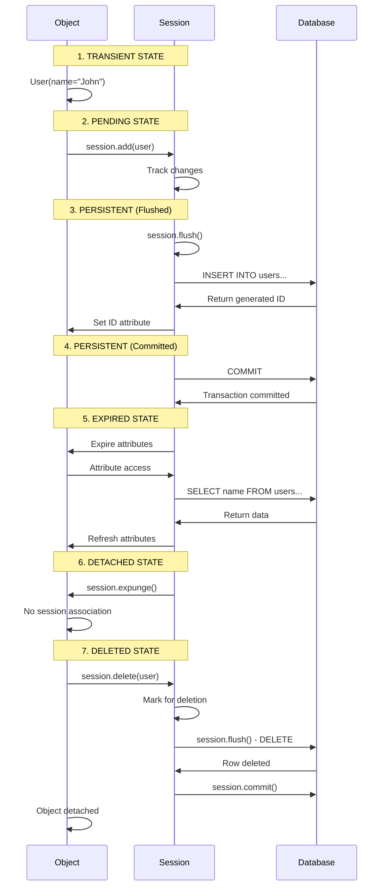

**SQLAlchemy Session Lifecycle Diagram**

Below diagram showing the complete SQLAlchemy session lifecycle with all states and transitions:


## Detailed State Explanations

### 1. **Transient State**

```python
# Object exists but is not associated with any session
user = User(name="John")
# user is in TRANSIENT state
print(session.is_modified(user))  # False
```

### 2. **Pending State**

```python
# Object added to session but not flushed
session.add(user)
# user is in PENDING state
print(user in session)  # True
print(session.is_modified(user, include_pending=True))  # True
```

### 3. **Persistent State (Flushed)**

```python
# SQL generated but not committed
session.flush()
# user is in PERSISTENT state (flushed)
print(user.id)  # Now has database-generated ID
```

### 4. **Persistent State (Committed)**

```python
# Changes persisted to database
session.commit()
# user is in PERSISTENT state (committed)
```

### 5. **Expired State**

```python
# After commit, attributes are expired
session.commit()
# user is in EXPIRED state
print(user.name)  # Triggers lazy load from database
```

### 6. **Detached State**

```python
# Object no longer associated with session
session.expunge(user)
# or session.close()
# user is in DETACHED state
print(user in session)  # False
```

### 7. **Deleted State**

```python
# Object marked for deletion
session.delete(user)
# user is in DELETED state
session.flush()  # DELETE statement generated
session.commit()  # Object removed from database
```

## Complete Lifecycle Example



## Session State Detection Methods

```python
from sqlalchemy.orm import object_state

def check_object_state(session, obj):
    """Check the current state of an object relative to a session"""

    # Check if object is in session
    in_session = obj in session

    # Get object state
    state = object_state(obj)

    states = {
        'transient': state.transient,
        'pending': state.pending,
        'persistent': state.persistent,
        'detached': state.detached,
        'deleted': state.deleted,
        'modified': session.is_modified(obj),
        'expired': state.expired
    }

    return states

# Usage example
db = SessionLocal()
user = User(name="Test")

print("Initial state:", check_object_state(db, user))
# transient: True, others: False

db.add(user)
print("After add:", check_object_state(db, user))
# pending: True

db.flush()
print("After flush:", check_object_state(db, user))
# persistent: True

db.commit()
print("After commit:", check_object_state(db, user))
# persistent: True, expired: True
```

## Common State Transitions Table

| From State | To State   | Trigger             | Description                          |
| ---------- | ---------- | ------------------- | ------------------------------------ |
| Transient  | Pending    | `session.add()`     | Object added to session tracking     |
| Pending    | Persistent | `session.flush()`   | SQL generated, object in database    |
| Persistent | Expired    | `session.commit()`  | Attributes marked for reload         |
| Persistent | Detached   | `session.expunge()` | Object removed from session          |
| Persistent | Deleted    | `session.delete()`  | Object marked for deletion           |
| Expired    | Persistent | Attribute access    | Lazy reload from database            |
| Any        | Detached   | `session.close()`   | Session closed, all objects detached |

## Practical Session Management Patterns

### Pattern 1: Context Manager with State Tracking

```python
from contextlib import contextmanager

@contextmanager
def managed_session(session_factory):
    session = session_factory()
    try:
        print("Session started")
        yield session
        session.commit()
        print("Session committed")
    except Exception as e:
        session.rollback()
        print(f"Session rolled back: {e}")
        raise
    finally:
        session.close()
        print("Session closed")

# Usage
with managed_session(SessionLocal) as session:
    user = User(name="Managed User")
    session.add(user)
    # Automatic commit on success, rollback on exception
```

### Pattern 2: State-aware Operations

```python
def safe_save(session, obj):
    """Safely save an object regardless of its current state"""
    state = object_state(obj)

    if state.detached:
        # Re-attach detached object
        session.add(obj)
        print("Re-attached detached object")
    elif state.transient:
        # Add transient object
        session.add(obj)
        print("Added transient object")
    elif state.persistent:
        # Object already in session
        print("Object already persistent")

    try:
        session.flush()
        print("Changes flushed to database")
    except Exception as e:
        session.rollback()
        print(f"Flush failed: {e}")
        raise

# Usage
db = SessionLocal()
user = User(name="Test")  # Transient
safe_save(db, user)

user2 = db.query(User).first()  # Persistent
db.expunge(user2)  # Now detached
safe_save(db, user2)  # Will re-attach
```
