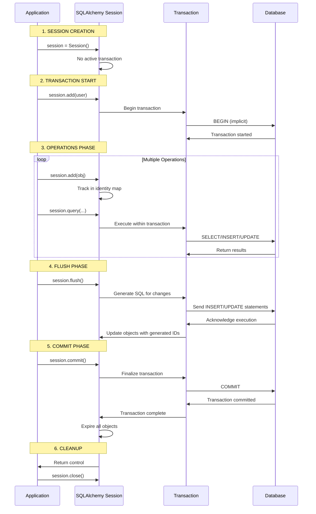
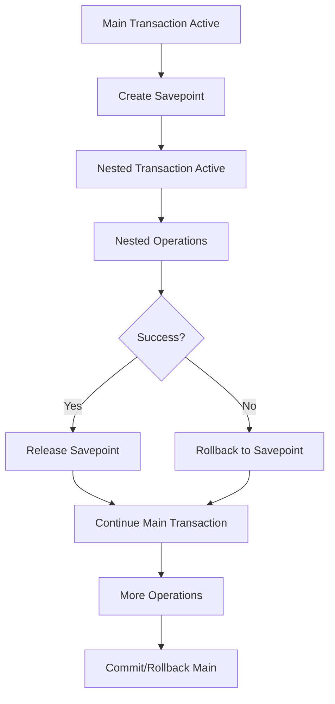
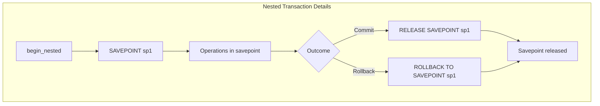

**SQLAlchemy Transaction Lifecycle Diagram**

Here's a comprehensive Mermaid diagram showing the complete SQLAlchemy transaction lifecycle with all states and transitions:


## Detailed Transaction State Explanations

### 1. **No Transaction (Autocommit Mode)**

```python
# Session created but no transaction active
session = SessionLocal()
# Session in NO TRANSACTION state
print(session.in_transaction())  # False
```

### 2. **Transaction Started**

```python
# Transaction begins implicitly or explicitly
session.begin()
# Or implicitly with first operation
user = User(name="John")
session.add(user)  # Transaction starts automatically
# Transaction is now ACTIVE
print(session.in_transaction())  # True
```

### 3. **Active Transaction with Changes**

```python
# Operations are tracked but not flushed
session.add(User(name="Alice"))
session.add(User(name="Bob"))
# Changes are in session's identity map
print(session.dirty)  # Shows modified objects
print(session.new)    # Shows new objects
```

### 4. **Flushed State**

```python
# SQL generated but not committed
session.flush()
# INSERT statements sent to database
# Objects now have database-generated IDs
print(user.id)  # Now has ID
# But transaction still active, not committed
```

### 5. **Commit Process**

```python
# Two-phase commit process
try:
    session.commit()  # Actually does:
    # 1. session.flush() - Generate SQL
    # 2. session.get_transaction().commit() - Database COMMIT
    # 3. session.expire_all() - Expire objects
except Exception as e:
    session.rollback()  # Automatic rollback on error
```

### 6. **Rollback Process**

```python
try:
    session.add(User(name="Test"))
    session.flush()
    raise Exception("Something went wrong")
except:
    session.rollback()  # Rolls back entire transaction
    print(session.in_transaction())  # False - transaction ended
```

## Complete Transaction Lifecycle Example



## Nested Transactions (Savepoints) Diagram





## Transaction State Detection Methods

```python
def check_transaction_state(session):
    """Comprehensive transaction state checking"""

    state = {
        'in_transaction': session.in_transaction(),
        'is_active': session.is_active if hasattr(session, 'is_active') else None,
        'transaction': session.get_transaction(),
        'nested': False,
        'savepoint': None
    }

    if state['transaction']:
        state['nested'] = state['transaction'].nested
        state['savepoint'] = getattr(state['transaction'], '_savepoint', None)

    return state

# Usage examples
def demonstrate_transaction_states():
    session = SessionLocal()

    print("1. Initial state:", check_transaction_state(session))
    # in_transaction: False

    # Start transaction
    session.begin()
    print("2. After begin:", check_transaction_state(session))
    # in_transaction: True, nested: False

    # Nested transaction
    savepoint = session.begin_nested()
    print("3. After begin_nested:", check_transaction_state(session))
    # in_transaction: True, nested: True

    # Commit nested
    savepoint.commit()
    print("4. After nested commit:", check_transaction_state(session))

    # Commit main
    session.commit()
    print("5. After main commit:", check_transaction_state(session))
    # in_transaction: False
```

## Transaction Isolation Levels


## Complete Transaction Management Patterns

### Pattern 1: Context Manager with Full State Tracking

```python
from contextlib import contextmanager
import logging

@contextmanager
def managed_transaction(session, isolation_level=None):
    """Complete transaction management with state tracking"""

    logger = logging.getLogger(__name__)

    def log_state(phase):
        state = check_transaction_state(session)
        logger.info(f"{phase}: in_transaction={state['in_transaction']}, "
                   f"nested={state['nested']}")

    try:
        log_state("Pre-transaction")

        if isolation_level:
            # Set isolation level for this transaction
            session.connection(execution_options={
                'isolation_level': isolation_level
            })

        # Begin transaction
        session.begin()
        log_state("Transaction started")

        yield session

        # Commit if no exceptions
        session.commit()
        log_state("Transaction committed")

    except Exception as e:
        # Rollback on error
        session.rollback()
        log_state("Transaction rolled back")
        logger.error(f"Transaction failed: {e}")
        raise

    finally:
        log_state("Post-transaction")

# Usage
with managed_transaction(session, isolation_level="REPEATABLE_READ") as tx_session:
    user = User(name="Transaction User")
    tx_session.add(user)
    # Automatic commit/rollback
```

### Pattern 2: Nested Transaction with Savepoints

```python
def complex_operation_with_savepoints(session):
    """Demonstrate nested transactions with savepoints"""

    print("Starting main transaction")
    session.begin()

    try:
        # Main operation
        user = User(name="Main User")
        session.add(user)
        session.flush()

        # Nested transaction 1
        print("Starting nested transaction 1")
        savepoint1 = session.begin_nested()

        try:
            profile = UserProfile(user_id=user.id, bio="Nested 1")
            session.add(profile)
            session.flush()
            savepoint1.commit()
            print("Nested transaction 1 committed")

        except Exception as e:
            savepoint1.rollback()
            print("Nested transaction 1 rolled back")
            raise

        # Nested transaction 2
        print("Starting nested transaction 2")
        savepoint2 = session.begin_nested()

        try:
            # This will fail intentionally
            invalid_profile = UserProfile(user_id=999, bio="Invalid")
            session.add(invalid_profile)
            session.flush()  # This will fail due to foreign key
            savepoint2.commit()

        except Exception as e:
            savepoint2.rollback()
            print("Nested transaction 2 rolled back (expected)")
            # Continue with main transaction

        # Main transaction continues
        user.name = "Updated Name"
        session.commit()
        print("Main transaction committed successfully")

    except Exception as e:
        session.rollback()
        print("Main transaction rolled back due to error")
        raise
```

### Pattern 3: Transaction Retry Logic

```python
import time
from sqlalchemy.exc import OperationalError, DBAPIError

def retryable_transaction(session, operation, max_retries=3, delay=1):
    """Execute a transaction with retry logic for transient errors"""

    for attempt in range(max_retries):
        try:
            with managed_transaction(session) as tx_session:
                result = operation(tx_session)
                return result

        except (OperationalError, DBAPIError) as e:
            if attempt == max_retries - 1:
                raise  # Final attempt failed

            if is_transient_error(e):
                print(f"Transient error, retrying in {delay} seconds...")
                time.sleep(delay)
                delay *= 2  # Exponential backoff
                continue
            else:
                raise  # Non-transient error

def is_transient_error(error):
    """Check if error is transient and retryable"""
    transient_codes = ['40001', '40P01', '55P03', '57014']  # SQLSTATE codes
    error_str = str(error).lower()

    # Check for common transient error indicators
    transient_indicators = [
        'deadlock',
        'timeout',
        'connection reset',
        'try again',
        'serialization failure'
    ]

    return any(indicator in error_str for indicator in transient_indicators)

# Usage
def create_user_operation(session):
    user = User(name="Retry User")
    session.add(user)
    return user

result = retryable_transaction(session, create_user_operation)
```

## Transaction State Transition Table

| From State     | To State    | Trigger                      | SQL Generated           | Notes                       |
| -------------- | ----------- | ---------------------------- | ----------------------- | --------------------------- |
| No Transaction | Active      | First operation or `begin()` | `BEGIN`                 | Implicit or explicit start  |
| Active         | Flushed     | `session.flush()`            | DML statements          | SQL sent but not committed  |
| Flushed        | Committed   | `session.commit()`           | `COMMIT`                | Changes persisted           |
| Active         | Rolled Back | `session.rollback()`         | `ROLLBACK`              | Changes discarded           |
| Active         | Nested      | `begin_nested()`             | `SAVEPOINT`             | Create savepoint            |
| Nested         | Committed   | Nested commit                | `RELEASE SAVEPOINT`     | Savepoint released          |
| Nested         | Rolled Back | Nested rollback              | `ROLLBACK TO SAVEPOINT` | Rollback to savepoint       |
| Any            | Closed      | `session.close()`            | (None)                  | Implicit rollback if active |

## Advanced Transaction Scenarios

### Distributed Transactions Pattern

```python
class DistributedTransactionManager:
    """Manage transactions across multiple databases"""

    def __init__(self, sessions):
        self.sessions = sessions  # Multiple session objects
        self.transactions = []

    def __enter__(self):
        # Begin transactions on all sessions
        for session in self.sessions:
            transaction = session.begin()
            self.transactions.append((session, transaction))
        return self

    def __exit__(self, exc_type, exc_val, exc_tb):
        if exc_type is None:
            # Commit all if successful
            for session, transaction in self.transactions:
                session.commit()
        else:
            # Rollback all on error
            for session, transaction in self.transactions:
                session.rollback()

    def commit(self):
        """Two-phase commit across all sessions"""
        try:
            # Phase 1: Prepare
            for session, transaction in self.transactions:
                session.flush()

            # Phase 2: Commit
            for session, transaction in self.transactions:
                session.commit()

        except Exception as e:
            self.rollback()
            raise

    def rollback(self):
        """Rollback all transactions"""
        for session, transaction in self.transactions:
            session.rollback()

# Usage
db1_session = SessionLocal()
db2_session = SessionLocal()

with DistributedTransactionManager([db1_session, db2_session]) as tx_manager:
    # Operations on multiple databases
    db1_session.add(User(name="Multi DB User"))
    db2_session.add(Product(name="Multi DB Product"))
    # All commit or all rollback together
```
