# Complete Request Flow

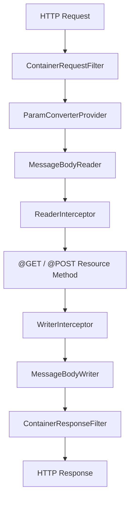

---

# What is a Provider?

A **Provider** is **any class that extends or customizes the REST framework**.

Think of it like installing a plugin in VS Code.

Instead of changing Quarkus itself, you provide additional behavior.

Examples:

| Provider               | Purpose                          |
| ---------------------- | -------------------------------- |
| ExceptionMapper        | Handle exceptions                |
| Request Filter         | Inspect requests                 |
| Response Filter        | Inspect responses                |
| ReaderInterceptor      | Read request body                |
| WriterInterceptor      | Write response body              |
| MessageBodyReader      | JSON → Java                      |
| MessageBodyWriter      | Java → JSON                      |
| ParamConverterProvider | Convert URL parameters           |
| ContextResolver        | Configure Jackson                |
| DynamicFeature         | Register providers conditionally |

Most providers are annotated with

```java
@Provider
```

---

# 1. ContainerRequestFilter

## What is it?

Runs **before the REST endpoint executes**.

Think of it as airport security.

```
Person arrives

↓

Security checks passport

↓

Allowed to board
```

---

## Request Flow

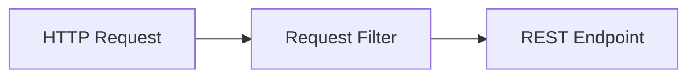

---

## Example

```java
@Provider
public class LoggingFilter
        implements ContainerRequestFilter {

    @Override
    public void filter(ContainerRequestContext ctx) {

        System.out.println(
            ctx.getMethod() +
            " " +
            ctx.getUriInfo().getPath());
    }
}
```

Calling

```
GET /users
```

Console

```
GET users
```

---

## When should I use it?

✅ Authentication

```text
Is user logged in?
```

✅ Authorization

```text
Can user access this API?
```

✅ Logging

```text
Who called this API?
```

✅ Rate limiting

```text
Has this client exceeded requests?
```

✅ Correlation IDs

```text
Generate request ID
```

---

# 2. ContainerResponseFilter

Runs **after the endpoint finishes but before the response is sent.**

---

## Flow

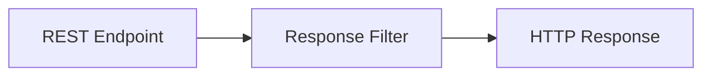

---

## Example

```java
@Provider
public class HeaderFilter
implements ContainerResponseFilter {

    @Override
    public void filter(
        ContainerRequestContext req,
        ContainerResponseContext res) {

        res.getHeaders()
           .add("X-App", "Quarkus");
    }
}
```

Client receives

```
HTTP 200

X-App: Quarkus
```

---

## When should I use it?

✅ Add security headers

```
X-Frame-Options

Strict-Transport-Security
```

✅ Add CORS headers

```
Access-Control-Allow-Origin
```

✅ Add custom headers

```
X-Request-ID
```

✅ Log response status

```
200

404

500
```

---

# 3. ReaderInterceptor

Runs while **reading the request body.**

Imagine someone opens every package before it enters a warehouse.

---

## Flow

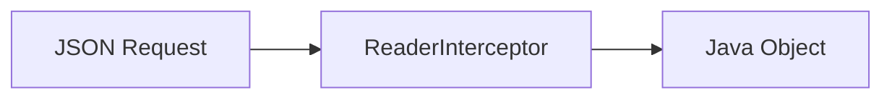

---

## Example

```java
@Provider
public class RequestLogger
implements ReaderInterceptor {

    @Override
    public Object aroundReadFrom(
            ReaderInterceptorContext ctx)
            throws IOException {

        System.out.println("Reading request");

        return ctx.proceed();
    }
}
```

---

## When should I use it?

✅ Decrypt request body

```
Encrypted JSON

↓

Decrypt

↓

Java Object
```

✅ Scan uploads

```
Virus Scan
```

✅ Validate payload

```
Reject invalid data
```

✅ Log request body

---

# 4. WriterInterceptor

Runs while **writing the response body.**

Think of it as wrapping a gift before shipping.

---

## Flow

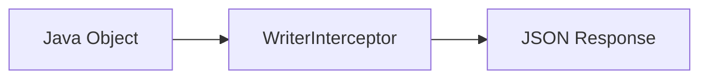

---

## Example

```java
@Provider
public class ResponseLogger
implements WriterInterceptor {

    @Override
    public void aroundWriteTo(
        WriterInterceptorContext ctx)
        throws IOException {

        System.out.println("Sending response");

        ctx.proceed();
    }
}
```

---

## When should I use it?

✅ Encrypt response

```
Java Object

↓

Encrypt

↓

Client
```

✅ Compress response

```
gzip
```

✅ Digital signature

```
Sign response
```

✅ Log response body

---

# 5. MessageBodyReader

Converts incoming data into Java objects.

```
JSON

↓

User class
```

---

## Flow

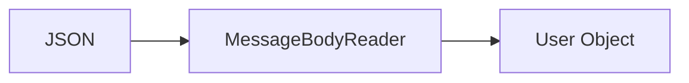

---

## Example

Incoming JSON

```json
{
  "name":"Ali"
}
```

Automatically becomes

```java
User user
```

```java
@POST
public void save(User user) {

}
```

Normally Jackson handles this automatically.

---

## When should I use it?

Almost never.

Create one only when supporting

* CSV
* XML
* Binary
* Protobuf
* Custom formats

---

# 6. MessageBodyWriter

Opposite of MessageBodyReader.

Converts Java into JSON.

---

## Flow

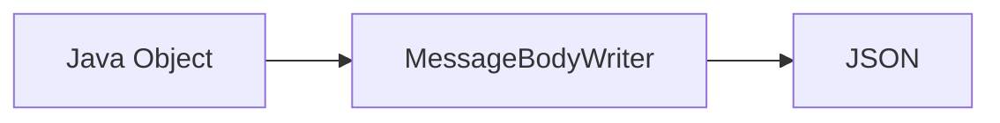

---

## Example

```java
return new User("Ali");
```

Produces

```json
{
 "name":"Ali"
}
```

---

## When should I use it?

Only when returning

* CSV
* XML
* PDF
* Binary
* Custom formats

---

# 7. ExceptionMapper

Handles exceptions globally.

---

## Flow

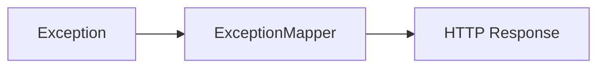

---

## Example

```java
@Provider
public class GlobalExceptionMapper
implements ExceptionMapper<Exception>{

    @Override
    public Response toResponse(Exception ex){

        return Response.status(500)
                .entity("Something went wrong")
                .build();
    }
}
```

---

## When should I use it?

Always.

Instead of

```
500 Internal Server Error
```

Return

```json
{
   "message":"User not found",
   "code":"USR-001"
}
```

This gives every API a consistent error format.

---

# 8. ParamConverterProvider

Converts URL parameters into Java objects.

---

## Flow

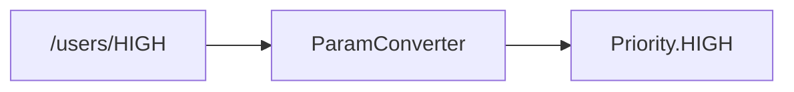

---

## Example

```
/priority/HIGH
```

Automatically becomes

```java
Priority.HIGH
```

---

## When should I use it?

Useful for custom types.

Examples

```
Money

Currency

UUID

OrderId

CustomerId

Email
```

---

# 9. ContextResolver

Provides configuration to another provider.

Usually used with Jackson.

---

## Flow

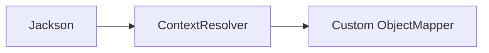

---

## Example

```java
@Provider
public class ObjectMapperResolver
implements ContextResolver<ObjectMapper>{

    @Override
    public ObjectMapper getContext(Class<?> type){

        ObjectMapper mapper=new ObjectMapper();
        mapper.findAndRegisterModules();

        return mapper;
    }
}
```

---

## When should I use it?

Customize JSON serialization.

Examples

```
Pretty JSON

Date formats

Ignore nulls

Custom serializers
```

---

# 10. DynamicFeature

Registers filters only where needed.

---

## Flow

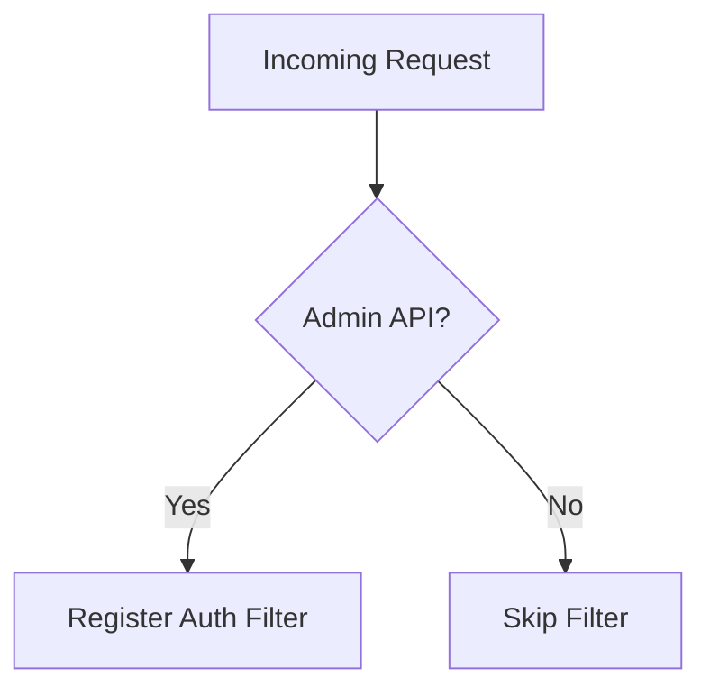

---

## When should I use it?

Instead of applying authentication to every endpoint,

Only apply it to

```
/admin

/private
```

Not

```
/health

/login

/public
```

---

# Filter vs Interceptor

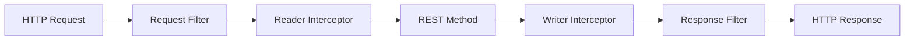

| Component          | Works On       | Main Purpose               | Typical Uses                                          |
| ------------------ | -------------- | -------------------------- | ----------------------------------------------------- |
| Request Filter     | HTTP Request   | Headers & request metadata | Authentication, logging, authorization, rate limiting |
| Reader Interceptor | Request Body   | Request payload            | Decryption, validation, body logging                  |
| Resource Method    | Business Logic | Process the request        | CRUD operations, service calls                        |
| Writer Interceptor | Response Body  | Response payload           | Encryption, compression, signing                      |
| Response Filter    | HTTP Response  | Headers & metadata         | CORS, security headers, response logging              |

---

# Which One Should I Use?

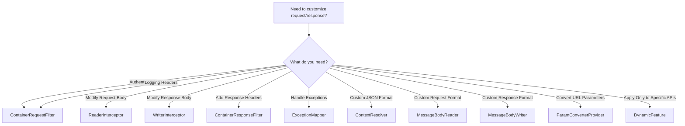

# Real-world usage frequency

| Component                      | How Often?    | Typical Real-world Scenario                                  |
| ------------------------------ | ------------- | ------------------------------------------------------------ |
| ⭐⭐⭐⭐⭐ `ExceptionMapper`        | Every project | Consistent API error responses                               |
| ⭐⭐⭐⭐⭐ `ContainerRequestFilter` | Every project | JWT authentication, authorization, request logging           |
| ⭐⭐⭐⭐ `ContainerResponseFilter` | Very common   | CORS, security headers, request IDs                          |
| ⭐⭐⭐ `ReaderInterceptor`        | Sometimes     | Decrypting or validating request bodies                      |
| ⭐⭐⭐ `WriterInterceptor`        | Sometimes     | Encrypting or compressing responses                          |
| ⭐⭐ `ContextResolver`           | Occasionally  | Global Jackson configuration                                 |
| ⭐⭐ `ParamConverterProvider`    | Occasionally  | Domain-specific URL parameter conversion                     |
| ⭐ `MessageBodyReader`          | Rare          | Supporting CSV, XML, Protobuf, or other custom input formats |
| ⭐ `MessageBodyWriter`          | Rare          | Producing CSV, XML, PDF, or other custom output formats      |
| ⭐ `DynamicFeature`             | Rare          | Conditionally applying filters or interceptors               |

---

# The One Diagram to Remember

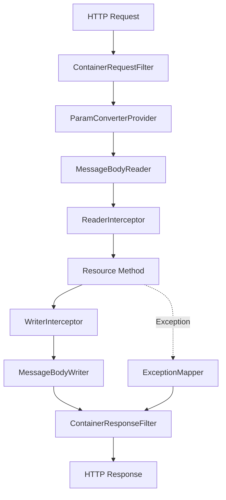

## Beginner learning order

Don't try to learn everything at once. A practical progression is:

1. **`ContainerRequestFilter`** – understand authentication, authorization, and request logging.
2. **`ContainerResponseFilter`** – learn how to add headers and handle CORS.
3. **`ExceptionMapper`** – create consistent error responses for your APIs.
4. **`ReaderInterceptor` and `WriterInterceptor`** – understand request and response body processing.
5. **`MessageBodyReader` and `MessageBodyWriter`** – learn how Quarkus converts between Java objects and HTTP payloads.
6. **`ParamConverterProvider`**, **`ContextResolver`**, and **`DynamicFeature`** – advanced customization you'll encounter less frequently but should recognize when reading production code.

If you're becoming a professional Quarkus developer, these are the provider-related concepts you'll encounter most often in enterprise applications.
