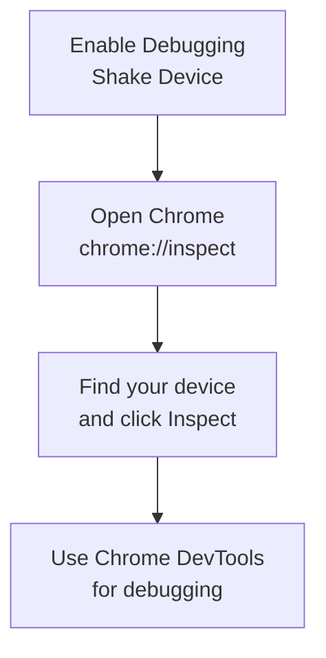
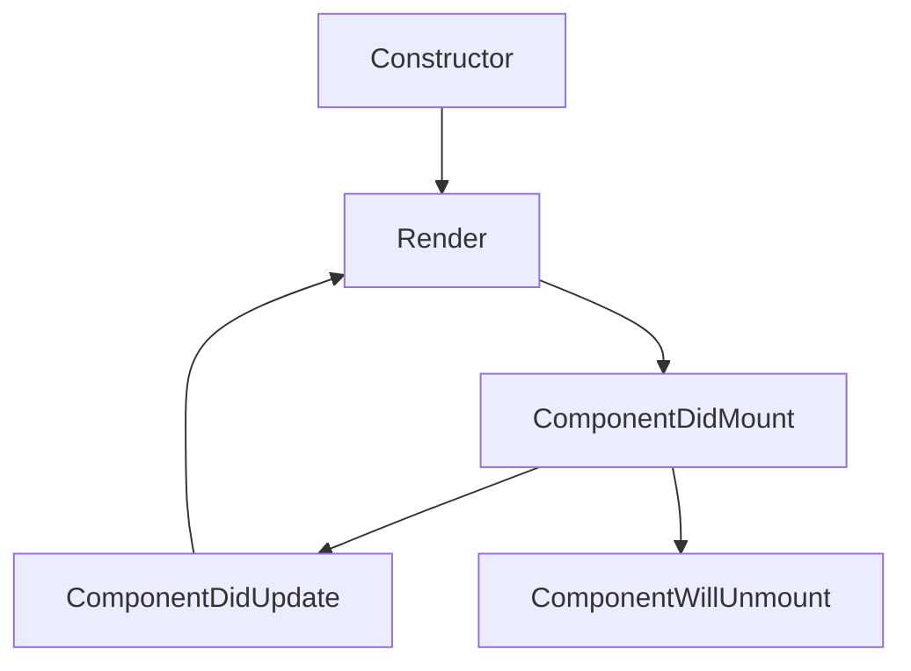
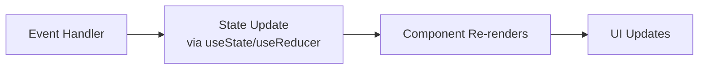

## Components

### Functional Components

- Basic functional component with props.
```jsx
import React from 'react';
import { Text, View } from 'react-native';

const MyComponent = ({ title }) => {
  return (
    <View>
      <Text>{title}</Text>
    </View>
  );
};

export default MyComponent;
```


### Class Components
- Traditional class-based component (less common in modern React Native).
```jsx
import React, { Component } from 'react';
import { Text, View } from 'react-native';

class MyComponent extends Component {
  render() {
    return (
      <View>
        <Text>{this.props.title}</Text>
      </View>
    );
  }
}

export default MyComponent;
```


## State Management

### useState Hook
- Manages local component state.
```jsx
import React, { useState } from 'react';
import { Button, Text, View } from 'react-native';

const Counter = () => {
  const [count, setCount] = useState(0);

  return (
    <View>
      <Text>Count: {count}</Text>
      <Button title="Increment" onPress={() => setCount(count + 1)} />
    </View>
  );
};
```


### useEffect Hook

- Handles side effects like API calls, subscriptions, etc.

```jsx
import React, { useState, useEffect } from 'react';
import { Text, View } from 'react-native';

const DataFetcher = () => {
  const [data, setData] = useState(null);

  useEffect(() => {
    fetch('https://api.example.com/data')
      .then(response => response.json())
      .then(data => setData(data));
  }, []); // Empty dependency array = run once on mount

  return (
    <View>
      <Text>{data ? data.message : 'Loading...'}</Text>
    </View>
  );
};
```

### useContext Hook
- Accesses context values without prop drilling.
```jsx
import React, { useContext, createContext } from 'react';
import { Text, View } from 'react-native';

const UserContext = createContext();

const ParentComponent = () => {
  const user = { name: 'John', age: 30 };

  return (
    <UserContext.Provider value={user}>
      <ChildComponent />
    </UserContext.Provider>
  );
};

const ChildComponent = () => {
  const user = useContext(UserContext);

  return (
    <View>
      <Text>Name: {user.name}</Text>
      <Text>Age: {user.age}</Text>
    </View>
  );
};
```


## Styling

### StyleSheet API

- Creates optimized styles with TypeScript-like validation.

```jsx
import React from 'react';
import { View, Text, StyleSheet } from 'react-native';

const StyledComponent = () => {
  return (
    <View style={styles.container}>
      <Text style={styles.text}>Hello World</Text>
    </View>
  );
};

const styles = StyleSheet.create({
  container: {
    flex: 1,
    justifyContent: 'center',
    alignItems: 'center',
    backgroundColor: '#f5f5f5',
  },
  text: {
    fontSize: 18,
    fontWeight: 'bold',
    color: '#333',
  },
});
```


### Inline Styles
- Quick styling for simple components (less performant for complex UIs).
```jsx
import React from 'react';
import { View, Text } from 'react-native';

const InlineStyledComponent = () => {
  return (
    <View style={{ flex: 1, padding: 20 }}>
      <Text style={{ fontSize: 16, color: 'blue' }}>Inline Styled Text</Text>
    </View>
  );
};
```

### Conditional Styling
- Dynamic styling based on component state.
```jsx
import React, { useState } from 'react';
import { View, Text, TouchableOpacity } from 'react-native';

const ToggleButton = () => {
  const [isActive, setIsActive] = useState(false);

  return (
    <TouchableOpacity 
      onPress={() => setIsActive(!isActive)}
      style={{
        padding: 10,
        backgroundColor: isActive ? 'green' : 'gray',
        borderRadius: 5,
      }}
    >
      <Text style={{ color: 'white' }}>
        {isActive ? 'Active' : 'Inactive'}
      </Text>
    </TouchableOpacity>
  );
};
```


## Navigation

### React Navigation Setup
```bash
npm install @react-navigation/native @react-navigation/stack
npm install react-native-gesture-handler react-native-reanimated react-native-screens
```

### Stack Navigator

- Basic stack navigation setup.

```jsx
import { NavigationContainer } from '@react-navigation/native';
import { createStackNavigator } from '@react-navigation/stack';

const Stack = createStackNavigator();

const App = () => {
  return (
    <NavigationContainer>
      <Stack.Navigator initialRouteName="Home">
        <Stack.Screen 
          name="Home" 
          component={HomeScreen} 
          options={{ title: 'Welcome' }}
        />
        <Stack.Screen 
          name="Details" 
          component={DetailsScreen} 
        />
      </Stack.Navigator>
    </NavigationContainer>
  );
};

const HomeScreen = ({ navigation }) => {
  return (
    <Button
      title="Go to Details"
      onPress={() => navigation.navigate('Details')}
    />
  );
};

const DetailsScreen = ({ navigation }) => {
  return <Text>Details Screen</Text>;
};
```


### Tab Navigator
- Bottom tab navigation implementation.
```jsx
import { createBottomTabNavigator } from '@react-navigation/bottom-tabs';

const Tab = createBottomTabNavigator();

const MyTabs = () => {
  return (
    <Tab.Navigator>
      <Tab.Screen name="Home" component={HomeScreen} />
      <Tab.Screen name="Settings" component={SettingsScreen} />
    </Tab.Navigator>
  );
};
```


## API Calls

### Fetch API
- Basic API call using Fetch with loading and error states.
```jsx
import React, { useState, useEffect } from 'react';
import { View, Text, ActivityIndicator } from 'react-native';

const ApiExample = () => {
  const [data, setData] = useState(null);
  const [loading, setLoading] = useState(true);
  const [error, setError] = useState(null);

  useEffect(() => {
    fetch('https://jsonplaceholder.typicode.com/posts')
      .then(response => {
        if (!response.ok) {
          throw new Error('Network response was not ok');
        }
        return response.json();
      })
      .then(data => {
        setData(data);
        setLoading(false);
      })
      .catch(error => {
        setError(error.message);
        setLoading(false);
      });
  }, []);

  if (loading) return <ActivityIndicator size="large" />;
  if (error) return <Text>Error: {error}</Text>;

  return (
    <View>
      {data && data.map(item => (
        <Text key={item.id}>{item.title}</Text>
      ))}
    </View>
  );
};
```


### Axios
- API calls using Axios library (needs to be installed separately).
```jsx
import React, { useState, useEffect } from 'react';
import { View, Text } from 'react-native';
import axios from 'axios';

const AxiosExample = () => {
  const [data, setData] = useState([]);

  useEffect(() => {
    axios.get('https://jsonplaceholder.typicode.com/posts')
      .then(response => setData(response.data))
      .catch(error => console.error(error));
  }, []);

  return (
    <View>
      {data.map(item => (
        <Text key={item.id}>{item.title}</Text>
      ))}
    </View>
  );
};
```


## Forms

### Basic Form Handling
- Basic form with controlled components.
```jsx
import React, { useState } from 'react';
import { View, TextInput, Button, Text } from 'react-native';

const SimpleForm = () => {
  const [name, setName] = useState('');
  const [email, setEmail] = useState('');

  const handleSubmit = () => {
    console.log('Name:', name);
    console.log('Email:', email);
    // Submit logic here
  };

  return (
    <View>
      <TextInput
        placeholder="Name"
        value={name}
        onChangeText={setName}
        style={{ borderWidth: 1, padding: 10, margin: 10 }}
      />
      <TextInput
        placeholder="Email"
        value={email}
        onChangeText={setEmail}
        keyboardType="email-address"
        style={{ borderWidth: 1, padding: 10, margin: 10 }}
      />
      <Button title="Submit" onPress={handleSubmit} />
    </View>
  );
};
```


### Formik Form Library
- Form handling using Formik library (needs to be installed separately).
```jsx
import React from 'react';
import { View, TextInput, Button } from 'react-native';
import { Formik } from 'formik';

const FormikExample = () => {
  return (
    <Formik
      initialValues={{ name: '', email: '' }}
      onSubmit={values => console.log(values)}
    >
      {({ handleChange, handleBlur, handleSubmit, values }) => (
        <View>
          <TextInput
            placeholder="Name"
            onChangeText={handleChange('name')}
            onBlur={handleBlur('name')}
            value={values.name}
          />
          <TextInput
            placeholder="Email"
            onChangeText={handleChange('email')}
            onBlur={handleBlur('email')}
            value={values.email}
            keyboardType="email-address"
          />
          <Button onPress={handleSubmit} title="Submit" />
        </View>
      )}
    </Formik>
  );
};
```


## Lists

### FlatList
- Efficient scrolling list for large datasets.

```jsx
import React from 'react';
import { FlatList, Text, View } from 'react-native';

const MyList = () => {
  const data = [
    { id: '1', title: 'Item 1' },
    { id: '2', title: 'Item 2' },
    { id: '3', title: 'Item 3' },
  ];

  return (
    <FlatList
      data={data}
      keyExtractor={item => item.id}
      renderItem={({ item }) => (
        <View style={{ padding: 10 }}>
          <Text>{item.title}</Text>
        </View>
      )}
    />
  );
};
```


### SectionList
- List with section headers for categorized data.
```jsx
import React from 'react';
import { SectionList, Text, View } from 'react-native';

const MySectionList = () => {
  const data = [
    {
      title: 'Main dishes',
      data: ['Pizza', 'Burger', 'Risotto'],
    },
    {
      title: 'Sides',
      data: ['French Fries', 'Onion Rings', 'Fried Shrimps'],
    },
  ];

  return (
    <SectionList
      sections={data}
      keyExtractor={(item, index) => item + index}
      renderItem={({ item }) => (
        <View style={{ padding: 10 }}>
          <Text>{item}</Text>
        </View>
      )}
      renderSectionHeader={({ section: { title } }) => (
        <Text style={{ fontWeight: 'bold', backgroundColor: '#f0f0f0', padding: 10 }}>
          {title}
        </Text>
      )}
    />
  );
};
```


## Hooks

### Custom Hook
- Custom hook for reusable logic.

```jsx
import { useState, useEffect } from 'react';

const useApi = (url) => {
  const [data, setData] = useState(null);
  const [loading, setLoading] = useState(true);
  const [error, setError] = useState(null);

  useEffect(() => {
    const fetchData = async () => {
      try {
        const response = await fetch(url);
        const result = await response.json();
        setData(result);
      } catch (err) {
        setError(err.message);
      } finally {
        setLoading(false);
      }
    };

    fetchData();
  }, [url]);

  return { data, loading, error };
};

// Usage in component
const MyComponent = () => {
  const { data, loading, error } = useApi('https://api.example.com/data');
  
  if (loading) return <Text>Loading...</Text>;
  if (error) return <Text>Error: {error}</Text>;
  
  return <Text>{JSON.stringify(data)}</Text>;
};
```


### useReducer Hook
- Alternative to useState for complex state logic.
```jsx
import React, { useReducer } from 'react';
import { View, Text, Button } from 'react-native';

const initialState = { count: 0 };

function reducer(state, action) {
  switch (action.type) {
    case 'increment':
      return { count: state.count + 1 };
    case 'decrement':
      return { count: state.count - 1 };
    default:
      throw new Error();
  }
}

const Counter = () => {
  const [state, dispatch] = useReducer(reducer, initialState);

  return (
    <View>
      <Text>Count: {state.count}</Text>
      <Button title="+" onPress={() => dispatch({ type: 'increment' })} />
      <Button title="-" onPress={() => dispatch({ type: 'decrement' })} />
    </View>
  );
};
```


## Platform Specific Code

### Platform Detection
- Detect and handle platform differences.
```jsx
import { Platform, Text, View } from 'react-native';

const PlatformSpecific = () => {
  return (
    <View>
      <Text>OS: {Platform.OS}</Text>
      <Text>Version: {Platform.Version}</Text>
      
      {Platform.OS === 'ios' && <Text>This is iOS only</Text>}
      {Platform.OS === 'android' && <Text>This is Android only</Text>}
    </View>
  );
};
```

### Platform Specific Files
```
Component.js
Component.ios.js
Component.android.js
```
**Description**: React Native will automatically load the correct file based on platform.

### Platform Specific Styles
- Apply different styles based on platform.
```jsx
import { Platform, StyleSheet } from 'react-native';

const styles = StyleSheet.create({
  container: {
    padding: Platform.OS === 'ios' ? 20 : 10,
    marginTop: Platform.select({
      ios: 20,
      android: 10,
    }),
  },
});
```

## Debugging

### Console Logging
- Various console methods for debugging.
```jsx
// Basic logging
console.log('Value:', myValue);

// Warning
console.warn('This is a warning');

// Error
console.error('This is an error');

// Debug with styling
console.log('%cStyled message', 'color: blue; font-weight: bold;');
```


### React DevTools
- Standalone DevTools for inspecting React component hierarchy.
```bash
# Install React DevTools
npm install -g react-devtools

# Run DevTools
react-devtools
```

### Debugging in Chrome
1. Enable Debugging: Shake device → "Debug"
2. Open Chrome: `chrome://inspect`
3. Click "Inspect" on your device
4. Use Chrome DevTools for debugging



## Component Lifecycle (Class Components)



## State Update Process (Functional Components)


