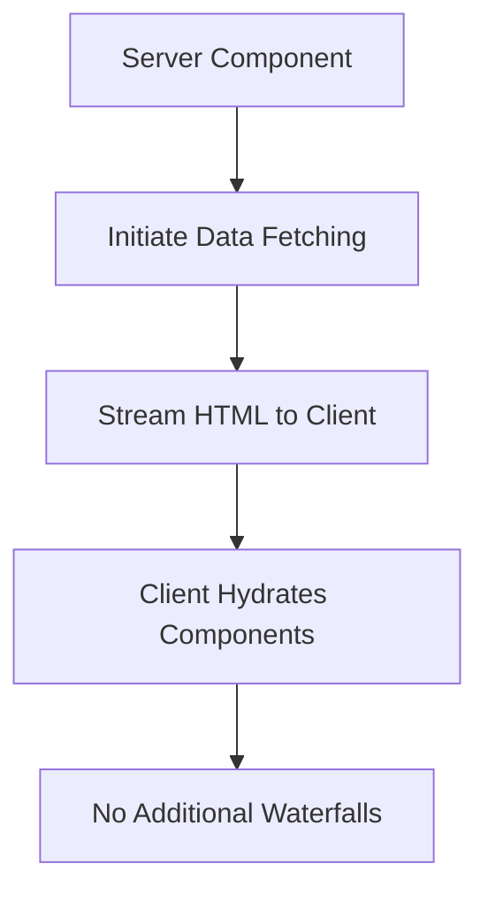

React 19 introduces powerful new features that streamline development, improve performance, and enhance the user experience. The combination of Actions, the useOptimistic hook, improved metadata management, and better resource loading makes React more capable than ever for building modern web applications.

These features work together to reduce boilerplate, minimize client-server waterfalls, and provide better UX during data mutations. As you adopt React 19, you'll find your code becomes more concise and your applications more responsive.

React 19 brings several powerful new features that enhance developer experience and application performance. Let's explore these features in depth with code examples and visual explanations.

## 1. Actions (Server and Client)

Actions allow you to pass functions from server components to client components, enabling seamless data mutations.

```jsx
// Server Component (app/page.js)
import { db } from './database';
import { Form } from './Form';

async function createItem(formData) {
  'use server';
  const name = formData.get('name');
  await db.items.create({ name });
}

export default function Page() {
  return <Form action={createItem} />;
}

// Client Component (Form.js)
'use client';

export function Form({ action }) {
  return (
    <form action={action}>
      <input type="text" name="name" required />
      <button type="submit">Create</button>
    </form>
  );
}
```

## 2. useOptimistic Hook

The `useOptimistic` hook provides immediate UI feedback while async operations complete.

```jsx
'use client';

import { useOptimistic, useState } from 'react';

function MessageList({ messages, sendMessage }) {
  const [optimisticMessages, addOptimisticMessage] = useOptimistic(
    messages,
    (state, newMessage) => [
      ...state,
      {
        text: newMessage,
        sending: true
      }
    ]
  );

  async function formAction(formData) {
    const message = formData.get('message');
    addOptimisticMessage(message);
    await sendMessage(message);
  }

  return (
    <div>
      {optimisticMessages.map((msg, index) => (
        <div key={index} className={msg.sending ? 'sending' : ''}>
          {msg.text}
          {msg.sending && <span> (Sending...)</span>}
        </div>
      ))}
      
      <form action={formAction}>
        <input type="text" name="message" placeholder="Hello!" />
        <button type="submit">Send</button>
      </form>
    </div>
  );
}
```

## 3. use Hook

The `use` hook allows you to read resources (like promises or context) conditionally.

```jsx
import { use } from 'react';

function Note({ notePromise }) {
  // This will suspend until the promise resolves
  const note = use(notePromise);
  
  return (
    <div>
      <h1>{note.title}</h1>
      <section>{note.body}</section>
    </div>
  );
}

// Using with context
function Button() {
  const theme = use(ThemeContext);
  return <button className={theme}>Click me</button>;
}
```

## 4. Document Metadata Management

React 19 allows setting metadata tags from any component.

```jsx
import { Title, Meta, Link } from 'react';

function BlogPost({ post }) {
  return (
    <article>
      <Title>{post.title} - My Blog</Title>
      <Meta name="description" content={post.excerpt} />
      <Meta property="og:image" content={post.image} />
      <Link rel="preload" href="/styles.css" as="style" />
      
      <h1>{post.title}</h1>
      {/* post content */}
    </article>
  );
}
```

## 5. Asset Loading

React 19 improves resource loading with prioritized loading and preloading.

```jsx
import { prefetchDNS, preconnect, preload, preinit } from 'react';

// Prefetch DNS for external domain
prefetchDNS("https://external-service.com");

// Preconnect to external origin
preconnect("https://fonts.googleapis.com", "crossorigin");

// Preload critical resources
preload("/critical-font.woff2", { as: "font", type: "font/woff2", crossOrigin: "anonymous" });

// Preinit stylesheet
preinit("https://fonts.googleapis.com/css2?family=Inter", { as: "style" });

function HomePage() {
  return (
    <div>
      <h1>Welcome to my site</h1>
    </div>
  );
}
```

## 6. Ref as a Prop

React 19 allows you to pass ref as a regular prop, simplifying component APIs.

```jsx
function MyInput({ ref, placeholder }) {
  return <input ref={ref} placeholder={placeholder} />;
}

function Form() {
  const inputRef = useRef(null);
  
  useEffect(() => {
    inputRef.current?.focus();
  }, []);
  
  return (
    <form>
      <MyInput ref={inputRef} placeholder="Enter text..." />
    </form>
  );
}
```

## 7. Enhanced Error Handling

Improved error handling with support for error boundaries in Server Components.

```jsx
// ErrorBoundary.js (Client Component)
'use client';

import { Component } from 'react';

class ErrorBoundary extends Component {
  state = { hasError: false, error: null };
  
  static getDerivedStateFromError(error) {
    return { hasError: true, error };
  }
  
  render() {
    if (this.state.hasError) {
      return this.props.fallback(this.state.error);
    }
    return this.props.children;
  }
}

// Using with Server Components
async function UserProfile({ userId }) {
  const user = await fetchUser(userId);
  return (
    <div>
      <h1>{user.name}</h1>
      {/* user profile content */}
    </div>
  );
}

export default function ProfilePage({ params }) {
  return (
    <ErrorBoundary fallback={(error) => <p>Error loading profile: {error.message}</p>}>
      <UserProfile userId={params.id} />
    </ErrorBoundary>
  );
}
```

## 8. Context Provider Improvements

Simplified context usage with improved performance characteristics.

```jsx
import { createContext, useContext } from 'react';

const ThemeContext = createContext('light');

function App() {
  return (
    <ThemeContext value="dark">
      <Header />
      <Content />
    </ThemeContext>
  );
}

function Header() {
  // No need for Consumer - useContext is now more efficient
  const theme = useContext(ThemeContext);
  
  return (
    <header className={theme}>
      <h1>My App</h1>
    </header>
  );
}
```

## 9. Waterfall Rendering Prevention

React 19 reduces client-server waterfalls with improved data fetching coordination.



## 10. Style Sheets Support

Native support for CSS-in-JS libraries with improved performance.

```jsx
import { style } from 'react';

const buttonStyles = style({
  backgroundColor: 'blue',
  color: 'white',
  padding: '10px 20px',
  borderRadius: '4px'
});

function Button({ children }) {
  return <button className={buttonStyles}>{children}</button>;
}
```

## Putting It All Together: Complete Example

```jsx
// app/page.js (Server Component)
import { db } from './database';
import { MessageList, sendMessage } from './MessageList';
import { Title, Meta } from 'react';

async function getMessages() {
  'use server';
  return await db.messages.findMany();
}

async function handleSendMessage(message) {
  'use server';
  await db.messages.create({ text: message });
}

export default function HomePage() {
  const messagesPromise = getMessages();
  
  return (
    <div>
      <Title>React 19 Chat App</Title>
      <Meta name="description" content="A chat app built with React 19" />
      
      <h1>Welcome to the Chat</h1>
      <MessageList 
        messagesPromise={messagesPromise} 
        sendMessage={handleSendMessage} 
      />
    </div>
  );
}

// MessageList.js (Client Component)
'use client';

import { use, useOptimistic, useState } from 'react';

export function MessageList({ messagesPromise, sendMessage }) {
  const initialMessages = use(messagesPromise);
  const [optimisticMessages, addOptimisticMessage] = useOptimistic(
    initialMessages,
    (state, newMessage) => [
      ...state,
      { text: newMessage, sending: true }
    ]
  );

  async function handleSubmit(formData) {
    const message = formData.get('message');
    addOptimisticMessage(message);
    await sendMessage(message);
  }

  return (
    <div className="chat-container">
      <div className="messages">
        {optimisticMessages.map((msg, index) => (
          <div key={index} className={`message ${msg.sending ? 'sending' : ''}`}>
            {msg.text}
            {msg.sending && <span className="status">Sending...</span>}
          </div>
        ))}
      </div>
      
      <form action={handleSubmit} className="message-form">
        <input 
          type="text" 
          name="message" 
          placeholder="Type a message..." 
          required 
        />
        <button type="submit">Send</button>
      </form>
    </div>
  );
}
```


