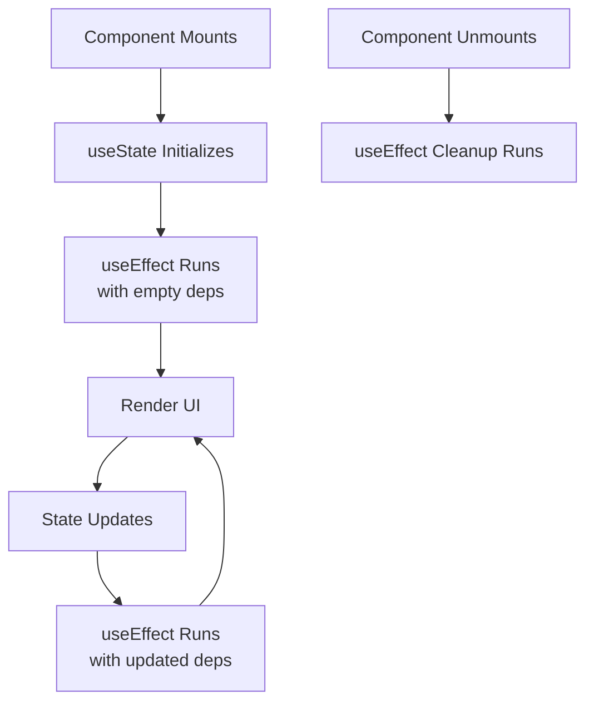

## Components

### Functional Components
```tsx
import React from 'react';

// Basic functional component
const Welcome: React.FC = () => {
  return <h1>Hello, World!</h1>;
};

export default Welcome;
```

### Component with Props
```tsx
import React from 'react';

// Define props interface
interface UserProps {
  name: string;
  age: number;
  isActive?: boolean; // Optional prop
}

// Component with typed props
const UserProfile: React.FC<UserProps> = ({ name, age, isActive = true }) => {
  return (
    <div>
      <h2>{name}</h2>
      <p>Age: {age}</p>
      <p>Status: {isActive ? 'Active' : 'Inactive'}</p>
    </div>
  );
};

export default UserProfile;
```

### Children Props
```tsx
import React, { ReactNode } from 'react';

interface CardProps {
  title: string;
  children: ReactNode; // For any React content
}

const Card: React.FC<CardProps> = ({ title, children }) => {
  return (
    <div className="card">
      <h3>{title}</h3>
      <div className="card-content">{children}</div>
    </div>
  );
};
```

## Props

### Default Props
```tsx
import React from 'react';

interface ButtonProps {
  text: string;
  type?: 'primary' | 'secondary';
  onClick: () => void;
}

const Button: React.FC<ButtonProps> = ({ 
  text, 
  type = 'primary', 
  onClick 
}) => {
  return (
    <button 
      className={`btn btn-${type}`}
      onClick={onClick}
    >
      {text}
    </button>
  );
};
```

### Prop Types with Enums
```tsx
import React from 'react';

// Define enum for types
export enum ButtonVariant {
  Primary = 'primary',
  Secondary = 'secondary',
  Danger = 'danger'
}

interface ButtonProps {
  variant: ButtonVariant;
  children: React.ReactNode;
  disabled?: boolean;
}

const StyledButton: React.FC<ButtonProps> = ({ 
  variant, 
  children, 
  disabled = false 
}) => {
  return (
    <button className={`btn btn-${variant}`} disabled={disabled}>
      {children}
    </button>
  );
};

// Usage:
// <StyledButton variant={ButtonVariant.Primary}>Click me</StyledButton>
```

## State Management

### useState Hook
```tsx
import React, { useState } from 'react';

interface User {
  id: number;
  name: string;
  email: string;
}

const UserForm: React.FC = () => {
  // Primitive state
  const [count, setCount] = useState<number>(0);
  
  // Object state
  const [user, setUser] = useState<User>({
    id: 1,
    name: '',
    email: ''
  });
  
  // Array state
  const [items, setItems] = useState<string[]>([]);

  const updateUserName = (name: string) => {
    setUser(prevUser => ({ ...prevUser, name }));
  };

  return (
    <div>
      <p>Count: {count}</p>
      <button onClick={() => setCount(count + 1)}>Increment</button>
      
      <input
        value={user.name}
        onChange={(e) => updateUserName(e.target.value)}
        placeholder="Enter name"
      />
    </div>
  );
};
```

### useReducer Hook
```tsx
import React, { useReducer } from 'react';

// State type
interface Todo {
  id: number;
  text: string;
  completed: boolean;
}

// Action types
type TodoAction =
  | { type: 'ADD_TODO'; text: string }
  | { type: 'TOGGLE_TODO'; id: number }
  | { type: 'DELETE_TODO'; id: number };

// Reducer function
const todoReducer = (state: Todo[], action: TodoAction): Todo[] => {
  switch (action.type) {
    case 'ADD_TODO':
      return [
        ...state,
        {
          id: Date.now(),
          text: action.text,
          completed: false
        }
      ];
    case 'TOGGLE_TODO':
      return state.map(todo =>
        todo.id === action.id
          ? { ...todo, completed: !todo.completed }
          : todo
      );
    case 'DELETE_TODO':
      return state.filter(todo => todo.id !== action.id);
    default:
      return state;
  }
};

const TodoApp: React.FC = () => {
  const [todos, dispatch] = useReducer(todoReducer, []);

  return (
    <div>
      <button onClick={() => dispatch({ type: 'ADD_TODO', text: 'New Todo' })}>
        Add Todo
      </button>
      {todos.map(todo => (
        <div key={todo.id}>
          <span>{todo.text}</span>
          <button onClick={() => dispatch({ type: 'TOGGLE_TODO', id: todo.id })}>
            Toggle
          </button>
        </div>
      ))}
    </div>
  );
};
```

## Hooks

### useEffect Hook
```tsx
import React, { useState, useEffect } from 'react';

interface Post {
  userId: number;
  id: number;
  title: string;
  body: string;
}

const DataFetcher: React.FC = () => {
  const [posts, setPosts] = useState<Post[]>([]);
  const [loading, setLoading] = useState<boolean>(true);
  const [error, setError] = useState<string | null>(null);

  // Effect with cleanup
  useEffect(() => {
    const abortController = new AbortController();
    
    const fetchData = async () => {
      try {
        setLoading(true);
        const response = await fetch(
          'https://jsonplaceholder.typicode.com/posts',
          { signal: abortController.signal }
        );
        
        if (!response.ok) throw new Error('Failed to fetch');
        
        const data: Post[] = await response.json();
        setPosts(data);
        setError(null);
      } catch (err) {
        if (!abortController.signal.aborted) {
          setError((err as Error).message);
        }
      } finally {
        setLoading(false);
      }
    };

    fetchData();

    // Cleanup function
    return () => {
      abortController.abort();
    };
  }, []); // Empty dependency array = run once on mount

  if (loading) return <div>Loading...</div>;
  if (error) return <div>Error: {error}</div>;

  return (
    <div>
      {posts.map(post => (
        <div key={post.id}>
          <h3>{post.title}</h3>
          <p>{post.body}</p>
        </div>
      ))}
    </div>
  );
};
```

### useMemo and useCallback
```tsx
import React, { useState, useMemo, useCallback } from 'react';

interface Product {
  id: number;
  name: string;
  price: number;
}

const ProductList: React.FC = () => {
  const [products, setProducts] = useState<Product[]>([
    { id: 1, name: 'Laptop', price: 1000 },
    { id: 2, name: 'Phone', price: 500 },
    { id: 3, name: 'Tablet', price: 300 },
  ]);
  
  const [filter, setFilter] = useState<string>('');
  const [count, setCount] = useState<number>(0);

  // Expensive calculation memoized
  const expensiveTotal = useMemo(() => {
    console.log('Calculating expensive total...');
    return products.reduce((total, product) => total + product.price, 0);
  }, [products]);

  // Filtered products memoized
  const filteredProducts = useMemo(() => {
    return products.filter(product =>
      product.name.toLowerCase().includes(filter.toLowerCase())
    );
  }, [products, filter]);

  // Function memoized with useCallback
  const addProduct = useCallback((name: string, price: number) => {
    setProducts(prev => [...prev, { id: Date.now(), name, price }]);
  }, []);

  return (
    <div>
      <input
        value={filter}
        onChange={(e) => setFilter(e.target.value)}
        placeholder="Filter products"
      />
      
      <p>Expensive Total: ${expensiveTotal}</p>
      <p>Regular Count: {count}</p>
      <button onClick={() => setCount(count + 1)}>Increment Count</button>
      
      {filteredProducts.map(product => (
        <div key={product.id}>
          {product.name} - ${product.price}
        </div>
      ))}
      
      <button onClick={() => addProduct('New Product', 100)}>
        Add Product
      </button>
    </div>
  );
};
```

## Event Handling

### Form Events
```tsx
import React, { useState, FormEvent, ChangeEvent } from 'react';

const ContactForm: React.FC = () => {
  const [formData, setFormData] = useState({
    name: '',
    email: '',
    message: ''
  });

  // Typing form change event
  const handleInputChange = (e: ChangeEvent<HTMLInputElement | HTMLTextAreaElement>) => {
    const { name, value } = e.target;
    setFormData(prev => ({ ...prev, [name]: value }));
  };

  // Typing form submit event
  const handleSubmit = (e: FormEvent<HTMLFormElement>) => {
    e.preventDefault();
    console.log('Form submitted:', formData);
    // Submit logic here
  };

  return (
    <form onSubmit={handleSubmit}>
      <input
        type="text"
        name="name"
        value={formData.name}
        onChange={handleInputChange}
        placeholder="Your Name"
      />
      <input
        type="email"
        name="email"
        value={formData.email}
        onChange={handleInputChange}
        placeholder="Your Email"
      />
      <textarea
        name="message"
        value={formData.message}
        onChange={handleInputChange}
        placeholder="Your Message"
      />
      <button type="submit">Send Message</button>
    </form>
  );
};
```

### Mouse and Keyboard Events
```tsx
import React, { MouseEvent, KeyboardEvent, useState } from 'react';

const EventExamples: React.FC = () => {
  const [position, setPosition] = useState({ x: 0, y: 0 });

  // Mouse event handler
  const handleClick = (e: MouseEvent<HTMLButtonElement>) => {
    console.log('Button clicked!', e.currentTarget.textContent);
  };

  // Keyboard event handler
  const handleKeyPress = (e: KeyboardEvent<HTMLInputElement>) => {
    if (e.key === 'Enter') {
      console.log('Enter pressed!', e.currentTarget.value);
    }
  };

  // Mouse move event with coordinates
  const handleMouseMove = (e: MouseEvent<HTMLDivElement>) => {
    setPosition({ x: e.clientX, y: e.clientY });
  };

  return (
    <div onMouseMove={handleMouseMove}>
      <button onClick={handleClick}>Click me!</button>
      <input onKeyPress={handleKeyPress} placeholder="Press Enter" />
      <p>Mouse position: {position.x}, {position.y}</p>
    </div>
  );
};
```

## Forms

### Controlled Components
```tsx
import React, { useState } from 'react';

interface FormData {
  username: string;
  email: string;
  password: string;
  newsletter: boolean;
  category: string;
}

const RegistrationForm: React.FC = () => {
  const [formData, setFormData] = useState<FormData>({
    username: '',
    email: '',
    password: '',
    newsletter: false,
    category: 'user'
  });

  const handleChange = (e: React.ChangeEvent<HTMLInputElement | HTMLSelectElement>) => {
    const { name, value, type } = e.target;
    const checked = (e.target as HTMLInputElement).checked;
    
    setFormData(prev => ({
      ...prev,
      [name]: type === 'checkbox' ? checked : value
    }));
  };

  const handleSubmit = (e: React.FormEvent) => {
    e.preventDefault();
    console.log('Form data:', formData);
    // Submit logic
  };

  return (
    <form onSubmit={handleSubmit}>
      <input
        type="text"
        name="username"
        value={formData.username}
        onChange={handleChange}
        placeholder="Username"
        required
      />
      
      <input
        type="email"
        name="email"
        value={formData.email}
        onChange={handleChange}
        placeholder="Email"
        required
      />
      
      <input
        type="password"
        name="password"
        value={formData.password}
        onChange={handleChange}
        placeholder="Password"
        required
      />
      
      <select name="category" value={formData.category} onChange={handleChange}>
        <option value="user">User</option>
        <option value="admin">Admin</option>
        <option value="moderator">Moderator</option>
      </select>
      
      <label>
        <input
          type="checkbox"
          name="newsletter"
          checked={formData.newsletter}
          onChange={handleChange}
        />
        Subscribe to newsletter
      </label>
      
      <button type="submit">Register</button>
    </form>
  );
};
```

### Form Validation
```tsx
import React, { useState } from 'react';

interface FormErrors {
  email?: string;
  password?: string;
}

const LoginForm: React.FC = () => {
  const [formData, setFormData] = useState({
    email: '',
    password: ''
  });
  
  const [errors, setErrors] = useState<FormErrors>({});

  const validateForm = (): boolean => {
    const newErrors: FormErrors = {};
    
    if (!formData.email) {
      newErrors.email = 'Email is required';
    } else if (!/\S+@\S+\.\S+/.test(formData.email)) {
      newErrors.email = 'Email is invalid';
    }
    
    if (!formData.password) {
      newErrors.password = 'Password is required';
    } else if (formData.password.length < 6) {
      newErrors.password = 'Password must be at least 6 characters';
    }
    
    setErrors(newErrors);
    return Object.keys(newErrors).length === 0;
  };

  const handleSubmit = (e: React.FormEvent) => {
    e.preventDefault();
    
    if (validateForm()) {
      console.log('Form is valid, submitting...', formData);
      // Submit logic
    }
  };

  const handleChange = (e: React.ChangeEvent<HTMLInputElement>) => {
    const { name, value } = e.target;
    setFormData(prev => ({ ...prev, [name]: value }));
    
    // Clear error when user starts typing
    if (errors[name as keyof FormErrors]) {
      setErrors(prev => ({ ...prev, [name]: undefined }));
    }
  };

  return (
    <form onSubmit={handleSubmit}>
      <div>
        <input
          type="email"
          name="email"
          value={formData.email}
          onChange={handleChange}
          placeholder="Email"
        />
        {errors.email && <span className="error">{errors.email}</span>}
      </div>
      
      <div>
        <input
          type="password"
          name="password"
          value={formData.password}
          onChange={handleChange}
          placeholder="Password"
        />
        {errors.password && <span className="error">{errors.password}</span>}
      </div>
      
      <button type="submit">Login</button>
    </form>
  );
};
```

## Styling

### CSS Modules
```tsx
// styles.module.css
.container {
  padding: 20px;
  border: 1px solid #ccc;
}

.title {
  color: #333;
  font-size: 24px;
}

// Component.tsx
import React from 'react';
import styles from './styles.module.css';

const StyledComponent: React.FC = () => {
  return (
    <div className={styles.container}>
      <h1 className={styles.title}>Styled Component</h1>
      <p>This uses CSS Modules for styling</p>
    </div>
  );
};
```

### Styled Components
```tsx
import styled from 'styled-components';

// Styled component with TypeScript
interface ButtonProps {
  variant?: 'primary' | 'secondary';
  size?: 'small' | 'medium' | 'large';
}

const StyledButton = styled.button<ButtonProps>`
  background-color: ${props => 
    props.variant === 'primary' ? '#007bff' : '#6c757d'};
  color: white;
  padding: ${props => {
    switch (props.size) {
      case 'small': return '5px 10px';
      case 'large': return '15px 30px';
      default: return '10px 20px';
    }
  }};
  border: none;
  border-radius: 4px;
  cursor: pointer;
  
  &:hover {
    opacity: 0.9;
  }
  
  &:disabled {
    opacity: 0.6;
    cursor: not-allowed;
  }
`;

const ButtonComponent: React.FC<ButtonProps & { disabled?: boolean }> = (props) => {
  return <StyledButton {...props}>{props.children}</StyledButton>;
};
```

### Inline Styles with TypeScript
```tsx
import React, { CSSProperties } from 'react';

const InlineStyledComponent: React.FC = () => {
  // Typing inline styles
  const containerStyle: CSSProperties = {
    padding: '20px',
    backgroundColor: '#f5f5f5',
    border: '1px solid #ddd',
    borderRadius: '8px'
  };

  const titleStyle: CSSProperties = {
    color: '#333',
    fontSize: '24px',
    marginBottom: '16px'
  };

  return (
    <div style={containerStyle}>
      <h2 style={titleStyle}>Inline Styled Component</h2>
      <p style={{ color: '#666', lineHeight: '1.5' }}>
        This component uses inline styles with TypeScript typing.
      </p>
    </div>
  );
};
```

## API Calls

### Custom API Hook
```tsx
import { useState, useEffect } from 'react';

interface UseApiResult<T> {
  data: T | null;
  loading: boolean;
  error: string | null;
  refetch: () => void;
}

function useApi<T>(url: string): UseApiResult<T> {
  const [data, setData] = useState<T | null>(null);
  const [loading, setLoading] = useState<boolean>(true);
  const [error, setError] = useState<string | null>(null);

  const fetchData = async () => {
    try {
      setLoading(true);
      setError(null);
      
      const response = await fetch(url);
      
      if (!response.ok) {
        throw new Error(`HTTP error! status: ${response.status}`);
      }
      
      const result: T = await response.json();
      setData(result);
    } catch (err) {
      setError((err as Error).message);
    } finally {
      setLoading(false);
    }
  };

  useEffect(() => {
    fetchData();
  }, [url]);

  return { data, loading, error, refetch: fetchData };
}

// Usage
interface Post {
  id: number;
  title: string;
  body: string;
}

const PostList: React.FC = () => {
  const { data: posts, loading, error, refetch } = useApi<Post[]>(
    'https://jsonplaceholder.typicode.com/posts'
  );

  if (loading) return <div>Loading...</div>;
  if (error) return <div>Error: {error}</div>;

  return (
    <div>
      <button onClick={refetch}>Reload</button>
      {posts?.map(post => (
        <div key={post.id}>
          <h3>{post.title}</h3>
          <p>{post.body}</p>
        </div>
      ))}
    </div>
  );
};
```

### Axios with TypeScript
```tsx
import React, { useState, useEffect } from 'react';
import axios, { AxiosError, AxiosResponse } from 'axios';

interface User {
  id: number;
  name: string;
  email: string;
}

const UserList: React.FC = () => {
  const [users, setUsers] = useState<User[]>([]);
  const [loading, setLoading] = useState<boolean>(true);
  const [error, setError] = useState<string | null>(null);

  useEffect(() => {
    const fetchUsers = async () => {
      try {
        setLoading(true);
        const response: AxiosResponse<User[]> = await axios.get(
          'https://jsonplaceholder.typicode.com/users'
        );
        setUsers(response.data);
      } catch (err) {
        const error = err as AxiosError;
        setError(error.message);
      } finally {
        setLoading(false);
      }
    };

    fetchUsers();
  }, []);

  if (loading) return <div>Loading users...</div>;
  if (error) return <div>Error: {error}</div>;

  return (
    <div>
      <h2>Users</h2>
      <ul>
        {users.map(user => (
          <li key={user.id}>
            {user.name} - {user.email}
          </li>
        ))}
      </ul>
    </div>
  );
};
```

## Context API

### Creating Context
```tsx
import React, { createContext, useContext, useState, ReactNode } from 'react';

// Define the context type
interface AuthContextType {
  user: User | null;
  login: (email: string, password: string) => Promise<void>;
  logout: () => void;
  isLoading: boolean;
}

interface User {
  id: string;
  email: string;
  name: string;
}

// Create context with default values
const AuthContext = createContext<AuthContextType | undefined>(undefined);

// Provider component
interface AuthProviderProps {
  children: ReactNode;
}

export const AuthProvider: React.FC<AuthProviderProps> = ({ children }) => {
  const [user, setUser] = useState<User | null>(null);
  const [isLoading, setIsLoading] = useState<boolean>(false);

  const login = async (email: string, password: string) => {
    setIsLoading(true);
    try {
      // Simulate API call
      const response = await fetch('/api/login', {
        method: 'POST',
        headers: { 'Content-Type': 'application/json' },
        body: JSON.stringify({ email, password }),
      });
      
      if (response.ok) {
        const userData: User = await response.json();
        setUser(userData);
      } else {
        throw new Error('Login failed');
      }
    } catch (error) {
      console.error('Login error:', error);
      throw error;
    } finally {
      setIsLoading(false);
    }
  };

  const logout = () => {
    setUser(null);
    // Additional cleanup logic
  };

  return (
    <AuthContext.Provider value={{ user, login, logout, isLoading }}>
      {children}
    </AuthContext.Provider>
  );
};

// Custom hook for using the context
export const useAuth = (): AuthContextType => {
  const context = useContext(AuthContext);
  if (context === undefined) {
    throw new Error('useAuth must be used within an AuthProvider');
  }
  return context;
};

// Usage in component
const LoginButton: React.FC = () => {
  const { login, isLoading } = useAuth();

  const handleLogin = async () => {
    try {
      await login('user@example.com', 'password');
    } catch (error) {
      console.error('Login failed');
    }
  };

  return (
    <button onClick={handleLogin} disabled={isLoading}>
      {isLoading ? 'Logging in...' : 'Login'}
    </button>
  );
};
```

## Lists & Keys

### Rendering Lists
```tsx
import React from 'react';

interface Item {
  id: number;
  name: string;
  category: string;
  price: number;
}

const ProductList: React.FC = () => {
  const products: Item[] = [
    { id: 1, name: 'Laptop', category: 'Electronics', price: 999 },
    { id: 2, name: 'Book', category: 'Education', price: 20 },
    { id: 3, name: 'Coffee', category: 'Food', price: 5 },
  ];

  // Using map to render list with proper keys
  return (
    <div>
      <h2>Product List</h2>
      <ul>
        {products.map(product => (
          <li key={product.id} className="product-item">
            <h3>{product.name}</h3>
            <p>Category: {product.category}</p>
            <p>Price: ${product.price}</p>
          </li>
        ))}
      </ul>
    </div>
  );
};
```

### List with Components
```tsx
import React from 'react';

interface Todo {
  id: number;
  text: string;
  completed: boolean;
}

interface TodoItemProps {
  todo: Todo;
  onToggle: (id: number) => void;
  onDelete: (id: number) => void;
}

// Individual todo item component
const TodoItem: React.FC<TodoItemProps> = ({ todo, onToggle, onDelete }) => {
  return (
    <li className={todo.completed ? 'completed' : ''}>
      <input
        type="checkbox"
        checked={todo.completed}
        onChange={() => onToggle(todo.id)}
      />
      <span>{todo.text}</span>
      <button onClick={() => onDelete(todo.id)}>Delete</button>
    </li>
  );
};

interface TodoListProps {
  todos: Todo[];
  onToggleTodo: (id: number) => void;
  onDeleteTodo: (id: number) => void;
}

// Todo list component
const TodoList: React.FC<TodoListProps> = ({ 
  todos, 
  onToggleTodo, 
  onDeleteTodo 
}) => {
  if (todos.length === 0) {
    return <p>No todos yet. Add one above!</p>;
  }

  return (
    <ul className="todo-list">
      {todos.map(todo => (
        <TodoItem
          key={todo.id}
          todo={todo}
          onToggle={onToggleTodo}
          onDelete={onDeleteTodo}
        />
      ))}
    </ul>
  );
};
```

## Custom Hooks

### useLocalStorage Hook
```tsx
import { useState, useEffect } from 'react';

function useLocalStorage<T>(key: string, initialValue: T) {
  // Get from local storage then parse stored json or return initialValue
  const [storedValue, setStoredValue] = useState<T>(() => {
    try {
      const item = window.localStorage.getItem(key);
      return item ? JSON.parse(item) : initialValue;
    } catch (error) {
      console.error(error);
      return initialValue;
    }
  });

  // Return a wrapped version of useState's setter function that persists the new value to localStorage
  const setValue = (value: T | ((val: T) => T)) => {
    try {
      // Allow value to be a function so we have the same API as useState
      const valueToStore = value instanceof Function ? value(storedValue) : value;
      setStoredValue(valueToStore);
      window.localStorage.setItem(key, JSON.stringify(valueToStore));
    } catch (error) {
      console.error(error);
    }
  };

  return [storedValue, setValue] as const;
}

// Usage
const UserPreferences: React.FC = () => {
  const [theme, setTheme] = useLocalStorage('theme', 'light');
  const [fontSize, setFontSize] = useLocalStorage('fontSize', 16);

  return (
    <div>
      <h2>Preferences</h2>
      <select value={theme} onChange={e => setTheme(e.target.value)}>
        <option value="light">Light</option>
        <option value="dark">Dark</option>
      </select>
      
      <input
        type="range"
        min="12"
        max="24"
        value={fontSize}
        onChange={e => setFontSize(Number(e.target.value))}
      />
      <span>Font Size: {fontSize}px</span>
    </div>
  );
};
```

### useDebounce Hook
```tsx
import { useState, useEffect } from 'react';

function useDebounce<T>(value: T, delay: number): T {
  const [debouncedValue, setDebouncedValue] = useState<T>(value);

  useEffect(() => {
    const handler = setTimeout(() => {
      setDebouncedValue(value);
    }, delay);

    return () => {
      clearTimeout(handler);
    };
  }, [value, delay]);

  return debouncedValue;
}

// Usage
const SearchComponent: React.FC = () => {
  const [searchTerm, setSearchTerm] = useState<string>('');
  const debouncedSearchTerm = useDebounce(searchTerm, 500);

  useEffect(() => {
    if (debouncedSearchTerm) {
      // Perform search API call
      console.log('Searching for:', debouncedSearchTerm);
    }
  }, [debouncedSearchTerm]);

  return (
    <input
      type="text"
      placeholder="Search..."
      value={searchTerm}
      onChange={e => setSearchTerm(e.target.value)}
    />
  );
};
```

## Performance Optimization

### React.memo
```tsx
import React, { memo, useState } from 'react';

interface ExpensiveComponentProps {
  value: number;
  onClick: () => void;
}

// This component will only re-render when props change
const ExpensiveComponent: React.FC<ExpensiveComponentProps> = memo(({ value, onClick }) => {
  console.log('ExpensiveComponent rendered');
  
  // Simulate expensive computation
  const expensiveValue = React.useMemo(() => {
    let result = value;
    for (let i = 0; i < 1000000; i++) {
      result += i % 2;
    }
    return result;
  }, [value]);

  return (
    <div>
      <p>Expensive value: {expensiveValue}</p>
      <button onClick={onClick}>Click me</button>
    </div>
  );
});

const OptimizationDemo: React.FC = () => {
  const [count, setCount] = useState(0);
  const [otherState, setOtherState] = useState('');

  // useCallback to memoize function
  const handleClick = React.useCallback(() => {
    console.log('Button clicked');
  }, []);

  return (
    <div>
      <button onClick={() => setCount(count + 1)}>Increment: {count}</button>
      <button onClick={() => setOtherState(otherState + 'a')}>
        Change other state: {otherState}
      </button>
      
      <ExpensiveComponent value={count} onClick={handleClick} />
    </div>
  );
};
```

### useMemo for Expensive Calculations
```tsx
import React, { useMemo, useState } from 'react';

interface DataItem {
  id: number;
  name: string;
  value: number;
}

const DataProcessor: React.FC = () => {
  const [data] = useState<DataItem[]>([
    { id: 1, name: 'Item 1', value: 10 },
    { id: 2, name: 'Item 2', value: 20 },
    { id: 3, name: 'Item 3', value: 30 },
    // ... more items
  ]);
  
  const [filter, setFilter] = useState<string>('');
  const [sortAscending, setSortAscending] = useState<boolean>(true);

  // Memoize filtered and sorted data
  const processedData = useMemo(() => {
    console.log('Processing data...');
    
    const filtered = data.filter(item =>
      item.name.toLowerCase().includes(filter.toLowerCase())
    );
    
    const sorted = [...filtered].sort((a, b) => {
      return sortAscending ? a.value - b.value : b.value - a.value;
    });
    
    return sorted;
  }, [data, filter, sortAscending]);

  return (
    <div>
      <input
        value={filter}
        onChange={e => setFilter(e.target.value)}
        placeholder="Filter by name"
      />
      
      <button onClick={() => setSortAscending(!sortAscending)}>
        Sort: {sortAscending ? 'Ascending' : 'Descending'}
      </button>
      
      <ul>
        {processedData.map(item => (
          <li key={item.id}>
            {item.name} - {item.value}
          </li>
        ))}
      </ul>
    </div>
  );
};
```

## Component Lifecycle with Hooks



