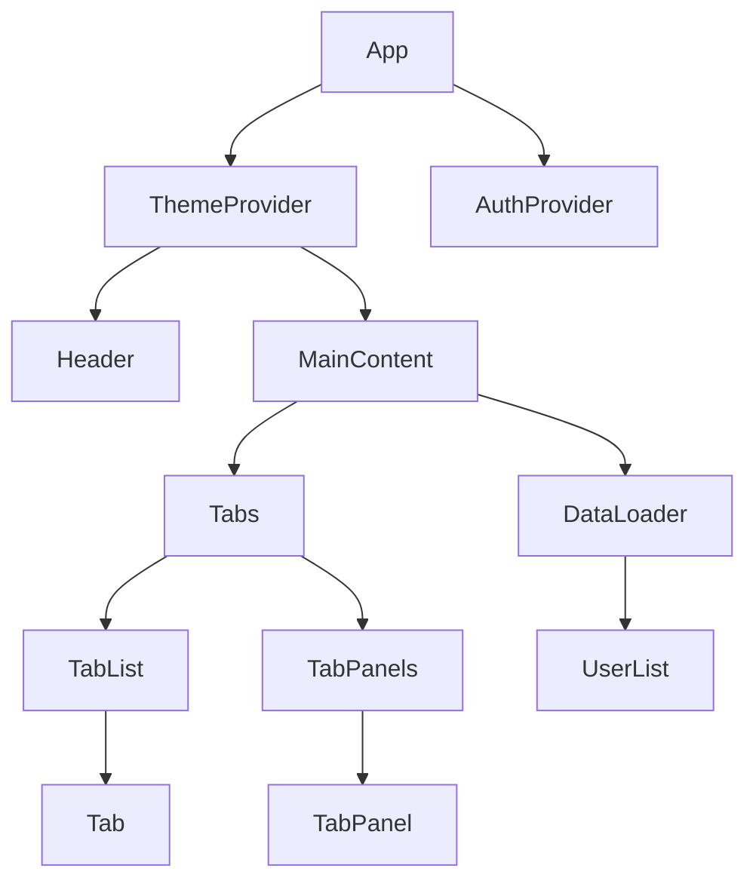
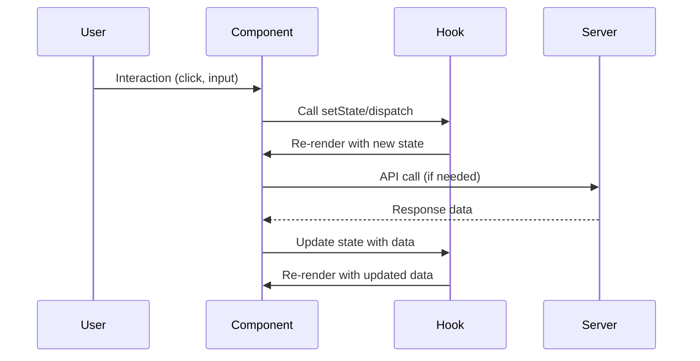
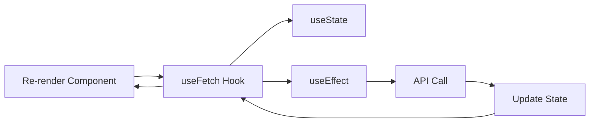

## 1. Component Patterns

### 1.1 Functional Components
```typescript
interface ButtonProps {
  label: string;
  onClick: () => void;
  variant?: 'primary' | 'secondary';
  disabled?: boolean;
}

const Button: React.FC<ButtonProps> = ({ 
  label, 
  onClick, 
  variant = 'primary',
  disabled = false 
}) => {
  return (
    <button 
      className={`btn btn-${variant}`}
      onClick={onClick}
      disabled={disabled}
    >
      {label}
    </button>
  );
};
```

### 1.2 Component Composition
```typescript
interface CardProps {
  title: string;
  children: React.ReactNode;
  footer?: React.ReactNode;
}

const Card: React.FC<CardProps> = ({ title, children, footer }) => {
  return (
    <div className="card">
      <div className="card-header">{title}</div>
      <div className="card-body">{children}</div>
      {footer && <div className="card-footer">{footer}</div>}
    </div>
  );
};

// Usage
<Card 
  title="User Profile" 
  footer={<Button label="Save" onClick={handleSave} />}
>
  <UserForm user={user} />
</Card>
```

## 2. State Management Patterns

### 2.1 useState Hook
```typescript
interface User {
  id: number;
  name: string;
  email: string;
}

const UserProfile: React.FC = () => {
  const [user, setUser] = useState<User | null>(null);
  const [loading, setLoading] = useState<boolean>(true);
  const [error, setError] = useState<string>('');

  const fetchUser = async (userId: number) => {
    try {
      setLoading(true);
      const response = await fetch(`/api/users/${userId}`);
      const userData: User = await response.json();
      setUser(userData);
    } catch (err) {
      setError('Failed to fetch user');
    } finally {
      setLoading(false);
    }
  };

  if (loading) return <div>Loading...</div>;
  if (error) return <div>Error: {error}</div>;

  return <div>{user?.name}</div>;
};
```

### 2.2 useReducer Pattern
```typescript
interface Todo {
  id: number;
  text: string;
  completed: boolean;
}

type TodoAction =
  | { type: 'ADD_TODO'; payload: string }
  | { type: 'TOGGLE_TODO'; payload: number }
  | { type: 'DELETE_TODO'; payload: number };

const todoReducer = (state: Todo[], action: TodoAction): Todo[] => {
  switch (action.type) {
    case 'ADD_TODO':
      return [...state, {
        id: Date.now(),
        text: action.payload,
        completed: false
      }];
    case 'TOGGLE_TODO':
      return state.map(todo =>
        todo.id === action.payload
          ? { ...todo, completed: !todo.completed }
          : todo
      );
    case 'DELETE_TODO':
      return state.filter(todo => todo.id !== action.payload);
    default:
      return state;
  }
};

const TodoApp: React.FC = () => {
  const [todos, dispatch] = useReducer(todoReducer, []);
  const [input, setInput] = useState('');

  const addTodo = () => {
    if (input.trim()) {
      dispatch({ type: 'ADD_TODO', payload: input });
      setInput('');
    }
  };

  return (
    <div>
      <input
        value={input}
        onChange={(e) => setInput(e.target.value)}
        placeholder="Add todo..."
      />
      <button onClick={addTodo}>Add</button>
      {todos.map(todo => (
        <div key={todo.id}>
          <input
            type="checkbox"
            checked={todo.completed}
            onChange={() => dispatch({ type: 'TOGGLE_TODO', payload: todo.id })}
          />
          {todo.text}
          <button onClick={() => dispatch({ type: 'DELETE_TODO', payload: todo.id })}>
            Delete
          </button>
        </div>
      ))}
    </div>
  );
};
```

## 3. Render Props Pattern

```typescript
interface DataLoaderProps<T> {
  url: string;
  children: (data: T | null, loading: boolean, error: string | null) => React.ReactNode;
}

const DataLoader = <T,>({ url, children }: DataLoaderProps<T>): React.ReactElement => {
  const [data, setData] = useState<T | null>(null);
  const [loading, setLoading] = useState(true);
  const [error, setError] = useState<string | null>(null);

  useEffect(() => {
    const fetchData = async () => {
      try {
        setLoading(true);
        const response = await fetch(url);
        const result = await response.json();
        setData(result);
      } catch (err) {
        setError(err instanceof Error ? err.message : 'An error occurred');
      } finally {
        setLoading(false);
      }
    };

    fetchData();
  }, [url]);

  return <>{children(data, loading, error)}</>;
};

// Usage
<DataLoader<User[]> url="/api/users">
  {(users, loading, error) => {
    if (loading) return <div>Loading users...</div>;
    if (error) return <div>Error: {error}</div>;
    return (
      <ul>
        {users?.map(user => (
          <li key={user.id}>{user.name}</li>
        ))}
      </ul>
    );
  }}
</DataLoader>
```

## 4. Higher-Order Component (HOC) Pattern

```typescript
interface WithAuthProps {
  isAuthenticated: boolean;
  user?: User;
}

const withAuth = <P extends object>(
  WrappedComponent: React.ComponentType<P & WithAuthProps>
): React.FC<P> => {
  const WithAuth: React.FC<P> = (props) => {
    const [isAuthenticated, setIsAuthenticated] = useState(false);
    const [user, setUser] = useState<User | undefined>();
    const [loading, setLoading] = useState(true);

    useEffect(() => {
      const checkAuth = async () => {
        try {
          const token = localStorage.getItem('token');
          if (token) {
            const userData = await verifyToken(token);
            setUser(userData);
            setIsAuthenticated(true);
          }
        } catch (error) {
          setIsAuthenticated(false);
        } finally {
          setLoading(false);
        }
      };

      checkAuth();
    }, []);

    if (loading) return <div>Loading authentication...</div>;

    return (
      <WrappedComponent
        {...props as P}
        isAuthenticated={isAuthenticated}
        user={user}
      />
    );
  };

  return WithAuth;
};

// Usage
interface ProfileProps extends WithAuthProps {
  // other props
}

const Profile: React.FC<ProfileProps> = ({ isAuthenticated, user }) => {
  if (!isAuthenticated) return <div>Please log in</div>;
  
  return (
    <div>
      <h1>Welcome, {user?.name}</h1>
      {/* Profile content */}
    </div>
  );
};

const ProtectedProfile = withAuth(Profile);
```

## 5. Custom Hooks Pattern

```typescript
// useLocalStorage hook
function useLocalStorage<T>(key: string, initialValue: T): [T, (value: T | ((val: T) => T)) => void] {
  const [storedValue, setStoredValue] = useState<T>(() => {
    try {
      const item = window.localStorage.getItem(key);
      return item ? JSON.parse(item) : initialValue;
    } catch (error) {
      return initialValue;
    }
  });

  const setValue = (value: T | ((val: T) => T)) => {
    try {
      const valueToStore = value instanceof Function ? value(storedValue) : value;
      setStoredValue(valueToStore);
      window.localStorage.setItem(key, JSON.stringify(valueToStore));
    } catch (error) {
      console.error(`Error setting localStorage key "${key}":`, error);
    }
  };

  return [storedValue, setValue];
}

// useFetch hook
interface UseFetchResult<T> {
  data: T | null;
  loading: boolean;
  error: string | null;
  refetch: () => void;
}

function useFetch<T>(url: string): UseFetchResult<T> {
  const [data, setData] = useState<T | null>(null);
  const [loading, setLoading] = useState(true);
  const [error, setError] = useState<string | null>(null);

  const fetchData = useCallback(async () => {
    try {
      setLoading(true);
      setError(null);
      const response = await fetch(url);
      if (!response.ok) throw new Error('Network response was not ok');
      const result = await response.json();
      setData(result);
    } catch (err) {
      setError(err instanceof Error ? err.message : 'An error occurred');
    } finally {
      setLoading(false);
    }
  }, [url]);

  useEffect(() => {
    fetchData();
  }, [fetchData]);

  return { data, loading, error, refetch: fetchData };
}

// Usage
const UserList: React.FC = () => {
  const { data: users, loading, error, refetch } = useFetch<User[]>('/api/users');
  const [darkMode, setDarkMode] = useLocalStorage('dark-mode', false);

  if (loading) return <div>Loading...</div>;
  if (error) return <div>Error: {error}</div>;

  return (
    <div className={darkMode ? 'dark' : ''}>
      <button onClick={() => setDarkMode(prev => !prev)}>
        Toggle Dark Mode
      </button>
      <ul>
        {users?.map(user => (
          <li key={user.id}>{user.name}</li>
        ))}
      </ul>
    </div>
  );
};
```

## 6. Compound Components Pattern

```typescript
interface TabsContextType {
  activeTab: string;
  setActiveTab: (tab: string) => void;
}

const TabsContext = React.createContext<TabsContextType | undefined>(undefined);

const Tabs: React.FC<{ children: React.ReactNode; defaultActiveTab: string }> = ({
  children,
  defaultActiveTab
}) => {
  const [activeTab, setActiveTab] = useState(defaultActiveTab);

  return (
    <TabsContext.Provider value={{ activeTab, setActiveTab }}>
      <div className="tabs">{children}</div>
    </TabsContext.Provider>
  );
};

const useTabs = () => {
  const context = useContext(TabsContext);
  if (!context) {
    throw new Error('useTabs must be used within a Tabs component');
  }
  return context;
};

const TabList: React.FC<{ children: React.ReactNode }> = ({ children }) => {
  return <div className="tab-list">{children}</div>;
};

const Tab: React.FC<{ tabId: string; children: React.ReactNode }> = ({ tabId, children }) => {
  const { activeTab, setActiveTab } = useTabs();
  
  return (
    <button
      className={`tab ${activeTab === tabId ? 'active' : ''}`}
      onClick={() => setActiveTab(tabId)}
    >
      {children}
    </button>
  );
};

const TabPanels: React.FC<{ children: React.ReactNode }> = ({ children }) => {
  return <div className="tab-panels">{children}</div>;
};

const TabPanel: React.FC<{ tabId: string; children: React.ReactNode }> = ({ tabId, children }) => {
  const { activeTab } = useTabs();
  
  return activeTab === tabId ? <div className="tab-panel">{children}</div> : null;
};

// Usage
<Tabs defaultActiveTab="profile">
  <TabList>
    <Tab tabId="profile">Profile</Tab>
    <Tab tabId="settings">Settings</Tab>
    <Tab tabId="messages">Messages</Tab>
  </TabList>
  
  <TabPanels>
    <TabPanel tabId="profile">
      <ProfileContent />
    </TabPanel>
    <TabPanel tabId="settings">
      <SettingsContent />
    </TabPanel>
    <TabPanel tabId="messages">
      <MessagesContent />
    </TabPanel>
  </TabPanels>
</Tabs>
```

## 7. Provider Pattern

```typescript
interface ThemeContextType {
  theme: 'light' | 'dark';
  toggleTheme: () => void;
}

const ThemeContext = React.createContext<ThemeContextType | undefined>(undefined);

const ThemeProvider: React.FC<{ children: React.ReactNode }> = ({ children }) => {
  const [theme, setTheme] = useState<'light' | 'dark'>('light');

  const toggleTheme = () => {
    setTheme(prev => prev === 'light' ? 'dark' : 'light');
  };

  useEffect(() => {
    document.documentElement.setAttribute('data-theme', theme);
  }, [theme]);

  return (
    <ThemeContext.Provider value={{ theme, toggleTheme }}>
      {children}
    </ThemeContext.Provider>
  );
};

const useTheme = () => {
  const context = useContext(ThemeContext);
  if (!context) {
    throw new Error('useTheme must be used within a ThemeProvider');
  }
  return context;
};

const ThemeToggle: React.FC = () => {
  const { theme, toggleTheme } = useTheme();
  
  return (
    <button onClick={toggleTheme}>
      Switch to {theme === 'light' ? 'dark' : 'light'} mode
    </button>
  );
};

// Usage in App
const App: React.FC = () => {
  return (
    <ThemeProvider>
      <div className="app">
        <Header />
        <MainContent />
        <ThemeToggle />
      </div>
    </ThemeProvider>
  );
};
```

## 8. Controlled vs Uncontrolled Components

### Controlled Component
```typescript
interface ControlledFormProps {
  value: string;
  onChange: (value: string) => void;
}

const ControlledInput: React.FC<ControlledFormProps> = ({ value, onChange }) => {
  return (
    <input
      type="text"
      value={value}
      onChange={(e) => onChange(e.target.value)}
    />
  );
};

// Parent component manages state
const Form: React.FC = () => {
  const [inputValue, setInputValue] = useState('');

  return (
    <ControlledInput
      value={inputValue}
      onChange={setInputValue}
    />
  );
};
```

### Uncontrolled Component
```typescript
interface UncontrolledFormProps {
  defaultValue: string;
  onBlur?: (value: string) => void;
}

const UncontrolledInput: React.FC<UncontrolledFormProps> = ({ 
  defaultValue, 
  onBlur 
}) => {
  const inputRef = useRef<HTMLInputElement>(null);

  const handleBlur = () => {
    if (onBlur && inputRef.current) {
      onBlur(inputRef.current.value);
    }
  };

  return (
    <input
      ref={inputRef}
      type="text"
      defaultValue={defaultValue}
      onBlur={handleBlur}
    />
  );
};
```


### Component Hierarchy Diagram


### State Flow Diagram


### Custom Hook Data Flow


