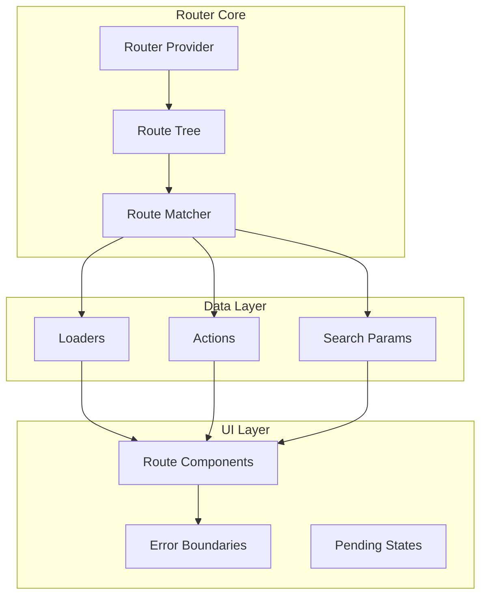
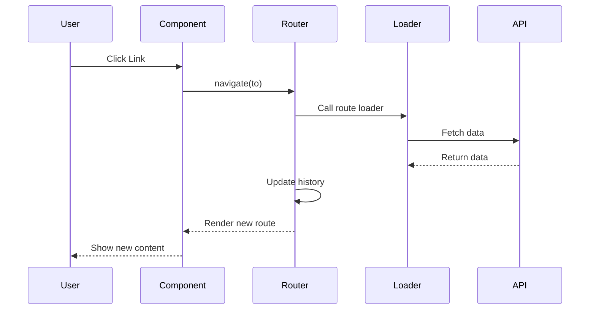
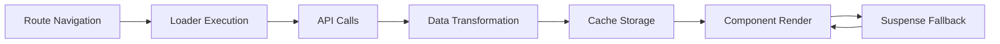

React Router v7 represents a significant evolution from previous versions, embracing modern React patterns and providing a more intuitive, type-safe, and performant routing solution for React 19 applications.

## What's New in React Router v7?
React Router v7 is designed specifically for React 18+ and embraces modern React patterns like hooks, concurrent features, and suspense.

## Core Concepts

### 1. Router Setup with Data APIs
```typescript
// main.tsx
import { StrictMode } from 'react';
import { createRoot } from 'react-dom/client';
import { createRouter, RouterProvider } from '@tanstack/react-router';
import { routeTree } from './routeTree.gen';

const router = createRouter({
  routeTree,
  defaultPreload: 'intent',
  defaultStaleTime: 5 * 60 * 1000, // 5 minutes
});

declare module '@tanstack/react-router' {
  interface Register {
    router: typeof router;
  }
}

createRoot(document.getElementById('root')!).render(
  <StrictMode>
    <RouterProvider router={router} />
  </StrictMode>
);
```

### 2. Route Tree Generation
```typescript
// routeTree.gen.ts (auto-generated)
import { createRouteTree } from '@tanstack/react-router';
import { rootRoute } from './routes/__root';
import { indexRoute } from './routes/index';
import { todosRoute } from './routes/todos';
import { todoIdRoute } from './routes/todos.$todoId';

export const routeTree = createRouteTree({
  root: rootRoute,
  children: [
    indexRoute,
    {
      path: 'todos',
      children: [todosRoute, todoIdRoute],
    },
  ],
});
```

## Complete Example: Todo App with React Router v7

### 1. Root Route with Layout
```typescript
// routes/__root.tsx
import { createRootRoute, Outlet } from '@tanstack/react-router';
import { TanStackRouterDevtools } from '@tanstack/router-devtools';
import { QueryClient, QueryClientProvider } from '@tanstack/react-query';

const queryClient = new QueryClient();

export const Route = createRootRoute({
  component: RootComponent,
});

function RootComponent() {
  return (
    <QueryClientProvider client={queryClient}>
      <div className="app">
        <nav className="nav">
          <a href="/" className="nav-link">
            Home
          </a>
          <a href="/todos" className="nav-link">
            Todos
          </a>
        </nav>
        <main className="main">
          <Outlet />
        </main>
        <TanStackRouterDevtools />
      </div>
    </QueryClientProvider>
  );
}
```

### 2. Index Route
```typescript
// routes/index.tsx
import { createRoute } from '@tanstack/react-router';
import { rootRoute } from './__root';

export const indexRoute = createRoute({
  getParentRoute: () => rootRoute,
  path: '/',
  component: Home,
});

function Home() {
  return (
    <div className="home">
      <h1>Welcome to Todo App</h1>
      <p>This is a modern React 19 app with React Router v7</p>
    </div>
  );
}
```

### 3. Todos Route with Loader
```typescript
// routes/todos.tsx
import { createRoute, useLoaderData } from '@tanstack/react-router';
import { rootRoute } from './__root';
import { todoService, Todo } from '../services/todoService';
import { TodoList } from '../components/TodoList';

export const todosRoute = createRoute({
  getParentRoute: () => rootRoute,
  path: 'todos',
  loader: async () => {
    return todoService.getTodos();
  },
  component: Todos,
});

function Todos() {
  const todos = useLoaderData({ from: todosRoute.id });
  
  return (
    <div className="todos-page">
      <h1>Todos</h1>
      <TodoList todos={todos} />
    </div>
  );
}
```

### 4. Dynamic Todo Route
```typescript
// routes/todos.$todoId.tsx
import { createRoute, useLoaderData, useParams } from '@tanstack/react-router';
import { todosRoute } from './todos';
import { todoService } from '../services/todoService';
import { TodoDetail } from '../components/TodoDetail';

export const todoIdRoute = createRoute({
  getParentRoute: () => todosRoute,
  path: '$todoId',
  loader: async ({ params }) => {
    const todos = await todoService.getTodos();
    const todo = todos.find(t => t.id === params.todoId);
    if (!todo) throw new Error('Todo not found');
    return todo;
  },
  component: TodoDetailPage,
});

function TodoDetailPage() {
  const todo = useLoaderData({ from: todoIdRoute.id });
  const params = useParams({ from: todoIdRoute.id });
  
  return <TodoDetail todo={todo} />;
}
```

### 5. Services
```typescript
// services/todoService.ts
export interface Todo {
  id: string;
  text: string;
  completed: boolean;
  createdAt: string;
}

export const todoService = {
  getTodos: async (): Promise<Todo[]> => {
    await new Promise(resolve => setTimeout(resolve, 300)); // Simulate network
    const stored = localStorage.getItem('todos');
    return stored ? JSON.parse(stored) : [];
  },

  getTodo: async (id: string): Promise<Todo> => {
    const todos = await todoService.getTodos();
    const todo = todos.find(t => t.id === id);
    if (!todo) throw new Error('Todo not found');
    return todo;
  },

  createTodo: async (text: string): Promise<Todo> => {
    const newTodo: Todo = {
      id: Math.random().toString(36).substr(2, 9),
      text,
      completed: false,
      createdAt: new Date().toISOString(),
    };
    
    const todos = await todoService.getTodos();
    const updatedTodos = [...todos, newTodo];
    localStorage.setItem('todos', JSON.stringify(updatedTodos));
    
    return newTodo;
  },

  updateTodo: async (id: string, updates: Partial<Todo>): Promise<Todo> => {
    const todos = await todoService.getTodos();
    const updatedTodos = todos.map(todo =>
      todo.id === id ? { ...todo, ...updates } : todo
    );
    localStorage.setItem('todos', JSON.stringify(updatedTodos));
    
    return updatedTodos.find(todo => todo.id === id)!;
  },

  deleteTodo: async (id: string): Promise<void> => {
    const todos = await todoService.getTodos();
    const updatedTodos = todos.filter(todo => todo.id !== id);
    localStorage.setItem('todos', JSON.stringify(updatedTodos));
  },
};
```

### 6. Components with Actions
```typescript
// components/TodoList.tsx
import { useNavigate } from '@tanstack/react-router';
import { Todo } from '../services/todoService';

interface TodoListProps {
  todos: Todo[];
}

export function TodoList({ todos }: TodoListProps) {
  const navigate = useNavigate();

  return (
    <div className="todo-list">
      {todos.map(todo => (
        <div
          key={todo.id}
          className="todo-item"
          onClick={() => navigate({ to: '/todos/$todoId', params: { todoId: todo.id } })}
        >
          <h3>{todo.text}</h3>
          <p>Status: {todo.completed ? 'Completed' : 'Active'}</p>
        </div>
      ))}
    </div>
  );
}
```

```typescript
// components/TodoDetail.tsx
import { useNavigate } from '@tanstack/react-router';
import { useMutation, useQueryClient } from '@tanstack/react-query';
import { todoService, Todo } from '../services/todoService';

interface TodoDetailProps {
  todo: Todo;
}

export function TodoDetail({ todo }: TodoDetailProps) {
  const navigate = useNavigate();
  const queryClient = useQueryClient();

  const updateMutation = useMutation({
    mutationFn: (updates: Partial<Todo>) => 
      todoService.updateTodo(todo.id, updates),
    onSuccess: () => {
      queryClient.invalidateQueries({ queryKey: ['todos'] });
    },
  });

  const deleteMutation = useMutation({
    mutationFn: () => todoService.deleteTodo(todo.id),
    onSuccess: () => {
      queryClient.invalidateQueries({ queryKey: ['todos'] });
      navigate({ to: '/todos' });
    },
  });

  return (
    <div className="todo-detail">
      <button onClick={() => navigate({ to: '/todos' })}>
        ← Back to Todos
      </button>
      
      <h1>{todo.text}</h1>
      <p>Created: {new Date(todo.createdAt).toLocaleDateString()}</p>
      
      <label>
        <input
          type="checkbox"
          checked={todo.completed}
          onChange={(e) => updateMutation.mutate({ completed: e.target.checked })}
        />
        Completed
      </label>
      
      <button
        onClick={() => deleteMutation.mutate()}
        disabled={deleteMutation.isPending}
      >
        {deleteMutation.isPending ? 'Deleting...' : 'Delete Todo'}
      </button>
    </div>
  );
}
```

### 7. Create Todo Route with Form Action
```typescript
// routes/todos.create.tsx
import { createRoute, useNavigate } from '@tanstack/react-router';
import { todosRoute } from './todos';
import { useMutation, useQueryClient } from '@tanstack/react-query';
import { todoService } from '../services/todoService';

export const createTodoRoute = createRoute({
  getParentRoute: () => todosRoute,
  path: 'create',
  component: CreateTodo,
});

function CreateTodo() {
  const navigate = useNavigate();
  const queryClient = useQueryClient();

  const createMutation = useMutation({
    mutationFn: todoService.createTodo,
    onSuccess: (newTodo) => {
      queryClient.invalidateQueries({ queryKey: ['todos'] });
      navigate({ to: '/todos/$todoId', params: { todoId: newTodo.id } });
    },
  });

  const handleSubmit = async (e: React.FormEvent<HTMLFormElement>) => {
    e.preventDefault();
    const formData = new FormData(e.currentTarget);
    const text = formData.get('text') as string;
    
    if (text.trim()) {
      createMutation.mutate(text.trim());
    }
  };

  return (
    <div className="create-todo">
      <h1>Create New Todo</h1>
      
      <form onSubmit={handleSubmit}>
        <input
          name="text"
          type="text"
          placeholder="Enter todo text..."
          required
          disabled={createMutation.isPending}
        />
        
        <button type="submit" disabled={createMutation.isPending}>
          {createMutation.isPending ? 'Creating...' : 'Create Todo'}
        </button>
        
        <button
          type="button"
          onClick={() => navigate({ to: '/todos' })}
          disabled={createMutation.isPending}
        >
          Cancel
        </button>
      </form>
      
      {createMutation.isError && (
        <div className="error">Error creating todo</div>
      )}
    </div>
  );
}
```

## Advanced Patterns

### 1. Route Loaders with Error Boundaries
```typescript
// routes/todos.$todoId.tsx (updated)
export const todoIdRoute = createRoute({
  getParentRoute: () => todosRoute,
  path: '$todoId',
  loader: async ({ params }) => {
    const todos = await todoService.getTodos();
    const todo = todos.find(t => t.id === params.todoId);
    if (!todo) throw new ErrorResponse({ status: 404, statusText: 'Todo not found' });
    return todo;
  },
  errorComponent: TodoError,
  component: TodoDetailPage,
});

function TodoError({ error }: { error: ErrorResponse }) {
  const navigate = useNavigate();
  
  return (
    <div className="error-page">
      <h1>{error.status} - {error.statusText}</h1>
      <p>The todo you're looking for doesn't exist.</p>
      <button onClick={() => navigate({ to: '/todos' })}>
        Back to Todos
      </button>
    </div>
  );
}
```

### 2. Parallel Data Loading
```typescript
// routes/dashboard.tsx
export const dashboardRoute = createRoute({
  getParentRoute: () => rootRoute,
  path: 'dashboard',
  loader: async () => {
    const [todos, user] = await Promise.all([
      todoService.getTodos(),
      userService.getCurrentUser(),
    ]);
    
    return { todos, user };
  },
  component: Dashboard,
});
```

### 3. Route Prefetching
```typescript
// components/TodoLink.tsx
import { useRouter } from '@tanstack/react-router';

function TodoLink({ todoId }: { todoId: string }) {
  const router = useRouter();

  return (
    <a
      href={`/todos/${todoId}`}
      onMouseEnter={() => router.preloadRoute({ to: '/todos/$todoId', params: { todoId } })}
    >
      View Todo
    </a>
  );
}
```

### 4. Search Params with Validation
```typescript
// routes/todos.tsx (updated)
import { z } from 'zod';

const searchSchema = z.object({
  filter: z.enum(['all', 'active', 'completed']).catch('all'),
  sort: z.enum(['newest', 'oldest']).catch('newest'),
});

export const todosRoute = createRoute({
  getParentRoute: () => rootRoute,
  path: 'todos',
  validateSearch: searchSchema,
  loader: async ({ search }) => {
    let todos = await todoService.getTodos();
    
    // Apply filters
    if (search.filter === 'active') {
      todos = todos.filter(t => !t.completed);
    } else if (search.filter === 'completed') {
      todos = todos.filter(t => t.completed);
    }
    
    // Apply sorting
    if (search.sort === 'oldest') {
      todos.sort((a, b) => new Date(a.createdAt).getTime() - new Date(b.createdAt).getTime());
    } else {
      todos.sort((a, b) => new Date(b.createdAt).getTime() - new Date(a.createdAt).getTime());
    }
    
    return todos;
  },
  component: Todos,
});
```


### React Router v7 Architecture


### Navigation Flow


### Data Loading Flow


## Best Practices

1. **Route-Based Code Splitting**: Use `lazyRouteComponent` for automatic code splitting
2. **Error Boundaries**: Wrap routes with error boundaries for better UX
3. **Loading States**: Use React 19 Suspense for loading states
4. **Type Safety**: Leverage TypeScript with route params and search params
5. **Prefetching**: Preload data on hover for better performance
6. **Parallel Loading**: Load multiple data sources in parallel

## Key Benefits of React Router v7

- ✅ **First-class TypeScript Support**: Full type safety throughout
- ✅ **Modern React Patterns**: Built for React 18/19 with concurrent features
- ✅ **Data Loading**: Integrated data loading and mutations
- ✅ **Code Splitting**: Automatic route-based code splitting
- ✅ **Search Params**: Type-safe search parameter management
- ✅ **Performance**: Optimized for modern web performance patterns
- ✅ **DevTools**: Excellent development experience with devtools

