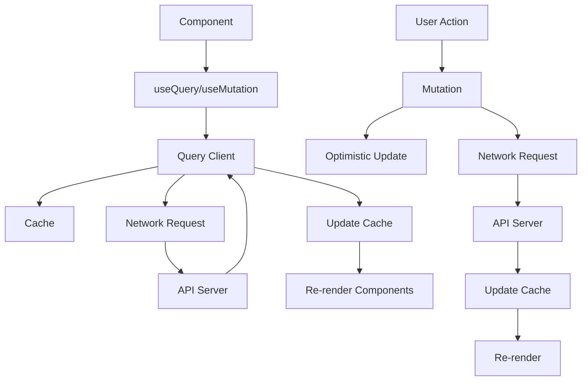
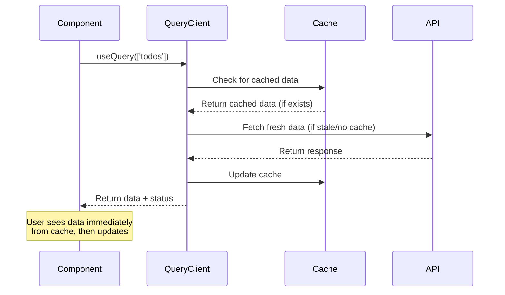
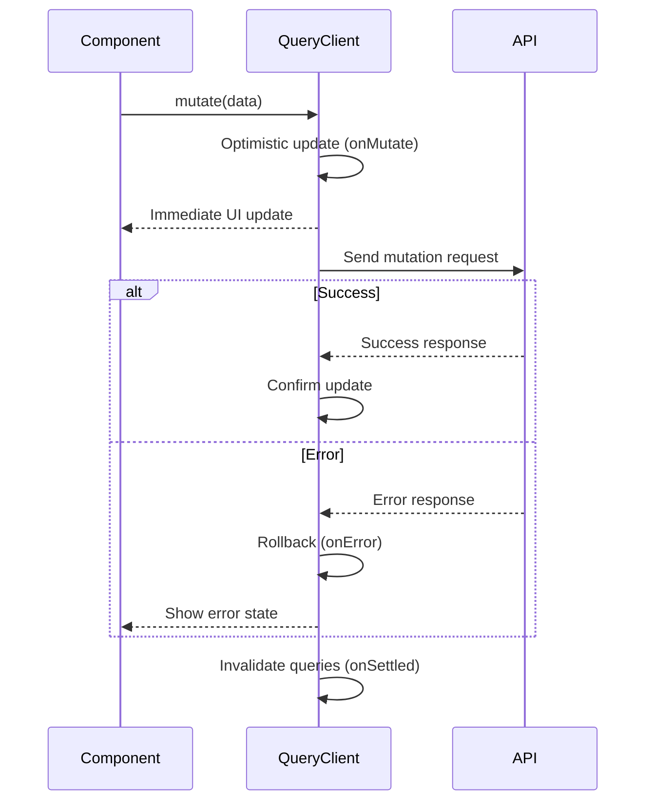

## What is TanStack Query?
TanStack Query (formerly React Query) is a powerful data synchronization library for React. It handles server state, caching, background updates, and more.

TanStack Query eliminates the need for manual state management of server data, providing a robust solution for data fetching, caching, and synchronization in React applications.

## Core Concepts

### 1. Query Client Setup
```typescript
// lib/queryClient.ts
import { QueryClient } from '@tanstack/react-query';

export const queryClient = new QueryClient({
  defaultOptions: {
    queries: {
      staleTime: 5 * 60 * 1000, // 5 minutes
      cacheTime: 10 * 60 * 1000, // 10 minutes
      retry: 1,
    },
  },
});
```

### 2. Provider Setup
```typescript
// main.tsx
import { QueryClientProvider } from '@tanstack/react-query';
import { ReactQueryDevtools } from '@tanstack/react-query-devtools';
import { queryClient } from './lib/queryClient';

ReactDOM.createRoot(document.getElementById('root')!).render(
  <QueryClientProvider client={queryClient}>
    <App />
    <ReactQueryDevtools initialIsOpen={false} />
  </QueryClientProvider>
);
```

## Complete Example: Todo App with TanStack Query

### 1. API Service Layer
```typescript
// services/todoService.ts
export interface Todo {
  id: string;
  text: string;
  completed: boolean;
  createdAt: string;
}

// Mock API functions
export const todoService = {
  getTodos: async (): Promise<Todo[]> => {
    const stored = localStorage.getItem('todos');
    return stored ? JSON.parse(stored) : [];
  },

  createTodo: async (text: string): Promise<Todo> => {
    const newTodo: Todo = {
      id: Math.random().toString(36).substr(2, 9),
      text,
      completed: false,
      createdAt: new Date().toISOString(),
    };
    
    const todos = await todoService.getTodos();
    const updatedTodos = [...todos, newTodo];
    localStorage.setItem('todos', JSON.stringify(updatedTodos));
    
    return newTodo;
  },

  updateTodo: async (id: string, updates: Partial<Todo>): Promise<Todo> => {
    const todos = await todoService.getTodos();
    const updatedTodos = todos.map(todo =>
      todo.id === id ? { ...todo, ...updates } : todo
    );
    localStorage.setItem('todos', JSON.stringify(updatedTodos));
    
    return updatedTodos.find(todo => todo.id === id)!;
  },

  deleteTodo: async (id: string): Promise<void> => {
    const todos = await todoService.getTodos();
    const updatedTodos = todos.filter(todo => todo.id !== id);
    localStorage.setItem('todos', JSON.stringify(updatedTodos));
  },
};
```

### 2. Custom Query Hooks
```typescript
// hooks/useTodos.ts
import { useQuery, useMutation, useQueryClient } from '@tanstack/react-query';
import { todoService, Todo } from '../services/todoService';

export const useTodos = () => {
  return useQuery({
    queryKey: ['todos'],
    queryFn: todoService.getTodos,
  });
};

export const useCreateTodo = () => {
  const queryClient = useQueryClient();

  return useMutation({
    mutationFn: (text: string) => todoService.createTodo(text),
    onSuccess: () => {
      queryClient.invalidateQueries({ queryKey: ['todos'] });
    },
  });
};

export const useUpdateTodo = () => {
  const queryClient = useQueryClient();

  return useMutation({
    mutationFn: ({ id, updates }: { id: string; updates: Partial<Todo> }) =>
      todoService.updateTodo(id, updates),
    onSuccess: () => {
      queryClient.invalidateQueries({ queryKey: ['todos'] });
    },
  });
};

export const useDeleteTodo = () => {
  const queryClient = useQueryClient();

  return useMutation({
    mutationFn: (id: string) => todoService.deleteTodo(id),
    onSuccess: () => {
      queryClient.invalidateQueries({ queryKey: ['todos'] });
    },
  });
};
```

### 3. Components
```typescript
// components/TodoForm.tsx
import { useState } from 'react';
import { useCreateTodo } from '../hooks/useTodos';

export const TodoForm: React.FC = () => {
  const [text, setText] = useState('');
  const createTodo = useCreateTodo();

  const handleSubmit = (e: React.FormEvent) => {
    e.preventDefault();
    if (text.trim()) {
      createTodo.mutate(text.trim());
      setText('');
    }
  };

  return (
    <form onSubmit={handleSubmit} className="todo-form">
      <input
        type="text"
        value={text}
        onChange={(e) => setText(e.target.value)}
        placeholder="Add a new todo..."
        disabled={createTodo.isPending}
      />
      <button type="submit" disabled={createTodo.isPending}>
        {createTodo.isPending ? 'Adding...' : 'Add'}
      </button>
      {createTodo.isError && (
        <span className="error">Error adding todo</span>
      )}
    </form>
  );
};
```

```typescript
// components/TodoItem.tsx
import { Todo } from '../services/todoService';
import { useUpdateTodo, useDeleteTodo } from '../hooks/useTodos';

interface TodoItemProps {
  todo: Todo;
}

export const TodoItem: React.FC<TodoItemProps> = ({ todo }) => {
  const updateTodo = useUpdateTodo();
  const deleteTodo = useDeleteTodo();

  const handleToggle = () => {
    updateTodo.mutate({
      id: todo.id,
      updates: { completed: !todo.completed },
    });
  };

  const handleDelete = () => {
    deleteTodo.mutate(todo.id);
  };

  return (
    <div className={`todo-item ${todo.completed ? 'completed' : ''}`}>
      <input
        type="checkbox"
        checked={todo.completed}
        onChange={handleToggle}
        disabled={updateTodo.isPending}
      />
      <span className="todo-text">{todo.text}</span>
      <button
        onClick={handleDelete}
        disabled={deleteTodo.isPending}
      >
        {deleteTodo.isPending ? 'Deleting...' : 'Delete'}
      </button>
      
      {(updateTodo.isError || deleteTodo.isError) && (
        <span className="error">Error</span>
      )}
    </div>
  );
};
```

```typescript
// components/TodoList.tsx
import { useState } from 'react';
import { useTodos } from '../hooks/useTodos';
import { TodoItem } from './TodoItem';

type Filter = 'all' | 'active' | 'completed';

export const TodoList: React.FC = () => {
  const [filter, setFilter] = useState<Filter>('all');
  const { data: todos, isLoading, error } = useTodos();

  const filteredTodos = todos?.filter(todo => {
    switch (filter) {
      case 'active':
        return !todo.completed;
      case 'completed':
        return todo.completed;
      default:
        return true;
    }
  });

  if (isLoading) return <div>Loading todos...</div>;
  if (error) return <div>Error loading todos</div>;

  return (
    <div className="todo-list">
      <div className="filter-buttons">
        {(['all', 'active', 'completed'] as Filter[]).map(f => (
          <button
            key={f}
            onClick={() => setFilter(f)}
            className={filter === f ? 'active' : ''}
          >
            {f.charAt(0).toUpperCase() + f.slice(1)}
          </button>
        ))}
      </div>

      <div className="todos">
        {filteredTodos?.map(todo => (
          <TodoItem key={todo.id} todo={todo} />
        ))}
        {filteredTodos?.length === 0 && (
          <div className="empty">No todos found</div>
        )}
      </div>
    </div>
  );
};
```

```typescript
// components/Stats.tsx
import { useTodos } from '../hooks/useTodos';

export const Stats: React.FC = () => {
  const { data: todos } = useTodos();

  const total = todos?.length || 0;
  const completed = todos?.filter(t => t.completed).length || 0;
  const active = total - completed;

  return (
    <div className="stats">
      <div>Total: {total}</div>
      <div>Completed: {completed}</div>
      <div>Active: {active}</div>
    </div>
  );
};
```

### 4. Main App Component
```typescript
// App.tsx
import { TodoForm } from './components/TodoForm';
import { TodoList } from './components/TodoList';
import { Stats } from './components/Stats';

function App() {
  return (
    <div className="app">
      <h1>TanStack Query Todo App</h1>
      <TodoForm />
      <TodoList />
      <Stats />
    </div>
  );
}

export default App;
```

## Advanced Patterns

### 1. Optimistic Updates
```typescript
// hooks/useOptimisticTodos.ts
import { useQueryClient } from '@tanstack/react-query';

export const useOptimisticUpdateTodo = () => {
  const queryClient = useQueryClient();

  return useMutation({
    mutationFn: ({ id, updates }: { id: string; updates: Partial<Todo> }) =>
      todoService.updateTodo(id, updates),
    onMutate: async ({ id, updates }) => {
      // Cancel any outgoing refetches
      await queryClient.cancelQueries({ queryKey: ['todos'] });

      // Snapshot the previous value
      const previousTodos = queryClient.getQueryData<Todo[]>(['todos']);

      // Optimistically update to the new value
      queryClient.setQueryData<Todo[]>(['todos'], (old) =>
        old?.map(todo => (todo.id === id ? { ...todo, ...updates } : todo))
      );

      return { previousTodos };
    },
    onError: (err, variables, context) => {
      // Rollback on error
      queryClient.setQueryData(['todos'], context?.previousTodos);
    },
    onSettled: () => {
      // Always refetch after error or success
      queryClient.invalidateQueries({ queryKey: ['todos'] });
    },
  });
};
```

### 2. Paginated Queries
```typescript
// hooks/usePaginatedTodos.ts
export const usePaginatedTodos = (page: number, limit: number = 10) => {
  return useQuery({
    queryKey: ['todos', { page, limit }],
    queryFn: () => todoService.getPaginatedTodos(page, limit),
    keepPreviousData: true, // Smooth transitions between pages
  });
};
```

### 3. Infinite Queries
```typescript
// hooks/useInfiniteTodos.ts
export const useInfiniteTodos = () => {
  return useInfiniteQuery({
    queryKey: ['todos', 'infinite'],
    queryFn: ({ pageParam = 0 }) => todoService.getTodosPage(pageParam, 10),
    getNextPageParam: (lastPage, allPages) => {
      return lastPage.length === 10 ? allPages.length : undefined;
    },
  });
};
```

### 4. Prefetching
```typescript
// hooks/useTodoPrefetching.ts
export const useTodoPrefetching = () => {
  const queryClient = useQueryClient();

  const prefetchTodo = (id: string) => {
    queryClient.prefetchQuery({
      queryKey: ['todo', id],
      queryFn: () => todoService.getTodoById(id),
    });
  };

  return { prefetchTodo };
};
```


### TanStack Query Data Flow


### Query Lifecycle


### Mutation Flow with Optimistic Updates


## Best Practices

1. **Query Keys**: Use structured query keys for better cache management
2. **Error Handling**: Always handle loading and error states
3. **Stale Time**: Configure appropriate staleTime for your data
4. **Selectors**: Use selectors to transform data efficiently
5. **Prefetching**: Prefetch data for better UX
6. **Optimistic Updates**: Use for immediate UI feedback

## Key Benefits

- ✅ **Automatic Caching**: Smart caching out of the box
- ✅ **Background Updates**: Automatic refetching and synchronization
- ✅ **Pagination**: Built-in support for paginated data
- ✅ **Optimistic UI**: Smooth user experience
- ✅ **DevTools**: Excellent development tools
- ✅ **TypeScript**: First-class TypeScript support
- ✅ **Bundle Size**: Relatively small (~11kB)

