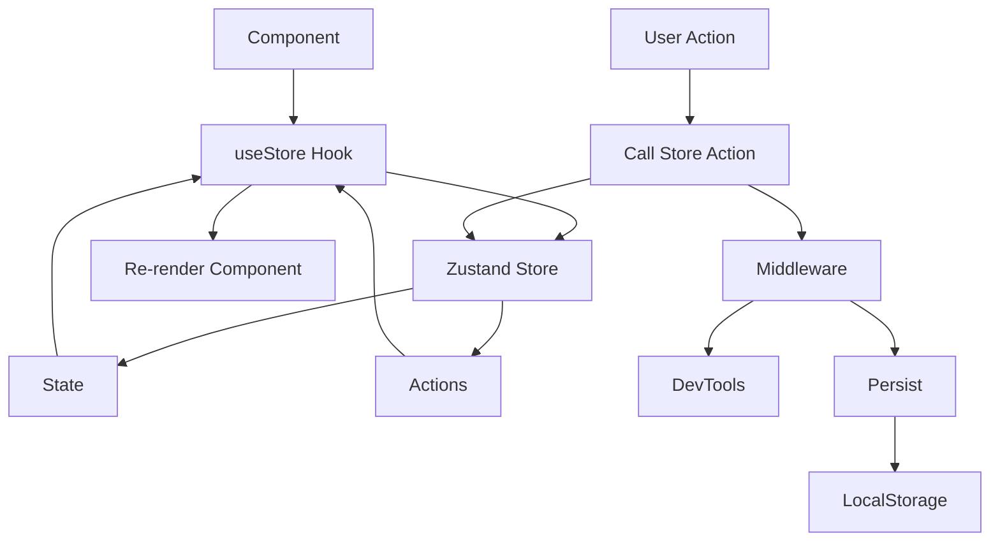
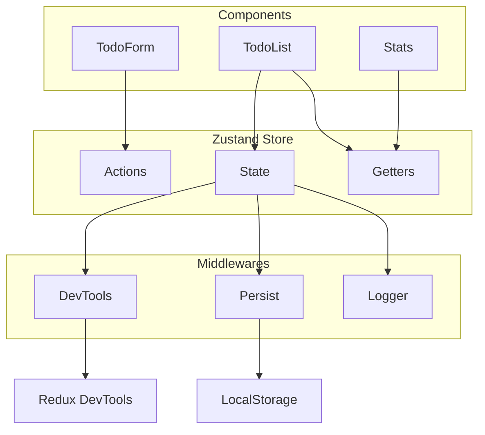

## What is Zustand?
Zustand is a small, fast, and scalable state management solution with a simple API. It's perfect for React applications when you need more than context but less than Redux.

Zustand provides a clean, type-safe, and efficient state management solution for React applications without the boilerplate of Redux.

## Core Concepts

### 1. Store Creation
```typescript
import { create } from 'zustand';
import { devtools, persist } from 'zustand/middleware';

interface BearState {
  bears: number;
  increase: (by: number) => void;
  removeAllBears: () => void;
}

export const useBearStore = create<BearState>()(
  devtools(
    persist(
      (set) => ({
        bears: 0,
        increase: (by) => set((state) => ({ bears: state.bears + by })),
        removeAllBears: () => set({ bears: 0 }),
      }),
      {
        name: 'bear-storage', // localStorage key
      }
    )
  )
);
```

### 2. Store Usage in Components
```typescript
import { useBearStore } from './stores/bearStore';

const BearCounter: React.FC = () => {
  const bears = useBearStore((state) => state.bears);
  return <h1>{bears} bears around here</h1>;
};

const Controls: React.FC = () => {
  const increase = useBearStore((state) => state.increase);
  const removeAll = useBearStore((state) => state.removeAllBears);
  
  return (
    <div>
      <button onClick={() => increase(1)}>Add bear</button>
      <button onClick={removeAll}>Remove all</button>
    </div>
  );
};
```

## Complete Example: Todo App with Zustand

### 1. Store Definition
```typescript
// stores/todoStore.ts
import { create } from 'zustand';
import { devtools, persist } from 'zustand/middleware';

export interface Todo {
  id: string;
  text: string;
  completed: boolean;
  createdAt: Date;
}

interface TodoStore {
  todos: Todo[];
  filter: 'all' | 'active' | 'completed';
  addTodo: (text: string) => void;
  toggleTodo: (id: string) => void;
  deleteTodo: (id: string) => void;
  setFilter: (filter: 'all' | 'active' | 'completed') => void;
  getFilteredTodos: () => Todo[];
  stats: {
    total: number;
    completed: number;
    active: number;
  };
}

export const useTodoStore = create<TodoStore>()(
  devtools(
    persist(
      (set, get) => ({
        todos: [],
        filter: 'all',
        
        addTodo: (text: string) =>
          set((state) => ({
            todos: [
              ...state.todos,
              {
                id: Math.random().toString(36).substr(2, 9),
                text,
                completed: false,
                createdAt: new Date(),
              },
            ],
          })),
        
        toggleTodo: (id: string) =>
          set((state) => ({
            todos: state.todos.map((todo) =>
              todo.id === id ? { ...todo, completed: !todo.completed } : todo
            ),
          })),
        
        deleteTodo: (id: string) =>
          set((state) => ({
            todos: state.todos.filter((todo) => todo.id !== id),
          })),
        
        setFilter: (filter: 'all' | 'active' | 'completed') =>
          set({ filter }),
        
        getFilteredTodos: () => {
          const { todos, filter } = get();
          switch (filter) {
            case 'active':
              return todos.filter((todo) => !todo.completed);
            case 'completed':
              return todos.filter((todo) => todo.completed);
            default:
              return todos;
          }
        },
        
        stats: {
          get total() {
            return get().todos.length;
          },
          get completed() {
            return get().todos.filter((todo) => todo.completed).length;
          },
          get active() {
            return get().todos.filter((todo) => !todo.completed).length;
          },
        },
      }),
      {
        name: 'todo-storage',
        partialize: (state) => ({ todos: state.todos }), // Only persist todos
      }
    ),
    { name: 'TodoStore' }
  )
);
```

### 2. Components
```typescript
// components/TodoForm.tsx
import { useState } from 'react';
import { useTodoStore } from '../stores/todoStore';

export const TodoForm: React.FC = () => {
  const [text, setText] = useState('');
  const addTodo = useTodoStore((state) => state.addTodo);

  const handleSubmit = (e: React.FormEvent) => {
    e.preventDefault();
    if (text.trim()) {
      addTodo(text.trim());
      setText('');
    }
  };

  return (
    <form onSubmit={handleSubmit} className="todo-form">
      <input
        type="text"
        value={text}
        onChange={(e) => setText(e.target.value)}
        placeholder="Add a new todo..."
        className="todo-input"
      />
      <button type="submit" className="add-button">
        Add
      </button>
    </form>
  );
};
```

```typescript
// components/TodoItem.tsx
import { useTodoStore, Todo } from '../stores/todoStore';

interface TodoItemProps {
  todo: Todo;
}

export const TodoItem: React.FC<TodoItemProps> = ({ todo }) => {
  const toggleTodo = useTodoStore((state) => state.toggleTodo);
  const deleteTodo = useTodoStore((state) => state.deleteTodo);

  return (
    <div className={`todo-item ${todo.completed ? 'completed' : ''}`}>
      <input
        type="checkbox"
        checked={todo.completed}
        onChange={() => toggleTodo(todo.id)}
        className="todo-checkbox"
      />
      <span className="todo-text">{todo.text}</span>
      <button
        onClick={() => deleteTodo(todo.id)}
        className="delete-button"
      >
        Delete
      </button>
    </div>
  );
};
```

```typescript
// components/TodoList.tsx
import { useTodoStore } from '../stores/todoStore';
import { TodoItem } from './TodoItem';

export const TodoList: React.FC = () => {
  const filteredTodos = useTodoStore((state) => state.getFilteredTodos());
  const filter = useTodoStore((state) => state.filter);
  const setFilter = useTodoStore((state) => state.setFilter);

  return (
    <div className="todo-list">
      <div className="filter-buttons">
        <button
          onClick={() => setFilter('all')}
          className={filter === 'all' ? 'active' : ''}
        >
          All
        </button>
        <button
          onClick={() => setFilter('active')}
          className={filter === 'active' ? 'active' : ''}
        >
          Active
        </button>
        <button
          onClick={() => setFilter('completed')}
          className={filter === 'completed' ? 'active' : ''}
        >
          Completed
        </button>
      </div>

      <div className="todos">
        {filteredTodos.map((todo) => (
          <TodoItem key={todo.id} todo={todo} />
        ))}
      </div>
    </div>
  );
};
```

```typescript
// components/Stats.tsx
import { useTodoStore } from '../stores/todoStore';

export const Stats: React.FC = () => {
  const stats = useTodoStore((state) => state.stats);

  return (
    <div className="stats">
      <div>Total: {stats.total}</div>
      <div>Completed: {stats.completed}</div>
      <div>Active: {stats.active}</div>
    </div>
  );
};
```

### 3. Main App Component
```typescript
// App.tsx
import { TodoForm } from './components/TodoForm';
import { TodoList } from './components/TodoList';
import { Stats } from './components/Stats';

function App() {
  return (
    <div className="app">
      <h1>Zustand Todo App</h1>
      <TodoForm />
      <TodoList />
      <Stats />
    </div>
  );
}

export default App;
```

## Advanced Patterns

### 1. Async Actions
```typescript
// stores/userStore.ts
interface User {
  id: number;
  name: string;
  email: string;
}

interface UserStore {
  user: User | null;
  loading: boolean;
  error: string | null;
  fetchUser: (id: number) => Promise<void>;
  updateUser: (user: Partial<User>) => void;
}

export const useUserStore = create<UserStore>()((set, get) => ({
  user: null,
  loading: false,
  error: null,
  
  fetchUser: async (id: number) => {
    set({ loading: true, error: null });
    try {
      const response = await fetch(`/api/users/${id}`);
      const user = await response.json();
      set({ user, loading: false });
    } catch (error) {
      set({ 
        error: error instanceof Error ? error.message : 'Failed to fetch user',
        loading: false 
      });
    }
  },
  
  updateUser: (updates: Partial<User>) => {
    const { user } = get();
    if (user) {
      set({ user: { ...user, ...updates } });
    }
  },
}));
```

### 2. Derived State with Selectors
```typescript
// Custom hook for optimized selects
export const useUserInfo = () => {
  const name = useUserStore((state) => state.user?.name);
  const email = useUserStore((state) => state.user?.email);
  const isLoading = useUserStore((state) => state.loading);
  
  return { name, email, isLoading };
};

// Usage in component
const UserProfile = () => {
  const { name, email, isLoading } = useUserInfo();
  
  if (isLoading) return <div>Loading...</div>;
  
  return (
    <div>
      <h2>{name}</h2>
      <p>{email}</p>
    </div>
  );
};
```

### 3. Middleware Pattern
```typescript
// Custom middleware logger
const logger = (config: any) => (set: any, get: any, api: any) =>
  config(
    (args: any) => {
      console.log('  applying', args);
      set(args);
      console.log('  new state', get());
    },
    get,
    api
  );

// Store with custom middleware
export const useLoggedStore = create(
  logger((set: any) => ({
    count: 0,
    increment: () => set((state: any) => ({ count: state.count + 1 })),
  }))
);
```

### Zustand Data Flow


### Store Architecture


## Best Practices

1. **Type Safety**: Always define interfaces for your store state
2. **Selectors**: Use selectors to prevent unnecessary re-renders
3. **Middleware**: Use devtools and persist for better development experience
4. **Separation**: Keep store logic separate from components
5. **Derived State**: Use getters for computed values
6. **Async Handling**: Handle loading and error states in async actions

## Key Benefits

- ✅ **Tiny**: Very small bundle size (~1kB)
- ✅ **Simple**: Minimal API surface
- ✅ **Fast**: Optimized re-renders with selector functions
- ✅ **Flexible**: Works with any React setup
- ✅ **TypeScript**: Excellent TypeScript support
- ✅ **Middleware**: Extensible with middleware system

