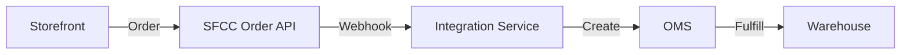

 
# Complete Guide to Integrating Back-End Services with Salesforce Commerce (SFCC)

**Salesforce B2C Commerce Cloud (SFCC)** provides a robust set of APIs that enable seamless integration with back-end systems such as ERPs, OMS, PIM, and third-party fulfillment services. 

This guide covers everything you need to know about integrating SFCC with your enterprise back-end, including catalog management, pricing, promotions, inventory, and order management flows.

---


## 1. Understanding the Salesforce Commerce API Landscape

Salesforce B2C Commerce Cloud provides two primary API frameworks that serve as the foundation for back-end integrations . Understanding their distinct purposes is critical for designing effective integration solutions.

### OCAPI (Open Commerce API)

OCAPI is the original integration workhorse behind Salesforce Commerce Cloud, in production for over a decade . It provides deep access to business logic and supports thousands of production storefronts.

| Aspect | Description |
|--------|-------------|
| **Maturity** | Battle-tested, stable, widely documented |
| **API Types** | Shop API (customer-facing), Data API (admin/back-end), Meta API (discovery)  |
| **Authentication** | OAuth 2.0 Client Credentials flow |
| **Use Cases** | Legacy integrations, deep customizations, complex business logic |
| **Future** | No new feature development—bug fixes only  |

### SCAPI (Salesforce Commerce API)

SCAPI is the modern, cloud-native API framework introduced in 2020 to support headless and composable commerce architectures .

| Aspect | Description |
|--------|-------------|
| **Maturity** | Active development; over 200 feature releases since 2021  |
| **API Families** | Shopper APIs (customer-facing), Admin APIs (back-end), Custom APIs  |
| **Authentication** | SLAS (Shopper Login and API Access Service) + OAuth 2.0 |
| **Use Cases** | New headless storefronts, composable commerce, multi-channel experiences |
| **Future** | Primary focus for Salesforce innovation |

### API Comparison Summary

| Feature | OCAPI | SCAPI |
|---------|-------|-------|
| **API Style** | REST (Shop/Data/Meta) | REST (Shopper/Admin)  |
| **Catalog Management** | Yes (Data API) | Yes (Admin API) |
| **Pricing & Promotions** | Yes | Yes, with enhanced caching |
| **Inventory** | Yes | Yes (via Shopper Products API)  |
| **Order Management** | Yes (Data API) | Yes (Shopper Orders API) |
| **Rate Limits** | Standard throttling | Higher scalability claims  |
| **Personalization** | Limited | Native Shopper Context support  |

### Which API Should You Use?

| Scenario | Recommendation |
|----------|----------------|
| **New integration project** | Start with SCAPI—it's the future  |
| **Maintaining existing OCAPI integration** | Continue using OCAPI while planning migration |
| **Headless storefront** | SCAPI Shopper APIs |
| **Complex custom business logic** | OCAPI may still be required; check feature availability |
| **Hybrid approach** | Run both APIs in parallel during migration  |

---

## 2. Authentication and Security Fundamentals

All SFCC API calls require OAuth 2.0 authentication. Understanding the authentication flow is essential for any integration.

### OAuth 2.0 Client Credentials Flow

This is the primary authentication method for server-to-server integrations .

```bash
# Step 1: Request an Access Token
curl -X POST \
  https://account.demandware.com/dw/oauth2/access_token \
  -H 'Content-Type: application/x-www-form-urlencoded' \
  --user 'YOUR_CLIENT_ID:YOUR_CLIENT_SECRET' \
  -d 'grant_type=client_credentials'
```

**Successful response:**
```json
{
  "access_token": "eyJhbGciOiJIUzI1NiJ9...",
  "token_type": "Bearer",
  "expires_in": 1799
}
```

### Authentication Steps

| Step | Description |
|------|-------------|
| **1. Configure API Client** | Create API Client ID and Secret in Business Manager |
| **2. Set Permissions** | Assign granular permissions for each Client ID  |
| **3. Obtain Token** | POST credentials to OAuth 2.0 token endpoint |
| **4. Use Token** | Include `Authorization: Bearer {token}` header in all API calls |
| **5. Refresh Token** | Request new token before expiration (typically 30 minutes) |

### Security Best Practices

| Practice | Implementation |
|----------|----------------|
| **Never hardcode credentials** | Use AWS Secrets Manager, Azure Key Vault, or HashiCorp Vault  |
| **Use dedicated API Clients** | Create separate clients for each integration  |
| **Apply least privilege** | Grant only necessary permissions per client |
| **Enforce HTTPS/TLS** | All API transactions must be encrypted  |
| **Rotate secrets regularly** | Implement automated secret rotation |
| **Monitor authentication failures** | Set alerts for repeated failures |

### SCAPI Authentication (SLAS)

For SCAPI Shopper APIs, authentication uses the Shopper Login and API Access Service (SLAS) :

```javascript
// Example SDK configuration
import { ShopperProducts } from "commerce-sdk-isomorphic";

const clientConfig = {
  parameters: {
    clientId: "YOUR_CLIENT_ID",
    organizationId: "YOUR_ORG_ID",
    shortCode: "YOUR_SHORT_CODE",
    siteId: "YOUR_SITE_ID"
  }
};

const shopperProductsClient = new ShopperProducts(clientConfig);
```

---

## 3. Catalog Management Integration

Catalog integration involves synchronizing product data between your back-end systems (PIM, ERP) and SFCC.

### Core Catalog Components

| Component | Description | API Access |
|-----------|-------------|------------|
| **Products** | Core product information (SKU, name, description) | OCAPI Data API, SCAPI Shopper Products |
| **Categories** | Hierarchical product organization | Both APIs support category retrieval |
| **Variations** | Product variants (size, color, etc.) | SCAPI includes variation support  |
| **Price Books** | Pricing data by customer group or region | SCAPI Admin API |
| **Images & Media** | Product images, videos, documents | SCAPI includes image URLs |

### Catalog Sync Patterns

#### Pattern 1: Full Site Sync (Initial Load)

Performs comprehensive synchronization of all catalog data .

```python
# Pseudo-code for full catalog sync
def full_catalog_sync():
    # 1. Fetch all products from source system (PIM/ERP)
    products = fetch_all_products_from_source()
    
    # 2. Transform to SFCC format
    transformed_products = transform_to_sfcc_format(products)
    
    # 3. Batch upload to SFCC
    for batch in chunk(transformed_products, 50):
        upload_products_to_sfcc(batch)
    
    # 4. Verify sync completion
    verify_sync_status()
```

**When to use:** Initial implementation, periodic full refreshes, disaster recovery.

#### Pattern 2: Delta Sync (Incremental Updates)

Synchronizes only changed products since the last sync .

```python
# Pseudo-code for delta sync
def delta_sync(last_sync_timestamp):
    # 1. Fetch changed products from source
    changed_products = fetch_changed_products_since(last_sync_timestamp)
    
    # 2. Process updates
    for product in changed_products:
        update_product_in_sfcc(product)
    
    # 3. Handle deletions
    deleted_products = fetch_deleted_products_since(last_sync_timestamp)
    for product_id in deleted_products:
        mark_product_offline_in_sfcc(product_id)
```

**When to use:** Ongoing maintenance, real-time updates, high-volume environments.

#### Pattern 3: On-Demand Targeted Sync

Sync specific products by SKU for urgent changes .

```python
# Pseudo-code for targeted sync
def targeted_sync(sku_list):
    for sku in sku_list:
        product = fetch_product_by_sku(sku)
        update_product_in_sfcc(product)
```

**When to use:** Price corrections, urgent product launches, error recovery.

### OCAPI Data API Example - Fetch Product

```bash
# Using OCAPI Data API to retrieve product details
curl -X GET \
  'https://your-instance.demandware.net/s/SiteGenesis/dw/data/v23_1/products/25595358M?select=(**)' \
  -H 'Authorization: Bearer YOUR_ACCESS_TOKEN' \
  -H 'Content-Type: application/json'
```

### SCAPI Shopper Products Example

```javascript
// Using SCAPI Shopper Products SDK
const product = await shopperProductsClient.getProduct({
  parameters: {
    id: "25595358M",
    siteId: "SiteGenesis"
  }
});

console.log(product.name, product.price, product.availability);
```

### Multi-Locale Catalog Management

For global deployments, manage localized product content :

| Locale Consideration | Implementation |
|---------------------|----------------|
| **Product names** | Sync localized versions from source |
| **Descriptions** | Maintain separate fields per locale |
| **Pricing** | Different price books per currency/region |
| **Availability** | Region-specific inventory levels |
| **Categories** | Localized category names and structures |

---

## 4. Pricing and Promotions Integration

Integrating pricing and promotions requires careful coordination between back-end systems and SFCC.

### Pricing Data Flow

```
ERP/PIM → Price Calculation → SFCC Price Book → Storefront Display
```

### Price Book Structure

| Component | Description |
|-----------|-------------|
| **Price Book ID** | Unique identifier for pricing configuration |
| **Currency** | Currency of all prices in the book |
| **Assignment** | Customer groups, sites, or regions |
| **Price Tables** | Product-to-price mappings |

### OCAPI Price Sync Example

```bash
# Update product price using OCAPI Data API
curl -X PATCH \
  'https://your-instance.demandware.net/s/SiteGenesis/dw/data/v23_1/price_books/standard-price-book/product_prices/25595358M' \
  -H 'Authorization: Bearer YOUR_ACCESS_TOKEN' \
  -H 'Content-Type: application/json' \
  -d '{
    "price": 29.99,
    "currency": "USD"
  }'
```

### Promotion Integration

Promotions can be managed through OCAPI or SCAPI, with important considerations :

**Key Promotion Behaviors:**

| Promotion Type | Display on PDP/PLP | Display in Basket |
|----------------|-------------------|-------------------|
| **Product-specific discounts** | Yes (callout messages) | Yes |
| **Basket-level promotions** | No (requires basket context) | Yes |
| **Conditional promotions** | Partial | Full calculation |
| **Shipping promotions** | No | Yes |

### Pricing Best Practices

| Practice | Description |
|----------|-------------|
| **Cache price data** | Reduce API calls by caching infrequently changed pricing  |
| **Use price books for segmentation** | Separate price books by customer group or region |
| **Sync price changes promptly** | Price updates should trigger delta syncs |
| **Validate currency alignment** | Ensure price book currency matches site currency |
| **Monitor price sync failures** | Set alerts for failed price updates |

### SCAPI Shopper Context Personalization

SCAPI supports shopper-contextual pricing based on device, location, or customer segment :

```javascript
// Example: Personalized pricing based on shopper context
const product = await shopperProductsClient.getProduct({
  parameters: {
    id: "25595358M",
    siteId: "SiteGenesis"
  },
  headers: {
    'x-shopper-context': '{"device":"mobile"}'
  }
});
// Mobile users may receive different pricing
```

---

## 5. Inventory Management Integration

Inventory integration ensures accurate stock availability across all sales channels.

### Inventory Data Flow

```
ERP/WMS → Inventory Levels → SFCC Inventory → Storefront Display
```

### Inventory Sync Patterns

#### Pattern 1: Full Inventory Sync

Synchronize all inventory levels periodically (e.g., daily).

#### Pattern 2: Real-Time Inventory Updates

Push inventory changes as they occur (e.g., after order fulfillment).

#### Pattern 3: On-Demand Inventory Check

Query back-end inventory in real-time when a customer views a product.

### Inventory API Access

| Use Case | OCAPI | SCAPI |
|----------|-------|-------|
| **Check product availability** | Shop API (products) | Shopper Products API  |
| **Update inventory levels** | Data API | Admin API |
| **Multi-location inventory** | Inventory Lists | Admin API |

### SCAPI Inventory Example

The Shopper Products API returns inventory availability as part of product responses :

```javascript
const product = await shopperProductsClient.getProduct({
  parameters: {
    id: "PRODUCT_ID",
    siteId: "SiteGenesis"
  }
});

// Check availability
const inStock = product.availability.available;
const stockLevel = product.availability.atp; // Available to Promise
```

### Inventory Best Practices

| Practice | Description |
|----------|-------------|
| **Define ATP logic** | Establish Available-to-Promise rules in back-end |
| **Implement safety stock** | Maintain buffer stock to prevent overselling |
| **Set sync frequency** | Balance freshness with API rate limits |
| **Handle backorders** | Define behavior when inventory is depleted |
| **Monitor stock discrepancies** | Alert when SFCC and back-end inventory diverge |

---

## 6. Order Management Integration

Order management integration is critical for processing and fulfilling customer orders.

### Order Lifecycle

```
Order Created → Payment Authorized → Order Submitted → Fulfillment → Shipment → Order Complete
```

### OCAPI Order Flow

```bash
# 1. Create/Retrieve Basket
GET /dw/shop/v23_1/baskets/{basket_id}

# 2. Add Payment Instrument
POST /dw/shop/v23_1/baskets/{basket_id}/payment_instruments

# 3. Submit Order
POST /dw/shop/v23_1/orders

# 4. Retrieve Order Details
GET /dw/data/v23_1/orders/{order_no}
```

### Order Integration Patterns

#### Pattern 1: Real-Time Order Push

When an order is submitted in SFCC, immediately push to OMS/ERP.

```
Customer Checkout → SFCC Order Created → Webhook → Integration Service → OMS/ERP
```

#### Pattern 2: Batch Order Processing

Collect orders and process them in scheduled batches.

```
Orders Accumulate in SFCC → Scheduled Job → Export Orders → OMS Import
```

#### Pattern 3: Pull-Based Order Retrieval

External systems periodically pull new orders from SFCC.

```
OMS Scheduler → Query SFCC for New Orders → Process Orders → Update Status
```

### Order Status Management

| Status | Description | Next Actions |
|--------|-------------|--------------|
| **Created** | Order submitted, awaiting processing | Send to OMS |
| **Paid** | Payment captured | Begin fulfillment |
| **Shipped** | Items shipped | Update customer, send tracking |
| **Cancelled** | Order cancelled | Refund payment |
| **Completed** | Order fully processed | Archive |

### Order Sync Example - OCAPI

```bash
# Fetch orders placed after specific date
curl -X GET \
  'https://your-instance.demandware.net/s/SiteGenesis/dw/data/v23_1/order_search?query=creation_date:{"from":"2024-01-01T00:00:00Z"}&select=(order_no,creation_date,status,total)' \
  -H 'Authorization: Bearer YOUR_ACCESS_TOKEN'
```

### SCAPI Order Retrieval

```javascript
// Using SCAPI to fetch customer orders
const orders = await shopperOrdersClient.getOrders({
  parameters: {
    siteId: "SiteGenesis"
  }
});
```

### Order Integration Best Practices

| Practice | Description |
|----------|-------------|
| **Idempotent processing** | Handle duplicate order notifications gracefully |
| **Implement retry logic** | Retry failed OMS pushes with exponential backoff |
| **Monitor order failures** | Alert on orders not synced within SLA |
| **Track order status** | Maintain status history for troubleshooting |
| **Handle payment separately** | Authorize before order submission, capture after fulfillment |

---

## 7. Integration Architecture Patterns

Choose the right architecture pattern based on your requirements.

### Pattern 1: Direct API Integration

```
Back-End System → SFCC API (Direct Calls)
```

**Pros:** Simple, low latency, minimal infrastructure  
**Cons:** Tight coupling, rate limit exposure, complex error handling

### Pattern 2: Middleware Integration

```
Back-End System → Integration Middleware → SFCC API
```

**Pros:** Decoupling, centralized monitoring, transformation capabilities  
**Cons:** Additional infrastructure, potential latency

**Common Middleware Options:** MuleSoft, Celigo, Boomi, custom Node.js/Java services 

### Pattern 3: Event-Driven Architecture

```
SFCC Event → SNS/SQS → Integration Service → Back-End System
```

**Pros:** Loose coupling, resilience, scalability  
**Cons:** Complexity, eventual consistency

### Pre-Built Connectors

For specific integration scenarios, pre-built connectors may accelerate development:

| Connector | Purpose | Source |
|-----------|---------|--------|
| **Adobe Commerce SFCC Connector** | Catalog and price sync | Adobe App Builder  |
| **Custom SFCC Cartridges** | Extend SFCC with custom APIs | Salesforce Developer  |

---

## 8. Step-by-Step Integration Workflows

### Workflow 1: Catalog Product Creation


**Steps:**

| Step | Action | API |
|------|--------|-----|
| 1 | Extract product from PIM | PIM API |
| 2 | Transform to SFCC schema | Integration logic |
| 3 | Create product in SFCC | OCAPI Data / SCAPI Admin |
| 4 | Assign to categories | OCAPI Data / SCAPI Admin |
| 5 | Set pricing | Price Book API |
| 6 | Set inventory | Inventory API |
| 7 | Publish to site | Site Publishing API |

### Workflow 2: Order Processing



**Steps:**

| Step | Action | Responsible System |
|------|--------|-------------------|
| 1 | Order submitted | SFCC Storefront |
| 2 | Order created in SFCC | SFCC |
| 3 | Webhook triggers integration | SFCC → Integration Service |
| 4 | Order transformed | Integration Service |
| 5 | Order pushed to OMS | OMS |
| 6 | OMS acknowledges | OMS → Integration Service |
| 7 | Status updated in SFCC | Integration Service → SFCC |

### Workflow 3: Inventory Replenishment


**Steps:**

| Step | Action | Timing |
|------|--------|--------|
| 1 | Inventory change in WMS | Real-time |
| 2 | WMS sends webhook | Immediate |
| 3 | Integration service validates | Synchronous |
| 4 | SFCC inventory updated | Synchronous |
| 5 | Storefront reflects availability | Immediate |

---

## 9. Error Handling and Resilience

### HTTP Status Codes to Handle

| Code | Meaning | Handling Strategy |
|------|---------|-------------------|
| 200-299 | Success | Normal processing |
| 400 | Bad Request | Log, fix request format |
| 401 | Unauthorized | Refresh token, retry |
| 403 | Forbidden | Check permissions |
| 404 | Not Found | Verify resource exists |
| 429 | Too Many Requests | Exponential backoff, reduce rate  |
| 500-504 | Server Error | Retry with backoff |

### Retry Strategy

```python
def call_with_retry(api_call, max_retries=3):
    for attempt in range(max_retries):
        try:
            return api_call()
        except RateLimitException:
            wait_time = (2 ** attempt) * 1000  # Exponential backoff (ms)
            time.sleep(wait_time)
        except ServerErrorException:
            if attempt == max_retries - 1:
                raise
            time.sleep(1000 * (attempt + 1))
```

### Dead-Letter Queue (DLQ) Pattern

For asynchronous integrations, use DLQs to capture failed messages:

```
Failed Message → DLQ → Manual Review → Reprocess → Success
```

### Idempotency

Ensure operations can be safely retried without duplication:

| Strategy | Implementation |
|----------|----------------|
| **Idempotency keys** | Send unique key with each request; SFCC deduplicates |
| **Check before create** | Query for existing resource before creation |
| **Status tracking** | Maintain processing status in integration database |

---

## 10. Performance Optimization

### API Rate Limits

| API | Typical Limits | Mitigation |
|-----|---------------|------------|
| OCAPI | Per-client throttling | Distribute load across multiple clients  |
| SCAPI | Higher scalability | Use caching, reduce request frequency |

### Optimization Techniques

| Technique | Description | Impact |
|-----------|-------------|--------|
| **Field selection** | Use `select` parameter to request only needed fields  | Reduces payload size |
| **Batching** | Batch multiple operations in single API call | Reduces request count |
| **Caching** | Cache infrequently changed data (catalog, pricing) | Reduces API calls  |
| **Long polling** | For SCAPI, use web-tier caching  | Improves response time |
| **Parallel processing** | Process independent operations concurrently | Increases throughput |

### Field Selection Example

```bash
# Request only specific fields to reduce payload
curl -X GET \
  'https://your-instance.demandware.net/s/SiteGenesis/dw/shop/v23_1/products/25595358M?select=(id,name,price,(price))' \
  -H 'Authorization: Bearer TOKEN'
```

### Batch Operations

```bash
# Batch create products (pseudo-code)
POST /dw/data/v23_1/product_batch_jobs
{
  "products": [
    {"product_id": "SKU1", "name": "Product 1"},
    {"product_id": "SKU2", "name": "Product 2"}
  ]
}
```

---

## 11. Testing and Validation Strategies

### Testing Environment Recommendations

| Environment | Purpose | Data |
|-------------|---------|------|
| **Development Sandbox** | Initial development | Synthetic/test data |
| **Staging Sandbox** | Integration testing | Anonymized production-like data |
| **Production** | Live operations | Real customer data |

### Test Scenarios

| Scenario | What to Test |
|----------|--------------|
| **Product sync** | Correct mapping of all attributes, variations, categories |
| **Price sync** | Accuracy of price books, currency handling |
| **Inventory sync** | ATP values, multi-location inventory |
| **Order flow** | End-to-end order creation to fulfillment |
| **Error recovery** | Retry logic, DLQ handling, manual intervention |
| **Rate limiting** | Behavior under high load |

### Validation Checklist

```yaml
pre-production-validation:
  catalog:
    - All product IDs match source system
    - Categories correctly mapped
    - Images URLs are accessible
    - Variations (size/color) correctly linked
  
  pricing:
    - Price books contain correct products
    - Currency values are accurate
    - Promotions apply correctly
  
  inventory:
    - ATP values match source system
    - Multi-location inventory accurate
  
  orders:
    - Orders successfully push to OMS
    - Status updates flow back to SFCC
    - Cancellations processed correctly
```

### Load Testing

Conduct load testing for high-traffic events like seasonal sales :

| Test Type | Goal | Success Criteria |
|-----------|------|------------------|
| **Baseline** | Establish normal performance | < 200ms average response |
| **Peak** | Simulate holiday traffic | No 429 errors |
| **Sustained** | Long-duration high load | Stable throughput |
| **Recovery** | System recovers after overload | Returns to normal within 5 minutes |

---

## 12. Monitoring and Alerting

### Key Metrics to Monitor

| Metric | Description | Alert Threshold |
|--------|-------------|-----------------|
| **API response time** | Time to complete API call | > 1 second |
| **Error rate** | Percentage of failed requests | > 5% over 5 minutes |
| **Rate limit usage** | Proximity to API limits | > 80% |
| **Sync lag** | Time between source change and SFCC update | > 15 minutes |
| **Order sync failures** | Orders failing to reach OMS | > 0 |

### Monitoring Tools

| Tool | Purpose |
|------|---------|
| **Salesforce Commerce Cloud Log Center** | SFCC-specific logs |
| **CloudWatch** | Integration service metrics |
| **Datadog/New Relic** | End-to-end tracing |
| **Custom dashboards** | Business KPIs |

### Logging Best Practices

```json
{
  "timestamp": "2024-01-15T10:30:00Z",
  "level": "ERROR",
  "service": "order-integration",
  "operation": "push_order_to_oms",
  "order_id": "ORD-12345",
  "error_code": "OMS_TIMEOUT",
  "retry_count": 2,
  "correlation_id": "abc123-def456"
}
```

### Alert Configuration

| Alert | Condition | Action |
|-------|-----------|--------|
| **High error rate** | Errors > 10% in 5 minutes | PagerDuty notification |
| **Sync stalled** | No successful sync in 1 hour | Email to integration team |
| **Rate limit approaching** | > 80% of limit | Slack alert to capacity planning |
| **Order backlog** | > 100 orders pending sync | Increase consumer instances |

---

## 13. Best Practices and Recommendations

### Integration Design Principles

| Principle | Application |
|-----------|-------------|
| **Decouple systems** | Use message queues or middleware  |
| **Design for idempotency** | Support safe retries without duplication |
| **Implement graceful degradation** | Continue core operations when integrations fail |
| **Monitor everything** | Log all API calls, errors, and performance metrics |
| **Version proactively** | Plan for API version updates  |

### API Selection Recommendations

| Need | Recommendation |
|------|----------------|
| **New projects** | Use SCAPI exclusively where possible  |
| **Catalog sync** | SCAPI Admin API |
| **Order management** | SCAPI Shopper Orders API |
| **Pricing & promotions** | SCAPI with Shopper Context |
| **Complex custom logic** | OCAPI (check feature availability first) |
| **Migration** | Run both APIs in parallel  |

### Data Consistency

| Strategy | Implementation |
|----------|----------------|
| **Transactional boundaries** | No cross-API transactions—manage state in application  |
| **Compensating transactions** | Implement rollback logic for failed multi-step operations |
| **Audit trails** | Log all data changes for reconciliation |
| **Regular reconciliation** | Compare source and target systems periodically |

### Performance Recommendations

| Practice | Benefit |
|----------|---------|
| **Implement caching** | Reduce API calls for catalog/pricing data  |
| **Use batch operations** | Up to 10x reduction in API requests |
| **Optimize field selection** | Reduce payload size and processing time |
| **Distribute load** | Use multiple API clients for high-volume operations |

### Security Recommendations

| Practice | Implementation |
|----------|----------------|
| **Credential management** | Use secrets manager, never hardcode  |
| **Network security** | Use VPC endpoints where available |
| **Audit logging** | Log all authentication and authorization events |
| **Regular reviews** | Quarterly permission and access reviews |

### SFCC-Specific Recommendations

| Area | Recommendation |
|------|----------------|
| **Hooks for customization** | Use before/after hooks to inject custom logic  |
| **Feature switches** | Enable SCAPI hooks via Business Manager  |
| **Site selection** | Specify correct site ID in API calls  |
| **Locale management** | Handle multi-locale data carefully in sync processes  |

---

## 14. SFCC Integration Glossary

This glossary includes key terms directly related to Salesforce Commerce Cloud integration.

---

### A

**Admin API**
SCAPI family for merchant-facing operations including catalog, inventory, price book, and customer management .

**ATP (Available to Promise)**
Inventory metric indicating quantity available for immediate customer purchase.

---

### C

**Cartridge**
A deployable package of code and configuration that extends SFCC functionality. Custom cartridges can expose new APIs for integration .

**Client Credentials Flow**
OAuth 2.0 authentication flow used for server-to-server integrations. Uses Client ID and Client Secret to obtain access tokens .

**Composable Commerce**
Architectural approach that decouples front-end presentation from back-end commerce logic. SCAPI is built to support composable architectures .

---

### D

**Data API**
OCAPI family for administrator and system integration access. Used for managing catalog data, inventory, orders, and customers from back-end systems .

**Dead-Letter Queue (DLQ)**
Storage for messages that failed processing after multiple retry attempts, enabling manual review and reprocessing.

**Delta Sync**
Synchronization pattern that transfers only changed data since the last sync, rather than full data sets .

---

### E

**Exponential Backoff**
Retry strategy where wait time increases exponentially with each attempt (e.g., 1s, 2s, 4s, 8s). Recommended for handling rate limit responses .

---

### H

**Headless Commerce**
Architecture separating front-end presentation layer from back-end commerce functionality. SFCC supports headless via OCAPI and SCAPI .

**Hook**
Custom server-side logic that executes before, after, or to modify responses for API requests. Available for Basket, Order, Customer, and other resources .

---

### I

**Idempotency**
Property ensuring that performing an operation multiple times has the same effect as performing it once. Critical for safe retries in order processing.

---

### M

**Meta API**
OCAPI family for discovering available API versions, resources, methods, and data structures for a given SFCC instance .

**Middleware**
Integration layer that sits between back-end systems and SFCC, handling transformation, routing, monitoring, and error recovery .

---

### O

**OAuth 2.0**
Industry-standard protocol for authorization. SFCC APIs use OAuth 2.0 Client Credentials flow for server-to-server authentication .

**OCAPI (Open Commerce API)**
Legacy SFCC API framework with Shop, Data, and Meta API families. Stable but receiving no new feature development .

**OMS (Order Management System)**
Back-end system responsible for order fulfillment, inventory management, and shipment processing.

---

### P

**PIM (Product Information Management)**
Back-end system managing master product data, including attributes, categories, media, and localization.

**Price Book**
SFCC container for pricing information, organized by currency and customer segment .

---

### R

**Rate Limiting**
Throttling mechanism that limits API request frequency per client to protect platform stability. Returns HTTP 429 when exceeded .

**Reconciliation**
Process of comparing data between source and target systems to identify and resolve discrepancies.

---

### S

**SCAPI (Salesforce Commerce API)**
Modern SFCC API framework introduced in 2020 for headless and composable commerce. Includes Shopper APIs and Admin APIs .

**SFCC (Salesforce Commerce Cloud)**
Salesforce's enterprise e-commerce platform (formerly Demandware). Provides OCAPI and SCAPI for integration .

**Shop API**
OCAPI family for customer-facing operations including product browsing, basket management, checkout, and order submission .

**Shopper API**
SCAPI family for customer-facing operations. Includes Shopper Products, Shopper Baskets, Shopper Orders, and Shopper Customers .

**SLAS (Shopper Login and API Access Service)**
SCAPI authentication service providing OAuth 2.0 tokens for shopper API calls .

---

### T

**Throttling**
See **Rate Limiting**.

---

## Summary

Integrating back-end services with Salesforce Commerce Cloud requires a solid understanding of the API landscape, authentication, data flows, and integration patterns. With OCAPI providing stability and SCAPI delivering modern capabilities, you can build robust integrations that scale with your business.

**Key Takeaways:**

- **API selection matters** - Use SCAPI for new projects; maintain OCAPI for legacy while planning migration 
- **OAuth 2.0 is required** - All API calls must authenticate with access tokens 
- **Understand API families** - Shop vs. Data (OCAPI) and Shopper vs. Admin (SCAPI) serve different purposes
- **Plan for rate limits** - Implement exponential backoff and use caching to reduce API calls 
- **Design for idempotency** - Ensure operations can be safely retried without duplication
- **Monitor everything** - Log all API calls, errors, and performance metrics
- **Test thoroughly** - Validate in sandbox environments before production deployment 

**Getting Started Recommendations:**
- Begin with SCAPI Shopper APIs for front-end integrations
- Use Admin APIs for catalog, price, and inventory sync
- Implement delta sync patterns for efficient catalog management 
- Set up dead-letter queues for failed message handling
- Establish comprehensive monitoring before going live