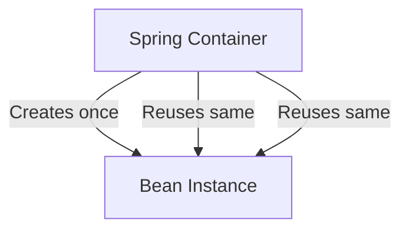
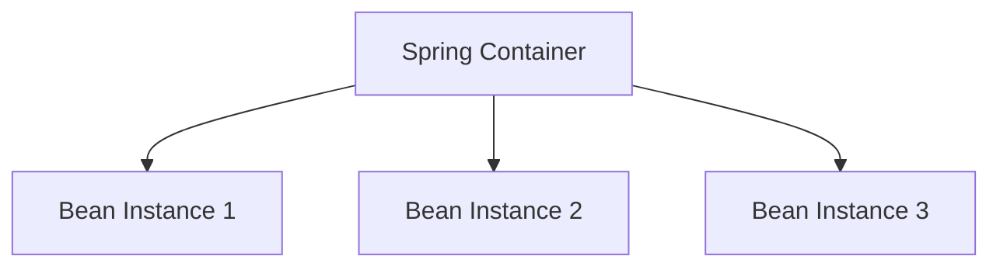
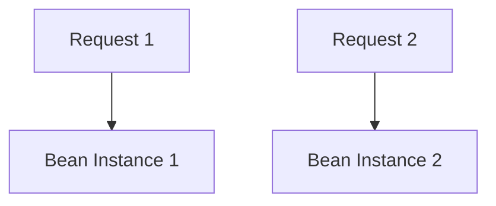
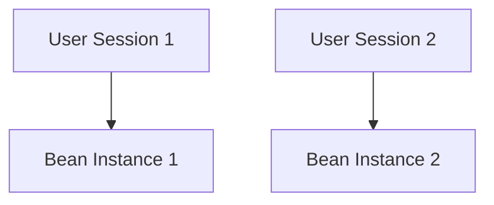
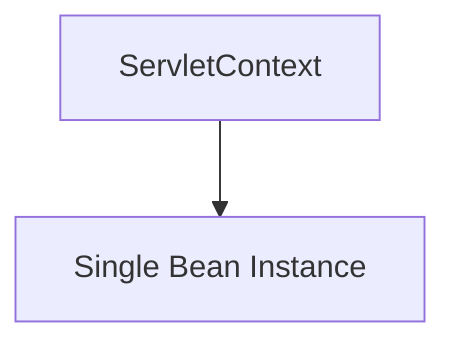
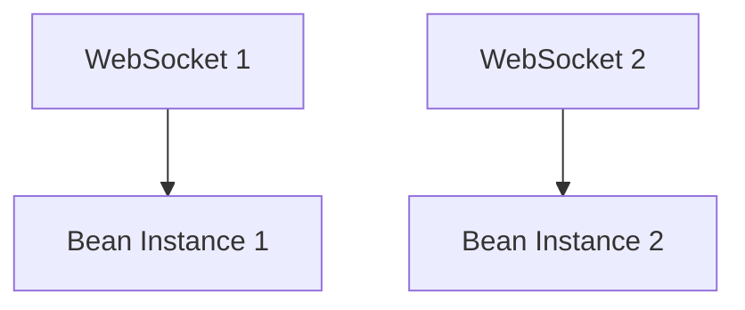

### 📌 Cheat Sheet (Quick Recall)

| Scope           | Lifetime                    | Use Case                   |
| --------------- | --------------------------- | -------------------------- |
| **Singleton**   | App-wide, one per container | Shared, stateless services |
| **Prototype**   | New instance per request    | Stateful, not shared       |
| **Request**     | One per HTTP request        | Request-scoped data        |
| **Session**     | One per HTTP session        | User session data          |
| **Application** | One per ServletContext      | Global web state           |
| **WebSocket**   | One per WebSocket session   | Real-time WebSocket apps   |


### 🟢 Spring Boot Bean Scopes

In **Spring Framework**, every object managed by the IoC container is called a **Bean**.
A *scope* defines **lifecycle and visibility** of a bean in the application context.

---

### 1. Singleton (Default)

* Only **one instance per Spring container**.
* Same instance is shared across the application.
* Default scope if none specified.

✅ Use when you need **shared state** or stateless service.

```java
@Component
@Scope("singleton")
public class MySingletonService { }
```



Perfect 👍 Let’s build the **step-by-step numbered lifecycle list** for a **Spring Boot REST request**, aligned with the detailed diagram I gave earlier.

---
---

### 2. Prototype

* A **new bean instance** is created **every time** it is requested from the container.
* Spring does **not manage full lifecycle** (you must destroy it manually).

✅ Use when bean is **stateful** and shouldn’t be shared.

```java
@Component
@Scope("prototype")
public class MyPrototypeService { }
```




---

### 3. Request (Web-Aware Scope)

* One bean per **HTTP request**.
* Works only in **web-aware contexts** (Spring MVC/Spring Boot web apps).

✅ Use when data is tied to a **single HTTP request**.

```java
@Component
@Scope(value = WebApplicationContext.SCOPE_REQUEST, proxyMode = ScopedProxyMode.TARGET_CLASS)
public class MyRequestBean { }
```




---

### 4. Session (Web-Aware Scope)

* One bean per **HTTP session**.
* Lives as long as the user session is active.

✅ Use for **user-specific data** (e.g., shopping cart).

```java
@Component
@Scope(value = WebApplicationContext.SCOPE_SESSION, proxyMode = ScopedProxyMode.TARGET_CLASS)
public class MySessionBean { }
```




---

### 5. Application (Web-Aware Scope)

* One bean instance per **ServletContext**.
* Shared across the whole web application.

✅ Use for **global web state**.

```java
@Component
@Scope(value = WebApplicationContext.SCOPE_APPLICATION, proxyMode = ScopedProxyMode.TARGET_CLASS)
public class MyApplicationBean { }
```




---

### 6. WebSocket (Web-Aware Scope)

* One bean per **WebSocket session**.

✅ Use for **WebSocket-based apps**.

```java
@Component
@Scope(value = "websocket", proxyMode = ScopedProxyMode.TARGET_CLASS)
public class MyWebSocketBean { }
```




---

### 🟢 How @Scope Works with @Autowired

When you inject beans with `@Autowired`, the **scope of the injected bean matters**.

---

### 1. Singleton → Singleton (Default Case)

* If you inject a singleton into another singleton → **same instance shared everywhere**.

```java
@Component
@Scope("singleton")
class A { }

@Component
class B {
    @Autowired
    private A a; // always same instance
}
```

✅ Simple and efficient.

---

### 2. Prototype → Singleton

* If you inject a **prototype** into a **singleton**,
  Spring injects **only one instance (at injection time)**, **not new per call**.

```java
@Component
@Scope("prototype")
class PrototypeBean { }

@Component
@Scope("singleton")
class SingletonBean {
    @Autowired
    private PrototypeBean prototype; // same instance reused, not new each time
}
```

❌ **Gotcha**: Developers often expect a new bean on every call, but they still get the same one.

---

### 3. Fixing Singleton → Prototype Problem

To truly get a **new prototype instance per method call**, use:

#### a) **`ObjectFactory`**

```java
@Component
@Scope("singleton")
class SingletonBean {
    @Autowired
    private ObjectFactory<PrototypeBean> factory;

    public void doWork() {
        PrototypeBean proto = factory.getObject(); // new each time
    }
}
```

#### b) `Provider` (Preferred)

```java
@Component
@Scope("singleton")
class SingletonBean {
    @Autowired
    private Provider<PrototypeBean> provider;

    public void doWork() {
        PrototypeBean proto = provider.get(); // always new
    }
}
```

---

### 4. Web Scopes (Request / Session) Injection

* You cannot inject `@Request` or `@Session` beans directly into singleton beans,
  because the lifecycle is shorter than singleton.

👉 Fix: Use **Scoped Proxy**.

```java
@Component
@Scope(value = WebApplicationContext.SCOPE_REQUEST,
       proxyMode = ScopedProxyMode.TARGET_CLASS)
class RequestBean { }

@Component
class SingletonBean {
    @Autowired
    private RequestBean requestBean; // proxy ensures correct instance per request
}
```

Spring creates a **proxy** object that delegates to the right bean depending on the active request/session.

---

### 🔑 Key Takeaways

1. `@Autowired` by default injects **one instance at container startup**.
2. Injecting **prototype into singleton** will not give new objects automatically.
3. Use **`Provider`/`ObjectFactory`** or **Scoped Proxy** to fix lifecycle mismatches.


