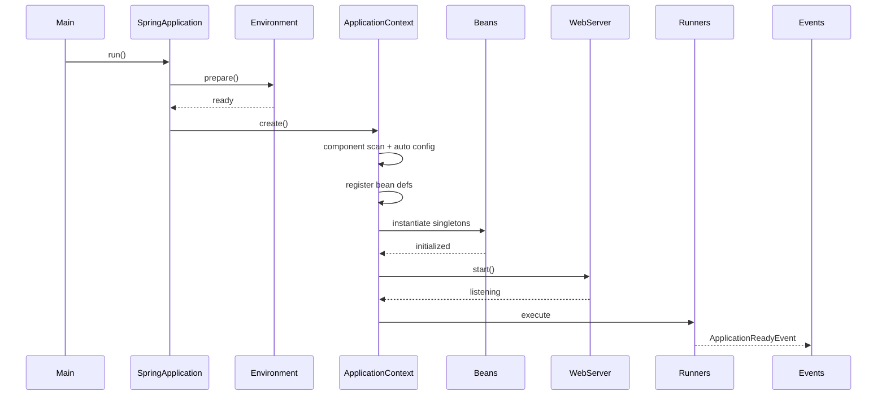

Let’s assume we have a simple app:

```java
@SpringBootApplication
public class MyApp {
    public static void main(String[] args) {
        SpringApplication.run(MyApp.class, args);
    }
}
```


### 1. `main()` Method Execution

* The entry point of your app.
* Calls `SpringApplication.run(...)`.
* This bootstraps the Spring context.


### 2. SpringApplication Initialization

When you call `SpringApplication.run(...)`, Spring Boot:

* Creates a `SpringApplication` instance.
* Determines if it’s a **web app** (Servlet/WebFlux/none).
* Loads **application.properties / application.yml** (via `ConfigFileApplicationListener`).
* Prepares the **Environment** (profiles, system/env variables).

👉 You can hook into this phase using **`ApplicationListener<ApplicationStartingEvent>`**.


### 3. Banner + Logging Setup

* If enabled, Spring Boot prints the **Spring Boot banner**.
* Initializes logging (Logback/Log4j2, depending on classpath).


### 4. ApplicationContext Creation

* Based on type:

  * `AnnotationConfigServletWebServerApplicationContext` (Spring MVC web app)
  * `AnnotationConfigReactiveWebServerApplicationContext` (Spring WebFlux)
  * `AnnotationConfigApplicationContext` (non-web app)
* Registers core beans (`Environment`, `BeanFactory`, etc.).


### 5. @ComponentScan + @Configuration Processing

* `@SpringBootApplication` → expands to:

  * `@EnableAutoConfiguration`
  * `@ComponentScan` (scans your packages for `@Component`, `@Service`, `@Repository`, `@Controller`).
  * `@Configuration` (registers beans defined in `@Bean` methods).
* Auto-configurations from `spring-boot-autoconfigure` JAR are loaded.

👉 This is where **Spring auto-wires a lot of magic beans** (like `DataSource`, `DispatcherServlet`, etc.).


### 6. Bean Definition Loading

* All discovered beans (`@Component`, `@Bean`, etc.) are registered in the **ApplicationContext** as `BeanDefinition`s.
* Metadata only → no instantiation yet.


### 7. BeanFactoryPostProcessor Execution

* Before creating beans, Spring executes all **`BeanFactoryPostProcessor`** and **`ConfigurationProperties` binding**.
* Example: `PropertySourcesPlaceholderConfigurer` replaces `@Value("${...}")`.


### 8. BeanPostProcessor Registration

* Spring registers all **`BeanPostProcessor`s** (e.g., AOP proxies, @Autowired injection logic).
* These will run during bean instantiation.


### 9. Singleton Bean Instantiation

* Spring creates all **singleton beans** eagerly (unless `@Lazy`).
* For each bean:

  1. Constructor/Factory method call.
  2. Dependency injection (`@Autowired`, `@Value`).
  3. `BeanPostProcessor.beforeInitialization()`.
  4. `@PostConstruct` methods run.
  5. `InitializingBean.afterPropertiesSet()`.
  6. `BeanPostProcessor.afterInitialization()`.


### 10. ApplicationContext Refresh

* Once beans are created, Spring publishes **ApplicationPreparedEvent** and **ApplicationStartedEvent**.
* Embedded web server (Tomcat/Jetty/Undertow) is created and started if it’s a web app.
* DispatcherServlet is registered with the servlet container.


### 11. CommandLineRunner / ApplicationRunner Execution

* Any beans implementing `CommandLineRunner` or `ApplicationRunner` are executed.
* Great place for startup logic (loading data, initializing caches, etc.).

```java
@Component
public class StartupRunner implements CommandLineRunner {
    @Override
    public void run(String... args) {
        System.out.println(">>> App has started, now running custom startup logic");
    }
}
```


### 12. ApplicationReadyEvent Published

* Finally, Spring publishes `ApplicationReadyEvent`.
* This means:

  * All beans created
  * Web server started
  * App is ready to serve requests

👉 Best place to run logic that requires the app to be **fully initialized**.


### ✅ Sequence diagram: timeline view (also minimal)


<br>

### 📌 Summery

1. **main() → SpringApplication.run()**
2. **Environment prepared** (properties, profiles).
3. **Logging & Banner** initialized.
4. **ApplicationContext created**.
5. **Component scan & auto-configuration**.
6. **Bean definitions registered**.
7. **BeanFactoryPostProcessors run**.
8. **BeanPostProcessors registered**.
9. **Singleton beans instantiated** (DI, AOP, lifecycle hooks).
10. **Context refresh & web server start**.
11. **CommandLineRunner/ApplicationRunner executed**.
12. **ApplicationReadyEvent → app is ready**.

