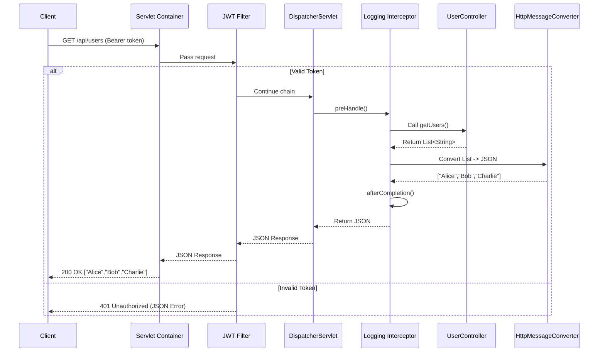

👉 Request:
`GET /api/users` with `Authorization: Bearer <jwt_token>`

---

### 1. JWT Authentication (Filter)

* Runs before Spring MVC.
* Validates JWT from request headers.
* If valid → continue; if invalid → return `401 Unauthorized`.

```java
@Component
public class JwtAuthFilter implements Filter {
    @Override
    public void doFilter(ServletRequest req, ServletResponse res, FilterChain chain)
            throws IOException, ServletException {
        HttpServletRequest request = (HttpServletRequest) req;
        String token = request.getHeader("Authorization");
        
        if (token != null && token.startsWith("Bearer ")) {
            // validate token here (simplified)
            System.out.println("JWT Filter: Token validated ✅");
            chain.doFilter(req, res);
        } else {
            ((HttpServletResponse) res).sendError(HttpServletResponse.SC_UNAUTHORIZED, "Invalid Token");
        }
    }
}
```

---

### 2. Logging Interceptor

* Runs inside Spring MVC.
* Logs request info before and after controller execution.

```java
@Component
public class LoggingInterceptor implements HandlerInterceptor {
    @Override
    public boolean preHandle(HttpServletRequest req, HttpServletResponse res, Object handler) {
        System.out.println("Interceptor: Incoming " + req.getMethod() + " " + req.getRequestURI());
        return true;
    }

    @Override
    public void afterCompletion(HttpServletRequest req, HttpServletResponse res,
                                Object handler, Exception ex) {
        System.out.println("Interceptor: Response status " + res.getStatus());
    }
}
```

---

### 3. REST Controller

* Returns a list of users in JSON.

```java
@RestController
@RequestMapping("/api/users")
public class UserController {

    @GetMapping
    public List<String> getUsers() {
        return List.of("Alice", "Bob", "Charlie");
    }
}
```

---

### 🔀 Detailed Request Flow (With JWT + Logging)



---

### 📌 Key Takeaways (Real-World)

* **JWT Filter** ensures only valid requests enter Spring MVC.
* **Interceptor** logs request/response around the controller.
* **Controller** just focuses on business logic.
* **HttpMessageConverter** automatically serializes Java objects to JSON.

