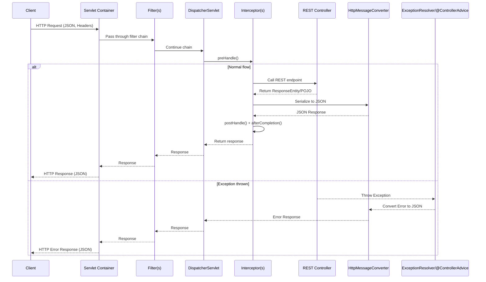

When a client makes a REST request (e.g., `GET /api/users`), the flow looks like this:

---

### 1. Client → Servlet Container

* Request arrives at **embedded server** (Tomcat/Jetty/Undertow).
* Delegated to Spring’s **DispatcherServlet**.

---

### 2. Filters

* **Servlet filters** execute before Spring MVC.
* Can:

  * Log requests
  * Handle authentication (JWT, API Key, CORS, etc.)
  * Modify headers/body

👉 Runs once per request (global).

---

### 3. DispatcherServlet (Front Controller)

* Spring’s central dispatcher.
* Finds correct handler method using **HandlerMapping**.

---

### 4. Interceptors

* **Spring MVC-specific hooks**.
* Execution order:

  1. `preHandle()` → before controller logic.
  2. `postHandle()` → after controller returns `ResponseEntity`/JSON, before serialization.
  3. `afterCompletion()` → after response is written back.

---

### 5. Controller (REST Endpoint)

* Executes method annotated with `@RestController` + `@RequestMapping`.
* Returns **POJO / ResponseEntity**.
* Spring converts it to JSON using **HttpMessageConverters** (e.g., Jackson).

---

### 6. Exception Handling

* If controller or interceptor throws exception:

  * Checked by **HandlerExceptionResolver** chain.
  * Custom handling via `@ControllerAdvice` and `@ExceptionHandler`.
  * Error converted to JSON error response.

---

### 7. Response Serialization

* Response is serialized (usually JSON).
* Passed back through **postHandle() / afterCompletion()** (interceptors).
* Passed back through **Filters**.
* Sent to client.

---

### 🔀 Detailed for REST Request

---

### 📌 Key REST Lifecycle Notes

* **Filters**

  * Run before and after request processing.
  * Servlet-level (global, not Spring-specific).
  * Example: CORS, Security (Spring Security adds its own filters).

* **Interceptors**

  * Spring MVC level.
  * Tied to specific URL patterns.
  * Good for request validation, metrics, user context.

* **Controller**

  * Handles request, returns **Java object**.
  * Uses `@RestController` or `@ResponseBody`.

* **HttpMessageConverter**

  * Converts POJO ↔ JSON/XML.
  * Jackson is default in Spring Boot.

* **Exception Handling**

  * Centralized error handling with `@ControllerAdvice`.
  * Ensures consistent REST error responses.

---

## 🟢 REST Request Lifecycle (Numbered Steps)

### Request Entry

1. **Client sends HTTP request** → (e.g., `GET /api/users` with JSON headers).
2. **Servlet Container (Tomcat/Jetty/Undertow)** receives the request and hands it to Spring’s **DispatcherServlet**.

---

### Request Pre-processing

3. **Filters (Servlet-level)** run first:

   * Logging
   * Authentication / JWT parsing
   * CORS handling
   * Request modification
     → Continue with `FilterChain.doFilter()`.

4. **DispatcherServlet (Front Controller)** activates Spring MVC request processing.

5. **Interceptors (Spring MVC-level)** run `preHandle()`:

   * Request validation
   * Adding attributes (e.g., user context)
   * Can block execution (return `false`).

---

### Controller Execution

6. **HandlerMapping** finds the right **@RestController** + `@RequestMapping` method.
7. **Controller method executes** (business logic).

   * Returns a POJO, DTO, or `ResponseEntity<>`.

---

### Response Processing

8. **HttpMessageConverter** (Jackson by default) converts return object → JSON.

   * Example: `User` object → `{"id":1,"name":"Alice"}`

9. **Interceptors (postHandle + afterCompletion)** run:

   * Modify response if needed (headers, logging).
   * Cleanup (metrics, MDC, etc.).

10. **Filters (after controller)** run again before sending response back.

---

### Exception Handling Path (if error occurs at step 7)

* Instead of step 8, exception is caught by:

  * **HandlerExceptionResolver chain**
  * Or custom `@ControllerAdvice + @ExceptionHandler`
* Converts exception → JSON error response.

---

### Response Exit

11. **DispatcherServlet returns JSON response** to the container.
12. **Servlet Container sends HTTP response** (status + JSON) back to **Client**.

---

## 🔑 Key takeaways

* **Order**:
  Client → Filters → DispatcherServlet → Interceptors → Controller → Converters → Interceptors → Filters → Response.

* **Filters**: Servlet-level, cross-cutting concerns.

* **Interceptors**: Spring MVC-level, per-request pre/post hooks.

* **Controller**: Executes business logic.

* **Converters**: Handle JSON serialization/deserialization.

* **Exception Handling**: Unified error responses with `@ControllerAdvice`.

