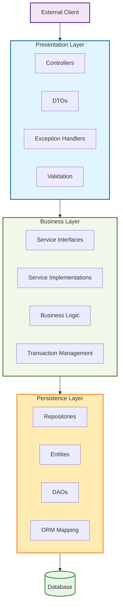

**Spring Boot Layered Architecture (N-Tier)**

This N-Tier architecture provides a clean separation that makes Spring Boot applications easier to develop, test, and maintain.

## 1. Presentation Layer

**Explanation:**
- **Controllers**: Handle HTTP requests, map URLs to methods, and manage API endpoints
- **DTOs (Data Transfer Objects)**: Separate objects for request/response to decouple API from domain models
- **Exception Handlers**: Centralize exception handling and transform exceptions to proper HTTP responses
- **Validation**: Validate incoming requests using annotations like `@Valid`
- **Responsibilities**: Receive requests, validate input, invoke business logic, and return appropriate HTTP responses

## 2. Business/Service Layer

**Explanation:**
- **Service Interfaces**: Define contracts for business operations
- **Service Implementations**: Contain the actual business logic and rules
- **Business Logic**: Core application functionality, workflows, and rules
- **Transaction Management**: Handle ACID properties using `@Transactional`
- **Domain Models**: Represent business entities and concepts
- **Responsibilities**: Implement business rules, coordinate transactions, and orchestrate data flow

## 3. Persistence Layer

**Explanation:**
- **Repository Interfaces**: Define data access contracts
- **Repository Implementations**: Concrete data access implementations (often provided by Spring Data)
- **Entity Classes**: JPA entities that map to database tables
- **DAO Pattern**: Data Access Objects for custom database operations
- **ORM Mapping**: Object-Relational Mapping configuration
- **Query Builders**: Programmatic query construction
- **Responsibilities**: Handle all database operations, SQL generation, and object-relational mapping

## 4. Complete N-Tier Architecture

**Complete Architecture Flow:**
1. **Request Flow**: External Client → Presentation Layer → Business Layer → Persistence Layer → Database
2. **Response Flow**: Database → Persistence Layer → Business Layer → Presentation Layer → External Client
3. **Dependency Direction**: Higher layers depend on lower layers, but not vice versa

## Key Benefits of This Architecture:

1. **Separation of Concerns**: Each layer has a distinct responsibility
2. **Testability**: Layers can be tested independently using mocks
3. **Maintainability**: Changes in one layer don't necessarily affect others
4. **Scalability**: Components can be scaled independently
5. **Flexibility**: Implementation details can change without affecting other layers

