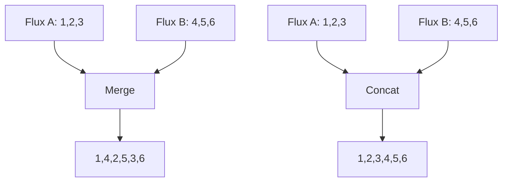

Merge, zip, or combine multiple streams together.

### Combining Techniques

```java
// Merge (interleaves)
Flux<Integer> flux1 = Flux.range(1, 3).delayElements(Duration.ofMillis(100));
Flux<Integer> flux2 = Flux.range(4, 3).delayElements(Duration.ofMillis(150));
Flux<Integer> merged = Flux.merge(flux1, flux2); // 1,4,2,5,3,6

// Zip (pairs)
Flux<String> names = Flux.just("Alice", "Bob", "Charlie");
Flux<Integer> ages = Flux.just(25, 30, 35);
Flux<Tuple2<String, Integer>> zipped =
    Flux.zip(names, ages); // [Alice,25], [Bob,30], [Charlie,35]

// Combine latest
Flux<String> latest = Flux.combineLatest(
    temperatureSensor,
    pressureSensor,
    (temp, pressure) -> temp + " at " + pressure
);
```

### Concatenation vs Merging



### Advanced Combination

```java
// When both monos complete
Mono<String> result = Mono.zip(
    userRepository.findById(userId),
    profileRepository.findByUserId(userId),
    (user, profile) -> user.getName() + " - " + profile.getBio()
);

// First mono to complete wins
Mono<String> fastest = Mono.firstWithValue(
    cacheService.getFromCache(key),
    databaseService.getFromDb(key)
);

// Switch on empty
Mono<String> data = cacheService.getFromCache(key)
    .switchIfEmpty(databaseService.getFromDb(key))
    .switchIfEmpty(Mono.just("default"));
```
