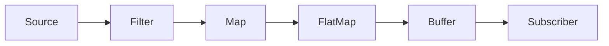

Operators to modify, filter, and transform data flowing through streams.

**Basic Transformations**

```java
// Map - synchronous transformation
Flux<Integer> numbers = Flux.range(1, 5)
    .map(n -> n * 2); // [2, 4, 6, 8, 10]

// FlatMap - asynchronous transformation
Flux<String> results = Flux.range(1, 3)
    .flatMap(n ->
        Mono.fromCallable(() -> fetchFromDatabase(n))
            .subscribeOn(Schedulers.boundedElastic())
    );

// Filter
Flux<Integer> evenNumbers = Flux.range(1, 10)
    .filter(n -> n % 2 == 0);
```

### Complex Transformations

```java
// concatMap (preserves order)
Flux<String> orderedResults = Flux.range(1, 3)
    .concatMap(n -> simulateAsync(n)); // Guaranteed order: 1, 2, 3

// switchMap (cancels previous)
Flux<String> searchResults = searchTermFlux
    .switchMap(term -> searchApi(term)); // Cancels previous search

// groupBy
Flux<GroupedFlux<Integer, String>> groups =
    Flux.just("apple", "banana", "cherry", "date")
        .groupBy(word -> word.length());
```

### Transformation Pipeline



### Common Operators:

- **map:** Transform each element
- **filter:** Keep only matching elements
- **flatMap:** Transform to new Publisher
- **concatMap:** Preserve order of results
- **switchMap:** Cancel previous operations
