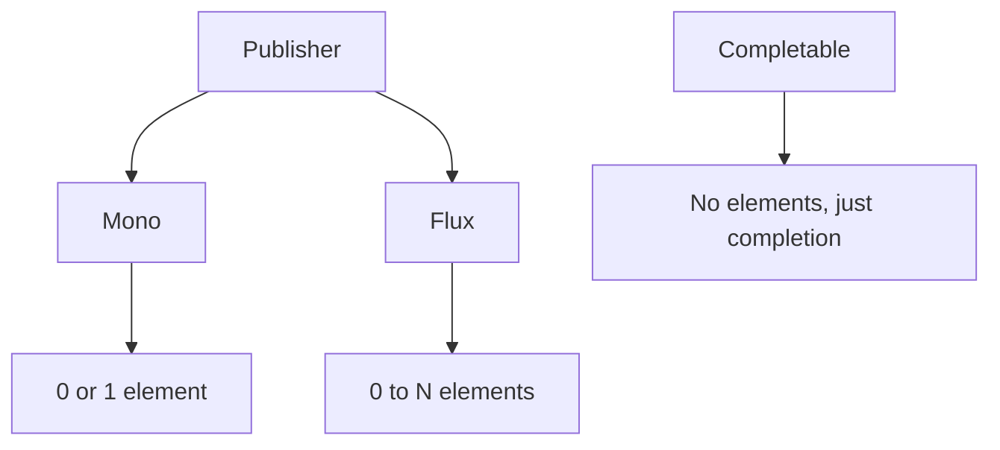

**Reactor Core Types**

Reactor provides two main types for handling asynchronous data sequences.

- **Mono:** 0-1 Result
- **Flux:** 0-N Results

### Mono: 0-1 Result

```java
// Creating Mono
Mono<String> emptyMono = Mono.empty();
Mono<String> singleValue = Mono.just("Hello");
Mono<String> deferred = Mono.fromCallable(() -> expensiveOperation());

// Mono lifecycle
Mono<String> mono = Mono.just("data")
    .doOnSubscribe(s -> System.out.println("Subscribed"))
    .doOnNext(value -> System.out.println("Received: " + value))
    .doOnSuccess(value -> System.out.println("Completed"));
```

### Flux: 0-N Results

```java
// Creating Flux
Flux<Integer> numbers = Flux.range(1, 10);
Flux<String> fromCollection = Flux.fromIterable(List.of("a", "b", "c"));
Flux<Long> interval = Flux.interval(Duration.ofSeconds(1));

// Flux lifecycle
Flux<Integer> flux = Flux.range(1, 5)
    .doOnRequest(n -> System.out.println("Requested: " + n))
    .doOnNext(i -> System.out.println("Next: " + i))
    .doOnComplete(() -> System.out.println("Completed"));
```

### Type Relationships


