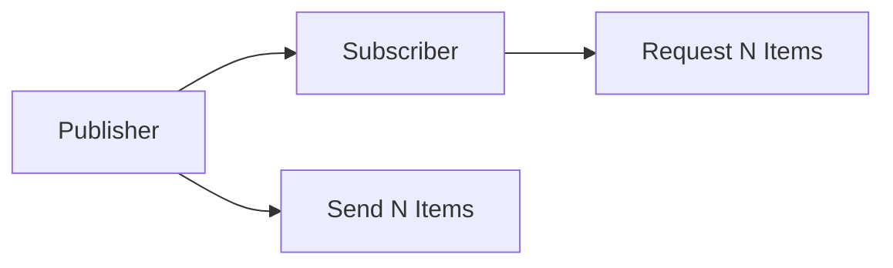

### What is Reactive Programming?

- `Reactive programming` is about `asynchronous data streams` and `non-blocking` execution.

- Instead of waiting for operations to complete, you define what should happen when data becomes available

- What we have doing so far was `Imperative programming` in traditional Spring Boot projects.

```java
// Imperative vs Reactive

// Imperative (Traditional)
List<String> results = new ArrayList<>();
for (String name : names) {
    String result = processName(name); // Blocks thread
    results.add(result);
}

// Reactive (Non-blocking)
Flux.fromIterable(names)
    .flatMap(name -> Mono.fromCallable(() -> processName(name)))
    .collectList()
    .subscribe(results -> System.out.println("Done!"));
```

### Backpressure Concept



### Key Concepts:

- **Asynchronous:** Operations don't block threads
- **Event-driven:** React to data availability
- **Backpressure:** Consumer controls data flow rate
- **Functional style:** Use operators to transform data

### Reactive Streams Specification

- **Publisher**: Produces data
- **Subscriber**: Consumes data
- **Subscription**: Controls flow
- **Processor**: Both Publisher and Subscriber
