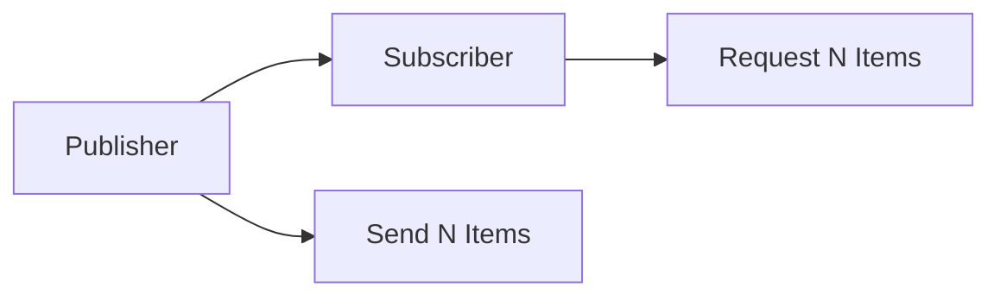
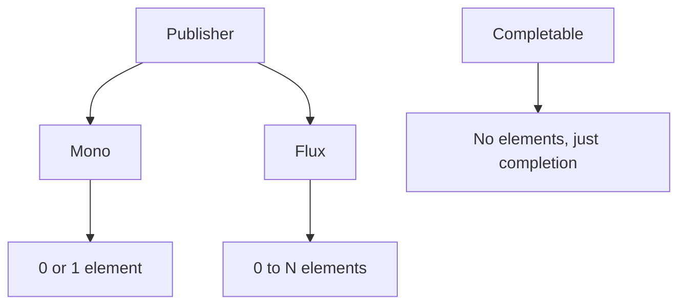
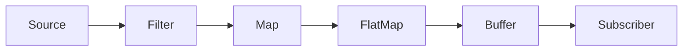
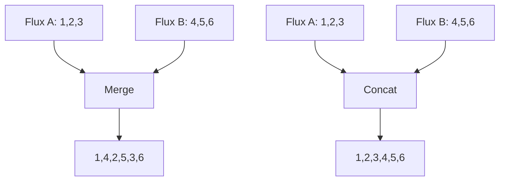
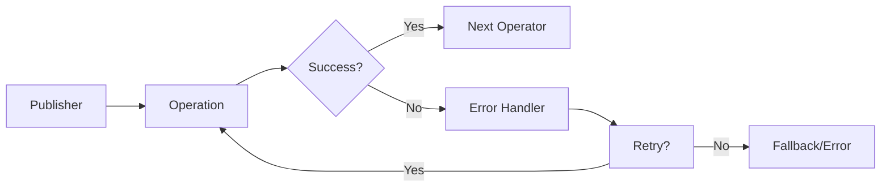
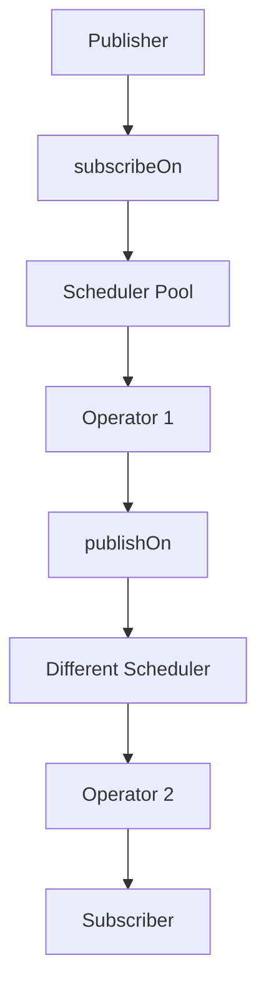

# Spring Boot Reactor Programming: Complete Guide

## Table of Contents

1. [Reactive Programming Fundamentals](#1-reactive-programming-fundamentals)
2. [Reactor Core Types](#2-reactor-core-types)
3. [Creating Publishers](#3-creating-publishers)
4. [Transforming Data](#4-transforming-data)
5. [Combining Streams](#5-combining-streams)
6. [Error Handling](#6-error-handling)
7. [Schedulers & Threading](#7-schedulers--threading)
8. [Testing Reactor](#8-testing-reactor)
9. [Spring WebFlux Integration](#9-spring-webflux-integration)
10. [Advanced Patterns](#10-advanced-patterns)

---

## 1. Reactive Programming Fundamentals

### What is Reactive Programming?

```java
// Imperative vs Reactive

// Imperative (Traditional)
List<String> results = new ArrayList<>();
for (String name : names) {
    String result = processName(name); // Blocks thread
    results.add(result);
}

// Reactive (Non-blocking)
Flux.fromIterable(names)
    .flatMap(name -> Mono.fromCallable(() -> processName(name)))
    .collectList()
    .subscribe(results -> System.out.println("Done!"));
```

### Backpressure Concept



### Reactive Streams Specification

- **Publisher**: Produces data
- **Subscriber**: Consumes data
- **Subscription**: Controls flow
- **Processor**: Both Publisher and Subscriber

---

## 2. Reactor Core Types

### Mono: 0-1 Result

```java
// Creating Mono
Mono<String> emptyMono = Mono.empty();
Mono<String> singleValue = Mono.just("Hello");
Mono<String> deferred = Mono.fromCallable(() -> expensiveOperation());

// Mono lifecycle
Mono<String> mono = Mono.just("data")
    .doOnSubscribe(s -> System.out.println("Subscribed"))
    .doOnNext(value -> System.out.println("Received: " + value))
    .doOnSuccess(value -> System.out.println("Completed"));
```

### Flux: 0-N Results

```java
// Creating Flux
Flux<Integer> numbers = Flux.range(1, 10);
Flux<String> fromCollection = Flux.fromIterable(List.of("a", "b", "c"));
Flux<Long> interval = Flux.interval(Duration.ofSeconds(1));

// Flux lifecycle
Flux<Integer> flux = Flux.range(1, 5)
    .doOnRequest(n -> System.out.println("Requested: " + n))
    .doOnNext(i -> System.out.println("Next: " + i))
    .doOnComplete(() -> System.out.println("Completed"));
```

### Type Relationships



---

## 3. Creating Publishers

### Simple Creation Methods

```java
// Mono factories
Mono<String> just = Mono.just("value");
Mono<String> error = Mono.error(new RuntimeException());
Mono<String> defer = Mono.defer(() -> Mono.just(computeValue()));

// Flux factories
Flux<Integer> range = Flux.range(1, 5);
Flux<String> generate = Flux.generate(
    () -> 0, // initial state
    (state, sink) -> {
        sink.next("Value " + state);
        if (state == 10) sink.complete();
        return state + 1;
    }
);
```

### From External Sources

```java
// From futures
Mono<String> fromFuture = Mono.fromFuture(CompletableFuture.supplyAsync(() -> "result"));

// From callable
Mono<String> fromCallable = Mono.fromCallable(() -> blockingOperation());

// From reactive streams
Flux<Integer> fromStream = Flux.fromStream(Stream.of(1, 2, 3));

// Creating from events
Flux<String> eventFlux = Flux.create(sink -> {
    eventListener.setOnData(sink::next);
    eventListener.setOnComplete(sink::complete);
    eventListener.setOnError(sink::error);
});
```

---

## 4. Transforming Data

### Basic Transformations

```java
// Map - synchronous transformation
Flux<Integer> numbers = Flux.range(1, 5)
    .map(n -> n * 2); // [2, 4, 6, 8, 10]

// FlatMap - asynchronous transformation
Flux<String> results = Flux.range(1, 3)
    .flatMap(n ->
        Mono.fromCallable(() -> fetchFromDatabase(n))
            .subscribeOn(Schedulers.boundedElastic())
    );

// Filter
Flux<Integer> evenNumbers = Flux.range(1, 10)
    .filter(n -> n % 2 == 0);
```

### Complex Transformations

```java
// concatMap (preserves order)
Flux<String> orderedResults = Flux.range(1, 3)
    .concatMap(n -> simulateAsync(n)); // Guaranteed order: 1, 2, 3

// switchMap (cancels previous)
Flux<String> searchResults = searchTermFlux
    .switchMap(term -> searchApi(term)); // Cancels previous search

// groupBy
Flux<GroupedFlux<Integer, String>> groups =
    Flux.just("apple", "banana", "cherry", "date")
        .groupBy(word -> word.length());
```

### Transformation Pipeline



---

## 5. Combining Streams

### Combining Techniques

```java
// Merge (interleaves)
Flux<Integer> flux1 = Flux.range(1, 3).delayElements(Duration.ofMillis(100));
Flux<Integer> flux2 = Flux.range(4, 3).delayElements(Duration.ofMillis(150));
Flux<Integer> merged = Flux.merge(flux1, flux2); // 1,4,2,5,3,6

// Zip (pairs)
Flux<String> names = Flux.just("Alice", "Bob", "Charlie");
Flux<Integer> ages = Flux.just(25, 30, 35);
Flux<Tuple2<String, Integer>> zipped =
    Flux.zip(names, ages); // [Alice,25], [Bob,30], [Charlie,35]

// Combine latest
Flux<String> latest = Flux.combineLatest(
    temperatureSensor,
    pressureSensor,
    (temp, pressure) -> temp + " at " + pressure
);
```

### Concatenation vs Merging



### Advanced Combination

```java
// When both monos complete
Mono<String> result = Mono.zip(
    userRepository.findById(userId),
    profileRepository.findByUserId(userId),
    (user, profile) -> user.getName() + " - " + profile.getBio()
);

// First mono to complete wins
Mono<String> fastest = Mono.firstWithValue(
    cacheService.getFromCache(key),
    databaseService.getFromDb(key)
);

// Switch on empty
Mono<String> data = cacheService.getFromCache(key)
    .switchIfEmpty(databaseService.getFromDb(key))
    .switchIfEmpty(Mono.just("default"));
```

---

## 6. Error Handling

### Error Handling Strategies

```java
// Basic error handling
Flux<String> flux = Flux.just("data")
    .map(this::riskyOperation)
    .onErrorReturn("fallback")              // Return fallback on error
    .onErrorResume(error -> {               // Resume with alternative flux
        if (error instanceof TimeoutException) {
            return Flux.just("timeout", "fallback");
        }
        return Flux.error(error);
    })
    .retry(3)                               // Retry up to 3 times
    .retryWhen(Retry.fixedDelay(3, Duration.ofSeconds(1))); // Retry with delay
```

### Advanced Error Recovery

```java
// Timeout handling
Flux<String> withTimeout = dataFlux
    .timeout(Duration.ofSeconds(5))
    .onErrorResume(TimeoutException.class,
        error -> Flux.just("default-data"));

// Circuit breaker pattern
CircuitBreaker circuitBreaker = CircuitBreaker.ofDefaults("service");
Flux<String> resilient = externalService.call()
    .transformDeferred(CircuitBreakerOperator.of(circuitBreaker));

// Error classification
Flux<String> classifiedErrors = dataFlux
    .onErrorMap(IOException.class, ServiceUnavailableException::new)
    .onErrorMap(IllegalArgumentException.class, BadRequestException::new);
```

### Error Flow



---

## 7. Schedulers & Threading

### Scheduler Types

```java
// Different schedulers for different purposes
Flux<Integer> flux = Flux.range(1, 10);

// Immediate (current thread)
flux.subscribeOn(Schedulers.immediate());

// Single (one dedicated thread)
flux.subscribeOn(Schedulers.single());

// Parallel (fixed worker pool)
flux.parallel()
    .runOn(Schedulers.parallel())
    .subscribe();

// Bounded elastic (for blocking operations)
Mono.fromCallable(() -> blockingIO())
    .subscribeOn(Schedulers.boundedElastic())
    .subscribe();

// Custom scheduler
Scheduler customScheduler = Schedulers.newBoundedElastic(
    10, 100, "custom-pool");
```

### Threading Models



### subscribeOn vs publishOn

```java
Flux.range(1, 5)
    .subscribeOn(Schedulers.parallel())     // Affects entire chain
    .map(i -> i * 2)                        // Runs on parallel thread
    .publishOn(Schedulers.boundedElastic()) // Changes thread from here
    .map(i -> i + 1)                        // Runs on bounded elastic
    .subscribe();
```

---

## 8. Testing Reactor

### StepVerifier Basics

```java
@Test
void testFlux() {
    Flux<String> flux = Flux.just("foo", "bar");

    StepVerifier.create(flux)
        .expectNext("foo")          // Verify next element
        .expectNextCount(1)         // Verify count of elements
        .expectComplete()           // Verify completion
        .verify(Duration.ofSeconds(5));
}

@Test
void testError() {
    Flux<String> flux = Flux.error(new RuntimeException());

    StepVerifier.create(flux)
        .expectError(RuntimeException.class)
        .verify();
}
```

### Advanced Testing

```java
// Virtual time testing
@Test
void testVirtualTime() {
    StepVerifier.withVirtualTime(() ->
        Flux.interval(Duration.ofHours(1)).take(2)
    )
    .expectSubscription()
    .thenAwait(Duration.ofHours(2)) // Skip 2 hours instantly
    .expectNext(0L, 1L)
    .verifyComplete();
}

// Context testing
@Test
void testContext() {
    Mono<String> mono = Mono.deferContextual(ctx ->
        Mono.just("Hello " + ctx.get("user"))
    );

    StepVerifier.create(mono.contextWrite(ctx -> ctx.put("user", "Alice")))
        .expectNext("Hello Alice")
        .verifyComplete();
}
```

### Test Support Utilities

```java
// TestPublisher for controlled testing
TestPublisher<String> testPublisher = TestPublisher.create();
Flux<String> testFlux = testPublisher.flux();

StepVerifier.create(testFlux)
    .then(() -> testPublisher.next("a", "b"))
    .expectNext("a", "b")
    .then(() -> testPublisher.error(new RuntimeException()))
    .expectError();
```

---

## 9. Spring WebFlux Integration

### Reactive Controllers

```java
@RestController
public class UserController {

    @GetMapping("/users/{id}")
    public Mono<User> getUser(@PathVariable String id) {
        return userService.findById(id);
    }

    @GetMapping("/users")
    public Flux<User> getUsers(
            @RequestParam(defaultValue = "0") int page,
            @RequestParam(defaultValue = "20") int size) {
        return userService.findAll(page, size);
    }

    @PostMapping("/users")
    public Mono<User> createUser(@RequestBody @Valid Mono<User> user) {
        return user.flatMap(userService::save);
    }
}
```

### WebClient (Reactive REST Client)

```java
@Service
public class ApiService {
    private final WebClient webClient;

    public ApiService(WebClient.Builder builder) {
        this.webClient = builder.baseUrl("https://api.example.com").build();
    }

    public Flux<User> fetchUsers() {
        return webClient.get()
            .uri("/users")
            .retrieve()
            .bodyToFlux(User.class)
            .timeout(Duration.ofSeconds(5))
            .retryWhen(Retry.backoff(3, Duration.ofSeconds(1)));
    }

    public Mono<User> createUser(User user) {
        return webClient.post()
            .uri("/users")
            .bodyValue(user)
            .retrieve()
            .bodyToMono(User.class);
    }
}
```

### Reactive Security

```java
@Configuration
@EnableWebFluxSecurity
public class SecurityConfig {

    @Bean
    public SecurityWebFilterChain securityFilterChain(ServerHttpSecurity http) {
        return http
            .authorizeExchange(exchanges -> exchanges
                .pathMatchers("/public/**").permitAll()
                .anyExchange().authenticated()
            )
            .httpBasic(withDefaults())
            .formLogin(withDefaults())
            .build();
    }
}
```

---

## 10. Advanced Patterns

### Caching with Reactor

```java
@Component
public class UserService {
    private final Cache<String, User> cache =
        Caffeine.newBuilder().expireAfterWrite(10, TimeUnit.MINUTES).build();

    public Mono<User> getUserWithCache(String id) {
        return Mono.fromCallable(() -> cache.getIfPresent(id))
            .filter(Objects::nonNull)
            .switchIfEmpty(
                userRepository.findById(id)
                    .doOnNext(user -> cache.put(id, user))
            );
    }
}
```

### Circuit Breaker Pattern

```java
@Service
public class ResilientService {
    private final CircuitBreaker circuitBreaker;

    public ResilientService() {
        this.circuitBreaker = CircuitBreaker.ofDefaults("external-service");
    }

    public Flux<Data> getDataWithResilience() {
        return externalService.getData()
            .transformDeferred(CircuitBreakerOperator.of(circuitBreaker))
            .timeout(Duration.ofSeconds(10))
            .retryWhen(Retry.backoff(3, Duration.ofSeconds(1)))
            .onErrorResume(throwable -> getFallbackData());
    }
}
```

### Hot vs Cold Publishers

```java
// Cold publisher (creates new data for each subscriber)
Flux<Integer> cold = Flux.defer(() ->
    Flux.fromIterable(fetchFreshData())); // New data each time

// Hot publisher (shares data among subscribers)
ConnectableFlux<Integer> hot = Flux.interval(Duration.ofSeconds(1))
    .publish(); // Shares among subscribers

hot.connect(); // Start emitting

// Replaying hot publisher
Flux<Integer> replay = hot.autoConnect().replay(10).autoConnect();
```

### Backpressure Strategies

```java
Flux.range(1, 1000)
    .onBackpressureBuffer(100)              // Buffer up to 100 items
    .onBackpressureDrop(dropped -> {        // Drop excess items
        log.warn("Dropped: {}", dropped);
    })
    .onBackpressureLatest()                 // Keep only latest
    .subscribe(new BaseSubscriber<Integer>() {
        @Override
        protected void hookOnSubscribe(Subscription subscription) {
            request(1); // Controlled demand
        }

        @Override
        protected void hookOnNext(Integer value) {
            process(value);
            request(1); // Request next after processing
        }
    });
```

### Metrics and Monitoring

```java
@Configuration
public class MetricsConfig {

    @Bean
    public MicrometerFluxMetrics micrometerFluxMetrics(MeterRegistry registry) {
        return new MicrometerFluxMetrics(registry);
    }
}

// Using metrics
Flux<String> monitoredFlux = dataFlux
    .name("data.processing")
    .tag("source", "kafka")
    .metrics()
    .map(this::processData);
```
