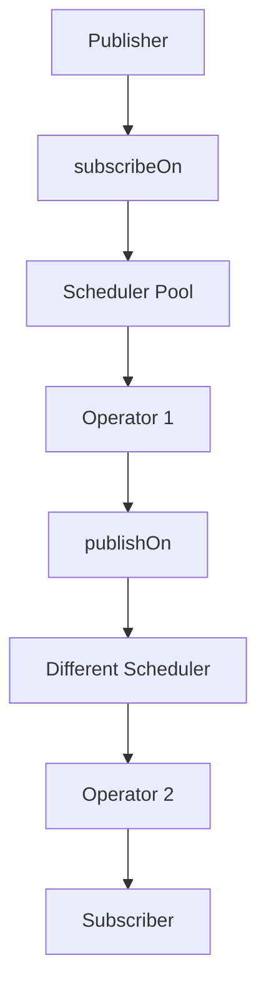

Control which threads execute different parts of your reactive pipeline.

### Scheduler Types

```java
// Different schedulers for different purposes
Flux<Integer> flux = Flux.range(1, 10);

// Immediate (current thread)
flux.subscribeOn(Schedulers.immediate());

// Single (one dedicated thread)
flux.subscribeOn(Schedulers.single());

// Parallel (fixed worker pool)
flux.parallel()
    .runOn(Schedulers.parallel())
    .subscribe();

// Bounded elastic (for blocking operations)
Mono.fromCallable(() -> blockingIO())
    .subscribeOn(Schedulers.boundedElastic())
    .subscribe();

// Custom scheduler
Scheduler customScheduler = Schedulers.newBoundedElastic(
    10, 100, "custom-pool");
```

### Threading Models



### subscribeOn vs publishOn

```java
Flux.range(1, 5)
    .subscribeOn(Schedulers.parallel())     // Affects entire chain
    .map(i -> i * 2)                        // Runs on parallel thread
    .publishOn(Schedulers.boundedElastic()) // Changes thread from here
    .map(i -> i + 1)                        // Runs on bounded elastic
    .subscribe();
```

---
