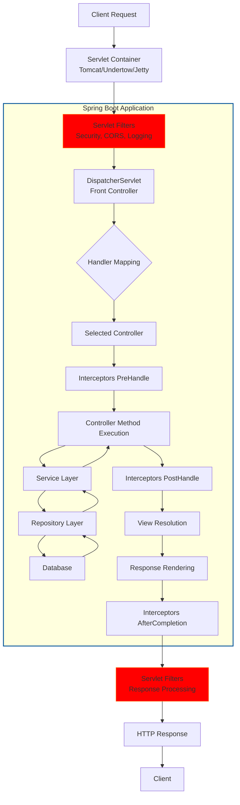

## Complete Request Processing Flow

## Detailed Lifecycle Stages

### 1. Client Request Initiation
- HTTP request arrives at the server
- Request contains method, headers, parameters, and body

### 2. Servlet Container Reception
- Request received by embedded servlet container (Tomcat, Undertow, or Jetty)
- Container creates HttpServletRequest and HttpServletResponse objects

### 3. Servlet Filter Chain Execution (Pre-processing)
- **Security Filters**: Authentication and authorization (Spring Security)
- **CORS Filters**: Cross-origin request handling
- **Logging Filters**: Request logging and monitoring
- **Character Encoding Filters**: Request encoding setup
- Each filter can process, modify, or reject the request

### 4. DispatcherServlet Handling
- Front controller receives the filtered request
- Central entry point for Spring MVC framework

### 5. Handler Mapping
- Determines which controller method should handle the request
- Based on URL patterns, HTTP methods, and other conditions

### 6. Handler Interceptors (PreHandle)
- Custom pre-processing logic
- Authentication checks
- Request logging
- Can short-circuit processing by returning false

### 7. Controller Method Execution
- Parameter binding (path variables, request params, request body)
- Validation (if applicable)
- Business logic invocation
- Service layer method calls

### 8. Service Layer Processing
- Business logic implementation
- Transaction management
- Additional validation

### 9. Repository Layer Access
- Data access operations
- Database interactions
- ORM operations (if using JPA/Hibernate)

### 10. Database Interaction
- SQL query execution
- Data retrieval or modification
- Transaction management

### 11. Response Processing Path
- Return from repository to service layer
- Return from service to controller
- Response object construction

### 12. Handler Interceptors (PostHandle)
- Post-processing after controller execution
- Response modification
- Additional logging

### 13. View Resolution (If applicable)
- View name to actual view resolution
- Template processing (Thymeleaf, JSP, etc.)
- Model data binding to view

### 14. Response Rendering
- Content generation (JSON, HTML, XML)
- Response body creation
- HTTP status and header setting

### 15. Handler Interceptors (AfterCompletion)
- Request completion callbacks
- Cleanup operations
- Final logging

### 16. Servlet Filter Chain Execution (Post-processing)
- Response modification filters
- Compression filters
- Additional response headers

### 17. HTTP Response Delivery
- Response sent back through servlet container
- Container manages connection and response writing

### 18. Client Reception
- Client receives HTTP response
- Browser or client application processes response

## Key Components in Detail

### Servlet Filters
- Execute before and after Spring MVC processing
- Can intercept and modify requests and responses
- Operate at the servlet container level

### DispatcherServlet
- Central dispatcher for HTTP request handling
- Coordinates all request processing components
- Manages handler mapping, view resolution, etc.

### Handler Mapping
- Maps requests to handler methods
- Supports various mapping strategies:
  - Annotation-based (@RequestMapping)
  - Controller class name patterns
  - Programmatic registration

### Handler Interceptors
- Three interception points:
  - preHandle: Before controller execution
  - postHandle: After controller but before view rendering
  - afterCompletion: After complete request processing

### Exception Handling
- @ControllerAdvice for global exception handling
- @ExceptionHandler for controller-specific exceptions
- HandlerExceptionResolver for custom exception resolution

### View Resolution
- ViewResolver strategies for different template engines
- Content negotiation for different response types
- Model data binding to views

